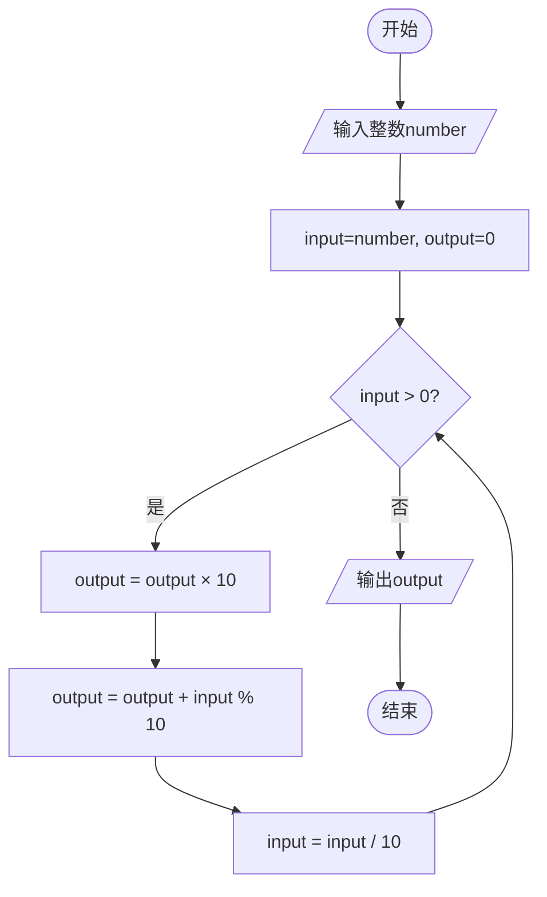
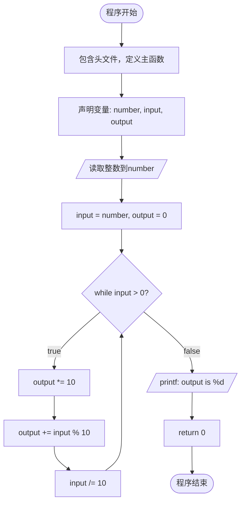

---
tags:
  - 408_计算机学科专业基础
创建时间: 2026-02-01T20:00:00
考试科目: "408"
课程: C语言
阶段: 零基础
老师: 泥鳅
开始日期: 2026-02-01
结束日期: 2026-02-01
---
# 翻转整数的解题思路与流程图

## 一、解题思路文字描述

翻转整数的核心思想是**逐位提取原数字的个位数字，并将其构建为新数字的最高位**。具体分析如下：

### 1. 识别重复行为
翻转整数的过程需要重复执行以下操作：
- 取出当前数字的个位数
- 将该数字添加到翻转结果中
- 去掉已经处理的个位数

这种重复性操作适合用循环结构实现。

### 2. 设计变量与观察中间状态
需要设计两个关键变量：
- `input`：保存当前待处理的数字（初始为原数字）
- `output`：保存已翻转的结果（初始为0）

通过观察中间状态变化，验证算法正确性：

| 循环次数 | input | output | 操作说明 |
|---------|-------|--------|---------|
| 初始状态 | 1234 | 0 | 初始化 |
| 第1次循环 | 123 | 4 | 取4，output=0×10+4=4 |
| 第2次循环 | 12 | 43 | 取3，output=4×10+3=43 |
| 第3次循环 | 1 | 432 | 取2，output=43×10+2=432 |
| 第4次循环 | 0 | 4321 | 取1，output=432×10+1=4321 |

### 3. 确定循环条件与边界
- **入口条件**：`input > 0`
  - 当input>0时，说明还有数字需要处理
  - 当input=0时，说明所有数字都已处理完毕
- **边界情况**：
  - 个位数：如5→5，循环一次
  - 数字0：直接输出0（不进入循环）
  - 负数：本代码未处理，需先取绝对值

### 4. 算法步骤总结
1. 读取原始整数
2. 初始化：input=原始数字，output=0
3. 当input>0时重复执行：
   - output = output × 10
   - output = output + (input % 10)
   - input = input / 10
4. 输出翻转结果

## 二、逻辑流程图

## 三、程序流程图

## 四、关键点说明

### 1. 为什么需要 `output *= 10`？
每次添加新数字前，将已有的结果左移一位（十进制），为新数字腾出个位位置。

### 2. `input % 10` 的作用
取当前数字的个位数，这是每次要提取的数字。

### 3. `input /= 10` 的作用
去掉已经处理的个位数，使数字右移一位（十进制）。

### 4. 循环终止条件
当 `input` 变为0时，说明所有位都已处理完毕。

### 5. 扩展考虑
- **处理负数**：可先判断正负，取绝对值处理，最后恢复符号
- **处理末尾0**：如100翻转后为1（不是001），本算法自然支持
- **溢出问题**：翻转后可能超出整数范围，实际应用中需添加溢出检查

此算法的时间复杂度为 O(n)，其中 n 是数字的位数；空间复杂度为 O(1)，只使用了固定数量的变量。