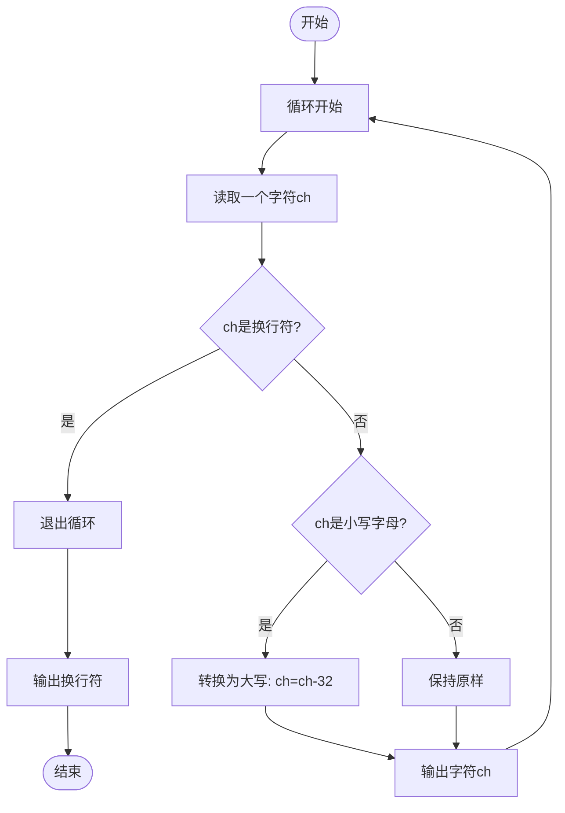
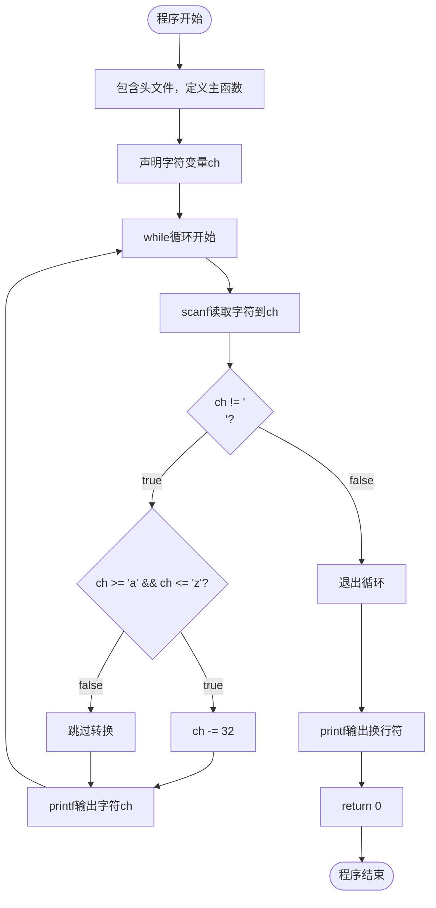

---
tags:
  - 408_计算机学科专业基础
创建时间: 2026-02-01T20:10:00
考试科目: "408"
课程: C语言
阶段: 零基础
老师: 泥鳅
开始日期: 2026-02-01
结束日期: 2026-02-01
---
# 小写转大写的解题思路与流程图

## 一、解题思路文字描述

将字符串中小写字母转换为大写字母的核心思想是**逐个字符处理，识别小写字母并进行ASCII码转换**。具体分析如下：

### 1. 识别重复行为
转换过程需要重复执行以下操作：
- 从输入流中读取一个字符
- 判断该字符是否为小写字母
- 如果是小写字母，转换为大写字母
- 输出处理后的字符

这种字符逐个处理的重复性操作适合用循环结构实现。

### 2. 设计变量与观察中间状态
需要设计关键变量：
- `ch`：保存当前读取的字符

通过观察中间状态变化，验证算法正确性：

输入字符串："hello world!"，共12个字符（包括空格和感叹号）

| 循环次数 | 读取字符 | 是否为小写 | 转换后字符 | 输出字符 |
|---------|---------|-----------|-----------|---------|
| 1 | 'h' | 是 | 'H' | 'H' |
| 2 | 'e' | 是 | 'E' | 'E' |
| 3 | 'l' | 是 | 'L' | 'L' |
| 4 | 'l' | 是 | 'L' | 'L' |
| 5 | 'o' | 是 | 'O' | 'O' |
| 6 | ' ' | 否 | ' ' | ' ' |
| 7 | 'w' | 是 | 'W' | 'W' |
| 8 | 'o' | 是 | 'O' | 'O' |
| 9 | 'r' | 是 | 'R' | 'R' |
| 10 | 'l' | 是 | 'L' | 'L' |
| 11 | 'd' | 是 | 'D' | 'D' |
| 12 | '!' | 否 | '!' | '!' |
| 13 | '\n' | - | - | 循环结束 |

### 3. 确定循环条件与边界
- **入口条件**：`scanf("%c", &ch) , ch != '\n'`
  - 逗号表达式：先执行`scanf`读取字符，然后判断`ch != '\n'`
  - 当读取到换行符时，循环结束
- **字符判断**：`ch >= 'a' && ch <= 'z'`
  - 利用ASCII码范围判断是否为小写字母
- **转换原理**：`ch -= 32`
  - 小写字母ASCII码比对应大写字母大32
  - 例如：'a'(97) - 32 = 'A'(65)
- **边界情况**：
  - 空输入（直接按回车）：不进入循环，直接输出换行
  - 混合字符：只转换小写字母，其他字符原样输出
  - 非英文字符：不在'a'-'z'范围内，不会误转换

### 4. 算法步骤总结
1. 循环读取字符直到遇到换行符
2. 对每个字符：
   - 如果是小写字母，转换为大写字母
   - 输出字符
3. 循环结束后输出换行符

## 二、逻辑流程图

## 三、程序流程图

## 四、关键点说明

### 1. 逗号表达式的使用
`while(scanf("%c", &ch) , ch != '\n')`
- 先执行`scanf("%c", &ch)`读取字符
- 然后判断`ch != '\n'`作为循环条件
- 注意：这里使用逗号表达式，整个表达式的值是最后一个表达式的值

### 2. ASCII码转换原理
- 大写字母A-Z：ASCII码65-90
- 小写字母a-z：ASCII码97-122
- 大小写字母差值为32
- 转换公式：大写 = 小写 - 32

### 3. 字符范围判断
- `ch >= 'a' && ch <= 'z'`：判断是否为小写字母
- 直接使用字符字面量，比使用ASCII码值更清晰

### 4. 输入缓冲机制
- `scanf`每次读取一个字符，包括空格
- 输入字符串"hello world!"后，需要按回车键结束
- 回车键产生的`\n`作为循环结束标志

### 5. 扩展考虑
- **效率优化**：使用`getchar()`替代`scanf("%c")`可能更高效
- **可移植性**：使用`toupper()`函数（需要`<ctype.h>`）更可读且可移植
- **多行处理**：修改循环条件可处理多行文本
- **内存限制**：逐个字符处理，无需存储整个字符串，内存占用小

此算法的时间复杂度为O(n)，其中n是输入字符数（不包括换行符）；空间复杂度为O(1)，只使用了一个字符变量。算法简单高效，适用于逐字符处理的场景。