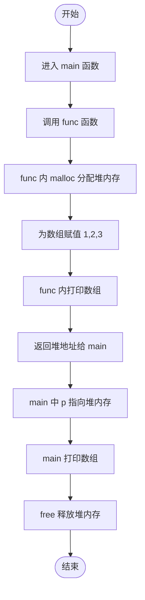
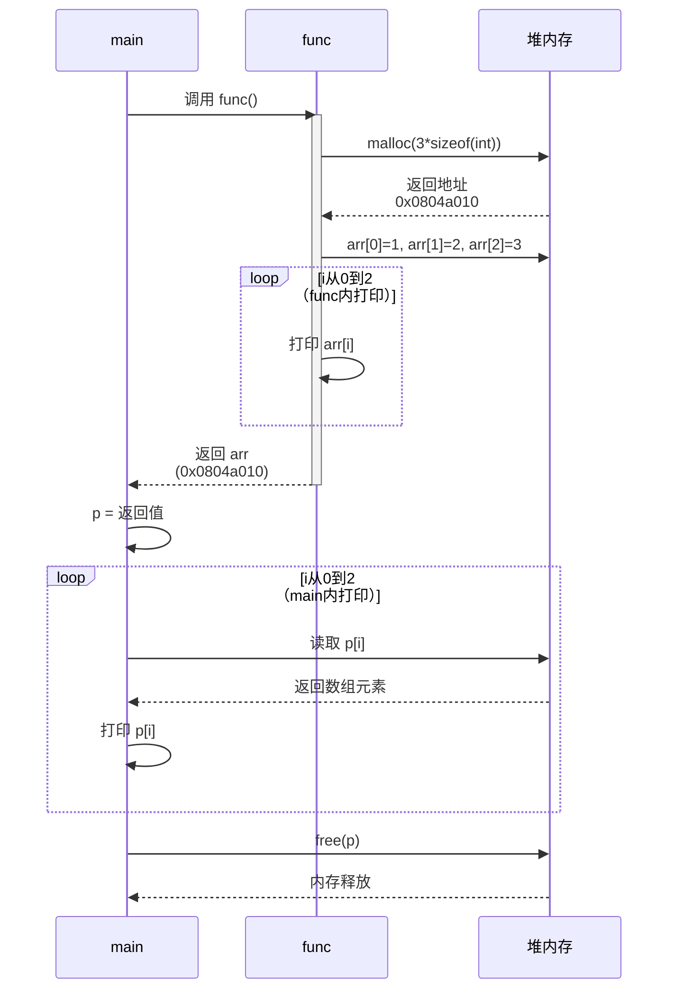
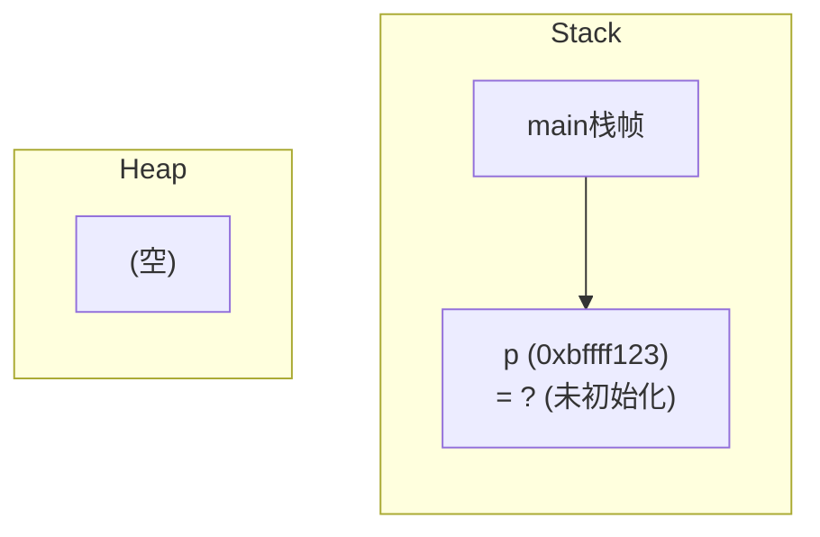
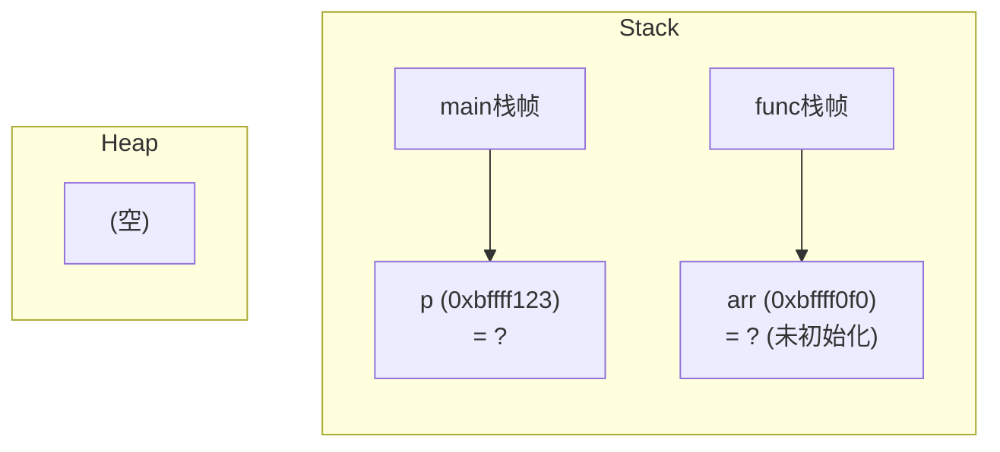
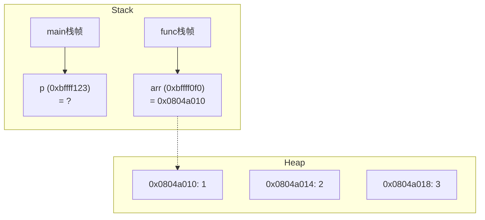
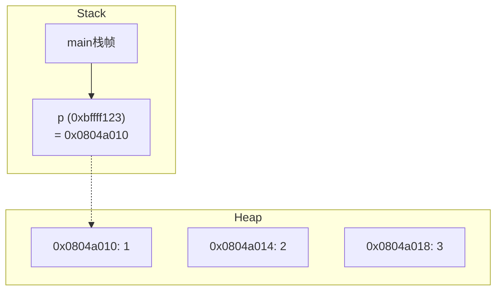
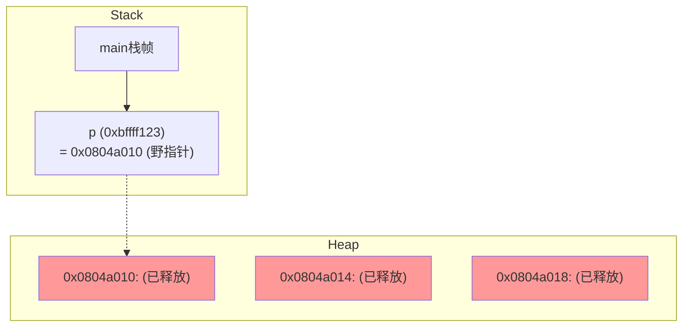

---
tags:
  - 408_计算机学科专业基础
创建时间: 2026-03-03T15:20:00
考试科目: "408"
课程: C语言
阶段: 零基础
老师: 泥鳅
开始日期: 2026-03-03
结束日期: 2026-03-03
---
已根据您的要求，对分步程序流程图中可能产生自动断词连字符的 loop 标签进行了手动换行处理，使用 `<br/>` 明确分割文本，避免渲染时出现类似“f-unc”的错误。以下是完整的 Obsidian 笔记内容：

---

# C程序内存动态分析：malloc与函数返回示例

## 1. 源代码 + 运行结果

### 1.1 源代码：
```c
#define _CRT_SECURE_NO_WARNINGS
#include<stdio.h>
#include<stdlib.h>

int *func(){
	int *arr = (int*)malloc(3 * sizeof(int));
	arr[0] = 1;
	arr[1] = 2;
	arr[2] = 3;
	for(int i = 0;i < 3;++i){
		printf("func arr[%d] = %d\n",i,arr[i]);
	}
	return arr;
}
int main(){
	int* p = func();
	for(int i = 0;i < 3;++i){
		printf("main p[%d] = %d\n",i,p[i]);
	}
	free(p); // 避免内存泄漏
	
	return 0;
}
```

### 1.2 运行结果：
```
func arr[0] = 1
func arr[1] = 2
func arr[2] = 3
main p[0] = 1
main p[1] = 2
main p[2] = 3
```

---

## 2. 整体程序流程图 + 分步程序流程图

### 2.1 整体程序流程图（程序逻辑总览）



### 2.2 分步程序流程图（关键步骤时序，明确展示循环）



---

## 3. 程序运行过程的内存状态示意图

以下图表展示了在 32 位操作系统下，程序执行过程中栈与堆的逐步变化（地址均采用 8 位十六进制表示，长文本已手动换行）。

### Step 0：进入 main，尚未调用 func
- **栈**：main 栈帧包含局部变量 `p`（未初始化，值为随机）。
- **堆**：无分配。



### Step 1：调用 func，进入 func 栈帧
- **栈**：main 栈帧保留，func 栈帧被压入，包含局部变量 `arr`（未初始化）。
- **堆**：仍为空。



### Step 2：func 内调用 malloc，分配堆内存并赋值
- **堆**：分配 3 个 int（12 字节），地址从 `0x0804a010` 开始，值依次为 1、2、3。
- **栈**：`arr` 指向堆首地址 `0x0804a010`。



### Step 3：func 返回，栈帧销毁，main 获得指针
- **栈**：func 栈帧消失，main 中的 `p` 获得返回值 `0x0804a010`，指向堆数组。
- **堆**：内容不变。



### Step 4：main 打印数组（内存状态同 Step 3，略）
此时仅访问堆内存，状态无变化，故不重复绘图。

### Step 5：main 调用 free(p)，释放堆内存
- **堆**：内存被释放，内容标记为“已释放”（用红色填充表示）。
- **栈**：`p` 仍持有原地址，但成为野指针（后续不再使用）。



---