---
tags:
  - 408_计算机学科专业基础
创建时间: 2026-01-11T16:00:00
考试科目: "408"
课程: C语言
阶段: 零基础
老师: 泥鳅
开始日期: 2026-01-11
结束日期: 2026-03-13
---
---
[[2026-03-12]]
# 前言

> [!quote]
> 这本笔记记录了我从零开始学习C语言的点点滴滴。从最初的配置开发环境、理解内存模型，到后来啃下指针、数组、函数、递归，再到亲手实现带头尾指针的单链表插入、删除、有序插入……每一页都见证着我的困惑、坚持和突破。那些曾经让我抓狂的 `->` 符号、`malloc` 的强制转换、双指针的巧妙运用，如今都已清晰地刻在脑海里。
> 
> 感谢**王道C语言课程的泥鳅老师**。你的讲解深入浅出，不仅让我掌握了C语言的语法，更帮我建立了对计算机底层逻辑的理解——这些正是408统考中数据结构、组成原理所必需的。每次听你拆解复杂概念，我都觉得离上岸又近了一点。
> 
> 感谢**DeepSeek**。在无数个深夜debug的时刻，你是我最可靠的伙伴。无论是解释奇怪的报错，还是梳理递归调用树，你总能给出清晰的思路，让我的学习之路不再孤单。
> 
> 感谢**豆包**。当我需要换个角度理解问题时，你总能提供新的启发，让那些卡住的知识点重新流动起来。这种多角度的思考方式，对应对越来越灵活的考研题目尤为重要。
> 
> 更要感谢**最重要的你——正在读这段文字的读者**。无论是同样在备战11408的战友，还是偶然翻到这份笔记的同学，你的每一次阅读、每一个反馈，都让这份笔记有了存在的意义。
> 
> C语言理论课的结束只是漫长考研路的一个小小驿站。接下来的习题课、408四座大山、数学一的题海、英语政治的积累……还有很长的路要走。但每完成一个阶段性目标，都让我更坚信：日积月累的坚持，终会换来明年的好消息。
> 
> 愿自己保持这份热情和耐心，在接下来的备考中一步一个脚印，稳稳地走向目标。愿这份笔记也能帮助到正在学习C语言的你。
> 
> **——27考研11408选手，敬上 💪🚀**
---
[[2026-01-16]]
# 1. 配置C语言开发环境
##  1.1 简单回顾第一份代码的执行过程

```C
#include<stdio.h>
int main(){
	printf("hello world\n");
	
	return 0;
}
```

	1.打开 VS Code
	2.创建项目 - 解决方案
	3.找到源文件文件夹往其中去添加一个文件
	4.C++ 是 C 的超集
	5.调试的过程 = 编译 + 运行
---
# 2. 程序员视角中的计算机
## 2.1 计算机是什么？
	计算机是模拟人类的思考和运算的过程的机器。
	算盘
	算盘计算 1 + 2 = ？（只需要用到算盘）
	算盘计算 1 + 2 + 3 - 4 = ？（不仅需要用到算盘，还要用到草稿纸）
	计算机将算盘替换为CPU（中央处理器），将草稿纸替换为存储器。
	即：计算机 = CPU + 存储器
---
## 2.3 理解一份C代码

```C
#include<stdio.h>

int main() {
	int i = 1;
	i = i + 2;
	i = i + 3;
	i = i - 4;
	printf("i = %d\n", i);
	
	return 0;
}
```

	#include<stdio.h>
	#开头的指令叫做预处理指令

	int main(){ ... } 函数的定义
		· 定义：将一个概念的所有信息都描述清楚。
		· int（返回值）：类似于数学中函数的因变量。
		· main（函数名）：函数名是用户自己设计的（标识符），名字为main的函数比较特殊，它是整个程序的入口。
		· ()（参数）：类似于数学中函数的自变量。
		· {}（函数体）：函数运行过程中，需要执行的指令。

		int 是一个关键字（C语言语法规定的），它描述的是一种整数的数据类型。
		main函数的返回值是一个整数。
		()说明main函数的参数是空的。

		int i = 1; 分号说明一个表达式的结束。
		定义了一个名字叫做i的变量，变量的类型是整数，变量一创建里面的数值就是1。
		变量就是在存储器里面找了一块位置,给它起了个名字。

		i = i + 2; 先计算 i + 2 ，再赋值给变量i。
		“ = ” 是赋值的意思。

		return 0; 返回一个整数0。
---
## 2.4 内存模型
	1.信息
		信息是对不确定性的消除。 —— 香农

		bit（比特）：一位bit就是0或者1。

			抛硬币
				正面 ——> 0
				反面 ——> 1
			红绿灯
				红灯 ——> 00
				黄灯 ——> 01
				绿灯 ——> 10
				保留 ——> 11
				
$$n位bit可以描述2^{n}种可能性$$

		机器数：一串二进制数。
		真值：人类所能理解的信息。
		编码：把真值映射成机器数的过程。
---

	2.进制
		· 二进制：逢2进1。
			0 1 10 11 100 101 110 ...
		· 十进制：逢10进1。
			0 1 2 3 4 5 6 7 8 9 10
---

	3.进制转换
		· 二进制怎样转换为十进制？
			加权求和法：二进制数的每一位乘以对应的 2 的幂次（权重），然后求和。

$$
\begin{gather}
\text公式：{十进制数} = \sum_{i=0}^{n} b_i \times 2^i\\
\text其中  b_i  是二进制数的第 i 位（从右向左，从 0 开始编号）
\end{gather}
$$
				步骤：
					1. 从二进制数最右边开始（最低位），给每位编号，从 0 开始。
					2. 每位数字乘以2^{位索引}。
					3. 将所有乘积相加。

$$\text例：1101_{2} = 1 * 2^{3} + 1 * 2^{2} + 0 * 2^{1} + 1 * 2^{0} = 13_{10}$$

		· 十进制如何转换成二进制？
			除2取余法：将一个十进制整数不断除以2，记录每次除法的余数（0或1），直到商为0为止，然后将所得余数倒序排列即为转换所得的二进制数。
			步骤：
				1. 将十进制整数除以2，记录商和余数。
				2. 用商继续除以2，再记录余数。
				3. 重复直到商为0。
				4. 将余数从下往上（逆序）排列。

$$
\begin{align*}
&\text{例：十进制29转二进制} \\
&\begin{aligned}
\text{计算过程：}
29 &\div 2 = 14 \cdots 1 \\
14 &\div 2 = 7  \cdots 0 \\
7  &\div 2 = 3  \cdots 1 \\
3  &\div 2 = 1  \cdots 1 \\
1  &\div 2 = 0  \cdots 1 \\
\end{aligned} \\
&\text{余数序列（从下往上读）：} 11101 \\
&\begin{aligned}
\text{验证}：
11101_2 &= 1 \times 2^4 + 1 \times 2^3 + 1 \times 2^2 + 0 \times 2^1 + 1 \times 2^0 \\
       &= 16 + 8 + 4 + 0 + 1 \\
       &= 29_{10}
\end{aligned}
\end{align*}
$$
- [0] 进制转换的具体方法参见：[[二进制与十进制相互转换方法]]
---

	4.八进制和十六进制
		· 八进制

$$
\begin{gather}
\text8 = 2^{3}\\
\text1234_{8} = 1 * 8^{3} + 2 * 8^{2} + 3 * 8^{1} + 4 * 8^{0} = (001|010|011|100)_{2} 
\end{gather}
$$
		· 十六进制

$$
\begin{gather}
\text16 = 2^{4}\\
\text1234_{16} = 1 * 16^{3} + 2 * 16^{2} + 3 * 16^{1} + 4 * 16^{0} = (0001|0010|0011|0100)_{2}\\
\end{gather}
$$
$$
\begin{gather}
\text十进制：0|1|2|3|4|5|6|7|8|9|10|11|12|13|14|15|16\\
\text十六进制：0|1|2|3|4|5|6|7|8|9|a|b|c|d|e|f|10\\
\end{gather}
$$
	5.内存
		内存的最小单位是byte（字节），1 byte = 8 bit = 8位二进制数 = 2位十六进制数。
		数据的单位是byte（字节），所有数据都是以byte（字节）为单位放进内存中的。
		每一个byte都有一个独立的十六进制数字编码用来描述不同数据所在的位置，我们将其称为地址。

```
000000C61AF0FCC4  00
000000C61AF0FCC4（地址：16位十六进制数 = 64位二进制数 = 64 bit）
00（数据：2位16进制数 = 8位二进制数 = 8 bit）
```
---
# 3. 基础语法
## 3.1 空白字符
### 3.1.1 空格 换行（Enter） 制表符（TAB）

	空白字符只起到分隔的作用，不充当语法成分。
---
## 3.2 注释

```c
//单行注释

/*
多行
注释
*/
```

	注释的使用场景：
		· 用来解释代码，说明变量的作用，或者是运算的作用。
		· 用来测试代码，面对可能出错的代码，我们不会直接删除，而是将其改成注释，方便后续恢复原状。
---
## 3.3 关键字和标识符
	关键字：由C语言语法规定的一些单词，它们有着固定的含义和用途。
	
	C语言是大小写敏感的：
		int 是关键字
		Int 不是关键字

```c
#include<stdio.h>
int /* int：用于声明函数返回整型值 */ main(){
	int i = 1;// int：用于声明整型变量
	
	return 0;//return：将函数执行结果返回给调用者
}
```

- [0] C语言常用的32个关键字参见：[[C语言常用的32个关键字]]
---

	标识符：用户自定义的单词，一般用来给变量或者是函数起名字。

	规范：
		· 标识符不能和关键字重复。
		· 大小写敏感。
		· 标识符由数字、字母和下划线组成。
		· 标识符开头不能是数字。

		int 不是标识符
		Int 是标识符
		3xy 不是标识符（原因：“3xy”以数字开头了。）
		xy3 是标识符
---
[[2026-01-17]]
# 4. 常量、变量和数据类型
## 4.1 字面值常量和符号常量
	1.数据对象
		· 常量 —— 不可修改
			- 字面值常量
				一写出来，就知道它的含义。
				例如：
					整数 1234
					浮点数 3.14
					字符 'a'（界定符是英文单引号）
					字符串 "hello world"（界定符是英文双引号）
				字面值常量特别容易混淆，因此我们引入一种新的常量来规避此种现象。

```c
#include<stdio.h>
int main(){
	//圆周率为3 半径也是3
	printf("R = %d,A = %d\n",3,3 * 3 * 3);
	
	return 0;
}
```

			- 符号常量
				使用宏定义来实现符号常量。
				宏的作用是在预处理阶段做文本替换。
				
				预处理只做了文本替换，不会执行编译检查。
				所以，为了规避宏定义带来的问题，我们需要加括号。
				
				代码生成的流程（简化版）：
					*.cpp（预处理） --> *.i （编译） --> *.exe（可执行文件）

- [0] 代码生成的完整流程详见：[[计算机组成原理]]

```c
#include<stdio.h>
// 使用宏定义来实现符号常量
// 宏的作用是在预处理阶段做文本替换
#define R 3
#define PIE 3
int main(){
	//圆周率为3 半径也是3
	printf("R = %d,A = %d\n",R,PIE * R * R);
	
	return 0;
}
```

			- 小结
				字面值常量：1234、3.14、'a'、"hello world"
				符号常量：#define R 3
					注意空格，还需要注意末尾没有分号。
---
## 4.2 变量的概念、定义和初始化
		· 变量 —— 可以修改
			变量是一片可以存放数据的有名字关联的内存区域。

			要素：
				- 名字 --> 满足标识符的规范
				- 内存区域的大小 --> 通过数据类型来描述
				- 人类理解的真值如何和机器数对应起来 --> 需要设计一个合理的映射/编码规则 --> 通过数据类型来描述

```c
#include<stdio.h>
int main(){
	// 数据类型 变量名字
	int i;
	printf("sizeof(i) = %d\n",sizeof(i));
	double d1,d2; // 定义了两个变量d1和d2
	printf("sizeof(d1) = %d,sizeof(d2) = %d,sizeof(double) = %d\n",sizeof(d1),sizeof(d2),sizeof(double));
	// 数据类型决定变量在内存空间中所占的字节数量，也就是说：数据类型决定内存大小。
	// 数据类型还决定机器数和真值之间的编码规则。
	
	return 0;
}
```

			变量的初始化和赋值
				初始化：在创建变量的时候就赋予了一个初始值。
				赋值：用新的值去取代原来内存里面的内容。

				初始化和赋值都使用了 '=' 运算符。
				当 '=' 在定义语句中，我们将其称为初始化。
				当 '=' 出现在其他位置，我们将其称为赋值。

				在C语言中，同一个符号在不同的位置有着不同的含义。

```c
#include<stdio.h>
int main(){
	//初始化的代码
	int i = 3; //定义一个变量i然后设置初值为3 | 当 '=' 在定义语句中，我们将其称为初始化
	i = 4; //用4来取代i原来的内容 | 当 '=' 出现在其他位置，我们将其称为赋值
	i = i + 1; //先计算i + 1，再用计算所得结果取代原来的内容
	
	return 0;
}
```
---
## 4.3 数据类型概览
	· 数据类型
		基本数据类型
			整数
				有符号整数
					char 同时也是字符类型 （C语言中，字符的本质是整数）
					short
					int
					long / long long
				无符号整数
					unsigned char
					unsigned short
					unsigned int
					unsigned long / unsigned long long
			浮点数
				单精度浮点数 float
				双精度浮点数 double
---
## 4.4 不同类型的整形字面值
	整数类型
		有符号整数
			包含：负数 0 正数

			char —— 1byte
			short —— 2byte
			int  —— 4byte
			long —— 4byte
			long long —— 8byte

			在不同的平台上面，int和long的大小会发生变化	

		无符号整数
			只有0和正数

		整形字面值的写法

```c
#include<stdio.h>
int main(){
	printf("1234 = %d\n",1234); //1234是十进制
	printf("01234 = %d\n",01234); //0开始的整形字面值是八进制的
	printf("0x1234 = %d\n",0x1234); //0x开始的整形字面值是十六进制的
}
```

		整数的数据范围：

$$
int \ ——> \ 4Byte \ ——> \ 32Bit \ ——> \ 2^{32} \ 种可能性 
\begin{cases}
0 & \text1种 \\
正数 & \text2^{31} - 1种 \\
负数 & \text2^{31}种 \\
\end{cases}
$$
		推广到其他的数据类型，结论类似：

$$
大小为n个Bit的有符号整数 \ ——> \ 2^{n} \ 种可能性 
\begin{cases}
0 & \text1种 \\
正数 & \text2^{n-1} - 1种 \\
负数 & \text2^{n-1}种 \\
\end{cases}
$$
---
## 4.5 整数溢出问题
	溢出问题：正数在做运算的时候，算出来的结果变成了负数。

```c
#include<stdio.h>
int main(){
	int i = 0x7fffffff 
	// 0111|1111|1111|1111|1111|1111|1111|1111 --> 最大正数
	i = i + 1;
	printf("i = %d\n",i);
	
	return 0
}
```

```c
结果：i = -2147483648
```
- [0] 整数溢出问题的具体原因详见：[[计算机组成原理]]
---
## 4.6 无符号整数
	无符号整数类型
		只能描述非负数

$$
\begin{gather}
\text unsigned \ char \ —— \ 1 \ byte \ 范围:0 \sim \ 2^{8}-1 \\
\text unsigned \ short \ —— \ 2 \ byte \ 范围:0 \sim \ 2^{16}-1 \\
\text unsigned \ int \ —— \ 4 \ byte \ 范围:0 \sim \ 2^{32}-1 \\
\text unsigned \ long \ —— \ 4 \ byte \ 范围:0 \sim \ 2^{32}-1 \\
\text unsigned \ long long \ —— \ 8 \ byte \ 范围:0 \sim \ 2^{64}-1 \\
\end{gather}
$$
```c
#include<stdio.h>
int main(){
	unsigned int u = 0xffffffff;
	u = u + 1;
	printf("u = %u\n",u);
	
	return 0;
}
```

```c
结果：u = 0
```

- [0] 输出结果表明：不管是有符号整数还是无符号整数能够表示的数据范围都是有限的，都会发生溢出问题。

- [1] 进一步推广可得到以下结论：无论什么数据类型，都是有范围的，都会发生溢出问题。
---
## 4.7 浮点数
	浮点数类型
		带小数的数据
			float -- 4byte
			double -- 8byte

```c
#include<stdio.h>
int main(){
	float f = 3.14159;
	printf("f = %f\n",f);
	
	return 0;
}
```

```c
结果：f = 3.141590
```

```c
#include<stdio.h>
int main(){
	float f = 3.14159;
	printf("f = %.10f\n",f);
	
	return 0;
}
```

```c
结果：f = 3.1415901184
```

		整数与浮点数的区别：
			整数是精确的。
			浮点数是近似值，有误差，因此浮点数是不能够去比较相等的，两个浮点数之间总会有一些偏差值。

```c
#include<stdio.h>
int main(){
	float f = 3.14159;
	printf("f = %.10f\n",f);
	double d = 3.14159;
	printf("d = %.10f\n",d);
	
	return 0;
}
```

```c
结果：
	f = 3.1415901184
	d = 3.1415900000
```

- [0] 输出结果表明：double的精度比float高。

- [1] double的有效数字是15位，float的有效数字是6位。
---

		浮点数的精度丢失问题：
			两个浮点数，如果绝对值相差很大，可能会出现精度丢失的问题。

```c
#include<stdio.h>
int main(){
	float a = 1.2345e10; // e10 = * 10^10
	float b = a + 20;
	printf("a = %f,b = %f\n",a,b);
	
	return 0;
}
```

```c
结果：a = 12344999936.000000,b = 12344999936.000000
```

- [0] 输出结果表明：当两个浮点数的绝对值相差过大，会出现精度丢失的问题。该现象产生的原因为：a与b二者相差20，20相对于1.2345e10来说显得过于小了，所以在做加减法运算时，20在移位的过程中由于小于精度而被忽略掉了，所以加法的信息也就没有了。

- [1] 总结：当两个浮点数的绝对值相差过大时，用float进行加减法运算是不行的。此问题的本质是由于float的精度不够高，因此我们可以换用double将精度提高。

```c
#include<stdio.h>
int main(){
	double a = 1.2345e10; // e10 = * 10^10
	double b = a + 20;
	printf("a = %f,b = %f\n",a,b);
	
	return 0;
}
```

```c
结果：a = 12345000000.000000,b = 12345000020.000000
```
---
## 4.8 字符和ASCII编码
	· 字符类型
		可以打印在屏幕上面的字符数据。
		字母、符号、数字之类。

		C语言种用char来表示字符类型。

```c
#include<stdio.h>
int main(){
	char ch;
	//显示字母
	ch = 'a';
	printf("ch = %c\n",ch);
	
	return 0;
}
```

```c
结果：ch = a
```

```c
#include<stdio.h>
int main(){
	char ch;
	//显示数字
	ch = '0'; //字符只能显示一位数字
	printf("ch = %c\n",ch);
	
	return 0;
}
```

```c
结果：ch = 0
```

```c
#include<stdio.h>
int main(){
	char ch;
	//显示逗号
	ch = ',';
	printf("ch = %c\n",ch);
	
	return 0;
}
```

```c
结果：ch = ,
```

```c
#include<stdio.h>
int main(){
	char ch;
	//换行\n
	ch = '\n';
	printf("ch = %c\n",ch);
	
	return 0;
}
```

```c
结果：ch = 

```

```c
#include<stdio.h>
int main(){
	char ch;
	//回车\r —— 将光标从右边移到左边
	ch = '\r';
	printf("abc%cxyz",ch);
	
	return 0;
}
```

```c
结果：xyz
```

```c
#include<stdio.h>
int main(){
	char ch;
	//退格\b —— 光标往左退一格
	ch = '\b';
	printf("abc%cxyz",ch);
	
	return 0;
}
```

```c
结果：abxyz
```

```c
#include<stdio.h>
int main(){
	char ch;
	//制表符\t
	ch = '\t';
	printf("abc%cxyz",ch);
	
	return 0;
}
```

```c
结果：abc xyz
```

```c
#include<stdio.h>
int main(){
	char ch;
	//反斜杠\\
	ch = '\\';
	printf("abc%cxyz",ch);
	
	return 0;
}
```

```c
结果：abc\xyz
```

	· char类型和整数的关系

```c
#include<stdio.h>
int main(){
	char ch;
	ch = 'a'; //'a' 和 数值97是等价的
	printf("ch = %d\n",ch);
	
	return 0;
}
```

```c
结果：ch = 97
```

```c
#include<stdio.h>
int main(){
	char ch1;
	ch1 = 97;
	printf("ch1 = %c\n",ch1);
	
	return 0;
}
```

```c
结果：ch1 = a
```

- [0] 输出结果表明：在内存中，任意两个数据当其数值为'a'和97时，这两个数据是等价的，输出结果的表现形式取决于打印时的解释方式（用占位符%d还是用占位符%c）。具体过程如下图所示。

$$
\text 97 \ ——> \
\begin{cases}
\%d & 97 \\
\%c & a \\
\end{cases}
$$

- [1] 因此可得到以下结论：字符的底层都是整数。
---

	· 编码规则：记录各种各样的数值与字符之间的对应关系 --> ASCII

	ASCII码
		128种对应规则 —— 0 ~ 127

		常用的ASCII码：
			0 —— NUL（null） —— 空
			10 —— LF（line feed —— new line） —— 换行
			48 ~ 57 —— 数字 0 ~ 9
			65 ~ 90 —— 大写字母 A ~ Z
			97 ~ 122 —— 小写字母 a ~ z

- [0] '0'等价于48而不是0

- [1] '3' - '1' 等价于 3 - 1

- [2] 相同含义的大写字母与小写字母之间相差32

- [0] 完整版ASCII码表格详见：[[ASCII码表(完整版)]]
---
## 4.9 字面值常量的默认类型
	一个整数字面值常量优先是int类型。
	int放不下，就是unsigned int，然后是long long。

	任何浮点数字面值常量都是double类型。

```c
#include<stdio.h>
int main(){
	float f = 1 / 2;
	printf("f = %f\n",f);
	
	return 0;
}
```

```c
结果： 0.000000
```

```c
#include<stdio.h>
int main(){
	float f = 1.0 / 2;
	printf("f = %f\n",f);
	
	return 0;
}
```

```c
结果： 0.500000
```

```c
#include<stdio.h>
int main(){
	long long ll;
	ll = 131072 * 131072;
	printf("ll = %lld\n",ll);
	
	return 0;
}
```

```c
结果：ll = 0
```

- [0] 输出结果和预想结果不同的原因：131072本身是一个int类型，131072也是一个int类型。int类型 * int类型 = int类型。二者相乘等于2^34超出了int类型能够表达的范围导致溢出了。所以在赋值给ll之前已经有一部分信息丢掉了。就算后面补救赋值给了一个long long类型信息已经不完整了导致输出结果和预想结果不同。解决办法如下：

```c
#include<stdio.h>
int main(){
	long long ll;
	ll = (long long)131072 * 131072; //(long long) + 表达式 —— 做类型转换
	printf("ll = %lld\n",ll);
	
	return 0;
}
```

```c
结果：ll = 1719869184
```
---
[[2026-01-18]]
# 5. 专题A 输入和输出
## 5.1 缓冲区
	目前需要了解的缓冲区：
		stdin —— 标准输入缓冲区
			用来处理标准输入缓冲区中的数据的函数有：
				scanf getchar fgets
		stdout —— 标准输出缓冲区
			用来处理标准输出缓冲区中的数据的函数有：
				printf puts
---
## 5.2 scanf( )的基本使用
	scanf()
		scanf()（格式化输入）：从标准输入缓冲区拷贝数据到自己的内存。

```c
#include<stdio.h>
int main(){
	int i; //用来存放从stdin过来的数据
	int ret = scanf("%d",&i); //%d是一个控制符，用来说将要接收的数据的类型是整数；&i是将数据存入i的地址当中,&符号的作用是取地址，不可省略。
	printf("ret = %d,i = %d\n",ret,i);
	
	return 0;
}
```

```c
在Visual Studio中点击编译，此时在输出窗口中会有一条报错信息："error C4996"提示我们scanf是不安全的。
```

- [0] 使用scanf( )时可能会报错，其原因是scanf是不安全的。我们希望将这个报错忽略掉，因此进行以下操作：

```c
#define _CRT_SECURE_NO_WARNINGS
#include<stdio.h>
int main(){
	int i; //用来存放从stdin过来的数据
	int ret = scanf("%d",&i); //%d是一个控制符，用来说将要接收的数据的类型是整数；&i是将数据存入i的地址当中,&符号的作用是取地址，不可省略。
	printf("ret = %d,i = %d\n",ret,i);
	
	return 0;
}
```

```c
输入：1234
结果：ret = 1,i = 1234
```

		使用scanf()的步骤如下：
			1. 准备变量 —— 数据的目的地
			2. scanf()的两类参数：
				- 第一类参数：字符串 —— 用来描述数据的格式
				- 第二类参数：& + 变量名 —— 用来说明存放数据的地址（记得使用'&'运算符）
			3. scanf()的返回值是读取成功的变量个数
				- 如果返回值和'%'个数相等 —— 读取成功
				- 如果返回值小于'%'个数 —— 有数据读取失败
				- 如果返回值为-1，我们认为是特殊情况，我们将这种特殊情况称为EOF

- [0] 若想深入了解EOF请参见：[[深入了解EOF]]
---

	stdin的性质
		先进先出 —— 本质上是一个字符队列

```c
#define _CRT_SECURE_NO_WARNINGS
#include<stdio.h>
int main(){
	int i;
	float f;
	scanf("%d%f",&i,&f);
	printf("i = %d,f = %f\n",i,f);
	
	return 0;
}
```

- [0] 使用scanf( )时，其参数中的%d、%f、%lf会忽略缓冲区里面的前置空白字符（换行、空格、制表符）

- [1] 因此我们使用scanf( )时，不需要考虑输入内容当中有多少个空格，控制字符可以连着写

```c
#define _CRT_SECURE_NO_WARNINGS
#include<stdio.h>
int main(){
	char ch;
	scanf("%c",&ch);
	printf("ch = %c\n",ch);
	
	return 0;
}
```

- [2] 使用scanf( )时，其参数中的%c不会忽略前面的空白字符

```c
#define _CRT_SECURE_NO_WARNINGS
#include<stdio.h>
int main(){
	int i;
	char ch;
	scanf("%d%c",&i,&ch);
	printf("i = %d,ch = %c\n",i,ch);
	
	return 0;
}
```

```c
输入：1234 a
结果：i = 1234,ch = 
```

- [3] 我们希望改变scanf( )中参数%c的性质，让它能够忽略前面的空白字符，因此可以进行如下操作：

```c
#define _CRT_SECURE_NO_WARNINGS
#include<stdio.h>
int main(){
	int i;
	char ch;
	scanf("%d %c",&i,&ch); //%c前面的空格，可以让%c忽略前面的空白
	printf("i = %d,ch = %c\n",i,ch);
	
	return 0;
}
```

- [4] 一般的使用场景：绝大多数情况下scanf( )的格式字符串里面，只有%控制符，偶尔会在%c前面加空格
---
## 5.3 getchar( )
	getchar()从stdin（标准输入缓冲区）获取并返回下一个字符，如果到达文件尾返回EOF。
	getchar()等价于scanf(%c)，也不会忽略空白字符

```c
#include<stdio.h>
int main(){
	char ch1,ch2;
	ch1 = getchar();
	ch2 = getchar();
	printf("ch1 = %c,ch2 = %c\n",ch1,ch2);
	
	return 0;
}
```

```c
输入：a b
结果：ch1 = a,ch2 =  
```
---
## 5.4 printf( )
	stdout是一种行缓冲，当数据中有换行符的时候，就会刷到屏幕上面 ——> 我们写的代码输出语句要以换行结尾

	printf() —— 格式化输出

	先修知识 —— 占位符
		%c 字符
		%d 十进制
		%o 八进制
		%x 十六进制
		%f 浮点数
		%u 无符号整数
		%lld long long
		%ld long
		%s 字符串

```c
#include<stdio.h>
int main(){
	char name[] = "CaiXukun"; //C语言中用字符数组来存储字符串
	int age = 30;
	char address[] = "USA";
	printf("I am %s,I am %d years old.I live in %s\n",name,age,address);
	
	return 0;
}
```

	设置数据的宽度

```c
#include<stdio.h>
int main(){
	char name1[] = "CaiXukun",name2[] = "WuYifan"; //C语言中用字符数组来存储字符串
	int age1 = 30,age2 = 33;
	char address1[] = "USA",address2[] = "Canada";
	printf("I am %8s,I am %d years old.I live in %s\n",name1,age1,address1); //%8s：保证数据宽度不小于8个字符并且右对齐
	printf("I am %8s,I am %d years old.I live in %s\n",name2,age2,address2);
	
	return 0;
}
```

```c
#include<stdio.h>
int main(){
	char name1[] = "CaiXukun",name2[] = "WuYifan"; //C语言中用字符数组来存储字符串
	int age1 = 30,age2 = 33;
	char address1[] = "USA",address2[] = "Canada";
	printf("I am %-8s,I am %d years old.I live in %s\n",name1,age1,address1); //-%8s：保证数据宽度不小于8个字符并且左对齐
	printf("I am %-8s,I am %d years old.I live in %s\n",name2,age2,address2);
	
	return 0;
}
```

```c
#include<stdio.h>
int main(){
	char name1[] = "CaiXukun",name2[] = "WuYifan"; //C语言中用字符数组来存储字符串
	int age1 = 30,age2 = 33;
	char address1[] = "USA",address2[] = "Canada";
	printf("I am %-8s,I am %03d years old.I live in %s\n",name1,age1,address1); //%03d保证数据宽度不小于3，并且当数据宽度小于3时在前面补0
	printf("I am %-8s,I am %03d years old.I live in %s\n",name2,age2,address2);
	
	return 0;
}
```

- [0] %和d/s/c/f之间可以添加整数，用来描述最小宽度

- [1] 整数前面加负号，可以实现左对齐

- [2] 整数前面加0，可以让不足最小宽度的数据填充0
---

	设置浮点数的宽度

```c
#include<stdio.h>
int main(){
	double d = 3.1415926535;
	printf("d = %.15lf\n",d);
	
	return 0;
}
```

	puts() —— 打印一行
		puts(str) 等价于 printf("%s\n",str)

```c
#include<stdio.h>
int main(){
	char str[] = "hello";
	puts(str);
	
	return 0;
}
```
---
[[2026-01-25]]
# 6. 运算符和表达式
	运算符
		算术运算符
		关系运算符
		逻辑运算符
		赋值运算符
		位运算符
		其他：条件运算符 逗号运算符
---
## 6.1 算术运算符
	+ - * / %
	整数支持：+ - * / %
	浮点数支持：+ - * / （不支持%）

```c
#include<stdio.h>
int main(){
	int a = 10,b = 5;
	printf("a + b = %d\n",a + b);
	printf("a - b = %d\n",a - b);
	printf("a * b = %d\n",a * b);
	printf("a / b = %d\n",a / b);
	printf("a %% b = %d\n",a % b); //printf()想显示%要写%%
	
	return 0;
}
```

```c
结果：
a + b = 15
a - b = 5
a * b = 50
a / b = 2
a % b = 0
```

- [0] '%'（取余运算符）的操作数必须是整数

```c
#include<stdio.h>
int main(){
	int a = 1,b = 2,c = 3;
	//优先级：* / % 高于 + -
	//相同优先级按照从左往右的顺序
	printf("output = %d\n",a + b * c);
	
	return 0;
}
```

```c
结果：output = 7
```

- [1] 优先级：* / % 高于 + -
- [2] 相同优先级按照从左往右的顺序 —— 结合性
---
## 6.2 关系运算符
	C语言当中如何描述真和假

$$
\left.
\begin{array}{l@{\quad}l}
\text{数据的机器数是0} & \text{—— 假} \\
\text{数据的机器数不是0} & \text{—— 真}
\end{array}
\right\}
\text{ ——> if 结构}
$$

```c
#include<stdio.h>
int main(){
	int condition = 1;
	if(condition){
		printf("true!\n");
	}
	else{
		printf("false!\n");
	}
	
	return 0;
}
```

```c
结果：true!
```

	关系运算符
		判断相等关系
			判断相等 ==
			判断不相等 !=
		判断大小关系
			小于 <
			小于等于 <=
			大于 >
			大于等于 >=

```c
#include<stdio.h>
int main(){
	int a = 10,b = 5;
	printf("a == b is %d\n",a == b);
	printf("a != b is %d\n",a != b);
	
	return 0;
}
```

```c
结果：
a == b is 0
a != b is 1
```

- [0] 满足条件，关系运算符的返回值为1；不满足条件，关系运算符的返回值为0。

```c
#include<stdio.h>
int main(){
	int a = 1,b = 2,c = 3;
	printf("a < b < c is %d\n",a < b < c);
	//a < b < c不是看b是否在a与c中间，而是先执行a < b，再执行b < c
	
	return 0;
}
```

```c
结果：a < b < c is 1
```

- [1] a < b < c不是看b是否在a与c中间，而是先执行a < b，再执行b < c

```c
#include<stdio.h>
int main(){
	int a = 1,b = 2,c = 1;
	printf("a == b < c is %d\n",a == b < c);
	//'<'的优先级高于'=='，所以要先做<运算，再做==运算
	
	return 0;
}
```

```c
结果：a == b < c is 0
```

- [3] 判断大小的运算符的优先级高于判断相等的运算符，相同优先级按照从左往右的顺序 —— 结合性
---
[[2026-01-26]]
## 6.3 逻辑运算符
	对布尔表达式（返回真或假的表达式）做运算

	逻辑与（&&） 逻辑或（||） 逻辑非（！）

	逻辑与 双目 L && R

<table class="table-center">
<tr>
<th>L</th>
<th>R</th>
<th>N</th>
</tr>
<tr>
<td>1</td>
<td>1</td>
<td>1</td>
</tr>
<tr>
<td>1</td>
<td>0</td>
<td>0</td>
</tr>
<tr>
<td>0</td>
<td>1</td>
<td>0</td>
</tr>
<tr>
<td>0</td>
<td>0</td>
<td>0</td>
</tr>
</table>

	逻辑或 双目 L || R

<table class="table-center">
<tr>
<th>L</th>
<th>R</th>
<th>N</th>
</tr>
<tr>
<td>1</td>
<td>1</td>
<td>1</td>
</tr>
<tr>
<td>1</td>
<td>0</td>
<td>1</td>
</tr>
<tr>
<td>0</td>
<td>1</td>
<td>1</td>
</tr>
<tr>
<td>0</td>
<td>0</td>
<td>0</td>
</tr>
</table>

	逻辑非 单目

$$
\begin{cases}
\ ! \ 0 & —— \ \ \ 1 \\
\ ! \ 1 & —— \ \ \ 0 \\
\end{cases}
$$

	判断某一年是不是闰年
		闰年的规则：
			· 年份能被4整除并且不能被100整除 —— 闰年
			· 年份能被400整除 —— 闰年
		year % 4 == 0 && year % 100 != 0 || year % 400 == 0

- [0] !（逻辑非） > &&（逻辑与） > ||（逻辑或）

```c
#define _CRT_SECURE_NO_WARNINGS
#include<stdio.h>
int main(){
	int year;
	scanf("%d",&year);
	if(year % 4 == 0 && year % 100 != 0 || year % 400 == 0){
		printf("%d is a leap year!\n",year);
	}
	else{
		printf("%d is not a leap year!\n",year);
	}
	
	return 0;
}
```

```c
输入：2026
结果：2026 is not a leap year!
```
---
## 6.4 优先级和表达式树
	C语言运算符的优先级
		单目运算符 > 算数运算符(* / % 高于 + -) > 关系运算符(< <= > >= 高于 == !=) > 逻辑运算符(&& 高于 ||)

- [0] 完整版C语言运算符的优先级汇总表详见[[C语言运算符优先级]]
---

	表达式树
		将表达式看作一个倒着长的树结构
			树：优先级最低的作为根

```c
year % 4 == 0 && year % 100 != 0 || year % 400 == 0
```

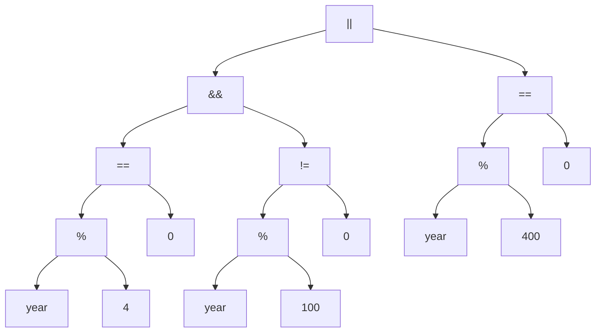
```mermaid
graph TD
    A["||"] --> B["&&"]
    A["||"] --> C["=="]
    B["&&"] --> D["=="]
    B["&&"] --> E["!="]
    C["=="] --> F["%"]
    C["=="] --> G["0"]
    D["=="] --> H["%"]
    D["=="] --> I["0"]
    E["!="] --> J["%"]
    E["!="] --> K["0"]
    F["%"] --> L["year"]
    F["%"] --> M["400"]
    H["%"] --> N["year"]
    H["%"] --> O["4"]
    J["%"] --> P["year"]
    J["%"] --> Q["100"]
```
---
## 6.5 短路操作
	短路操作
		当逻辑与(&&)的左操作数为假时，可以不用执行右操作数
		当逻辑或(||)的左操作数为真时，可以不用执行右操作数

```c
#include<stdio.h>
int main(){
	int i = 1;
	int j = 1;
	i == j || (j = 2);
	printf("j = %d\n",j);
	
	return 0;
}
```

```c
结果：j = 1
```

- [0] 总结：当表达式中存在&&或者||时，表达式应该先执行左边的操作数，看是否触发短路，再考虑是否执行右边的操作数。
---
## 6.6 赋值运算符
	赋值运算符 L = R
		赋值运算符优先级比较低
		可以将赋值运算符'='看作一个向左指向的箭头'⬅'，其实质为把R的值(可以是临时数据)放入L的内存空间里面。因此，我们需要对L提出一些要求：

$$
\text L(左值)
\begin{cases}
① & L必须代表一片内存空间 \\
② & 该空间可以被修改 \\
\end{cases}
$$

```c
#include<stdio.h>
int main(){
	int i = 1; //这个等于号不是赋值，它是初始化
	i = 3 + 4; //合理
	3 + 4 = i; //不合理
	i = i + 1; //合理 i出现在左边表示访问i的地址；i出现在右边表示获取i的值
	i += 1; //等价于 i = i + 1;
	++i; //等价于 i = i + 1;
	
	return 0;
}
```

	赋值运算符的结合性 —— 从右往左

```c
#include<stdio.h>
int main(){
	int x,y;
	x = y = 1;
	printf("x = %d,y = %d\n",x,y);
	
	return 0;
}
```

```c
结果：x = 1,y = 1
```
---
## 6.7 三目运算符
	条件运算符 3目 A ? B : C
		检查A的真假，若A为真则返回B，若A为假则返回C

```c
#include<stdio.h>
int main(){
	int a = 10,b = 5;
	int max = a > b ? a : b;
	printf("max = %d\n",max);
	
	return 0;
}
```

```c
结果：max = 10
```

```c
#include<stdio.h>
int main(){
	int a = 10,b = 5,c = 15;
	int max = (a > b ? a : b) > c ? (a > b ? a : b) : c;
	printf("max = %d\n",max);
	
	return 0;
}
```

```c
结果：max = 15
```
---
## 6.8 逗号运算符
	逗号运算符的优先级是最低的
	A,B ——> 先执行A再执行B最后返回B
	和A;B;很像

	场景：变量i，要求先改变i的值，再判断i是否合适

	if(i = i + 1,i == 3){
	}

- [2] 注意：函数参数里面的','不是逗号运算符，C语言没有规定参数的处理顺序。
---
## 6.9 自增自减运算符
	++ 单目 自增 ——> 操作数必须是左值
	-- 单目 自减 ——> 操作数必须是左值

	++i 前缀自增 内存内容：4 返回结果：4 ——> 先自增再返回
	i++ 后缀自增 内存内容：4 返回结果：3 ——> 先返回再自增

```c
#include<stdio.h>
int main(){
	int i = 3;
	int j;
	j = ++i; //前缀自增：先自增(++)再返回
	printf("i = %d,j = %d\n",i,j)
	
	return 0;
}
```

```c
结果：i = 4,j = 4
```

```c
#include<stdio.h>
int main(){
	int i = 3;
	int j;
	j = i++; //前缀自增：先自增(++)再返回
	printf("i = %d,j = %d\n",i,j)
	
	return 0;
}
```

```c
结果：i = 4,j = 3
```
---
[[2026-01-27]]
## 6.10 运算符总结

```c
5 > 3 && 8 < 4 - !0
```

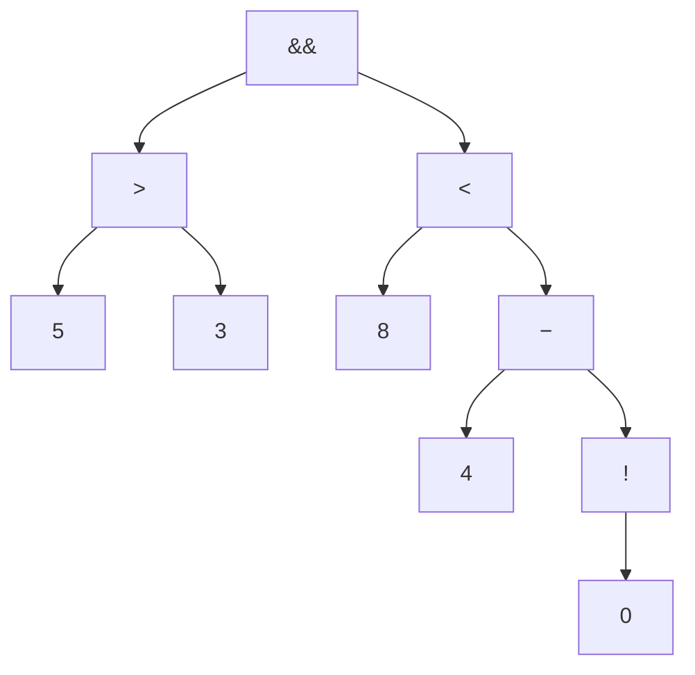
```mermaid
graph TD
    A["&&"] --> B["&gt;"]
    A["&&"] --> C["<"]
    B["&gt;"] --> D["5"]
    B["&gt;"] --> E["3"]
    C["<"] --> F["8"]
    C["<"] --> G["&minus;"]
    G["&minus;"] --> H["4"]
    G["&minus;"] --> I["!"]
    I["!"] --> J["0"]
```

```
先算 5 > 3 --> 1

!0 --> 1
4 - 1 --> 3
8 < 3 --> 0

最后 1 && 0 --> 0
```

- [0] 1.需要按照优先级整理表达式树
- [1] 2.几个特殊运算符 && || , 规定了执行顺序
---
# 7. 选择结构
## 7.1 选择结构描述

	先修知识 —— 顺序结构

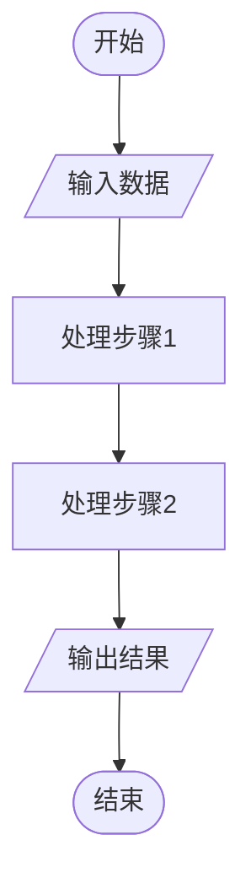
```mermaid
flowchart TD
    Start([开始]) --> Input[/输入数据/]
    Input --> Process1[处理步骤1]
    Process1 --> Process2[处理步骤2]
    Process2 --> Output[/输出结果/]
    Output --> End([结束])
```

	选择结构

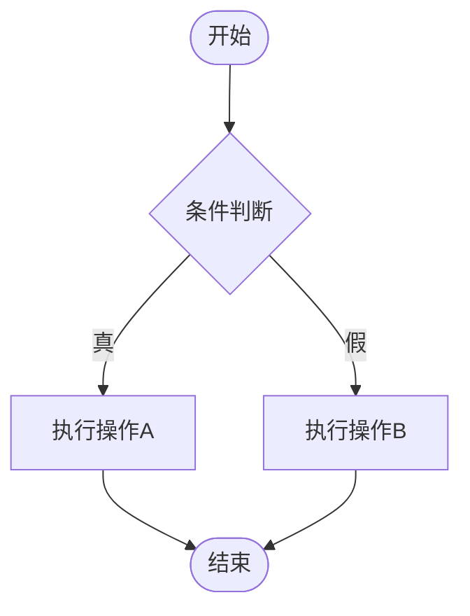
```mermaid
flowchart TD
    Start([开始]) --> Condition{条件判断}
    Condition -->|真| ProcessA[执行操作A]
    Condition -->|假| ProcessB[执行操作B]
    ProcessA --> End([结束])
    ProcessB --> End
```

- [0] C语言中选择结构靠if和switch两种方式实现
---
## 7.2 单分支if
	if(表达式){
		语句块
	}

	语句块可以是：
		一个语句
		{多个语句}

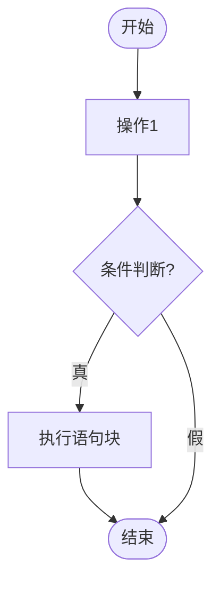
```mermaid
flowchart TD
    A([开始]) --> B[操作1]
    B --> C{条件判断?}
    C -->|真| D[执行语句块]
    D[执行语句块] --> F([结束])
    C -->|假| F([结束])
```
```c
#define _CRT_SECURE_NO_WARNINGS
#include<stdio.h>
int main(){
	int i;
	scanf("%d",&i);
	if(i == 1){
		printf("i is 1!\n");
	} //编程要求：我们自己写的代码，不能省略花括号。
	
	return 0;
}
```

```c
输入：1
结果：i is 1!
```
---
## 7.3 双分支if
	if(表达式){
		语句块1
	}
	else{
		语句块2
	}

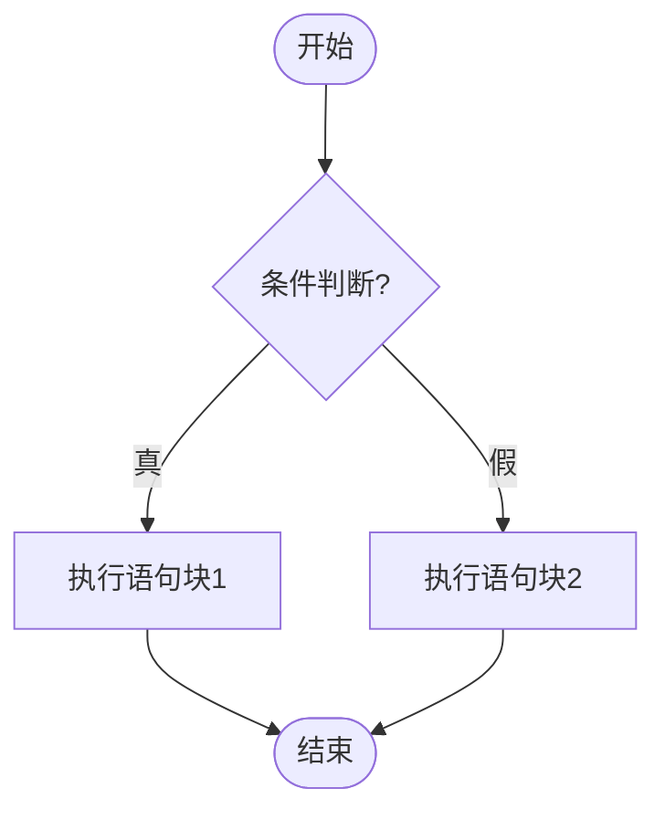
```mermaid
flowchart TD
    A([开始]) --> B{条件判断?}
    B -->|真| C[执行语句块1]
    B -->|假| D[执行语句块2]
    C --> E([结束])
    D --> E([结束])
```

```c
#include<stdio.h>
int main(){
	int a = 10,b = 5;
	if(a > b){
		printf("max = a,a is %d\n",a)
	}
	else{
		printf("max = b,b is %d\n",b);
	}
	
	return 0;
}
```

```c
结果：max = a,a is 10
```

```c
#include<stdio.h>
int main(){
	int a = 10,b = 15,c = 20;
	if(a > b){
		if(a > c){
			printf("max = a,a is %d\n",a);
		}
		else{
			printf("max = c,c is %d\n",c);
		}
	}
	else{
		if(b > c){
			printf("max = b,b is %d\n",b);
		}
		else{
			printf("max = c,c is %d\n",c);
		}
	}
	
	return 0;
}
```

```c
结果：max = c,c is 20
```
---
## 7.4 多分支if
	只需要在else的语句里面嵌套使用if，就可以实现更多分支的if了。

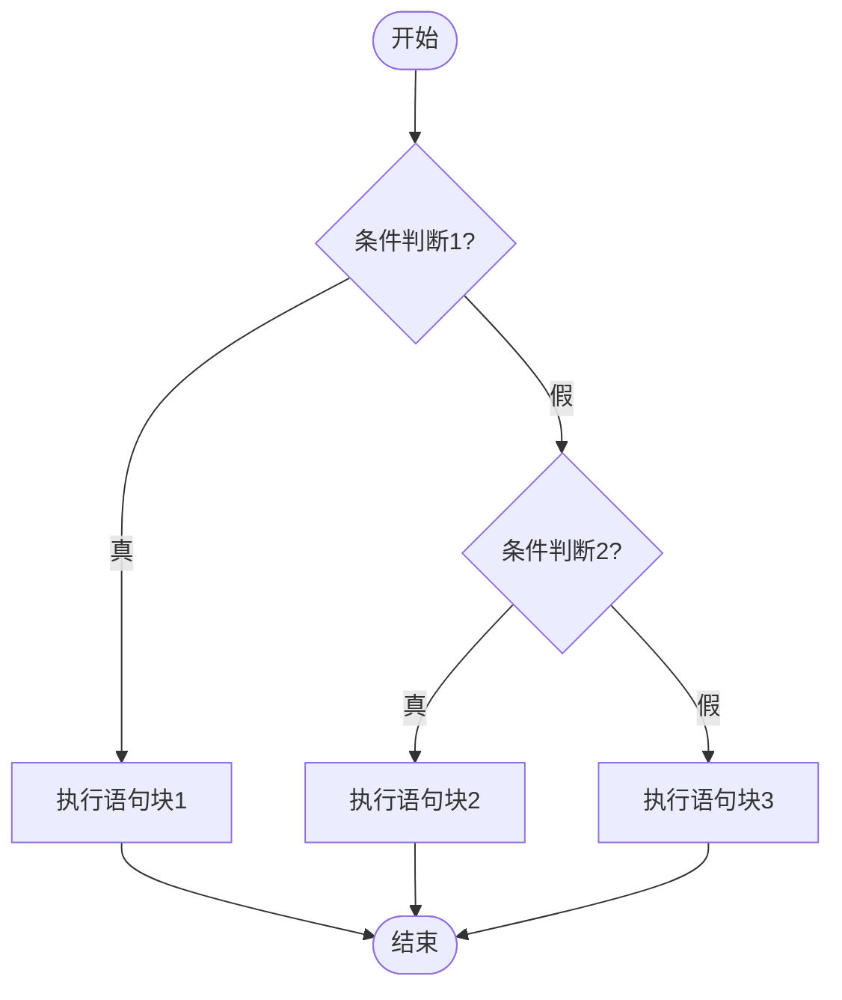
```mermaid
flowchart TD
    Start([开始]) --> Condition1{条件判断1?}
    Condition1 -->|真| Process1[执行语句块1]
    Condition1 -->|假| Condition2{条件判断2?}
    Condition2 -->|真| Process2[执行语句块2]
    Condition2 -->|假| Default[执行语句块3]
    Process1 --> End([结束])
    Process2 --> End([结束])
    Default --> End([结束])
```

```c
#define _CRT_SECURE_NO_WARNINGS
#include<stdio.h>
int main(){
	int height;
	scanf("%d",&height);
	if(height < 160){
		printf("He is short!\n");
	}
	else if(height <= 178){
		printf("He is middle-sized!\n")
	}
	else{
		printf("He is tall!\n");
	}
	
	return 0;
}
```

```c
输入：180
结果：He is tall!
```
---
[[2026-01-29]]
## 7.5 else就近匹配
	不加花括号可能会出现的问题

```c
#include<stdio.h>
int main(){
	int i = 0;
	if(i > 1)
		if(i < 10)
			printf("i is between 1 amd 10\n");
	else{
		printf("i is less than 1\n");
	}
	
	return 0;
}
```

```c
结果：
```

- [0] if和else是就近匹配的

```c
#include<stdio.h>
int main(){
	int i = 0;
	if(i > 1){
		if(i < 10){
			printf("i is between 1 and 10\n");
		}
	}
	else{
		printf("i is less than 1\n");
	}
	
	return 0;
}
```

```c
结果：i is less than 1
```

- [1] C语言中，缩进不代表匹配规则
---
## 7.6 switch
	用于处理固定的多分支。

	switch(表达式){
		case 值1:
			...
		case 值2:
			...

		...

		default:
			...
	}

```c
#include<stdio.h>
int main(){
	int i = 4;
	switch(i){
		case 1:
			printf("1\n");
		case 2:
			printf("2\n");
		case 3:
			printf("3\n");
		default:
			printf("default!\n");
	}
	
	return 0;
}
```

```c
结果：default!
```

```c
#include<stdio.h>
int main(){
	int i = 3;
	switch(i){
		case 1:
			printf("1\n");
		case 2:
			printf("2\n");
		case 3:
			printf("3\n");
		default:
			printf("default!\n");
	}
	
	return 0;
}
```

```c
结果：
i = 3
default!
```

	switch当中的break
		switch语句块的代码遇到break会立刻跳出语句块

```c
#include<stdio.h>
int main(){
	int i = 3;
	switch(i){
		case 1:
			printf("1\n");
			break;
		case 2:
			printf("2\n");
			break;
		case 3:
			printf("3\n");
			break;
		default:
			printf("default!\n");
			break;
	}
	
	return 0;
}
```

```c
结果：3
```

	场景题：给出年份和月份，求这个月有多少天？

```c
#define _CRT_SECURE_NO_WARNINGS
#include<stdio.h>
int main(){
	int year,month;
	scanf("%d%d",&year,&month);
	int days_of_the_month;
	switch(month){
		case 1: case 3: case 5:
		case 7: case 8: case 10:
		case 12:
			days_of_the_month = 31;
			printf("Days of the month are %d\n",days_of_the_month);
			break;
		case 4: case 6: case 9:
		case 11:
			days_of_the_month = 30;
			printf("Days of the month are %d\n",days_of_the_month);
			break;
		case 2:
			days_of_the_month = 28 + (year % 400 == 0 || year % 4 == 0 && year % 100 != 0);
			printf("Days of the month are %d\n",days_of_the_month);
			break;
		default:
			printf("error!\n");
	}
	
	return 0;
}
```

```c
输入：2026 1
结果：Days of the month are 31
```
---
# 8. 循环结构
## 8.1 goto和循环
	实现函数内部的跳转 ——> 重复做一些事情 ——> 循环结构

```c
#include<stdio.h>
int main(){
	int i = 1;
	int total = 0;
label:
	total += i;
	++i;
	if(i <= 100){
		goto label;
	}
	printf("total is %d\n",total);
	
	return 0;
}
```

```c
结果：total is 5050
```

	如何用goto实现循环：
		先写标签，再写goto —— 实现循环
		goto语句应该放在if结构里面，否则会产生死循环（死循环需要用任务管理器排查）

	goto实现循环的问题：
		goto有害 —— Dijkstra
			代码的可读性下降
			性能问题（破坏了局部性）
		我们一般情况下使用goto，就算是用goto，也不会用它来实现循环。
		goto的使用场景是做快速跳转 —— 可以用goto离开多重循环。

		前向goto：标签在goto前面 —— 实现循环
		后向goto：标签在goto后面 —— 快速跳转
---
[[2026-02-01]]
## 8.2 while循环
	while循环
		while(表达式 —— 入口条件){
			语句块 —— 循环体
		}

		语句块可以是：
			一个语句
			{多个语句}

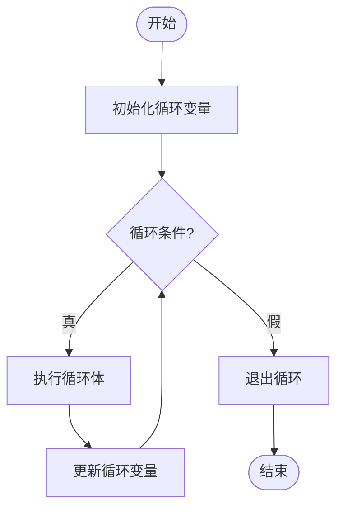
```mermaid
flowchart TD
    Start([开始]) --> Init[初始化循环变量]
    Init --> Condition{循环条件?}
    Condition -->|真| LoopBody[执行循环体]
    LoopBody --> Update[更新循环变量]
    Update --> Condition
    Condition -->|假| Exit[退出循环]
    Exit --> End([结束])
```

```c
#include<stdio.h>
int main(){
	int i = 1;
	int total = 0;
	while(i <= 100){ //先写循环体，再写入口条件
		total += i;
		++i;
	}
	printf("Total is %d\n",total);
	
	return 0;
}
```

```c
结果：Total is 5050
```
---
## 8.3 翻转整数
	输入一个整数，然后输出翻转之后的结果：
	1234 ——> 4321

- [0] 本题解题思路详见[[8.3 翻转整数解题思路]]

```c
#define _CRT_SECURE_NO_WARNINGS
#include<stdio.h>
int main(){
	int number;
	scanf("%d",&number);
	int input = number;
	int output = 0;
	while(input > 0){
		output *= 10;
		output += input % 10;
		input /= 10;
	}
	printf("output is %d\n",output);
	
	return 0;
}
```

```c
输入：1234
结果：output is 4321
```

	使用循环解决问题的思路：
		1.代码中肯定存在重复的行为

		2.先想循环体，把问题的中间状态列一个表格，观察各数据的变化，设计合理的变量

		3.入口条件，重点关注最后一次循环体（边界问题）
---
## 8.4 小写转大写
	输入一行字符串，将其中的小写字母转成大写字母：
	hello world! ——> HELLO WORLD!

- [0] 本题需要用到我们之前学过的知识[[ASCII码表(完整版)]]

- [1] 本题解题思路详见[[8.4 小写转大写解题思路]]

```c
#define _CRT_SECURE_NO_WARNINGS
#include<stdio.h>
int main(){
	char ch;
	while(scanf("%c",&ch) , ch != '\n'){
		if(ch >= 'a' && ch <= 'z'){
			ch -= 32; //将小写字母 转换成 大写字母
		}
		printf("%c",ch);
	}
	printf("\n");
	
	return 0;
}
```

```c
输入：hello world!
结果：HELLO WORLD!
```

	使用循环解决问题的思路：
		1.代码中肯定存在重复的行为

		2.先想循环体，把问题的中间状态列一个表格，观察各数据的变化，设计合理的变量

		3.入口条件，重点关注最后一次循环体（边界问题）
---
## 8.5 for循环
	背景：使用while执行一个100次的循环，代码如下：

```c
#include<stdio.h>
int main(){
	int i = 0;
	while(i < 100){
		循环体
		++1;
	}
}
```

	当我们使用while循环时，需要在主业务(循环体)之外进行一些额外操作(用于控制此循环)：
		1.初始化一个循环变量
		2.设置入口条件
		3.在循环体末尾对循环变量进行迭代
---

	这些额外操作(用于控制此循环)与主业务(循环体)的逻辑是毫无关联的，但在书写代码时却与主业务(循环体)的代码混在一起。为了解决这个问题，我们提出了for循环。
	for循环希望将这些额外操作(用于控制此循环)的代码和主业务(循环体)的代码分离，使代码结构更加清晰，方便程序员阅读。
---

	for(初始化;入口条件;循环变量迭代){
		语句块 —— 循环体
	}

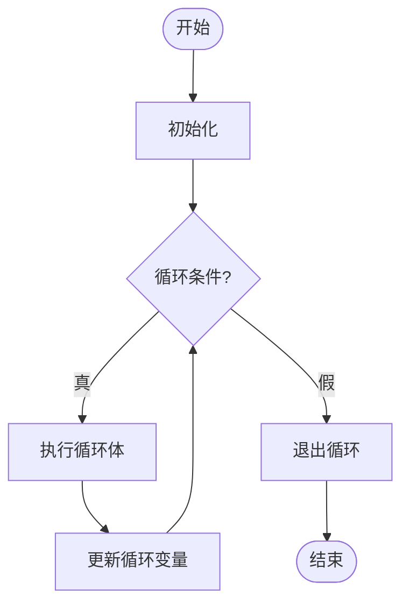
```mermaid
flowchart TD
    Start([开始]) --> Init[初始化]
    Init --> Condition{循环条件?}
    Condition -->|真| LoopBody[执行循环体]
    LoopBody --> Update[更新循环变量]
    Update --> Condition
    Condition -->|假| Exit[退出循环]
    Exit --> End([结束])
```

```c
#include<stdio.h>
int main(){
	int total;
	for(i = 1;i <= 100;++1){
		total += i;
	}
	printf("Total is %d\n",total);
	
	return 0;
}
```

```c
结果：Total is 5050
```
---
## 8.6 do while循环
	do while循环
		do{
			语句块 —— 循环体
		}
		while(条件);
	先执行语句块，再检查条件

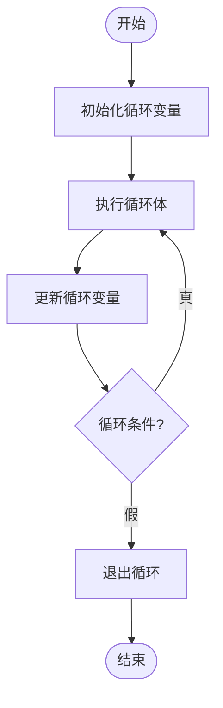
```mermaid
flowchart TD
    Start([开始]) --> Init[初始化循环变量]
    Init --> LoopBody[执行循环体]
    LoopBody --> Update[更新循环变量]
    Update --> Condition{循环条件?}
    Condition -->|真| LoopBody
    Condition -->|假| Exit[退出循环]
    Exit --> End([结束])
```

```c
#include<stdio.h>
int main(){
	int total = 0;
	int i = 1;
	do{
		total += i;
		++1;
	}while(i <= 100);
	printf("Total is %d\n",total);
	
	return 0;
}
```

```c
结果：Total is 5050
```
---
[[2026-02-06]]
## 8.7 continue
	continue关键字
		continue用在循环体里面
		程序运行的时候遇到continue，就会跳过本次循环体，直接开始下一次循环体
---

	场景题：对2，4，6，8，···，100进行求和

```c
#include<stdio.h>
int main(){
	int i = 1;
	int total = 0;
	while(i <= 100){
		if(i % 2 != 0){
			++i; //在continue之前记得对循环变量进行迭代！！！
			continue;
		}
		else{
			total += i;
			++i;
		}
	}
	printf("Total is %d\n",total);
	
	return 0;
}
```

```c
结果：Total is 2550
```

- [0] 在while循环中使用continue需注意要在continue之前对循环变量进行迭代！！！

```c
#include<stdio.h>
int main(){
	int total = 0;
	for(i = 1;i <= 100;++i){
		if(i % 2 != 0){
			continue;
		}
		else{
			total += i;
		}
	}
	printf("Total is %d\n",total);
	
	return 0;
}
```

```c
结果：Total is 2550
```
---
## 8.8 break
	break关键字
		break之前在选择结构switch里面出现过，现在讲的是一种新用法。
		break与continue一样只能出现在循环体里面。
		当程序运行到break的时候，程序会跳出单层循环。
		break的此种用法一般用于提前终止循环或循环次数未知的循环。
---

	场景题：1 + 2 + 3 + ··· + n > 200 (n∈N)，使此不等式成立的n的最小值是多少？（n为多少时，1 + 2 + 3 + ··· + n 第一次大于200？）

```c
#include<stdio.h>
int main(){
	while(1){
		//死循环 + 循环体里面break --> 循环次数未知的循环
		total += i;
		if(total > 200){
			break; //跳出循环结构
		}
		++i;
	}
	printf("Total is %d,i is %d\n",total,i);
	
	return 0;
}
```

```c
结果：Total is 210,i is 20
```
---
# 9. 专题B 枚举
	枚举思想
		面对一个问题的时候，直接将问题的所有可能性全部列出来，一个一个地检查是否符合题目的要求 --> 暴力解法 --> 存在重复操作 --> 循环
## 9.1 水仙花数
	“水仙花数”是指一个三位数，其各位数字的立方和等于该数本身。例如，153是一个水仙花数。请编写程序，找出所有的三位水仙花数。

```c
#include<stdio.h>
int main(){
	for(int i = 1;i <= 9;++i){
		for(int j = 0;j <= 9;++j){
			for(int k = 0;k <= 9;++k){
				if(100 * i + 10 * j + k == i * i * i + j * j * j + k * k * k){
					printf("%d\n",100 * i + 10 * j + k);
				}
			}
		}
	}
	
	return 0;
}
```

```c
结果：
153
370
371
407
```
---
## 9.2 找完数
	完数是指除本身以外的因子之和等于其本身的数。
	任给一个自然数n，求n以内的所有完数。如果找不到，则输出"No"

```c
#define _CRT_SECURE_NO_WARNINGS
#include<stdio.h>
int main(){
	int n;
	printf("Please enter a natural number:");
	scanf("%d",&n);
	int Is_Empty = 1; //记录完数个数是否为0
	for(int i = 1;i <= n;++i){
		// i用来遍历所有小于等于n的自然数
		int total = 0;
		for(int j = 1;j < i;++j){
			// j用来遍历所有比i小的数，把i的约数找出来
			if(i % j == 0){
				// 如果整除，则j是i的一个约数
				total += j;
			}
			else{
				continue;
			}
		}
		if(total == i){
			// 满足完数条件
			Is_Empty = 0; // 只要有一个完数，就不打印No
			printf("%d is a perfect number!\n",i);
		}
		else{
			continue;
		}
	}
	if(Is_Empty == 1){
		printf("There are no perfect numbers within the natural number n!\n");
	}
	
	return 0;
}
```

```c
Please enter a natural number:1024
结果：
6 is a perfect number!
28 is a perfect number!
496 is a perfect number!
```
---
## 9.3 检查一个数是否为质数
	输入一个正整数，检查该数是否为质数。如果该数是质数，则输出Yes；如果该数不是质数，则输出No。

```c
#define _CRT_SECURE_NO_WARNINGS
#include<stdio.h>
int main(){
	int n;
	printf("Please enter a positive integer:");
	scanf("%d",&n);
	int Is_Prime = 1;
	for(int i = 2;i < n;++i){
		if(n % i == 0){
			Is_Prime = 0;
			break;
		}
	}
	if(Is_Prime == 1){
		printf("Yes\n");
	}
	else{
		printf("No\n");
	}
	
	return 0;
}
```

```c
Please enter a positive integer:31
结果：Yes
```
---

	算法是否有优化空间？
	当前算法为：从2检查到n - 1 --> 有没有办法少检查几次？

- [0] 假如一个数n不是质数，那么它可以用a * b（a,b ≠ 1 且 a,b ≠ n）来表示，并且a,b不可能同时大于$\sqrt{n}$ ，也就是说，假如一个数n不是质数，那么它至少有一个约数小于等于$\sqrt{n}$
- [1] 因此，我们只需要从2检查到$\sqrt{n}$就可以了

```c
#define _CRT_SECURE_NO_WARNINGS
#include<stdio.h>
int main(){
	int n;
	printf("Please enter a positive integer:");
	scanf("%d",&n);
	int Is_Prime = 1;
	for(int i = 2;i * i <= n;++i){
		if(n % i == 0){
			Is_Prime = 0;
			break;
		}
	}
	if(Is_Prime == 1){
		printf("Yes\n");
	}
	else{
		printf("No\n");
	}
	
	return 0;
}
```

```c
Please enter a positive integer:31
结果：Yes
```
---
# 10. 函数的基本原理
## 10.1 函数简介
	正式学习函数之前，我们需要对函数建立两个直觉：
		- 函数大概有什么用？
			● 传入参数 --> 执行函数体里面的指令 --> 返回结果
			● 把函数看成是程序的组件：
				■ 可以把函数看成是小的子程序
				■ 可以把程序看成是不同的函数组合起来
		- 使用函数有什么好处？
			● 减少重复代码的冗余
---

	场景题：现有3组数据，每组数据里面有3个整数，请你判断每组数据中的3个整数能否作为三角形的三边边长。三组数据如下：

	第一组数据：1,2,3
	第二组数据：2,3,4
	第三组数据：4,5,6

	解题思路：根据三角形任意两边之和大于第三边的性质对每组数据进行判断。
---
>**Version 1** : 声明每组数据时直接进行初始化，再对每组数据进行判断。

```c
#include<stdio.h>
int main(){
	int a1 = 1,b1 = 2,c1 = 3;
	int a2 = 2,b2 = 3,c2 = 4;
	int a3 = 4,b3 = 5,c3 = 6;
	
	if(a1 + b1 > c1 && a1 + c1 > b1 && b1 + c1 > a1){
		printf("The three integers in the first set of data can serve as the lengths of the three sides of a triangle.\n");
	}
	else{
		printf("The three integers in the first set of data cannot serve as the lengths of the three sides of a triangle.\n");
	}
	
	if(a2 + b2 > c2 && a2 + c2 > b2 && b2 + c2 > a2){
		printf("The three integers in the second set of data can serve as the lengths of the three sides of a triangle.\n");
	}
	else{
		printf("The three integers in the second set of data cannot serve as the lengths of the three sides of a triangle.\n");
	}
	
	if(a3 + b3 > c3 && a3 + c3 > b3 && b3 + c3 > a3){
		printf("The three integers in the third set of data can serve as the lengths of the three sides of a triangle.\n");
	}
	else{
		printf("The three integers in the third set of data cannot serve as the lengths of the three sides of a triangle.\n");
	}
	
	return 0;
}
```

```c
结果：
The three integers in the first set of data cannot serve as the lengths of the three sides of a triangle.
The three integers in the second set of data can serve as the lengths of the three sides of a triangle.
The three integers in the third set of data can serve as the lengths of the three sides of a triangle.
```
---
>**Version 2** : 先声明每组数据，然后通过 **scanf( )** 对每组数据进行赋值，最后对每组数据进行判断。

```c
#define _CRT_SECURE_NO_WARNINGS
#include<stdio.h>
int main(){
	int a1,b1,c1;
	printf("Please enter the first set of data:");
	scanf("%d%d%d",&a1,&b1,&c1);
	
	int a2,b2,c2;
	printf("Please enter the second set of data:");
	scanf("%d%d%d",&a2,&b2,&c2);
	
	int a3,b3,c3;
	printf("Please enter the third set of data:");
	scanf("%d%d%d",&a3,&b3,&c3);
	
	if(a1 + b1 > c1 && a1 + c1 > b1 && b1 + c1 > a1){
		printf("The three integers in the first set of data can serve as the lengths of the three sides of a triangle.\n");
	}
	else{
		printf("The three integers in the first set of data cannot serve as the lengths of the three sides of a triangle.\n");
	}
	
	if(a2 + b2 > c2 && a2 + c2 > b2 && b2 + c2 > a2){
		printf("The three integers in the second set of data can serve as the lengths of the three sides of a triangle.\n");
	}
	else{
		printf("The three integers in the second set of data cannot serve as the lengths of the three sides of a triangle.\n");
	}
	
	if(a3 + b3 > c3 && a3 + c3 > b3 && b3 + c3 > a3){
		printf("The three integers in the third set of data can serve as the lengths of the three sides of a triangle.\n");
	}
	else{
		printf("The three integers in the third set of data cannot serve as the lengths of the three sides of a triangle.\n");
	}
	
	return 0;
}
```

```c
Please enter the first set of data:1 2 3
Please enter the second set of data:2 3 4
Please enter the third set of data:4 5 6
结果：
The three integers in the first set of data cannot serve as the lengths of the three sides of a triangle.
The three integers in the second set of data can serve as the lengths of the three sides of a triangle.
The three integers in the third set of data can serve as the lengths of the three sides of a triangle.
```
---

	Version 1与Version 2的代码中存在大量重复冗余的片段，导致代码非常容易出错。为了降低代码出错的概率，我们应该尽量减少重复的操作。为此我们提出了函数这一概念。
---

	函数
		返回值类型 函数名(函数参数列表 --> 形参 --> 当作局部变量){
			函数体
		}
---
>**Version 3** : 将 **Version 1** 与 **Version 2** 中对每组数据进行判断的代码重新编写后集成到新定义的函数 **Is_Triangle( )** 中，对每组数据进行判断时只需调用**Is_Triangle( )** ，减少了重复操作，降低了代码出错的概率。

```c
#define _CRT_SECURE_NO_WARNINGS
#include<stdio.h>

void Is_Triangle(char rank[], int a, int b, int c){
	if (a + b > c && a + c > b && b + c > a){
		printf("The three integers in the %s set of data can serve as the lengths of the three sides of a triangle.\n", rank);
	}
	else{
		printf("The three integers in the %s set of data cannot serve as the lengths of the three sides of a triangle.\n", rank);
	}
}

int main(){
	int a1, b1, c1;
	char r1[] = "first";
	printf("Please enter the %s set of data:", r1);
	scanf("%d%d%d", &a1, &b1, &c1);
	Is_Triangle(r1, a1, b1, c1);

	int a2, b2, c2;
	char r2[] = "second";
	printf("Please enter the %s set of data:", r2);
	scanf("%d%d%d", &a2, &b2, &c2);
	Is_Triangle(r2, a2, b2, c2);

	int a3, b3, c3;
	char r3[] = "third";
	printf("Please enter the %s set of data:", r3);
	scanf("%d%d%d", &a3, &b3, &c3);
	Is_Triangle(r3, a3, b3, c3);

	return 0;
}
```

```c
Please enter the first set of data:1 2 3
结果：
The three integers in the first set of data cannot serve as the lengths of the three sides of a triangle.
Please enter the second set of data:2 3 4
结果：
The three integers in the second set of data can serve as the lengths of the three sides of a triangle.
Please enter the third set of data:4 5 6
结果：
The three integers in the third set of data can serve as the lengths of the three sides of a triangle.
```
---
>**Version 4** : 进一步将告诉程序输入的是第几组数据这一功能也集成到**Is_Triangle( )** 中，并引入**整形变量n** 来获取要输入几组数据的信息，进而通过**for** 循环来调用**Is_Triangle( )** 对每组数据进行判断。

```c
#define _CRT_SECURE_NO_WARNINGS
#include<stdio.h>

void Is_Triangle(){
	char rank[100];
	printf("Please enter the ranking of this set of data(e.g., first, second, third, ...):");
	scanf("%s",rank);
	int a,b,c;
	printf("Please enter the %s set of data(three integers):",rank);
	scanf("%d%d%d",&a,&b,&c);
	
	if (a + b > c && a + c > b && b + c > a){
		printf("The three integers in the %s set of data can serve as the lengths of the three sides of a triangle.\n", rank);
	}
	else{
		printf("The three integers in the %s set of data cannot serve as the lengths of the three sides of a triangle.\n", rank);
	}
}

int main(){
	int n;
	printf("Please input the number of data groups:");
	scanf("%d",&n);
	for(int i = 1;i <= n;++i){
		Is_Triangle();
	}

	return 0;
}
```

```c
Please input the number of data groups:3
Please enter the ranking of this set of data(e.g., first, second, third, ...):first
Please enter the first set of data(three integers):1 2 3
结果：
The three integers in the first set of data cannot serve as the lengths of the three sides of a triangle.
Please enter the ranking of this set of data(e.g., first, second, third, ...):second
Please enter the second set of data(three integers):2 3 4
结果：
The three integers in the second set of data can serve as the lengths of the three sides of a triangle.
Please enter the ranking of this set of data(e.g., first, second, third, ...):third
Please enter the third set of data(three integers):4 5 6
结果：
The three integers in the third set of data can serve as the lengths of the three sides of a triangle.
```

- [0] 当我们使用函数时，可以将重复冗余的操作都放进函数体中。这样做可以使代码量减少，进而降低程序出错的可能性。
---
[[2026-02-10]]
## 10.2 函数的声明和定义
	函数的声明
		通知编译器函数的一些信息，包括：
			返回值类型
			函数名
			形式参数
			分号';'

		在使用函数之前，必须有函数的声明

```c
#define _CRT_SECURE_NO_WARNINGS
#include<stdio.h>

void Is_Triangle(); //函数的声明
void Is_Triangle(); //声明可以多次

int main(){
	int n;
	printf("Please input the number of data groups:");
	scanf("%d",&n);
	for(int i = 1;i <= n;++i){
		Is_Triangle();
	}

	return 0;
}

void Is_Triangle(){
	char rank[100];
	printf("Please enter the ranking of this set of data(e.g., first, second, third, ...):");
	scanf("%s",rank);
	int a,b,c;
	printf("Please enter the %s set of data(three integers):",rank);
	scanf("%d%d%d",&a,&b,&c);
	
	if (a + b > c && a + c > b && b + c > a){
		printf("The three integers in the %s set of data can serve as the lengths of the three sides of a triangle.\n", rank);
	}
	else{
		printf("The three integers in the %s set of data cannot serve as the lengths of the three sides of a triangle.\n", rank);
	}
}
```
---

	函数的定义
		函数的定义就是把一个函数的所有信息全部描述出来，包括：
			返回值类型
			函数名
			形式参数
			函数体{}

		函数的定义会自带一次声明。
		函数的定义在一个程序中只能有一次！
---
- [0] 一个函数的定义在程序中只能有一次；一个函数的声明在程序中可以有多次。
---
## 10.3 函数运行过程
	函数调用
		函数调用语句之前，必须要先有函数声明。

		调用函数时，先写函数的名字，再写一对圆括号，在圆括号里面写传入的参数（实际参数 —— 实参）

		主调方：调用函数的一方
		被调方：被调用的函数

		流程：主调方先准备实参，然后传入给被调方，调用被调函数，被调方执行函数体，返回之后讲返回值给主调方。
---

	调试函数调用过程

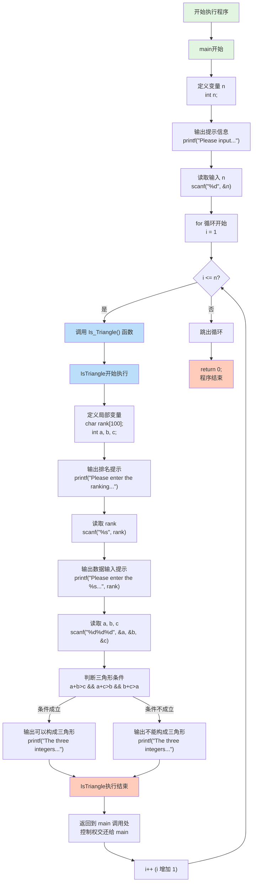
```mermaid
flowchart TD
    Start["开始执行程序"] --> A[main开始]
    
    A --> B["定义变量 n<br>int n;"]
    B --> C["输出提示信息<br>printf(&quot;Please input...&quot;)"]
    C --> D["读取输入 n<br>scanf(&quot;%d&quot;, &n)"]
    D --> E["for 循环开始<br>i = 1"]
    
    E --> Condition{i <= n?}
    
    Condition -- 是 --> F["调用 Is_Triangle() 函数"]
    
    F --> G[IsTriangle开始执行]
    G --> H["定义局部变量<br>char rank[100];<br>int a, b, c;"]
    H --> I["输出排名提示<br>printf(&quot;Please enter the ranking...&quot;)"]
    I --> J["读取 rank<br>scanf(&quot;%s&quot;, rank)"]
    J --> K["输出数据输入提示<br>printf(&quot;Please enter the %s...&quot;, rank)"]
    K --> L["读取 a, b, c<br>scanf(&quot;%d%d%d&quot;, &a, &b, &c)"]
    L --> M["判断三角形条件<br>a+b>c && a+c>b && b+c>a"]
    
    M -- 条件成立 --> N["输出可以构成三角形<br>printf(&quot;The three integers...&quot;)"]
    M -- 条件不成立 --> O["输出不能构成三角形<br>printf(&quot;The three integers...&quot;)"]
    
    N --> P[IsTriangle执行结束]
    O --> P
    
    P --> Q["返回到 main 调用处<br>控制权交还给 main"]
    Q --> R["i++ (i 增加 1)"]
    R --> Condition
    
    Condition -- 否 --> S["跳出循环"]
    S --> T["return 0;<br>程序结束"]
    
    style Start fill:#e1f5e1
    style A fill:#e1f5e1
    style F fill:#bbdefb
    style G fill:#bbdefb
    style P fill:#ffccbc
    style T fill:#ffccbc
```
- [0] 1.调试函数的时候要使用F11而不是F10
- [1] 2.主调函数去调用被调函数的时候，指令位置会跳转到被调函数，等被调函数返回之后，再回到主调方

>总结：
>顺序结构：指令一行一行从上往下走
>选择结构：出现指令跳转的情况
>循环结构：出现指令走回头路的情况
>函数调用：出现指令临时跳转到被调函数，被调方返回之后，再回到主调方的情况
---
## 10.4 函数运行的内存原理

```c
#include<stdio.h>

void func1(){
	
}

void func2(){
	func1();
}

int main(){
	func1();
	func2();
	
	return 0;
}
```

- [1] 调试函数调用的过程会发现：存在这样一个现象 —— 后调用的函数先返回。此现象的详细说明详见 —— [[函数调用的详细过程]]

- [0] 在指令的运行过程中，内存发生了什么变化？详见 —— [[内存布局]] + [[函数调用的内存原理]]

>总结：
>根据先修知识[[内存布局]]我们了解到 —— 函数调用影响的是栈区
>栈区的特征 —— 后进先出 **(Last in,first out.)**
>
>根据先修知识[[函数调用的内存原理]]我们了解到 —— 在函数调用的过程中，内存的变化如下：
>每次调用函数，会开辟一个栈帧
>栈帧会压入栈区；
>每次函数返回，会弹出一个栈帧 —— 被弹出的这个栈帧就会被销毁掉
---
## 10.5 作用域
	作用域用来描述变量的有效范围

```c
#define _CRT_SECURE_NO_WARNINGS
#include<stdio.h>
int a = 1;
void func(){
	int b = 2;
}
int main(){
	int c = 3;
	{
		int d = 4;
		// 在第11行这个位置，a b c d谁是有效的谁是无效的？答：除了b其他都有效。
	}
	
	// 在第14行这个位置，a b c d谁是有效的谁是无效的？答：除了b和d其他都有效。
	return 0;
}
```

- [0] 通过在**不同位置分别对a b c d进行赋值操作**，然后对代码进行编译，我们会发现：存在这样一个**现象** —— **不同位置的变量的有效范围是有区别的。**

- [1] 变量的作用域是以 —— **花括号'{}'** 作为边界的。

- [2] 我们将**花括号'{}'** 内部的变量称为 —— **内部变量**；我们将**花括号'{}'** 外部的变量称为 —— **外部变量**。

- [3] 外部变量在内部**依然可以生效**；内部变量在外部**不生效**。

- [4] C语言**不支持函数嵌套定义**

- [5] 函数**外部**的叫做**全局变量**；函数**内部**的叫做**局部变量**。
---
[[2026-02-11]]

```c
#define _CRT_SECURE_NO_WARNINGS
#include<stdio.h>
int a = 1;
void func(){
	int b = 2;
}
int main(){
	int c = 3;
	{
		int d = 4;
		int a = 2;
		a = 3;
		
	}
	
	return 0;
}
```

- [0] 在**main函数**前面打上一个**断点**后对程序进行调试，会发现指令在**进入main函数之前** **变量a的值为1**。指令在**进入main函数之后** 走到**int a = 2;** 这一行时，**变量a的值为2**；走到**a = 3;** 这一行时，**变量a的值为3**。指令**离开main函数之后**，**变量a的值又变回1了**。

>总结：
>在内部作用域里面，可以初始化一个和外部变量重名的变量 —— 起到隐藏的效果
>隐藏的含义：当程序运行到内部作用域的时候，外部变量就被藏起来了。
>
>❗注意：在C语言中，如果存在一个已被初始化的全局变量 `a`，而在某个函数内部**没有**定义同名的局部变量 `a`，就直接对变量 `a` 做各种运算，那么这里的 `a` 指的就是全局变量 `a`，所有运算都会直接作用于该全局变量，从而改变它的值。
---
## 10.6 生存期
	变量的生存期关注的是进程启动的时候，变量申请内存和释放内存的时机。
	变量在申请内存之后才能够使用；变量在释放内存后就不能够使用了。
	生存期与作用域的区别
		作用域：在写代码的时候考虑的。
		生存期：在程序运行的时候考虑的。

```c
#define _CRT_SECURE_NO_WARNINGS
#include<stdio.h>
int a = 1;
void func(){
	int a = 2;
}
int main(){
	int a = 3;
	func();
	
	return 0;
}
```

>总结：
>**全局变量**的**生存期**：**程序一启动**就**有效**；**程序终止**时**失效**。**与函数的调用与返回无关**。
>因此**全局变量**储存在内存的 **"数据段"** 中 **("数据段"的概念详见[[内存布局]])**。
>**局部变量**的**生存期**：所有的**局部变量**都储存在**栈帧**中 **("栈帧"的概念详见[[函数调用的内存原理]])**。**函数调用**时**分配内存**；**函数返回**时**释放内存**。
>因此**栈帧的大小**由**局部变量的大小**决定的。
---
## 10.7 值传递

>引例：对变量a和变量b做值交换的操作，代码如下：

```c
#define _CRT_SECURE_NO_WARNINGS
#include<stdio.h>
void swap(int a,int b){
	int temp = a;
	a = b;
	b = temp;
	printf("swap,a = %d,b = %d\n",a,b);
}
int main(){
	int a = 10,b = 5;
	swap(a,b);
	printf("main,a = %d,b = %d\n",a,b);
	
	return 0;
}
```

```c
结果：
swap,a = 5,b = 10
main,a = 10,b = 5
```

- [0] 通过**输出结果**我们可以得知：在**swap函数**中**成功**实现了对变量a和变量b做值交换的操作，而在**main函数**中**失败**了。这牵扯到了C语言中函数的一个非常重要的**机制** —— **[[值传递]](型参与实参的关系)**

- [1] **函数调用的过程**就是把**主调方的实参**传递给**被调方的形参**，**传递的方式**为**值传递**。

- [2] 在C语言中，**函数的形参**  **等价于** **函数内部的局部变量** **——** **函数的形参是储存到对应函数的栈帧中的**。**值传递的过程**可以简单理解为用 **实参值** 来 **初始化** **形参** **(将实参的值复制粘贴给形参)**。

- [3] **在main函数中失败的原因：** 值交换这一操作的代码都集成到**swap函数**中了，而**swap函数**所实现的值交换仅仅是对**swap函数**的**形参(sawp函数内部的局部变量)** 进行值交换，**main函数内部的局部变量a、b**并没有发生任何改变。因此在**main函数**中失败了。
---
[[2026-02-14]]
# 11. 数组
## 11.1 数组的概念和定义
	数组

	场景：
		如果需要5个变量？ —— int a1,a2,a3,a4,a5;
		如果需要10个变量？ —— int a1,a2,···,a10;
		如果需要100个变量？ —— int a1,a2,···,a100;

	由于程序业务的要求，我们现在需要很多个变量，原来用来描述单一数据的数据类型已经无法满足我们的需求了。因此我们提出了 —— 聚合数据结构(把单一的数据组合在一起)

	数组就是一种典型的聚合数据结构。

```c
#define _CRT_SECURE_NO_WARNINGS
#include<stdio.h>
int main(){
	int arr[5];
	
	return 0;
}
```

- [0] 当我声明了一个整形数组arr[5] (int arr[5])时，内存中发生了什么呢？ —— 详见[[C语言数组声明详解：int arr[5] ]]
- [1] 数组的性质 —— 详见[[数组的性质]]
---

	数组的定义
		元素的数据类型 数组名[数组长度(必须是"正·常·整数")];

```c
#define _CRT_SECURE_NO_WARNINGS
#include<stdio.h>
#define LEN 5
int main(){
	// 数组的长度必须大于0 && 数组的长度是一个整数
	int arr[LEN]; // 数组的元素类型为int，数组名为arr，数组长度为5。
	// 下面是不推荐的写法（不推荐的原因：数组长度不应该是变量）
	// int len = 5;
	// int arr[len];
	
	return 0;
}
```
---
## 11.2 数组的初始化
	数组的初始化就是在定义数组时，就给数组的元素设置好值 —— 数组的初始化

```c
#define _CRT_SECURE_NO_WARNINGS
#include<stdio.h>
#define LEN 5
int main(){
	int arr[LEN] = {1,2,3,4,5};
	
	return 0;
}
```

```c
#define _CRT_SECURE_NO_WARNINGS
#include<stdio.h>
#define LEN 5
int main(){
	// 初始化列表元素个数小于数组长度时，剩余元素自动赋值为0。
	// 注意：初始化列表元素个数不允许大于数组长度！！！
	int arr[LEN] = {1,2,3};
	
	return 0;
}
```

```c
#define _CRT_SECURE_NO_WARNINGS
#include<stdio.h>
#define LEN 5
int main(){
	// 数组长度是可以自动推断的。
	// 注意：只有初始化列表存在的情况下才可以省略数组长度！！！
	int arr[] = {1,2,3};
	
	return 0;
}
```

```c
#define _CRT_SECURE_NO_WARNINGS
#include<stdio.h>
#define LEN 5
int main(){
	// 申请一个长度为1024的数组，内容全是0
	int arr[1024] = {0};
	
	return 0;
}
```

```c
#define _CRT_SECURE_NO_WARNINGS
#include<stdio.h>
#define LEN 5
int main(){
	int arr[5] = {1,2,3,4,5}; // 定义语句里面，"="是初始化符号。
	int arr[5];
	arr[5] = {1,2,3,4,5}; // 在定义语句之外，"="是赋值的意思，赋值不能使用初始化列表。
	
	return 0;
}
```
---
[[2026-02-15]]
## 11.3 访问数组元素

```c
#define _CRT_SECURE_NO_WARNINGS
#include<stdio.h>
#define LEN 5
int main(){
	int arr[5] = {1,2,3,4,5};
	// 下标运算符'[]'
	// arr[0] arr[1] ··· arr[4] // 范围是 0 ~ N - 1
	/* arr[0]是一个元素 —— 可以当成一个变量：
		1.arr[0]里面有值
		2.编译器给arr[0]分配了内存空间
	*/
	
	return 0;
}
```

```c
#define _CRT_SECURE_NO_WARNINGS
#include<stdio.h>
#define LEN 5
int main(){
	int arr[5] = {1,2,3,4,5}; // 定义语句里面'[]'用来规定数组的长度，这时'[]'称为数组定义运算符。
	for(int i = 0;i < 5;++i){
		// 非定义语句里面'[]'用来根据下标访问元素。
		printf("arr[%d] = %d\n",i,arr[i]);
	}
	printf("-------------------------\n");
	arr[3] = 1024;
	for(int i = 0;i < 5;++i){
		printf("arr[%d] = %d\n",i,arr[i]);
	}
	
	return 0;
}
```
---
## 11.4 数组元素的内存布局和越界问题

>**知识回顾 —— 数组的性质**
>1.连续存储
>2.数据类型相同

```c
#define _CRT_SECURE_NO_WARNINGS
#include<stdio.h>
#define LEN 5
int main(){
	int arr[5] = {1,2,3,4,5}; // 定义语句里面'[]'用来规定数组的长度，这时'[]'称为数组定义运算符。
	for(int i = 0;i < 5;++i){
		// 非定义语句里面'[]'用来根据下标访问元素。
		printf("arr[%d] = %d\n",i,arr[i]);
	}
	printf("-------------------------\n");
	arr[3] = 1024;
	for(int i = 0;i < 5;++i){
		printf("arr[%d] = %d\n",i,arr[i]);
	}
	
	return 0;
}
```

	数组元素的内存布局
		1.数组的首地址和arr[0]的首地址是一样的。
		2.arr[i]的地址 = 数组首地址 + i * sizeof(元素类型) —— 如果想要访问某个元素，不需要知道数组的长度，只需要知道数组的首地址、下标和元素类型即可。

	'[]'的原理：根据数组的首地址、下标和元素类型求出i号元素在内存中的位置，再访问元素。
	'[]'的本质：先计算地址，再访问元素。

```c
#define _CRT_SECURE_NO_WARNINGS
#include<stdio.h>
#define LEN 5
int main(){
	int arr[5] = {1,2,3,4,5};
	int a = 20;
	for(int i = 0;i < 13;++i){
		arr[i] = i + 1;
	}
	printf("a = %d\n",a);
	
	return 0;
}
```

```c
结果：a = 12
```

- [0] 我并没有对局部变量a进行除了初始化之外的任何操作，但为什么打印的时候a的值从20变为12了呢？ —— 具体原因详见[[数组元素的内存布局与越界问题]]
---
[[2026-02-16]]
## 11.5 局部数组的长度限制
	栈帧的大小限制
		只要是局部的变量，无论是单一变量还是数组，都分配在栈帧上面。与单一变量不同，数组的长度可能会很大，因此我们提出这样一个问题 —— 数组的长度有没有限制？

```c
#define _CRT_SECURE_NO_WARNINGS
#include<stdio.h>
#define LEN 5
int main(){
	char arr[1200000];
	
	return 0;
}
```

- [0] 我点击调试按钮之后弹出了一条报错信息：**Stack Overflow** 这是怎么回事？默认栈帧大小是多少？该如何解决？ —— 具体原因与解决方案详见 —— [[局部数组的长度限制与栈溢出]]
---
## 11.6 数组作为函数参数
	使用函数传递数组

	知识回顾：'[]'运算符
		arr[i]的原理：先根据数组首地址、元素类型和下标i计算出地址，再根据地址去访问内存 —— 数组的长度是没用的信息。
		C语言的作者在设计数组参数的时候，决定丢弃掉长度信息。

```c
#define _CRT_SECURE_NO_WARNINGS
#include<stdio.h>
#define LEN 5
void func(int arr[5],int length){
	// length补充数组的长度信息。
	// 在被调函数中，数组会退化成一个地址，丢失了长度信息。
	printf("func sizeof(arr) = %d\n",sizeof(arr));
	for(int i = 0;i < length;++i){
		printf("%3d",arr[i]); // '[]'不需要长度信息。
	}
	printf("\n");
}
int main(){
	// 在主调函数的位置，我们知道数组的长度信息。
	int arr[LEN] = {1,2,3,4,5};
	printf("main sizeof(arr) = %d\n",sizeof(arr));
	for(int i = 0;i < sizeof(arr) / sizeof(int);++i){
		printf("%3d",arr[i]);
	}
	printf("\n");
	func(arr,sizeof(arr) / sizeof(int)); // 数组这个整体作为实参时，不需要'[]'。
	
	return 0;
}
```

```c
结果：
main sizeof(arr) = 20
  1  2  3  4  5
func sizeof(arr) = 8
  1  2  3  4  5
```

- [0] C语言中将一个数组从主调函数传递给被调函数时，会将数组退化成指向数组第一个字节的地址
---
[[2026-02-24]]
## 11.7 二维数组的基本概念
	一维数组 —— 向量
	二维数组 —— 矩阵

```c
int arr[M][N]; // M —— 行数 N —— 列数
```


$$
\text {从计算机的角度看：二维数组也是一维数组}
\begin{cases}
\text {数组的元素类型是数组 \ —— \ “数组的数组”} \\
\text {数组的行数即数组的长度} \\
\end{cases}
$$

```c
int a[2][3]; // 长度为2的数组，数组元素是长度为3的数组
```

- [0] 数组在内存中按照行优先存储
---
## 11.8 二维数组的初始化

```c
#define _CRT_SECURE_NO_WARNINGS
#include<stdio.h>
int main(){
	// 二维数组方式初始化
	int arr[2][3] = { {1,2,3},{4,5,6} };
	// 一维数组方式初始化
	int arr[2][3] = {1,2,3,4,5,6};
	
	// 二维数组方式初始化
	int arr[2][3] = { {1,2},{3,4} };
	// 一维数组方式初始化
	int arr[2][3] = {1,2,3,4};
	
	return 0;
}
```
---
[[2026-02-25]]
## 11.9 二维数组的访问和传递

```c
#define _CRT_SECURE_NO_WARNINGS
#include<stdio.h>
int main(){
	int arr[2][3] = { {1,2,3},{4,5,6}};
	for(int i = 0;i < 2;++i){ // 遍历每一行
		for(int j = 0;j < 3;++j){ // 遍历每一列
			printf("%3d",arr[i][j]);
		}
		printf("\n");
	}
	
	return 0;
}
```

```c
结果：
  1  2  3
  4  5  6
```

	arr[i][j]的地址如何计算？
	arr首地址 + i * sizeof(int) * 3 + j * sizeof(int)

>[!note]
>计算二维数组元素的内存地址时，只需要知道二维数组的列数，不需要知道二位数组的行数。

- [0] 深入理解C语言中是如何计算二维数组元素的内存地址 —— 详见[[计算二维数组元素的内存地址]]

```c
#define _CRT_SECURE_NO_WARNINGS
#include<stdio.h>
void func(int arr[2][3]){
	for(int i = 0;i < 2;++i){ // 遍历每一行
		for(int j = 0;j < 3;++j){ // 遍历每一列
			printf("%3d",arr[i][j]);
		}
		printf("\n");
	}
}
int main(){
	int arr[2][3] = { {1,2,3},{4,5,6}};
	for(int i = 0;i < 2;++i){ // 遍历每一行
		for(int j = 0;j < 3;++j){ // 遍历每一列
			printf("%3d",arr[i][j]);
		}
		printf("\n");
	}
	printf("-----------\n");
	func(arr);
	
	return 0;
}
```

```c
结果：
  1  2  3
  4  5  6
-----------
  1  2  3
  4  5  6
```

>[!note]
>二维数组作为参数传递时只丢失了行数的信息。

---
[[2026-02-26]]
# 12. 指针
## 12.1 地址、指针和指针变量

>知识回顾：内存模型 —— 详见[[内存布局]]

	我们想根据地址来访问内存中的数据
	指针就是地址
	指针变量是一个变量，变量的内存里面存储了一个指针

---
## 12.2 指针变量的定义和初始化
	前提：指针变量是依附于另外一个目标而存在的。所以在使用指针变量时需要先给目标申请内存，再创建指针变量。

	基类型：指针所指向的目标的数据类型。
	基类型决定了目标的大小。
	基类型 *指针变量名

```c
#define _CRT_SECURE_NO_WARNINGS
#include<stdio.h>
int main(){
	int i = 10;
	int *p; // 推荐将*和变量名写在一起。
	// '&'(取地址运算符)出现在非定义语句里面时，表示取地址的意思。'&'(取地址运算符)只能作用于变量/数组的名字，不能对一个临时的结果做取地址的操作。
	p = &i; // p里面存储的地址值是i的地址 —— p指向i
	// 对指针变量赋值可以修改指针的指向
	
	int *p = &i; // 定义一个指针变量p，初始化为指向i
	
	return 0;
}
```

---
## 12.3 解引用运算符

```c
#define _CRT_SECURE_NO_WARNINGS
#include<stdio.h>
int main(){
	int i = 10;
	
	int *p = &i; // 定义一个指针变量p，初始化为指向i
	
	printf("*p = %d\n",*p);
	// '*'运算符在定义语句里面，用来说明创建指针变量。
	// '*'(解引用运算符)出现非定义语句里面，表示解引用/间接访问(根据指针变量里面存储的地址值和指针变量的基类型去访问目标的内容)的意思。
	*p = 11;
	printf("i = %d\n",i);
	
	return 0;
}
```

```c
结果：
*p = 10
i = 11
```

---
[[2026-02-27]]
## 12.4 指针基本使用小结
	流程：
		1.给目标申请内存
		2.准备一个指针变量，通过初始化/赋值的方式，让指针变量去指向目标
		3.使用解引用运算符'*'去间接访问目标

	两种用途：
		1.指针的传递 —— 指针和函数配合
		2.指针的偏移 —— 指针和数组配合

---
## 12.5 指针的传递

>**知识回顾：函数的值传递机制 —— 详见[[值传递]]**

```c
#define _CRT_SECURE_NO_WARNINGS
#include<stdio.h>
void swap(int a,int b){
	int temp = a;
	a = b;
	b = temp;
	printf("sawp a = %d,b = %d\n",a,b);
}
int main(){
	int a = 10,b = 5;
	swap(a,b);
	printf("main a = %d,b = %d\n",a,b);
	
	return 0;
}
```

```c
结果：
sawp a = 5,b = 10
main a = 10,b = 5
```

>[!note]
>由于**函数的值传递机制**，被调函数没有办法修改**主调函数栈帧里面的内容**。

```c
#define _CRT_SECURE_NO_WARNINGS
#include<stdio.h>
void swap(int *pa,int *pb){
	int temp = *pa;
	*pa = *pb;
	*pb = temp;
	printf("swap *pa = %d,*pb = %d\n",*pa,*pb);
}
int main(){
	int a = 10,b = 5;
	int *pa,*pb;
	pa = &a;
	pb = &b;
	swap(pa,pb);
	printf("main a = %d,b = %d\n",a,b);
	
	return 0;
}
```

```c
结果：
swap *pa = 5,*pb = 10
main a = 5,b = 10
```

>[!Note]
>指针的传递可以用来在被调函数中去修改主调函数栈帧中的数据。
>	1.主调方先给被修改的数据申请内存
>	2.被调方需要用数据的指针作为参数
>	3.被调方需要用解引用运算符去间接访问内存，修改内容

- [0] 若想深入理解程序运行过程中内存是如何变化的 —— 详见[[指针交换程序内存变化分析]]
---
[[2026-02-28]]
## 12.6 指针的偏移
	对指针变量做加减法（只能加减整数）
	int *p
	p和p + 1有什么关系？

```c
#define _CRT_SECURE_NO_WARNINGS
#include<stdio.h>
int main(){
	int i = 10;
	double d = 3.14;
	int *pi = &i;
	double *pd = &d;
	printf("pi = %p,pi + 1 = %p\n",pi,pi + 1); // 指针可以用%p作为占位符
	printf("pd = %p,pd + 1 = %p\n",pd,pd + 1);
	
	return 0;
}
```

```c
结果：
pi = 000000533A19FB74,pi + 1 = 000000533A19FB78
pd = 000000533A19FB98,pd + 1 = 000000533A19FBA0
```

>[!note]
>p + n的结果 = p里面存储的地址 + n * sizeof(基类型) —— 和'[]'运算符很像
>因此可以得到以下结论：我们经常会把数组当中的某个元素的地址取出来，然后**对指针变量做加减法（即指针的偏移）** 从而去访问数组中的其他元素。
>根据此结论我们建立了一个直觉 —— 指针的偏移通常会和数组联系在一起，也就是说我们会经常会通过**对指针变量做加减法（即指针的偏移）** 来访问数组中的其他元素。

---
## 12.7 指针和数组的关系

```c
#define _CRT_SECURE_NO_WARNINGS
#include<stdio.h>
int main(){
	int arr[] = {1,2,3,4,5};
	int *p = &arr[0];
	for(int i = 0;i < 5;++i){
		printf("i = %d,p + i = %p,&arr[i] = %p\n",i,p + i,&arr[i]);
		printf("i = %d,*(p + i) = %d,arr[i] = %d\n",i,*(p + i),arr[i]);
	}
	
	return 0;
}
```

```c
结果：
i = 0,p + i = 00000091628FF638,&arr[i] = 00000091628FF638
i = 0,*(p + i) = 1,arr[i] = 1
i = 1,p + i = 00000091628FF63C,&arr[i] = 00000091628FF63C
i = 1,*(p + i) = 2,arr[i] = 2
i = 2,p + i = 00000091628FF640,&arr[i] = 00000091628FF640
i = 2,*(p + i) = 3,arr[i] = 3
i = 3,p + i = 00000091628FF644,&arr[i] = 00000091628FF644
i = 3,*(p + i) = 4,arr[i] = 4
i = 4,p + i = 00000091628FF648,&arr[i] = 00000091628FF648
i = 4,*(p + i) = 5,arr[i] = 5
```

>[!important] 指针和数组更有意思的关联

```c
#define _CRT_SECURE_NO_WARNINGS
#include<stdio.h>
int main(){
	int arr[] = {1,2,3,4,5};
	int *p = arr;
	for(int i = 0;i < 5;++i){
		printf("i = %d,p + i = %p,&arr[i] = %p\n",i,p + i,&arr[i]);
		printf("i = %d,*(p + i) = %d,arr[i] = %d\n",i,*(p + i),arr[i]);
	}
	
	return 0;
}
```

```c
结果：
i = 0,p + i = 00000091628FF638,&arr[i] = 00000091628FF638
i = 0,*(p + i) = 1,arr[i] = 1
i = 1,p + i = 00000091628FF63C,&arr[i] = 00000091628FF63C
i = 1,*(p + i) = 2,arr[i] = 2
i = 2,p + i = 00000091628FF640,&arr[i] = 00000091628FF640
i = 2,*(p + i) = 3,arr[i] = 3
i = 3,p + i = 00000091628FF644,&arr[i] = 00000091628FF644
i = 3,*(p + i) = 4,arr[i] = 4
i = 4,p + i = 00000091628FF648,&arr[i] = 00000091628FF648
i = 4,*(p + i) = 5,arr[i] = 5
```

```c
#define _CRT_SECURE_NO_WARNINGS
#include<stdio.h>
int main(){
	int arr[] = {1,2,3,4,5};
	int *p = arr;
	for(int i = 0;i < 5;++i){
		printf("i = %d,p + i = %p,&arr[i] = %p\n",i,p + i,&arr[i]);
		printf("i = %d,*(p + i) = %d,arr[i] = %d\n",i,*(p + i),arr[i]);
		printf("i = %d,p[i] = %d,*(arr + i) = %d\n",i,p[i],*(arr + i));
	}
	
	return 0;
}
```

```c
结果：
i = 0,p + i = 0000006EB40FF7B8,&arr[i] = 0000006EB40FF7B8
i = 0,*(p + i) = 1,arr[i] = 1
i = 0,p[i] = 1,*(arr + i) = 1
i = 1,p + i = 0000006EB40FF7BC,&arr[i] = 0000006EB40FF7BC
i = 1,*(p + i) = 2,arr[i] = 2
i = 1,p[i] = 2,*(arr + i) = 2
i = 2,p + i = 0000006EB40FF7C0,&arr[i] = 0000006EB40FF7C0
i = 2,*(p + i) = 3,arr[i] = 3
i = 2,p[i] = 3,*(arr + i) = 3
i = 3,p + i = 0000006EB40FF7C4,&arr[i] = 0000006EB40FF7C4
i = 3,*(p + i) = 4,arr[i] = 4
i = 3,p[i] = 4,*(arr + i) = 4
i = 4,p + i = 0000006EB40FF7C8,&arr[i] = 0000006EB40FF7C8
i = 4,*(p + i) = 5,arr[i] = 5
i = 4,p[i] = 5,*(arr + i) = 5
```

>[!note]
>1.数组不是指针，指针也不是数组
>2.数组的数组名可以赋值给一个指针变量；也可以做加减法 —— 数组的数组名可以退化成&arr[0]
>3.指针可以使用'[]'运算符
>p[i] = 等价于 (p + i) (先做偏移，后做解引用)

```c
#define _CRT_SECURE_NO_WARNINGS
#include<stdio.h>
int main(){
	int arr[] = {1,2,3,4,5};
	int *p = arr;
	for(int i = 0;i < 5;++i){
		printf("i = %d,p + i = %p,&arr[i] = %p\n",i,p + i,&arr[i]);
		printf("i = %d,*(p + i) = %d,arr[i] = %d\n",i,*(p + i),arr[i]);
		printf("i = %d,i[p] = %d,*(arr + i) = %d\n",i,i[p],*(arr + i));
	}
	
	return 0;
}
```

```c
结果：
i = 0,p + i = 000000076BCFFAE8,&arr[i] = 000000076BCFFAE8
i = 0,*(p + i) = 1,arr[i] = 1
i = 0,i[p] = 1,*(arr + i) = 1
i = 1,p + i = 000000076BCFFAEC,&arr[i] = 000000076BCFFAEC
i = 1,*(p + i) = 2,arr[i] = 2
i = 1,i[p] = 2,*(arr + i) = 2
i = 2,p + i = 000000076BCFFAF0,&arr[i] = 000000076BCFFAF0
i = 2,*(p + i) = 3,arr[i] = 3
i = 2,i[p] = 3,*(arr + i) = 3
i = 3,p + i = 000000076BCFFAF4,&arr[i] = 000000076BCFFAF4
i = 3,*(p + i) = 4,arr[i] = 4
i = 3,i[p] = 4,*(arr + i) = 4
i = 4,p + i = 000000076BCFFAF8,&arr[i] = 000000076BCFFAF8
i = 4,*(p + i) = 5,arr[i] = 5
i = 4,i[p] = 5,*(arr + i) = 5
```

>[!note]
>数组有时候会变成指针，指针也可以对其使用'[]'运算符。
>此时我们会有一个疑问：数组是不是就是指针？指针和数组是有区别的。
>大部分场景下指针和数组是等价的，但存在例外 —— **sizeof( )**

```c
#define _CRT_SECURE_NO_WARNINGS
#include<stdio.h>
int main(){
	int arr[] = {1,2,3,4,5};
	int *p = arr;
	for(int i = 0;i < 5;++i){
		printf("i = %d,p + i = %p,&arr[i] = %p\n",i,p + i,&arr[i]);
		printf("i = %d,*(p + i) = %d,arr[i] = %d\n",i,*(p + i),arr[i]);
		printf("i = %d,i[p] = %d,*(arr + i) = %d\n",i,i[p],*(arr + i));
	}
	printf("sizeof(p) = %d,sizeof(arr) = %d\n",sizeof(p),sizeof(arr));
	
	return 0;
}
```

```c
结果：
i = 0,p + i = 00000007BD0FF818,&arr[i] = 00000007BD0FF818
i = 0,*(p + i) = 1,arr[i] = 1
i = 0,i[p] = 1,*(arr + i) = 1
i = 1,p + i = 00000007BD0FF81C,&arr[i] = 00000007BD0FF81C
i = 1,*(p + i) = 2,arr[i] = 2
i = 1,i[p] = 2,*(arr + i) = 2
i = 2,p + i = 00000007BD0FF820,&arr[i] = 00000007BD0FF820
i = 2,*(p + i) = 3,arr[i] = 3
i = 2,i[p] = 3,*(arr + i) = 3
i = 3,p + i = 00000007BD0FF824,&arr[i] = 00000007BD0FF824
i = 3,*(p + i) = 4,arr[i] = 4
i = 3,i[p] = 4,*(arr + i) = 4
i = 4,p + i = 00000007BD0FF828,&arr[i] = 00000007BD0FF828
i = 4,*(p + i) = 5,arr[i] = 5
i = 4,i[p] = 5,*(arr + i) = 5
sizeof(p) = 8,sizeof(arr) = 20
```

>[!note]
>指针和数组尽管在很多情况下起到一样的作用。比如说在偏移的时候；比如说在赋值的时候；比如说在使用'[]'运算符的时候。但是指针和数组并不是一回事，在使用**sizeof( )** 去计算二者的大小时二者的结果并不是相等的。
>指针不是数组，数组也不是指针。但是**数组可以退化成指针**，**指针也可以使用'[]'运算符**。

---
[[2026-03-02]]
## 12.8 指针的使用原则

>[!important]
>指针非常容易犯错
>原则：我们必须先确保目标的存在，再考虑指向它的指针。

```c
#define _CRT_SECURE_NO_WARNINGS
#include<stdio.h>
int *func(){
	int arr[] = {1,2,3};
	for(int i = 0;i < 3;++i){
		printf("func arr[i] = %d\n",arr[i]);
	}
	return arr; // 数组的数组名是可以赋值/传递给主调方的，这样的话数组会退化成指针
}
int main(){
	int *p = func();
	for(int i = 0;i < 3;++i){
		printf("main p[i] = %d\n",p[i]);
	}
	
	return 0;
}
```

```c
结果：
func arr[i] = 1
func arr[i] = 2
func arr[i] = 3
main p[i] = 1
main p[i] = -858993460
main p[i] = -858993460
```

>[!Important]
>结论：函数的返回值不能返回指向自己局部变量的指针。因为在它返回时，这个局部变量已经被销毁了。

---
[[2026-03-03]]
## 12.9 堆空间和动态数组
#### 堆空间
##### 内存布局

>**知识回顾：[[内存布局]]**
>栈区：函数调用的时候申请内存函数返回的时候释放内存。
>数据段 *(用来存放全局变量)* ：程序运行的时候申请内存；程序结束的时候释放内存。
>堆区：由用户自己决定什么时候申请内存 **(malloc)** ，什么时候释放内存 **(free)**。

	malloc
		语法：
			#include<stdlib.h>
			void *malloc(size_t size);
		功能：函数指向一个大小为size的空间，如果错误发生返回NULL。

	1.添加一个#include<stdlib.h>
	2.函数名是malloc，函数参数是一个size_t类型（无符号的8字节整数 —— 描述申请空间的大小），返回值是一个void *（基类型还没有确定的指针，void *类型的指针变量在解引用和偏移之前必须先强转成其他类型） —— 描述申请空间的首地址

	free
		语法：
			#include<stdlib.h>
			void free(void *ptr);
		功能：函数释放指针ptr指向的空间，以供以后使用，指针ptr必须由先前对malloc()，calloc()，realloc()的调用返回。

```c
#define _CRT_SECURE_NO_WARNINGS
#include<stdio.h>
#include<stdlib.h>
#include<string.h>

int *func(){
	int *arr = (int*)malloc(3 * sizeof(int));
	arr[0] = 1;
	arr[1] = 2;
	arr[2] = 3;
	for(int i = 0;i < 3;++i){
		printf("func arr[%d] = %d\n",i,arr[i]);
	}
	return arr;
}
int main(){
	int *p = func();
	for(int i = 0;i < 3;++i){
		printf("main p[%d] = %d\n",i,p[i]);
	}
	free(p); // 避免内存泄漏
	
	return 0;
}
```

```c
结果：
func arr[0] = 1
func arr[1] = 2
func arr[2] = 3
main p[0] = 1
main p[1] = 2
main p[2] = 3
```

- [0] 若想深入理解此程序 —— 详见[[C程序内存动态分析：malloc与函数返回示例]]

>[!堆空间的用法]
>**使用堆空间的好处：** 
>1.堆空间的生存期是不受函数调用和返回的影响。
>2.堆空间的长度不需要在一开始写代码时就确定，可以在后期根据需求再进行分配，我们将其称为 —— **动态数组(实际上并不是一个数组而是一个指针)**
>
>堆空间的长度是可以 **在程序运行的时候确定的**。

---
## 12.10 野指针和空指针

```c
#define _CRT_SECURE_NO_WARNINGS
#include<stdio.h>
#include<stdlib.h>
#icnlude<string.h>

int main(){
	int *p;
	p = (int*)0x12345678;
	// 这是一个野指针
	*p = 100;
	printf("*p = %d\n",*p);
	
	return 0;
}
```

>[!caution]
>此程序虽然能够编译成功，但实际上这个程序是错误的！！！
>
>**使用指针的原则：** 必须先确保目标的存在，在考虑指向它的指针。
>
>0x12345678不是任何目标的内存地址，当你运行此程序时，编译器会弹出一条**报错信息：引发了异常，写入访问权限冲突。** 也就是说，0x12345678所指向的内存空间根本就没分配，所以我们无法访问这部分内存空间。所以这种指针变量我们是无法使用的。

- [0] 我们如果创建了一个指针变量，为了**规避野指针**的问题，我们可以怎么做？

```c
#define _CRT_SECURE_NO_WARNINGS
#include<stdio.h>
#include<stdlib.h>
#include<string.h>

int main(){
	int *p = NULL; // NULL底层原理是0 —— 我们将p称为空指针
	int i = 101;
	p = &i;
	*p = 100;
	
	return 0;
}
```

```c
#define _CRT_SECURE_NO_WARNINGS
#include<stdio.h>
#include<stdlib.h>
#include<string.h>

void func(int *pi){
	*pi = 100;
}
int main(){
	int *p = NULL;
	int i = 100;
	p = &i;
	func(p);
	
	return 0;
}
```

---
# 13. 专题C C风格字符串
## 13.1 C风格的字符串

>[!definition]
>**字符串：** 字符串是由一个或者多个字符组成的字符序列。

>[!caution]
>C语言没有原生的字符串类型。
>C语言的字符串是基于字符数组 **(char数组)** 的。

```c
#define _CRT_SECURE_NO_WARNINGS
#include<stdio.h>
#include<stdlib.h>
#include<string.h>

int main(){
	char str[] = "hello";
	printf("str = %s\n",str);
	
	return 0;
}
```

```c
结果：
str = hello
```

>[!important]
>C语言的字符串 = 字符数组 + 在字符串的有效内容之后，要额外加一个ASCII码为0的终止符**('\0') ** 作为结尾 **(额外约定)**

```c
#define _CRT_SECURE_NO_WARNINGS
#include<stdio.h>
#include<stdlib.h>
#include<string.h>

int main(){
	char str[5] = {'h','e','l','l','o'}; // 没有空间去放'\0'
	printf("str = %s\n",str);
	
	return 0;
}
```

```c
结果：
str = hello烫烫烫烫烫烫烫烫烫烫烫烫烫烫烫?
```

---
[[2026-03-04]]
## 13.2 strlen
#### 和字符串相关的函数

	strlen
		语法：
			#include<string.h> // 所有和字符串相关的函数在使用前都要引入<string.h>这个头文件。
			size_t strlen(char *str);
		功能：函数返回字符串str的长度(即空值结束符之前字符数目)。

```c
#define _CRT_SECURE_NO_WARNINGS
#include<stdio.h>
#include<stdlib.h>
#include<string.h>

int main(){
	char str[10] = "hello"; // 数组长度 ≥ 有效长度 + 1 即可
	printf("strlen(str) = %d,sizeof(str) = %d\n",strlen(str),sizeof(str));
	return 0;
}
```

```c
结果：
strlen(str) = 5,sizeof(str) = 10
```

---
## 13.3 strcpy

	strcpy
		语法：
			#include<string.h>
			char *strcpy(char *to,const char *from)
		功能：复制字符串from中的字符到字符串to，包括空值结束符。返回值为指针to。

```c
#define _CRT_SECURE_NO_WARNINGS
#include<stdio.h>
#include<stdlib.h>
#include<string.h>

int main(){
	char to[10];
	char from[10] = "hello";
	// to = from; // 这是一个错误用法，数组是不能赋值的。
	strcpy(to,from);
	printf("to = %s\n",to)
	
	return 0;
}
```

>[!caution]
>使用 `strcpy` 存在**缓冲区溢出风险**。
>
>`strcpy(to, from);`  
>该函数仅根据源字符串的 `'\0'` 结束符决定拷贝长度，**不检查目标数组 `to` 的大小**。因此，如果源字符串的长度（包含结尾的 `'\0'`）超过目标数组的容量，就会发生越界写入，导致程序行为不可预测甚至崩溃。

```c
#define _CRT_SECURE_NO_WARNINGS
#include<stdio.h>
#include<stdlib.h>
#include<string.h>

int main(){
	char to[5];
	char from[10] = "hello";
	// to = from; // 这是一个错误用法，数组是不能赋值的。
	strcpy(to,from);
	printf("to = %s\n",to)
	
	return 0;
}
```

>[!caution]
>程序运行时报错 **Run-Time Check Failure #2 – Stack around the variable 'to' was corrupted**，这是因为 `strcpy(to, from)` 将长度为 6 字节的字符串（`"hello"` 的 5 个字符 + 结尾的 `'\0'`）复制到容量仅 5 字节的数组 `to` 中，导致数组越界。由于 `to` 是 `main` 函数的局部数组，存储在栈区，越界写入破坏了栈上其他数据（如相邻变量或返回地址），从而引发栈损毁检测错误。

---
## 13.4 strcmp

	strcmp
		语法：
			#include<string.h>
			int strcmp(const char *str1,const char *str2);
		功能：比较字符串str1 and str2，返回值如下：

| 返回值            | 解释                        |
| -------------- | ------------------------- |
| less than 0    | str1 is less than str2    |
| equal to 0     | str1 is equal to str2     |
| greater than 0 | str1 is greater than str2 |
```c
#define _CRT_SECURE_NO_WARNINGS
#include<stdio.h>
#include<Stdlib.h>
#include<string.h>

int main(){
	char str1[] = "back";
	char str2[] = "backward";
	char str3[] = "back";
	printf("str1 vs str2 = %d\n",strcmp(str1,str2));
	printf("str2 vs str1 = %d\n",strcmp(str2,str1));
	printf("str1 vs str3 = %d\n",strcmp(str1,str3));
	
	return 0;
}
```

```c
结果：
str1 vs str2 = -1
str2 vs str1 = 1
str1 vs str3 = 0
```

---
## 13.5 strcat

	strcat
		语法：
			#include<string.h>
			char *strcat(char *str1,const *str2);
		功能：函数将字符串str2连接到str1的末端，并返回指针str1。

```c
#define _CRT_SECURE_NO_WARNINGS
#include<stdio.h>
#include<stdlib.h>
#include<string.h>

int main(){
	char str1[20] = "how";
	char str2[] = "ever";
	strcat(str1,str2);
	printf("str1 = %s\n",str1);
	
	return 0;
}
```

```c
结果：
str1 = however
```

>[!caution]
>使用 `strcat` 存在**缓冲区溢出风险**。
>
>`strcat(str1, str2);`  
>该函数将字符串 `str2` 追加到 `str1` 的末尾（覆盖 `str1` 的结尾空字符，然后添加新的空字符）。**它不检查目标数组 `str1` 的大小**。因此，如果 `str1` 中原有字符串的长度与 `str2` 的长度（均不包含结尾的 `'\0'`）之和再加 1 超过 `str1` 数组的容量，就会发生越界写入，导致程序行为不可预测甚至崩溃。

```c
#define _CRT_SECURE_NO_WARNINGS
#include<stdio.h>
#include<stdlib.h>
#include<string.h>

int main(){
	char str1[5] = "how";
	char str2[] = "ever";
	strcat(str1,str2);
	printf("str1 = %s\n",str1);
	
	return 0;
}
```

>[!caution]
>程序运行时报错 **Run-Time Check Failure #2 – Stack around the variable 'str1' was corrupted**，这是因为 `strcat(str1, str2)` 将字符串 `"ever"`（长度 4，加上结尾 `'\0'` 共 5 字节）追加到 `str1` 原有字符串 `"how"`（长度 3，加上结尾 `'\0'` 共 4 字节）的末尾。合并后的字符串总长度为 7（不含结尾 `'\0'`），加上结尾 `'\0'` 共需 8 字节，而 `str1` 数组的容量仅为 5 字节，导致数组越界写入。由于 `str1` 是 `main` 函数的局部数组，存储在栈区，越界写入破坏了栈上其他数据（如相邻变量或返回地址），从而引发栈损毁检测错误。

---
## 13.6 字符串输入

>**从标准输入中读取字符串**

	scanf %s —— 读取一个单词 —— 以空白字符为边界(遇到换行、空格、制表符等空白字符时都会停止输入)
	fgets —— 读取一行内容 —— 以换行为边界

```c
#define _CRT_SECURE_NO_WARNINGS
#include<stdio.h>
#icnlude<stdlib.h>
#include<string.h>

int main(){
	char str[20];
	scanf("%s",str); // str是一个数组，当数组作为参数进行传递时会退化成一个指针
	printf("str = %s\n",str);
	
	return 0;
}
```

```c
输入：
hello
结果：
str = hello
```

```c
输入：
how are you
结果：
str = how
```

	fgets
		语法：
			#include<stdio.h>
			char *fgets(char *str,int num,FILE *stream);
		函数fgets()从给出的文件流中读取[num - 1]个字符并且把它们转储到str(字符串)中。fgets()在到达行末时停止，在这种情况下，str(字符串)将会被一个新行符结束。如果fgets()达到[num - 1]个字符或者遇到EOF, str(字符串)将会以null结束.fgets()成功时返回str(字符串),失败时返回NULL。

```c
#define _CRT_SECURE_NO_WARNINGS
#include<stdio.h>
#include<stdlib.h>
#include<string.h>

int main(){
	char str[20];
	fgets(str,20,stdin); // 从stdin中读取一行到str，最大长度是20。
	printf("str = %s\n",str);
	
	return 0;
}
```

```c
输入：
how are you
结果：
str = how are you


```

>[!important]
>fgets读取一行内容时，不会将末尾的'\n'换行符去掉，而是会留在缓冲区中。

- [1] 若想去掉多余的换行，我们可以进行如下操作：

```c
#define _CRT_SECURE_NO_WARNINGS
#include<stdio.h>
#include<stdlib.h>
#include<string.h>

int main(){
	char str[20];
	fgets(str,20,stdin); // 从stdin中读取一行到str，最大长度是20。
	int idx = strlen(str) - 1;
	if(str[idx] == '\n'){
		str[idx] = '\0';
	}
	printf("str = %s\n",str);
	
	return 0;
}
```

```c
输入：
how are you
结果：
str = how are you

```

>[!caution]
>**scanf和fgets的安全性**
>**scanf的安全性**
>scanf的参数里面没有长度信息。
>**结论一：** scanf是不安全的，有可能会出现数组越界的问题。
>**fgets的安全性**
>fgets的参数里面有长度限制信息。
>**结论二：** fgets是安全的。

```c
#define _CRT_SECURE_NO_WARNINGS
#include<stdio.h>
#include<stdlib.h>
#include<string.h>

int main(){
	char str[4];
	scanf("%s",str);
	printf("str = %s\n",str);
	
	return 0;
}
```

>[!caution]
>程序运行时报错 **Run-Time Check Failure #2 – Stack around the variable 'str' was corrupted**，这是因为 `scanf("%s", str)` 没有限制输入长度，当用户输入的字符串长度超过数组 `str` 的容量（4字节，最多存储3个字符加一个结尾空字符）时，就会发生缓冲区溢出，越界写入栈上的相邻内存，导致栈损毁检测错误。

```c
#define _CRT_SECURE_NO_WARNINGS
#include<stdio.h>
#include<Stdlib.h>
#include<string.h>

int main(){
	char str[10];
	fgets(str,10,stdin);
	printf("str = %s\n",str);
	
	return 0;
}
```

```c
输入：
how are you
结果：
str = how are y
```

---
[[2026-03-05]]
# 14. 专题D 递归和分治
## 14.1 递归

>[!definition]
>**递归：** 设计一个函数func的函数定义，再func的函数体里面，去调用func函数本身 —— 递归

```c
#define _CRT_SECURE_NO_WARNINGS
#include<stdio.h>
#include<stdlib.h>
#include<string.h>

void func(int i){
	printf("i = %d\n",i);
	// 避免无限递归触发栈溢出，我们可以设计一个递归出口。
	if(i <= 0){
		return;
	}
	else{
		func(i - 1);
	}
}
int main(){
	func(4);
}
```

```c
结果：
i = 4
i = 3
i = 2
i = 1
i = 0
```

>[!caution]
>**避免无限递归的方法：** 设计一个合理的递归出口。

---
## 14.2 爬楼梯问题

>[!question]
>**爬楼梯问题：** 假设你正在爬楼梯，总共有n阶台阶。每次你只能爬1阶 **或者** 爬2阶。
>问：你有多少种不同的方法可以爬到楼顶？ 

>[!challenge]
>我们从传统的全局视角当中，很难去找到问题的解决方案。

>[!solution]
>**局部解决：** 把一个规模大一点的问题转移成规模小一点的问题 —— 分治法( *分而治之 divide and conquer* )

>[!method]
>**数学归纳法：** 假设 num = 1,2,3,4, ... ,n - 1 都已经被解决了，在此基础上去解决 num = n的问题。

>[!principle]
>**组合计数问题 —— 加法原理** 
>台阶数num = n时爬到楼顶的方法总数 = 台阶数num = n - 1时爬到楼顶的方法总数 + 台阶数num = n - 2时爬到楼顶的方法总数

>[!derivation]
>**同理可得：** 
>$$
>\begin{gather}
>\text{设台阶数num \ = \ n时爬到楼顶的方法总数为}S_n \\
>S_{n - 1} \ = \ S_{n - 2} \ + \ S_{n - 3} \\
>S_{n - 2} \ = \ S_{n - 3} \ + \ S_{n - 4} \\
>... \\
>S_{3} \ = \ S_{2} \ + \ S_{1} \\
>\end{gather}
>$$

>[!ideology]
>当$S_{n-1}$逐步分解直到分解为$S_{3} \ = \ S_{2} \ + \ S_{1}$时，如何根据$S_{1} \ 和 \ S_{2}$求得$S_{3}$已经不再困难，我们可以非常轻松的计算出$S_{3}$。( *divide：递推 —— 将大问题转移成小问题* )
>求出$S_{3}$之后，我们可以根据$S_{2} \ 和刚刚求得的 \ S_{3} \ 进而去计算 \ S_{4}$，以此类推，最后我们可以计算出$S_{n}$。( *conquer：回归 —— 将小问题解决后进行反向推理使大问题也得到了解决* )

```c
#define _CRT_SECURE_NO_WARNINGS
#include<stdio.h>
#include<stdlib.h>
#include<string.h>

int f(int n){
	// 大问题 —— 小问题 —— 递归
	if(n > 2){
		int result = f(n - 1) + f(n - 2);
		return result;
	}
	// 最小问题的解决方案
	else if(n == 2){
		return 2;
	}
	else if(n == 1){
		return 1;
	}
}
int main(){
	int n = 4;
	printf("f(%d) = %d\n",n,f(n));
	
	return 0;
}
```

```c
结果：
f(4) = 5
```

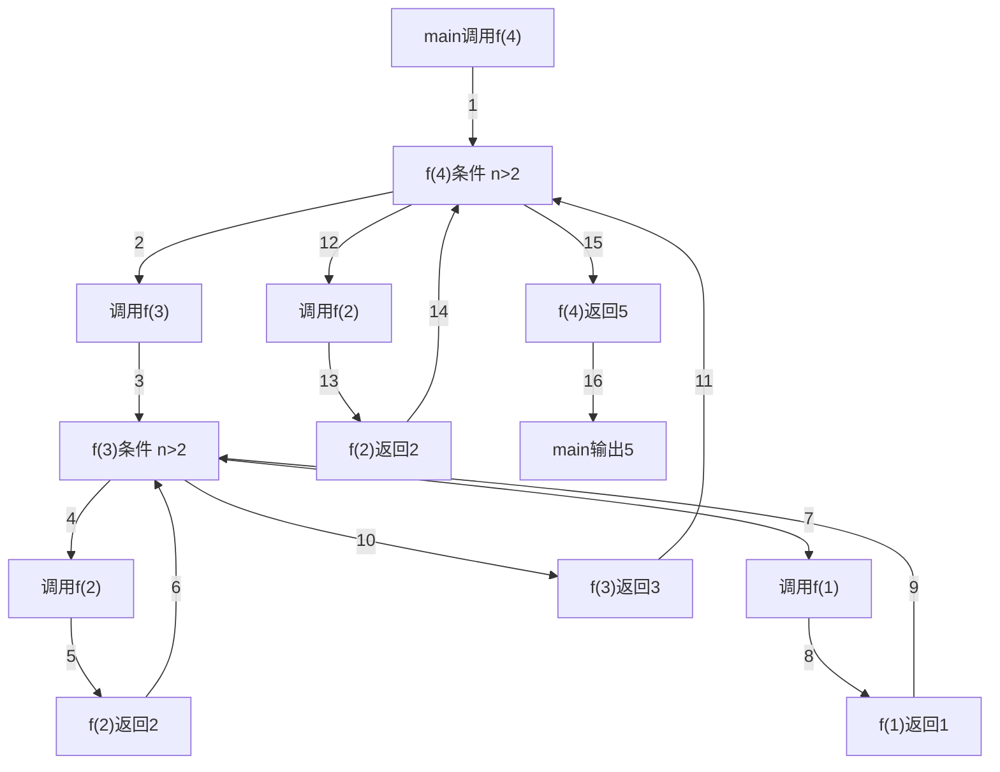
```mermaid
flowchart TD
    A["main调用f(4)"] -->|1| B["f(4)条件 n>2"]
    B -->|2| C["调用f(3)"]
    C -->|3| D["f(3)条件 n>2"]
    D -->|4| E["调用f(2)"]
    E -->|5| F["f(2)返回2"]
    F -->|6| D
    D -->|7| G["调用f(1)"]
    G -->|8| H["f(1)返回1"]
    H -->|9| D
    D -->|10| I["f(3)返回3"]
    I -->|11| B
    B -->|12| J["调用f(2)"]
    J -->|13| K["f(2)返回2"]
    K -->|14| B
    B -->|15| L["f(4)返回5"]
    L -->|16| M["main输出5"]
```

>[!process]
>**递归过程**
>*1.大问题转移成小问题 —— 递推*
>*2.找到问题的边界(最小问题) —— 回归*

---
## 14.3 汉诺塔问题


```c
#define _CRT_SECURE_NO_WARNINGS
#include<stdio.h>
#include<stdlib.h>
#include<string.h>

// 汉诺塔递归函数
void hanoi(int n, char from, char buffer, char to){
	// 形参from 圆盘的初始位置
	// 形参to 圆盘的最终位置
	// 形参buffer 临时借用的位置
	
	// 大问题 —— 小问题 —— 递归
	if(n > 1){
		// 把前n - 1个圆盘从 from 移动到 buffer
		hanoi(n - 1,from,to,buffer);
		// 将第n个圆盘从 from 移动到 to
		hanoi(1,from,buffer,to);
		// 把前n - 1个圆盘从 buffer 移动到 to
		hanoi(n - 1,buffer,from,to);
	}
	else if(n == 1){
		printf("move %c to %c\n",from,to);
	}
}

int main(){
    int n = 5;
    hanoi(n, 'A', 'B', 'C');
    return 0;
}
```

```c
结果：
move A to C
move A to B
move C to B
move A to C
move B to A
move B to C
move A to C
move A to B
move C to B
move C to A
move B to A
move C to B
move A to C
move A to B
move C to B
move A to C
move B to A
move B to C
move A to C
move B to A
move C to B
move C to A
move B to A
move B to C
move A to C
move A to B
move C to B
move A to C
move B to A
move B to C
move A to C
```

根据新代码（参数顺序为 `from, buffer, to`），以 n=5 为例的递归调用树非常庞大（共 46 个节点，31 个叶子节点对应输出）。为了清晰展示整体结构，下面采用缩略树的形式，用节点范围表示完整的子树，并标注了深度优先遍历的序号。

**缩略版递归调用树**

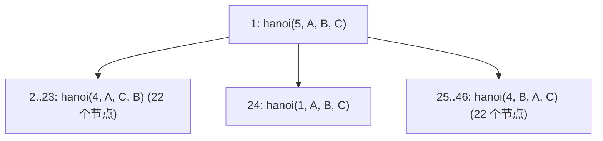
```mermaid
flowchart TD
    A["1: hanoi(5, A, B, C)"] --> B["2..23: hanoi(4, A, C, B) (22 个节点)"]
    A --> C["24: hanoi(1, A, B, C)"]
    A --> D["25..46: hanoi(4, B, A, C) (22 个节点)"]
```

#### 节点序号说明
- **序号 1**：根调用 `hanoi(5, A, B, C)`。
- **序号 2~23**：完整的 `hanoi(4, A, C, B)` 子树，内部包含 22 个节点（递归展开后对应前 22 步调用）。
- **序号 24**：直接输出 `move A to C` 的调用 `hanoi(1, A, B, C)`。
- **序号 25~46**：完整的 `hanoi(4, B, A, C)` 子树，内部包含 22 个节点。

每个 `hanoi(4, ...)` 子树内部结构可类比 n=4 时的递归树（共 22 个节点），其展开方式与根节点类似，依次包含两个 n=3 子树和一个 n=1 调用。若需查看完整展开，可参考 n=3 的详细树结构进行类推。

#### 完整调用统计
- n=5 时，总调用次数（含叶子输出）为 46 次，其中输出语句执行 31 次，与 $2^5-1=31$ 一致。

此缩略树在保持整体结构的同时，避免了过长的节点列表，便于在 Obsidian 中呈现和理解递归的层次关系。

**完整版递归调用树**

#### 根节点：hanoi(5, A, B, C)
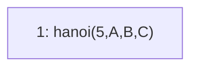
```mermaid
flowchart TD
    1["1: hanoi(5,A,B,C)"]
```
#### 左子树：hanoi(4, A, C, B)
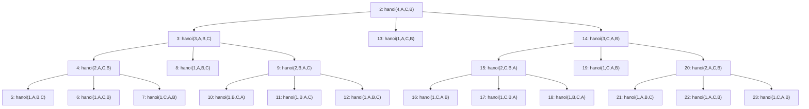
```mermaid
flowchart TD
    2["2: hanoi(4,A,C,B)"]
    3["3: hanoi(3,A,B,C)"]
    4["4: hanoi(2,A,C,B)"]
    5["5: hanoi(1,A,B,C)"]
    6["6: hanoi(1,A,C,B)"]
    7["7: hanoi(1,C,A,B)"]
    8["8: hanoi(1,A,B,C)"]
    9["9: hanoi(2,B,A,C)"]
    10["10: hanoi(1,B,C,A)"]
    11["11: hanoi(1,B,A,C)"]
    12["12: hanoi(1,A,B,C)"]
    13["13: hanoi(1,A,C,B)"]
    14["14: hanoi(3,C,A,B)"]
    15["15: hanoi(2,C,B,A)"]
    16["16: hanoi(1,C,A,B)"]
    17["17: hanoi(1,C,B,A)"]
    18["18: hanoi(1,B,C,A)"]
    19["19: hanoi(1,C,A,B)"]
    20["20: hanoi(2,A,C,B)"]
    21["21: hanoi(1,A,B,C)"]
    22["22: hanoi(1,A,C,B)"]
    23["23: hanoi(1,C,A,B)"]
    2 --> 3
    3 --> 4
    4 --> 5
    4 --> 6
    4 --> 7
    3 --> 8
    3 --> 9
    9 --> 10
    9 --> 11
    9 --> 12
    2 --> 13
    2 --> 14
    14 --> 15
    15 --> 16
    15 --> 17
    15 --> 18
    14 --> 19
    14 --> 20
    20 --> 21
    20 --> 22
    20 --> 23
```
#### 中子树(中子)：hanoi(1, A, B, C)
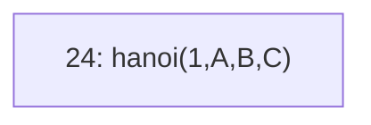
```mermaid
flowchart TD
    24["24: hanoi(1,A,B,C)"]
```
#### 右子树：hanoi(4, B, A, C)
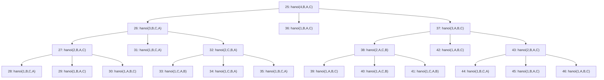
```mermaid
flowchart TD
    25["25: hanoi(4,B,A,C)"]
    26["26: hanoi(3,B,C,A)"]
    27["27: hanoi(2,B,A,C)"]
    28["28: hanoi(1,B,C,A)"]
    29["29: hanoi(1,B,A,C)"]
    30["30: hanoi(1,A,B,C)"]
    31["31: hanoi(1,B,C,A)"]
    32["32: hanoi(2,C,B,A)"]
    33["33: hanoi(1,C,A,B)"]
    34["34: hanoi(1,C,B,A)"]
    35["35: hanoi(1,B,C,A)"]
    36["36: hanoi(1,B,A,C)"]
    37["37: hanoi(3,A,B,C)"]
    38["38: hanoi(2,A,C,B)"]
    39["39: hanoi(1,A,B,C)"]
    40["40: hanoi(1,A,C,B)"]
    41["41: hanoi(1,C,A,B)"]
    42["42: hanoi(1,A,B,C)"]
    43["43: hanoi(2,B,A,C)"]
    44["44: hanoi(1,B,C,A)"]
    45["45: hanoi(1,B,A,C)"]
    46["46: hanoi(1,A,B,C)"]
    25 --> 26
    26 --> 27
    27 --> 28
    27 --> 29
    27 --> 30
    26 --> 31
    26 --> 32
    32 --> 33
    32 --> 34
    32 --> 35
    25 --> 36
    25 --> 37
    37 --> 38
    38 --> 39
    38 --> 40
    38 --> 41
    37 --> 42
    37 --> 43
    43 --> 44
    43 --> 45
    43 --> 46
```

>[!process]
>**递归过程**
>*1. 大问题转移成小问题 —— 递推：每次将 n 个盘子的问题转化为 n-1 个盘子的问题，直到边界 n=1。*
>*2. 找到问题的边界（最小问题）—— 回归：当 n=1 时直接移动，然后逐步返回，完成上层剩余的移动。*

---
[[2026-03-06]]
## 14.4 归并排序

>*利用分而治之的思想进行排序*

>[!question]
>现有一个**无序**的数组（即对于下标 i < j，不一定有 a[i] < a[j]），我们想通过**分而治之的思想**对数组中的元素进行**排序**。

>*解决这个问题之前让我们先解决一个前提问题：*

>[!question]
>给出两个**有序**的小数组，如何合并成一个大的**有序**数组？
>**例如：**
>```c
>int a[5] = {1,3,5,7,9};
>int b[5] = {2,4,6,8,10};
>```

>[!solution]
>准备两个变量 i 和 j 分别从左往右扫描数组 a 和 b，每次比较 i 和 j 所指的元素，将**较小者**放入结果数组中，并移动相应指针。重复此过程直到其中一个数组扫描完毕，最后将另一个数组的剩余元素直接复制到结果末尾。

>*解决了前提问题之后，让我们回到最初的问题 —— 利用* **分而治之的思想** *对* **无序** * *数组进行* **排序**

>[!ideology]
>**分治法**
>1. **划分（Divide）**：将无序大数组均分成两个无序的小数组( *divide：递推过程* ）；
>2. **解决（Conquer）**：递归地对两个小数组进行排序，使其成为有序小数组；
>3. **合并（Combine）**：将两个有序小数组**合并**成一个有序大数组( *conquer：回归过程* )。
>
>当数组长度为 0 或 1 时，数组自然有序，这是递归的**边界条件**。

>[!method]
>**数学归纳法（递归视角）**：假设我们已经知道如何对长度为$n - 1$的数组进行排序，那么可以通过“分 — 排 — 合”的步骤解决长度为$n$的数组的排序问题。但归并排序更自然的描述是：将数组一分为二，递归排序两个子数组，然后合并。

>[!principle]
>**分治策略**：将长度为 n 的数组排序问题分解为三个子问题：
>4. 将数组从中间分成左右两个子数组(规模约为$n/2$)；
>5. 递归地对左子数组进行归并排序；
>6. 递归地对右子数组进行归并排序；
>7. 将两个已排序的子数组合并成一个完整的有序数组。

>[!derivation]
>**递归公式**：设对 n 个元素进行归并排序所需的最多比较次数为 $T(n)$，则有：
>$$
>T(n) = 2T(n/2) + O(n)
>$$
>其中 $O(n)$ 为合并两个有序子数组所需的时间（线性扫描）。若忽略常数，可写为：
>$$
>T(n) = 2T(n/2) + n
>$$
>**通项公式推导（迭代法 / 主定理）**：
>假设 $n = 2^k$，则：
>$$
>\begin{aligned}
>T(n) &= 2T(n/2) + n \\
>&= 2(2T(n/4) + n/2) + n = 4T(n/4) + 2n \\
>&= 4(2T(n/8) + n/4) + 2n = 8T(n/8) + 3n \\
>&\quad \vdots \\
>&= 2^k T(1) + k \cdot n
>\end{aligned}
>$$
>其中 $T(1)=0$（一个元素无需比较），$k = \log_2 n$，因此：
>$$
>T(n) = n \log_2 n
>$$
>即归并排序的时间复杂度为 **$O(n \log n)$**。

>[!caution]
>在时间复杂度的大$O$表示法中，对数底数通常是**省略**的，因为不同底数之间仅相差一个常数因子，而常数因子在大$O$中被忽略。例如，$\log⁡_{2}n=\log⁡_{2}10⋅\log_{⁡10}n$，所以 $O(\log_{⁡2}n)$ 与 $O(\log_{⁡10}n)$是等价的，统一写作 $O(\log⁡_{}n)$。
>因此，归并排序的时间复杂度$O(n\log_{}⁡n)$中的$\log$默认可以是以$2$为底，也可以是以其他常数为底，不影响渐近阶。推导中出现了$\log_{⁡2}n$，最后写成$O(n\log n)$是标准且正确的，不需要特意加上底数$2$。

>[!ideology]
>当子数组长度降为 1 时，问题变得极为简单：单个元素自然有序。这就是( *divide：递推* )的过程。求出最小问题的解后，我们逐层返回，将两个有序子数组合并成更大的有序数组。这就是( *conquer：回归* )的过程。

#### 代码实现

以下实现使用 `while` 循环完成合并，逻辑清晰且无变量作用域错误。

```c
#define _CRT_SECURE_NO_WARNINGS
#include<stdio.h>
#include<stdlib.h>
#include<string.h>

// 合并两个有序子数组 [left, mid] 和 [mid+1, right]
void merge(int* arr, int* temp, int left, int mid, int right) {
    // 1. 将原数组备份到 temp
    for (int i = left; i <= right; ++i) {
        temp[i] = arr[i];
    }

    // 2. 合并两个有序子数组
    int i = left;          // 左半部分起始下标
    int j = mid + 1;       // 右半部分起始下标
    int k = left;          // 写入 arr 的位置

    while (i <= mid && j <= right) {
        if (temp[i] < temp[j]) {
            arr[k++] = temp[i++];
        } else {
            arr[k++] = temp[j++];
        }
    }

    // 3. 处理剩余元素
    while (i <= mid) {
        arr[k++] = temp[i++];
    }
    while (j <= right) {
        arr[k++] = temp[j++];
    }
}

// 归并排序递归函数
void mergeSort(int* arr, int* temp, int left, int right) {
    if (left < right) {                     // 当区间长度大于1时
        int mid = (left + right) / 2;        // 划分点
        mergeSort(arr, temp, left, mid);     // 排序左半
        mergeSort(arr, temp, mid + 1, right); // 排序右半
        merge(arr, temp, left, mid, right);   // 合并两个有序半区
    }
    // left == right 时，区间只有一个元素，自然有序，不做任何操作
}

int main() {
    int arr[] = {3, 14, 15, 9, 26, 5, 35, 89, 79, 32, 38, 46};
    int temp[12];                            // 辅助数组
    mergeSort(arr, temp, 0, 11);              // 对全部12个元素排序

    printf("排序后的 arr：\n");
    for (int i = 0; i < 12; ++i) {
        printf("arr[%d] = %d\n", i, arr[i]);
    }
    return 0;
}
```

以下实现使用 `for` 循环完成合并，逻辑清晰且无变量作用域错误。

```c
#define _CRT_SECURE_NO_WARNINGS
#include<stdio.h>
#include<stdlib.h>
#include<string.h>

// 合并功能函数merge
void merge(int *arr,int *temp,int left,int mid,int right){
	// arr[left] ~ arr[mid] 和 arr[mid + 1] ~ arr[right] 进行合并
	// 1.将arr的内容备份到temp里面
	for(int i = left;i <= right;++i){
		temp[i] = arr[i];
	}
	
	// 2.合并有序数组 —— 准备三个变量i,j,k
	// i用来访问左半边 | j用来访问右半边 | k用来存放结果
	int i,j,k;
	// 把左右两边当中比较小的那一边完全放到目标数组中
	for(int i = left,j = mid + 1,k = left;i <= mid && j <= right;++k){
		if(temp[i] < temp[j]){
			arr[k] = temp[i];
			++i;
		}
		else{
			arr[k] = temp[j];
			++j;
		}
	}
	
	// 如果左边没有放完，那就将左边剩余的数组元素放到目标数组中
	while(i <= mid){
		arr[k] = temp[i];
		++i;
		++k;
	}
	
	// 如果右边没有放完，那就将右边剩余的数组元素放到目标数组中
	while(j <= right){
		arr[k] = temp[j];
		++j;
		++k;
	}
}

//归并排序
void mergeSort(int *arr,int *temp,int left,int right){
	// 大问题 —— 小问题 —— 递归
	if(left < right){
		int mid = (left + right) / 2;
		mergeSort(arr,temp,left,mid);
		mergeSort(arr,temp,mid + 1,right);
		merge(arr,temp,left,mid,right);
	}
	
	// 找到最小问题的解决方案
}

int main(){
	int arr[] = {3,14,15,9,26,5,35,89,79,32,38,46};
	int temp[12];
	mergeSort(arr,temp,0,11);
	for(int i = 0;i < 12;++i){
		printf("arr[%d] = %d\n",i,arr[i]);
	}
	printf("--------------------\n");
	for(int i = 0;i < 12;++i){
		printf("temp[%d] = %d\n",i,temp[i]);
	}
	
	return 0;
}
```

> [!caution]
> 初学者容易在 `merge` 函数中犯变量作用域错误（如过早声明 `i, j, k` 却未初始化，或在 `for` 循环内重新定义局部变量）。上述代码分别采用了`while` 循环和`for` 循环实现，每个变量在使用前都被正确初始化。

#### 递归调用树示例

以数组 `{3,14,15,9,26,5,35,89,79,32,38,46}`( 下标 $0$ ~ $11$ )为例，归并排序的递归调用树如下( 缩进表示递归深度，每个节点表示一次 `mergeSort` 调用，其后的区间为待排序范围 )：

```
mergeSort(arr, temp, 0, 11)
├── mergeSort(arr, temp, 0, 5)                 // 左半 [0,5]
│   ├── mergeSort(arr, temp, 0, 2)              // [0,2]
│   │   ├── mergeSort(arr, temp, 0, 1)           // [0,1]
│   │   │   ├── mergeSort(arr, temp, 0, 0)       // [0,0] 叶子
│   │   │   └── mergeSort(arr, temp, 1, 1)       // [1,1] 叶子
│   │   │   └── merge(arr, temp, 0, 0, 1)         // 合并 [0,0] 和 [1,1]
│   │   └── mergeSort(arr, temp, 2, 2)           // [2,2] 叶子
│   │   └── merge(arr, temp, 0, 1, 2)             // 合并 [0,1] 和 [2,2]
│   └── mergeSort(arr, temp, 3, 5)              // [3,5]
│       ├── mergeSort(arr, temp, 3, 4)           // [3,4]
│       │   ├── mergeSort(arr, temp, 3, 3)       // [3,3] 叶子
│       │   └── mergeSort(arr, temp, 4, 4)       // [4,4] 叶子
│       │   └── merge(arr, temp, 3, 3, 4)         // 合并 [3,3] 和 [4,4]
│       └── mergeSort(arr, temp, 5, 5)           // [5,5] 叶子
│       └── merge(arr, temp, 3, 4, 5)             // 合并 [3,4] 和 [5,5]
│   └── merge(arr, temp, 0, 2, 5)                 // 合并左半 [0,2] 和 [3,5]
└── mergeSort(arr, temp, 6, 11)                 // 右半 [6,11]
    ├── mergeSort(arr, temp, 6, 8)               // [6,8]
    │   ├── mergeSort(arr, temp, 6, 7)           // [6,7]
    │   │   ├── mergeSort(arr, temp, 6, 6)       // [6,6] 叶子
    │   │   └── mergeSort(arr, temp, 7, 7)       // [7,7] 叶子
    │   │   └── merge(arr, temp, 6, 6, 7)         // 合并 [6,6] 和 [7,7]
    │   └── mergeSort(arr, temp, 8, 8)           // [8,8] 叶子
    │   └── merge(arr, temp, 6, 7, 8)             // 合并 [6,7] 和 [8,8]
    └── mergeSort(arr, temp, 9, 11)              // [9,11]
        ├── mergeSort(arr, temp, 9, 10)          // [9,10]
        │   ├── mergeSort(arr, temp, 9, 9)       // [9,9] 叶子
        │   └── mergeSort(arr, temp, 10, 10)     // [10,10] 叶子
        │   └── merge(arr, temp, 9, 9, 10)        // 合并 [9,9] 和 [10,10]
        └── mergeSort(arr, temp, 11, 11)         // [11,11] 叶子
        └── merge(arr, temp, 9, 10, 11)           // 合并 [9,10] 和 [11,11]
    └── merge(arr, temp, 6, 8, 11)                 // 合并右半 [6,8] 和 [9,11]
└── merge(arr, temp, 0, 5, 11)                     // 最终合并左右两半
```

>[!note]
>树中每个内部节点都对应一次 `merge` 操作，而叶子节点（长度为1的区间）不执行任何实际合并。整个递归过程先**递推**分解到叶子，然后逐层**回归**合并，最终得到完全有序的数组。

>[!process]
>**递归过程**
>1. **大问题转移成小问题 —— 递推**：每次将长度为 n 的数组排序问题转化为两个长度为 n/2 的子数组排序问题，不断划分直到数组长度为 1（自然有序）。
>2. **找到问题的边界（最小问题）—— 回归**：当数组长度为 1 时直接返回，然后逐层向上将两个已排序的子数组合并成更大的有序数组，最终得到原数组的有序结果。

>[!summarization]
>通过上述分治策略，归并排序实现了稳定、高效的排序，时间复杂度始终为 $O(n \log n)$，且不受输入数据初始顺序的影响。

---
# 15. 结构体和补充知识
## 15.1 结构体类型定义和变量定义

>[!review]
>**知识回顾：[[数据类型]] —— 一个对象被放在内存里面后，它的种类是什么？**
>**组成数据类型的三要素：**
>1.数据在内存中占多大的空间？
>2.以何种方式去解释内存中的每一个`bit` ？
>3.数据都支持什么类型的运算？

>[!review]
>**基本数据类型：** `int` , `double` , `float` , `char` , `···`
>**复合数据类型：** `数组` , `指针` , `···`

>[!question]
>*除此之外还有没有其他* **数据类型** *？*

>[!definition]
>**结构体：** 一种由用户自定义的复合数据类型( 可以把多个不同类型的成员打包在一起组成一个新的类型 )。
>可以将**结构体**看作一个容器，容器里面是一个个成员。

>[!question]
>如何定义一个结构体类型？

```c
#define _CRT_SECURE_NO_WARNINGS
#include<stdio.h>
#include<stdlib.h>
#include<string.h>

// 定义结构体类型
struct student_s{ // struct studentn_s 是结构体类型的名字
	int id;
	char name[25];
	char gender;
	float Politics;
	float English;
	float Math;
	float cs408;
}; //分号是不可省略的

int main(){
	// struct student_s stu; // 结构体类型的变量
	struct student_s stu = {2023211033,"LvZiyuan",'m',60,75,115,115};
	
	return 0;
}
```

>[!important]
>**声明**一个**结构体变量**时，系统会为该变量分配一块连续的内存空间，其占用的内存大小通常 **≥** 该结构体类型所有成员占用的内存大小之和。

---
## 15.2 对齐问题

>[!question]
>*结构体都支持什么类型的运算？*

>[!note]
>**1.sizeof：** 用字节计算右边表达式并返回字节数 —— 计算数据类型所占内存大小

```c
#define _CRT_SECURE_NO_WARNINGS
#include<stdio.h>
#include<stdlib.h>
#include<string.h>

// 定义结构体类型
struct student_s{ // struct studentn_s 是结构体类型的名字
	int id;
	char name[25];
	char gender;
	float Politics;
	float English;
	float Math;
	float cs408;
	// sizeof(stu) = 4 + 25 + 1 + 4 + 4 + 4 + 4 = 46
}; //分号是不可省略的

int main(){
	// struct student_s stu; // 结构体类型的变量
	struct student_s stu = {2023211033,"LvZiyuan",'m',60,75,115,115};
	printf("sizeof(stu) = %d\n",sizeof(stu));
	
	return 0;
}
```

```c
结果：
sizeof(stu) = 48
```

>[!question]
>系统分配给**结构体变量stu**的内存大小的理论值为46 $byte$，但在程序实际运过程中**sizeof(stu) = 48** $byte$，系统实际分配给**结构体变量stu**的内存大小比系统分配给**结构体变量stu**的内存大小的理论值大 $2 \ byte$，这是为什么？

>[!definition]
>**内存对齐：( Memory Alignment )** 是计算机系统为了提升内存访问效率，而对数据在内存中的存放地址所做出的一种限制。简单来说，它要求特定类型的数据只能存储在内存中某些特定的地址上（通常是该数据类型大小的整数倍地址）。
>若想深入理解 **内存对齐** 的概念 —— 详见[[内存对齐]]

---
## 15.3 常见结构体变量

### '.'运算符

```c
#define _CRT_SECURE_NO_WARNINGS
#include<stdio.h>
#include<stdlib.h>
#include<string.h>

// 定义结构体类型
struct student_s{ // struct studentn_s 是结构体类型的名字
	int id;
	char name[25];
	char gender;
	float Politics;
	float English;
	float Math;
	float cs408;
}; //分号是不可省略的

int main(){
	// struct student_s stu; // 结构体类型的变量
	struct student_s stu = {2023211033,"LvZiyuan",'m',60,75,115,115};
	
	// '.'运算符 —— 根据结构体去访问内部的成员
	printf("stu = %d %s %c %f %f %f %f\n",stu.id,stu.name,stu.gender,stu.Politics,stu.English,stu.Math,stu.cs408);
	
	return 0;
}
```

```c
结果：
stu = 2023211033 LvZiyuan m 60.000000 75.000000 115.000000 115.000000
```

### '='运算符

```c
#define _CRT_SECURE_NO_WARNINGS
#include<stdio.h>
#include<stdlib.h>
#include<string.h>

// 定义结构体类型
struct student_s{ // struct studentn_s 是结构体类型的名字
	int id;
	char name[25];
	char gender;
	float Politics;
	float English;
	float Math;
	float cs408;
}; //分号是不可省略的

int main(){
	// struct student_s stu; // 结构体类型的变量
	struct student_s stu = {2023211033,"LvZiyuan",'m',60,75,115,115};
	
	// '.'运算符 —— 根据结构体去访问内部的成员
	printf("stu = %d %s %c %f %f %f %f\n",stu.id,stu.name,stu.gender,stu.Politics,stu.English,stu.Math,stu.cs408);
	
	// '='运算符
	struct student_s stu1;
	stu1 = stu;
	printf("stu1 = %d %s %c %f %f %f %f\n",stu1.id,stu1.name,stu1.gender,stu1.Politics,stu1.English,stu1.Math,stu1.cs408);
	
	return 0;
}
```

```c
结果：
stu = 2023211033 LvZiyuan m 60.000000 75.000000 115.000000 115.000000
stu1 = 2023211033 LvZiyuan m 60.000000 75.000000 115.000000 115.000000
```

>[!caution]
>**数组**是**不能直接赋值**的，但如果**结构体变量**中的某个成员的数据类型是**数组** 的话，我们是可以把含有**数组**成员的**结构体变量**赋值给另外一个**结构体变量**的。

### '->'运算符

```c
#define _CRT_SECURE_NO_WARNINGS
#include<stdio.h>
#include<stdlib.h>
#include<string.h>

// 定义结构体类型
struct student_s{ // struct studentn_s 是结构体类型的名字
	int id;
	char name[25];
	char gender;
	float Politics;
	float English;
	float Math;
	float cs408;
}; // 分号是不可省略的

int main(){
	// struct student_s stu; // 结构体类型的变量
	struct student_s stu = {2023211033,"LvZiyuan",'m',60,75,115,115};
	
	// '.'运算符 —— 根据结构体去访问内部的成员
	printf("stu = %d %s %c %f %f %f %f\n",stu.id,stu.name,stu.gender,stu.Politics,stu.English,stu.Math,stu.cs408);
	
	// '='运算符
	struct student_s stu1;
	stu1 = stu;
	printf("stu1 = %d %s %c %f %f %f %f\n",stu1.id,stu1.name,stu1.gender,stu1.Politics,stu1.English,stu1.Math,stu1.cs408);
	
	// 指针
	struct student_s *pstu = &stu; // 可能会存在一个坑！！！
	// '*'运算符的优先级低于'.'运算符
	//(*pstu).id // 这种访问方式过于复杂，因此我们引入'->'运算符
	// '->'运算符 —— 先解引用再访问结构体成员
	//引入'->'运算符后，(*pstu).id 可以改为 pstu -> id
	printf("(*pstu).id = %d,pstu -> id = %d\n",(*pstu).id,pstu -> id);
	
	return 0;
}
```

```c
结果：
stu = 2023211033 LvZiyuan m 60.000000 75.000000 115.000000 115.000000
stu1 = 2023211033 LvZiyuan m 60.000000 75.000000 115.000000 115.000000
(*pstu).id = 2023211033,pstu -> id = 2023211033
```

---
## 15.4 typedef

>[!definieion]
>**typedef(给类型起别名)：** **关键字** `typedef` 允许你从一个现有的类型中创建一个新类型。

```c
#define _CRT_SECURE_NO_WARNINGS
#include<stdio.h>
#include<stdlib.h>
#include<string.h>

typedef int type_t; // 给int起了一个别名叫type_t

// 定义结构体类型
typedef struct{ // struct studentn_s 是结构体类型的名字
	type_t id;
	char name[25];
	char gender;
	float Politics;
	float English;
	float Math;
	float cs408;
};student_t // 分号是不可省略的

//typedef struct student_s student_t;

int main(){
	// struct student_s stu; // 结构体类型的变量
	student_t stu = {2023211033,"LvZiyuan",'m',60,75,115,115};
	
	// '.'运算符 —— 根据结构体去访问内部的成员
	printf("stu = %d %s %c %f %f %f %f\n",stu.id,stu.name,stu.gender,stu.Politics,stu.English,stu.Math,stu.cs408);
	
	// '='运算符
	student_t stu1;
	stu1 = stu;
	printf("stu1 = %d %s %c %f %f %f %f\n",stu1.id,stu1.name,stu1.gender,stu1.Politics,stu1.English,stu1.Math,stu1.cs408);
	
	// 指针
	student_t *pstu = &stu; // 可能会存在一个坑！！！
	// '*'运算符的优先级低于'.'运算符
	//(*pstu).id // 这种访问方式过于复杂，因此我们引入'->'运算符
	// '->'运算符 —— 先解引用再访问结构体成员
	//引入'->'运算符后，(*pstu).id 可以改为 pstu -> id
	printf("(*pstu).id = %d,pstu -> id = %d\n",(*pstu).id,pstu -> id);
	
	return 0;
}
```

---
[[2026-03-09]]
## 15.5 补充知识：C++的引用

>[!note]
>**引用机制：** C++的语法，其目的是 *简化* 指针的阅读难度。

```c
#define _CRT_SECURE_NO_WARNINGS
#include<stdio.h>
#include<stdlib.h>
#include<string.h>

void swap(int *pa,int *pb){
	int temp = *pa;
	*pa = *pb;
	*pb= temp;
}

int main(){
	int a = 10;
	int b = 5;
	swap(&a,&b);
	printf("a = %d,b = %d\n",a,b);
	
	return 0;
}
```

```c
结果：
a = 5,b = 10
```

>[!important]
>C++的作者在设计C++时觉得C语言中的指针阅读难度太高，于是想到了一种简化阅读难度的方案 —— **引用**
>**引用**的本质就是**指针**，只不过写起来更加简单。

```c
#define _CRT_SECURE_NO_WARNINGS
#include<stdio.h>
#include<stdlib.h>
#include<string.h>

void swap(int& a,int& b){ // '&'运算符出现在定义语句里面，表示引用(传参时并不只是简单的将数值传递过来，而是将内存地址信息连同数值一起传递过来)的意思；'&'运算符出现在定义语句之外时，表示取地址的意思。// 当定义语句中出现了'&'运算符时，意味着函数传参时用的不是值传递，而是按引用传递。
	int temp = a;
	a = b;
	b = temp;
}

int main(){
	int a = 10;
	int b = 5;
	swap(a,b);
	printf("a = %d,b = %d\n",a,b);
	
	return 0;
}
```

```c
结果：
a = 5,b = 10
```

>[!caution]
>**引用**的底层原理与**指针**相同，只不过**引用**可以使*代码的可读性变高*。
>**一般情况**下我们是不会使用**C++中的引用机制**的，**能用指针就用指针**，当你觉得**用指针不太好看的时候**，我们可以使用**C++中的引用机制**。

---
# 16. 专题E 链表
## 16.1 线性表、数组和链表

>[!review]
>**知识回顾：** [[C语言入门课程#11. 数组]]
>**数组vs链表**
>*1.数组的特征：*
>*1)* 相同的元素类型；
>*2)* 数组在内存中必须是连续存放的；
>*3)* 数组元素是有序的；
>
>我们**只需要**知道**数组第一个元素的内存地址**以及**每个数组元素所占的内存大小**，即可把数组中**所有数组元素在内存中的位置**计算出来。
>当我们想要**访问数组中的某个数组元素**时，**访问速度**会**非常快**。因为我们可以**很快地**将这个**数组元素的内存地址**计算出来，然后通过其**内存地址**来访问这个**数组元素**。
>
>因此我们将这种**能够快速访问任意位置的数组元素**的特点称为 —— **随机访问**
>然而，这种设计也要付出相应的**代价**。由于数组元素在内存中连续存放，当需要在数组中间**插入**或**删除**一个元素时，为了**维持连续性**，**必须移动该位置之后**的**所有元素**，导致**操作效率较低**（*时间复杂度* 为$O(n)$）。此外，数组的大小**通常在定义时固定**，无法**动态扩展**；若**预先分配的空间不足，则无法添加新元素**；若**分配过大，又会造成内存浪费**。这些**局限性**正是**链表**等其他数据结构所**试图弥补**的。
>
>**数组**和**链表**能够起到相同的作用：数组中除**首元素**和**尾元素**之外其余元素都有**一个前驱**和**一个后继**。整个数组就可以通过先有一个**开始节点**，然后在**开始节点的后面**加上**一个后继**，再在这个**后继的后面**再加上**一个后继** $···$的**方式**将？**数组**中的每个**数组元素**连接起来，就像是一根*绳子*。
>
>我们将这种像*绳子* 一样的**数据结构**称为 —— **线性表**
>我们将**符合上述数组特征**的**线性表**称为 —— **顺序线性表**

>[!review]
>**知识回顾：** [[C语言入门课程#11. 数组]]
>**数组vs链表**
>*1.数组的特征：*
>*1)* 相同的元素类型；
>*2)* 数组在内存中必须是连续存放的；
>*3)* 数组元素是有序的；
>
>我们只需要知道数组第一个元素的内存地址以及每个数组元素所占的内存大小，即可把数组中所有数组元素在内存中的位置计算出来。
>当我们想要访问数组中的某个数组元素时，访问速度会非常快。因为我们可以很快地将这个数组元素的内存地址计算出来，然后通过其内存地址来访问这个数组元素。
>
>因此我们将这种能够快速访问任意位置的数组元素的特点称为——**随机访问**。
>然而，这种设计也要付出相应的**代价**。由于数组元素在内存中连续存放，当需要在数组中间**插入**或**删除**一个元素时，为了维持连续性，必须移动该位置之后的所有元素，导致操作效率较低（时间复杂度为 $O(n)$）。此外，数组的大小通常在定义时固定，无法动态扩展；若预先分配的空间不足，则无法添加新元素；若分配过大，又会造成内存浪费。这些局限性正是**链表**等其他数据结构所试图弥补的。

>[!note]
>**数组**和**链表**能够起到相同的作用：数组中除首元素和尾元素之外其余元素都有一个前驱和一个后继。整个数组就可以通过先有一个开始节点，然后在开始节点的后面加上一个后继，再在这个后继的后面再加上一个后继……的方式将数组中的每个数组元素连接起来，就像是一根绳子。
>
>我们将这种像绳子一样的数据结构称为——**线性表**。
>我们将符合上述数组特征的线性表称为——**顺序线性表**。
>
>**链表**也是一个**线性表**，它是一种*链式结构*，而不是*顺序结构*。它没有**连续存放**和**有序**的特征。但**链表**中元素的**数据类型**是**一致**的。
>
>*2.链表的模型：*
>*1)* 链表中的元素在内存中可以是不连续的；


```mermaid
flowchart LR
    classDef dataNode fill:#e3f2fd,stroke:#1565c0,stroke-width:2px,color:#0d47a1,font-weight:bold,r:20px;
    classDef dataNode2 fill:#e8f5e8,stroke:#2e7d32,stroke-width:2px,color:#1b5e20,font-weight:bold,r:20px;
    classDef dataNode3 fill:#f3e5f5,stroke:#6a1b9a,stroke-width:2px,color:#4a148c,font-weight:bold,r:20px;
    classDef nullNode fill:#eeeeee,stroke:#9e9e9e,stroke-width:2px,color:#616161,font-style:italic,r:10px;
    classDef lastNode fill:#eeeeee,stroke:#9e9e9e,stroke-width:2px,color:#212121,font-weight:bold,font-style:normal,r:10px;

    A["data: 5 ｜ next"]:::dataNode --> B["data: 3 ｜ next"]:::dataNode2 --> C["data: 7 ｜ next"]:::dataNode3 --> D["data: 1 | NULL"]:::lastNode
```

>[!note]
>*2)* 链表访问其中的某个元素的效率较低；
>*3)* 链表的空间利用率较低( 链表中每个元素既要存储**数据**又要存储**指针** )；
>*4)* 链表插入和删除元素的效率较高。

---
## 16.2 链表的类型定义

>[!declaration]
>**链表的代码实现：**
>在*C语言阶段* 我们*只学习一种链表* —— *不带头节点* 但是带*头指针和尾指针* 的**单链表( 只有一个指针域 —— 只能通过前一个节点找到它的后继，但是没有办法通过后一个节点去找它的前驱)**。

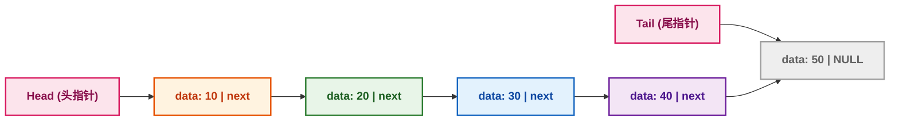
```mermaid
flowchart LR
    classDef dataNode fill:#e3f2fd,stroke:#1565c0,stroke-width:2px,color:#0d47a1,font-weight:bold,r:20px;
    classDef dataNode2 fill:#e8f5e8,stroke:#2e7d32,stroke-width:2px,color:#1b5e20,font-weight:bold,r:20px;
    classDef dataNode3 fill:#f3e5f5,stroke:#6a1b9a,stroke-width:2px,color:#4a148c,font-weight:bold,r:20px;
    classDef dataNode4 fill:#fff3e0,stroke:#e65100,stroke-width:2px,color:#bf360c,font-weight:bold,r:20px;
    classDef dataNodeGray fill:#eeeeee,stroke:#9e9e9e,stroke-width:2px,color:#616161,font-weight:bold,r:20px;
    classDef pointerStyle fill:#fce4ec,stroke:#d81b60,stroke-width:2px,color:#880e4b,font-weight:bold,r:10px;

    Head["Head (头指针)"]:::pointerStyle --> Node1
    Tail["Tail (尾指针)"]:::pointerStyle --> Node5
    Node1["data: 10 | next"]:::dataNode4 --> Node2
    Node2["data: 20 | next"]:::dataNode2 --> Node3
    Node3["data: 30 | next"]:::dataNode --> Node4
    Node4["data: 40 | next"]:::dataNode3 --> Node5
    Node5["data: 50 | NULL"]:::dataNodeGray
```

```c
#define _CRT_SECURE_NO_WARNINGS
#include<stdio.h>
#include<stdlib.h>
#include<string.h>

typedef struct node_s{
	// 数据域
	int data;
	// 指针域
	struct node_s *next;
	// struct node_s next // 这样写是不行的
}node_t;

typedef struct link_list_s{
	node_t *phead;
	node_t *ptail;
}link_list_t;

int main(){
	return 0;
}
```

---
[[2026-03-10]]
## 16.3 链表头插法和遍历

>[!method]
>**头插法：** 
>最开始链表为空，*phead* 和*ptail* 的指向都是**NULL**就可以了。

>[!step]
>**头插法的步骤：**
>**1.** 将新节点的**指针域**改为指向原来的*phead* ；
>**2.** 将*phead* 改为指向新节点；

```c
#define _CRT_SECURE_NO_WARNINGS
#include<stdio.h>
#include<stdlib.h>
#include<string.h>

typedef struct node_s{
	// 数据域
	int data;
	// 指针域
	struct node_s *next; // 指针变量本身所占的内存大小为4个字节，是一个固定值
	// struct node_s next // 这样写是不行的
}node_t;

typedef struct link_list_s{
	node_t *phead;
	node_t *ptail;
}link_list_t;

// 头插法
void head_insert(link_list_t *plist,int data){
	// 1.给新节点申请内存 & 初始化
	node_t *pnew_node = (node_t*)malloc(sizeof(node_t));
	pnew_node -> next = NULL; // 新节点的指针域一开始总是NULL
	pnew_node -> data = data;
	
	// 2.分类讨论
	if(plist -> phead == NULL){
		plist -> phead = pnew_node;
		plist -> ptail = pnew_node;
	}
	else{
		pnew_node -> next = plist -> phead;
		plist -> phead = pnew_node;
	}
}

int main(){
	link_list_t list;
	// 初始化
	list.phead = NULL;
	list.ptail = NULL;
	
	head_insert(&list,1);
	head_insert(&list,3);
	head_insert(&list,5);
	
	return 0;
}
```

>[!quote]
>若想深入理解**单链表头插法**是**如何实现**的 —— 详见[[C语言单链表头插法实现详解( 带头尾指针 )]]

>[!method]
>通过**打印链表**的方式来检验**单链表头插法**是否正确：

```c
#define _CRT_SECURE_NO_WARNINGS
#include<stdio.h>
#include<stdlib.h>
#include<string.h>

typedef struct node_s{
	// 数据域
	int data;
	// 指针域
	struct node_s *next; // 指针变量本身所占的内存大小为4个字节，是一个固定值
	// struct node_s next // 这样写是不行的
}node_t;

typedef struct link_list_s{
	node_t *phead;
	node_t *ptail;
}link_list_t;

// 头插法
void head_insert(link_list_t *plist,int data){
	// 1.给新节点申请内存 & 初始化
	node_t *pnew_node = (node_t*)malloc(sizeof(node_t));
	pnew_node -> next = NULL; // 新节点的指针域一开始总是NULL
	pnew_node -> data = data;
	
	// 2.分类讨论
	if(plist -> phead == NULL){
		plist -> phead = pnew_node;
		plist -> ptail = pnew_node;
	}
	else{
		pnew_node -> next = plist -> phead;
		plist -> phead = pnew_node;
	}
}

// 打印链表
void print_list(link_list_t *plist){
	node_t *pcur = plist -> phead;
	while(pcur != NULL){
		printf("%d",pcur -> data);
		if(pcur -> next != NULL){
			printf(" -> ");
		}
		pcur = pcur -> next; // 每次都需要将游标后移
	}
	printf("\n");
}

int main(){
	link_list_t list;
	// 初始化
	list.phead = NULL;
	list.ptail = NULL;
	
	head_insert(&list,1);
	print_list(&list);
	head_insert(&list,3);
	print_list(&list);
	head_insert(&list,5);
	print_list(&list);
	
	return 0;
}
```

```c
结果：
1
3 -> 1
5 -> 3 -> 1
```

---
## 16.4 链表尾插法

>[!method]
>**尾插法：**
>尾插法将新节点插入到链表末尾，需要维护尾指针*ptail*。

>[!step]
>**尾插法的步骤：**
>**1.** 将新节点的**指针域**置为**NULL**；
>**2.** 若链表为空（*phead* 为**NULL**），则将*phead* 和*ptail* 都指向新节点；
>**3.** 若链表非空，则将*ptail* 所指向节点的**指针域**指向新节点，然后更新*ptail* 指向新节点。

```c
#define _CRT_SECURE_NO_WARNINGS
#include<stdio.h>
#include<stdlib.h>
#include<string.h>

typedef struct node_s{
	// 数据域
	int data;
	// 指针域
	struct node_s *next; // 指针变量本身所占的内存大小为4个字节，是一个固定值
	// struct node_s next // 这样写是不行的
}node_t;

typedef struct link_list_s{
	node_t *phead;
	node_t *ptail;
}link_list_t;

// 头插法
void head_insert(link_list_t *plist,int data){
	// 1.给新节点申请内存 & 初始化
	node_t *pnew_node = (node_t*)malloc(sizeof(node_t));
	pnew_node -> next = NULL; // 新节点的指针域一开始总是NULL
	pnew_node -> data = data;
	
	// 2.分类讨论
	if(plist -> phead == NULL){
		plist -> phead = pnew_node;
		plist -> ptail = pnew_node;
	}
	else{
		pnew_node -> next = plist -> phead;
		plist -> phead = pnew_node;
	}
}

// 尾插法
void tail_insert(link_list_t *plist,int data){
	// 1.给新节点申请内存 & 初始化
	node_t *pnew_node = (node_t*)malloc(sizeof(node_t));
	pnew_node -> next = NULL; // 新节点的指针域一开始总是NULL
	pnew_node -> data = data;
	
	// 2.分类讨论
	if(plist -> phead == NULL){
		plist -> phead = pnew_node;
		plist -> ptail = pnew_node;
	}
	else{
		plist -> ptail -> next = pnew_node;
		plist -> ptail = pnew_node;
	}
}

// 打印链表
void print_list(link_list_t *plist){
	node_t *pcur = plist -> phead;
	while(pcur != NULL){
		printf("%d",pcur -> data);
		if(pcur -> next != NULL){
			printf(" -> ");
		}
		pcur = pcur -> next; // 每次都需要将游标后移
	}
	printf("\n");
}

int main(){
	link_list_t list;
	// 初始化
	list.phead = NULL;
	list.ptail = NULL;
	
	//head_insert(&list,1);
	//print_list(&list);
	//head_insert(&list,3);
	//print_list(&list);
	//head_insert(&list,5);
	//print_list(&list);
	
	tail_insert(&list,1);
	print_list(&list);
	tail_insert(&list,3);
	print_list(&list);
	tail_insert(&list,5);
	print_list(&list);
	
	return 0;
}
```

```c
结果：
1
1 -> 3
1 -> 3 -> 5
```

>[!quote]
>若想深入理解**单链表尾插法**是**如何实现**的 —— 详见[[C语言单链表尾插法实现详解( 带头尾指针 )]]

>[!quote]
>在实际编程中，尾插法是最常用的链表插入方式，因为它能保持元素的插入顺序。头插法则较少使用，但它的优势在于：当链表没有尾指针（`ptail`）时，头插法的实现比尾插法更为简洁。因此，在具备尾指针（`ptail`）的情况下，应优先使用尾插法以保持元素的插入顺序；仅在链表没有尾指针时，才考虑使用头插法，因为此时头插法的实现更为简洁。

---
## 16.5 链表有序插入法

>[!method]
>**有序插入：** 将一组乱序的数据逐个插入链表，并保证每次插入后链表始终保持有序（如升序或降序）。即在插入每个新节点时，需找到正确的位置，使链表整体有序。

>[!question]
>**给定一个有序链表，如何插入一个新节点，使得插入后链表依然保持有序？**
>若要在某个节点之前插入新节点，关键在于找到该节点的前驱节点，并修改其指针域，使其指向新节点。

>[!question]
>**当待插入位置的前驱节点与需要修改指针的节点并非同一节点时，应如何应对？**

>[!method]
>**双指针法（两个指针协同遍历）：** 当我们需要在链表中定位某个节点的前驱节点时，可以同时维护两个指针——一个在前（`pcur`）用于遍历目标节点，一个在后（`ppre`）紧随其后记录其前驱。这两个指针既可以“一前一后”同步移动，也可以根据业务需求设计为“一快一慢”的节奏。

>[!step]
>**双指针定位插入位置：** 初始化两个指针 `pre`（前驱）指向 `NULL`，`cur`（当前）指向链表头节点。然后进入循环：只要 `cur` 不为空且 `cur->data` 小于待插入数据，就同步移动两个指针（`pre = cur; cur = cur->next`）。循环终止后，`prev` 即为插入位置的前驱节点，`cur` 指向第一个不小于新数据的节点（可能为 `NULL`）。此时，创建新节点 `new_node`，令 `new_node->next = cur`，再根据 `pre` 是否为 `NULL` 决定插入方式：若 `pre` 为空，则新节点成为新的头节点；否则将 `pre->next` 指向 `new_node`，完成插入。

>[!quote]
>以下是用 Mermaid 绘制的双指针定位插入位置的过程示意图，每一步链表结构变化对应一张图。示例链表为有序链表 `1 -> 3 -> 5 -> 7`，待插入数据 `4`。指针 `pre` 标记为紫色，`cur` 标记为橙色。

### 步骤1：初始状态
- `prev` 指向 `NULL`，`cur` 指向头节点 `1`。

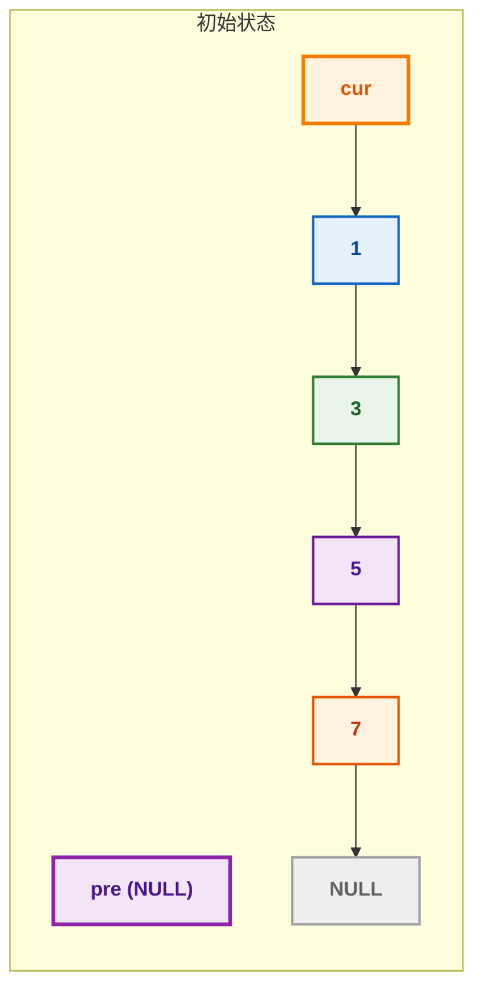
```mermaid
flowchart LR
    classDef dataNode fill:#e3f2fd,stroke:#1565c0,stroke-width:2px,color:#0d47a1,font-weight:bold,r:20px;
    classDef dataNode2 fill:#e8f5e8,stroke:#2e7d32,stroke-width:2px,color:#1b5e20,font-weight:bold,r:20px;
    classDef dataNode3 fill:#f3e5f5,stroke:#6a1b9a,stroke-width:2px,color:#4a148c,font-weight:bold,r:20px;
    classDef dataNode4 fill:#fff3e0,stroke:#e65100,stroke-width:2px,color:#bf360c,font-weight:bold,r:20px;
    classDef dataNodeGray fill:#eeeeee,stroke:#9e9e9e,stroke-width:2px,color:#616161,font-weight:bold,r:20px;
    classDef pointerStyle fill:#fce4ec,stroke:#d81b60,stroke-width:2px,color:#880e4b,font-weight:bold,r:10px;
    classDef prevStyle fill:#f3e5f5,stroke:#8e24aa,stroke-width:3px,color:#4a148c,font-weight:bold,r:10px;
    classDef curStyle fill:#fff3e0,stroke:#f57c00,stroke-width:3px,color:#e65100,font-weight:bold,r:10px;

    subgraph 初始状态
        Pre["pre (NULL)"]:::prevStyle
        Cur["cur"]:::curStyle --> N1
        N1["1"]:::dataNode --> N3["3"]:::dataNode2
        N3 --> N5["5"]:::dataNode3 --> N7["7"]:::dataNode4 --> Null["NULL"]:::dataNodeGray
    end
```

### 步骤2：第一次比较（`1 < 4`），移动指针
- `prev` 移到 `1`，`cur` 移到 `3`。

```mermaid
flowchart LR
    classDef dataNode fill:#e3f2fd,stroke:#1565c0,stroke-width:2px,color:#0d47a1,font-weight:bold,r:20px;
    classDef dataNode2 fill:#e8f5e8,stroke:#2e7d32,stroke-width:2px,color:#1b5e20,font-weight:bold,r:20px;
    classDef dataNode3 fill:#f3e5f5,stroke:#6a1b9a,stroke-width:2px,color:#4a148c,font-weight:bold,r:20px;
    classDef dataNode4 fill:#fff3e0,stroke:#e65100,stroke-width:2px,color:#bf360c,font-weight:bold,r:20px;
    classDef dataNodeGray fill:#eeeeee,stroke:#9e9e9e,stroke-width:2px,color:#616161,font-weight:bold,r:20px;
    classDef pointerStyle fill:#fce4ec,stroke:#d81b60,stroke-width:2px,color:#880e4b,font-weight:bold,r:10px;
    classDef prevStyle fill:#f3e5f5,stroke:#8e24aa,stroke-width:3px,color:#4a148c,font-weight:bold,r:10px;
    classDef curStyle fill:#fff3e0,stroke:#f57c00,stroke-width:3px,color:#e65100,font-weight:bold,r:10px;

    subgraph 第一次移动后
        Pre["pre"]:::prevStyle --> N1
        Cur["cur"]:::curStyle --> N3
        N1["1"]:::dataNode --> N3["3"]:::dataNode2
        N3 --> N5["5"]:::dataNode3 --> N7["7"]:::dataNode4 --> Null["NULL"]:::dataNodeGray
    end
```

### 步骤3：第二次比较（`3 < 4`），移动指针
- `prev` 移到 `3`，`cur` 移到 `5`。

```mermaid
flowchart LR
    classDef dataNode fill:#e3f2fd,stroke:#1565c0,stroke-width:2px,color:#0d47a1,font-weight:bold,r:20px;
    classDef dataNode2 fill:#e8f5e8,stroke:#2e7d32,stroke-width:2px,color:#1b5e20,font-weight:bold,r:20px;
    classDef dataNode3 fill:#f3e5f5,stroke:#6a1b9a,stroke-width:2px,color:#4a148c,font-weight:bold,r:20px;
    classDef dataNode4 fill:#fff3e0,stroke:#e65100,stroke-width:2px,color:#bf360c,font-weight:bold,r:20px;
    classDef dataNodeGray fill:#eeeeee,stroke:#9e9e9e,stroke-width:2px,color:#616161,font-weight:bold,r:20px;
    classDef pointerStyle fill:#fce4ec,stroke:#d81b60,stroke-width:2px,color:#880e4b,font-weight:bold,r:10px;
    classDef prevStyle fill:#f3e5f5,stroke:#8e24aa,stroke-width:3px,color:#4a148c,font-weight:bold,r:10px;
    classDef curStyle fill:#fff3e0,stroke:#f57c00,stroke-width:3px,color:#e65100,font-weight:bold,r:10px;

    subgraph 第二次移动后
        Pre["pre"]:::prevStyle --> N3
        Cur["cur"]:::curStyle --> N5
        N1["1"]:::dataNode --> N3["3"]:::dataNode2
        N3 --> N5["5"]:::dataNode3 --> N7["7"]:::dataNode4 --> Null["NULL"]:::dataNodeGray
    end
```

### 步骤4：第三次比较（`5 >= 4`），停止移动，找到插入位置
- `prev` 指向 `3`，`cur` 指向 `5`，插入位置在 `3` 和 `5` 之间。

```mermaid
flowchart LR
    classDef dataNode fill:#e3f2fd,stroke:#1565c0,stroke-width:2px,color:#0d47a1,font-weight:bold,r:20px;
    classDef dataNode2 fill:#e8f5e8,stroke:#2e7d32,stroke-width:2px,color:#1b5e20,font-weight:bold,r:20px;
    classDef dataNode3 fill:#f3e5f5,stroke:#6a1b9a,stroke-width:2px,color:#4a148c,font-weight:bold,r:20px;
    classDef dataNode4 fill:#fff3e0,stroke:#e65100,stroke-width:2px,color:#bf360c,font-weight:bold,r:20px;
    classDef dataNodeGray fill:#eeeeee,stroke:#9e9e9e,stroke-width:2px,color:#616161,font-weight:bold,r:20px;
    classDef pointerStyle fill:#fce4ec,stroke:#d81b60,stroke-width:2px,color:#880e4b,font-weight:bold,r:10px;
    classDef prevStyle fill:#f3e5f5,stroke:#8e24aa,stroke-width:3px,color:#4a148c,font-weight:bold,r:10px;
    classDef curStyle fill:#fff3e0,stroke:#f57c00,stroke-width:3px,color:#e65100,font-weight:bold,r:10px;

    subgraph 找到插入位置
        Pre["pre"]:::prevStyle --> N3
        Cur["cur"]:::curStyle --> N5
        N1["1"]:::dataNode --> N3["3"]:::dataNode2
        N3 -.->|待插入| Ins["4 (新节点)"]:::dataNode4
        N5["5"]:::dataNode3 --> N7["7"]:::dataNode4 --> Null["NULL"]:::dataNodeGray
    end
```

### 步骤5：插入新节点 `4`
- 新节点 `4` 的 `next` 指向 `cur`（即 `5`），`prev->next` 指向新节点。

```mermaid
flowchart LR
    classDef dataNode fill:#e3f2fd,stroke:#1565c0,stroke-width:2px,color:#0d47a1,font-weight:bold,r:20px;
    classDef dataNode2 fill:#e8f5e8,stroke:#2e7d32,stroke-width:2px,color:#1b5e20,font-weight:bold,r:20px;
    classDef dataNode3 fill:#f3e5f5,stroke:#6a1b9a,stroke-width:2px,color:#4a148c,font-weight:bold,r:20px;
    classDef dataNode4 fill:#fff3e0,stroke:#e65100,stroke-width:2px,color:#bf360c,font-weight:bold,r:20px;
    classDef dataNodeGray fill:#eeeeee,stroke:#9e9e9e,stroke-width:2px,color:#616161,font-weight:bold,r:20px;
    classDef pointerStyle fill:#fce4ec,stroke:#d81b60,stroke-width:2px,color:#880e4b,font-weight:bold,r:10px;
    classDef prevStyle fill:#f3e5f5,stroke:#8e24aa,stroke-width:3px,color:#4a148c,font-weight:bold,r:10px;
    classDef curStyle fill:#fff3e0,stroke:#f57c00,stroke-width:3px,color:#e65100,font-weight:bold,r:10px;

    subgraph 插入后
        N1["1"]:::dataNode --> N3["3"]:::dataNode2 --> Ins["4"]:::dataNode4 --> N5["5"]:::dataNode3 --> N7["7"]:::dataNode4 --> Null["NULL"]:::dataNodeGray
    end
```

>[!caution]
>**在使用双指针法之前，必须满足以下前提：** 链表中至少要有一个节点。因为双指针法的**核心是**同时维护“当前节点”和“前驱节点”两个指针，用于在遍历过程中定位插入或删除的位置；若链表为空，则没有节点可供遍历，也就不存在前驱和当前节点的概念，此时**只需**直接操作头指针即可，无需使用双指针。

```c
#define _CRT_SECURE_NO_WARNINGS
#include<stdio.h>
#include<stdlib.h>
#include<string.h>

typedef struct node_s{
	// 数据域
	int data;
	// 指针域
	struct node_s *next; // 指针变量本身所占的内存大小为4个字节，是一个固定值
	// struct node_s next // 这样写是不行的
}node_t;

typedef struct link_list_s{
	node_t *phead;
	node_t *ptail;
}link_list_t;

// 头插法
void head_insert(link_list_t *plist,int data){
	// 1.给新节点申请内存 & 初始化
	node_t *pnew_node = (node_t*)malloc(sizeof(node_t));
	pnew_node -> next = NULL; // 新节点的指针域一开始总是NULL
	pnew_node -> data = data;
	
	// 2.分类讨论
	if(plist -> phead == NULL){
		plist -> phead = pnew_node;
		plist -> ptail = pnew_node;
	}
	else{
		pnew_node -> next = plist -> phead;
		plist -> phead = pnew_node;
	}
}

// 尾插法
void tail_insert(link_list_t *plist,int data){
	// 1.给新节点申请内存 & 初始化
	node_t *pnew_node = (node_t*)malloc(sizeof(node_t));
	pnew_node -> next = NULL; // 新节点的指针域一开始总是NULL
	pnew_node -> data = data;
	
	// 2.分类讨论
	if(plist -> phead == NULL){
		plist -> phead = pnew_node;
		plist -> ptail = pnew_node;
	}
	else{
		plist -> ptail -> next = pnew_node;
		plist -> ptail = pnew_node;
	}
}

// 有序插入
void sort_insert(link_list_t *plist,int data){
	// 1.给新节点申请内存 & 初始化
	node_t *pnew_node = (node_t*)malloc(sizeof(node_t));
	pnew_node -> next = NULL; // 新节点的指针域一开始总是NULL
	pnew_node -> data = data;
	
	// 2.分类讨论
	if(plist -> phead == NULL){ // 没有节点的情况下不能使用双指针法
		plist -> phead = pnew_node;
		plist -> ptail = pnew_node;
	}
	else if(plist -> phead -> data > data){
		// 插入的节点比第一个节点还要小，退化成头插法
		pnew_node -> next = plist -> phead;
		plist -> phead = pnew_node;
	}
	else{ // 插在中间或插在末尾 —— 使用双指针法寻找待插入的位置
		node_t *ppre = plist -> phead; // 慢指针
		node_t *pcur = ppre -> next; 
		while(pcur != NULL){
			if(pcur -> data > data){
				ppre -> next = pnew_node;
				pnew_node -> next = pcur;
				break;
			}
			ppre = ppre -> next;
			pcur = pcur -> next;
		}
		if(pcur == NULL){ // 尾插法
			plist -> ptail -> next = pnew_node;
			plist -> ptail = pnew_node;
		}
	}
}

// 打印链表
void print_list(link_list_t *plist){
	node_t *pcur = plist -> phead;
	while(pcur != NULL){
		printf("%d",pcur -> data);
		if(pcur -> next != NULL){
			printf(" -> ");
		}
		pcur = pcur -> next; // 每次都需要将游标后移
	}
	printf("\n");
}

int main(){
	link_list_t list;
	// 初始化
	list.phead = NULL;
	list.ptail = NULL;
	
	//head_insert(&list,1);
	//print_list(&list);
	//head_insert(&list,3);
	//print_list(&list);
	//head_insert(&list,5);
	//print_list(&list);
	
	//tail_insert(&list,1);
	//print_list(&list);
	//tail_insert(&list,3);
	//print_list(&list);
	//tail_insert(&list,5);
	//print_list(&list);
	
	sort_insert(&list,2);
	print_list(&list);
	sort_insert(&list,4);
	print_list(&list);
	sort_insert(&list,6);
	print_list(&list);
	sort_insert(&list,1);
	print_list(&list);
	sort_insert(&list,3);
	print_list(&list);
	sort_insert(&list,5);
	print_list(&list);
	
	return 0;
}
```

```c
结果：
2
2 -> 4
2 -> 4 -> 6
1 -> 2 -> 4 -> 6
1 -> 2 -> 3 -> 4 -> 6
1 -> 2 -> 3 -> 4 -> 5 -> 6
```

>[!quote]
>若想深入理解**单链表有序插入( 双指针法 )** 是**如何实现**的 —— 详见[[C语言单链表有序插入( 双指针法 )实现详解]]

---
## 16.6 链表的删除

>[!method]
>**链表的删除：**
>**1.** 链表为空时 —— 无法删除，直接返回或抛出异常。
>**2.** 删除链表的第一个节点时 —— 将头指针指向原头节点的下一个节点，并释放原头节点（若需手动管理内存）。
>**3.** 删除链表的其他节点时 —— 找到待删节点的前一个节点，将其 next 指针指向待删节点的下一个节点，然后释放待删节点。
	
```c
#define _CRT_SECURE_NO_WARNINGS
#include<stdio.h>
#include<stdlib.h>
#include<string.h>

typedef struct node_s{
	// 数据域
	int data;
	// 指针域
	struct node_s *next; // 指针变量本身所占的内存大小为4个字节，是一个固定值
	// struct node_s next // 这样写是不行的
}node_t;

typedef struct link_list_s{
	node_t *phead;
	node_t *ptail;
}link_list_t;

// 头插法
void head_insert(link_list_t *plist,int data){
	// 1.给新节点申请内存 & 初始化
	node_t *pnew_node = (node_t*)malloc(sizeof(node_t));
	pnew_node -> next = NULL; // 新节点的指针域一开始总是NULL
	pnew_node -> data = data;
	
	// 2.分类讨论
	if(plist -> phead == NULL){
		plist -> phead = pnew_node;
		plist -> ptail = pnew_node;
	}
	else{
		pnew_node -> next = plist -> phead;
		plist -> phead = pnew_node;
	}
}

// 尾插法
void tail_insert(link_list_t *plist,int data){
	// 1.给新节点申请内存 & 初始化
	node_t *pnew_node = (node_t*)malloc(sizeof(node_t));
	pnew_node -> next = NULL; // 新节点的指针域一开始总是NULL
	pnew_node -> data = data;
	
	// 2.分类讨论
	if(plist -> phead == NULL){
		plist -> phead = pnew_node;
		plist -> ptail = pnew_node;
	}
	else{
		plist -> ptail -> next = pnew_node;
		plist -> ptail = pnew_node;
	}
}

// 有序插入
void sort_insert(link_list_t *plist,int data){
	// 1.给新节点申请内存 & 初始化
	node_t *pnew_node = (node_t*)malloc(sizeof(node_t));
	pnew_node -> next = NULL; // 新节点的指针域一开始总是NULL
	pnew_node -> data = data;
	
	// 2.分类讨论
	if(plist -> phead == NULL){ // 没有节点的情况下不能使用双指针法
		plist -> phead = pnew_node;
		plist -> ptail = pnew_node;
	}
	else if(plist -> phead -> data > data){
		// 插入的节点比第一个节点还要小，退化成头插法
		pnew_node -> next = plist -> phead;
		plist -> phead = pnew_node;
	}
	else{ // 插在中间或插在末尾 —— 使用双指针法寻找待插入的位置
		node_t *ppre = plist -> phead; // 慢指针
		node_t *pcur = ppre -> next; 
		while(pcur != NULL){
			if(pcur -> data > data){
				ppre -> next = pnew_node;
				pnew_node -> next = pcur;
				break;
			}
			ppre = ppre -> next;
			pcur = pcur -> next;
		}
		if(pcur == NULL){ // 尾插法
			plist -> ptail -> next = pnew_node;
			plist -> ptail = pnew_node;
		}
	}
}

// 删除
void list_delete(link_list_t *plist,int data){
	node_t *pcur = plist -> phead; // pcur用来记录待删除节点的地址
	if(plist -> phead == NULL){
		printf("Error:List is empty!\n");
		return;
	}
	else if(pcur -> data == data){
		plist -> phead = pcur -> next;
		if(plist -> phead == NULL){ // 删除目标节点后，链表为空
			plist -> ptail = NULL;
		}
	}
	else{ // 某一个节点的指针域会发生改变 —— 使用双指针法
		node_t *ppre = plist -> phead;
		pcur = ppre -> next;
		while(pcur != NULL){
			if(pcur -> data == data){
				ppre -> next = pcur -> next;
				break;
			}
			ppre = ppre -> next;
			pcur = pcur -> next;
		}
		if(pcur == NULL){ // 目标节点不存在
			printf("Error:No such node!\n");
			return;
		}
		if(pcur == plist -> ptail){
			plist -> ptail = ppre;
		}
	}
	
	free(pcur);
	pcur = NULL;
}

// 打印链表
void print_list(link_list_t *plist){
	node_t *pcur = plist -> phead;
	while(pcur != NULL){
		printf("%d",pcur -> data);
		if(pcur -> next != NULL){
			printf(" -> ");
		}
		pcur = pcur -> next; // 每次都需要将游标后移
	}
	printf("\n");
}

int main(){
	link_list_t list;
	// 初始化
	list.phead = NULL;
	list.ptail = NULL;
	
	//head_insert(&list,1);
	//print_list(&list);
	//head_insert(&list,3);
	//print_list(&list);
	//head_insert(&list,5);
	//print_list(&list);
	
	//tail_insert(&list,1);
	//print_list(&list);
	//tail_insert(&list,3);
	//print_list(&list);
	//tail_insert(&list,5);
	//print_list(&list);
	
	sort_insert(&list,2);
	print_list(&list);
	sort_insert(&list,4);
	print_list(&list);
	sort_insert(&list,6);
	print_list(&list);
	sort_insert(&list,1);
	print_list(&list);
	sort_insert(&list,3);
	print_list(&list);
	sort_insert(&list,5);
	print_list(&list);
	
	list_delete(&list,7);
	print_list(&list);
	list_delete(&list,2);
	print_list(&list);
	list_delete(&list,4);
	print_list(&list);
	list_delete(&list,6);
	print_list(&list);
	list_delete(&list,1);
	print_list(&list);
	list_delete(&list,3);
	print_list(&list);
	list_delete(&list,5);
	print_list(&list);
	list_delete(&list,5);
	print_list(&list);
	
	return 0;
}
```

```c
结果：
2
2 -> 4
2 -> 4 -> 6
1 -> 2 -> 4 -> 6
1 -> 2 -> 3 -> 4 -> 6
1 -> 2 -> 3 -> 4 -> 5 -> 6
Error:No such node!
1 -> 2 -> 3 -> 4 -> 5 -> 6
1 -> 3 -> 4 -> 5 -> 6
1 -> 3 -> 5 -> 6
1 -> 3 -> 5
3 -> 5
5

Error:List is empty!

```

>[!quote]
>若想深入理解**单链表删除( 双指针法 )** 是**如何实现**的 —— 详见[[C语言单链表删除( 双指针法 )实现详解]]

---
# 17. 习题讲解

[[2026-03-11]]
## 17.1 挂盐水

#Language：C #ID：1014 #Level：Low

>[!description]
>挂盐水的时候，如果滴起来有规律，先是滴一滴，停一下；然后滴二滴，停一下；再滴三滴，停一下...，现在有一个问题：这瓶盐水一共有VUL毫升，每一滴是D毫升，每一滴的速度是一秒（假设最后一滴不到D毫升，则花费的时间也算一秒），停一下的时间也是一秒这瓶水什么时候能挂完呢？

>[!input]
>输入数据包含多个测试实例，每个实例占一行，由VUL和D组成，其中 0<D<VUL<5000。(输入EOF说明结束)

>[!output]
>对于每组测试数据，请输出挂完盐水需要的时间，每个实例的输出占一行。

>[!Sample Input 1]
>10 1

>[!Sample Output 1]
>13

### 个人独立思考后给出的解决方案

#### Version1

```c
#define _CRT_SECURE_NO_WARNINGS
#include <stdio.h>
#include <math.h>

typedef struct saline_parameters {
    double VUL;
    double D;
} sp;

void calculate_infusion_time(sp para) {
    double vul = para.VUL;
    double d = para.D;
    long long N = (long long)ceil(vul / d);
    double temp = sqrt(8.0 * N + 1.0);
    long long m = (long long)ceil((temp - 1.0) / 2.0);
    long long time = N + m - 1;
    printf("%lld\n", time);
}

int main() {
    sp sp_array[1000] = { 0 };   // 初始化数组，消除警告
    int i = 0;
    while (scanf("%lf %lf", &sp_array[i].VUL, &sp_array[i].D) != EOF) {
        calculate_infusion_time(sp_array[i]);
        i++;
    }
    return 0;
}
```

>[!Algorithm Explained]
> 
> 这段代码采用**数学公式法**直接计算挂盐水所需的总时间，并通过结构体封装输入参数，函数封装计算逻辑，使代码结构清晰、模块化。下面详细解释其算法原理和步骤。
> 
> ### 算法步骤
> 
> 1. **输入处理**  
>    在 `main` 函数中，从标准输入循环读取两个双精度浮点数 `VUL`（总体积）和 `D`（每滴体积），存入结构体数组 `sp_array` 的元素中。每读取一组数据，立即调用 `calculate_infusion_time` 函数进行处理。
> 
> 2. **计算总滴数**  
>    `calculate_infusion_time` 函数接收一个 `sp` 结构体变量，从中取出 `vul` 和 `d`。由于最后一滴即使不足 `D` 毫升也算一滴，因此总滴数 `N` 需要对 `vul / d` 向上取整：  
>    `N = ceil(vul / d)`  
>    代码中用 `(long long)ceil(vul / d)` 实现，并转换为长整型。
> 
> 3. **计算组数**  
>    根据滴水规律（第1组滴1滴，第2组滴2滴，……），设组数为 `m`，则前 `m` 组的总滴数为 `S(m) = 1+2+...+m = m(m+1)/2`。  
>    需要找到最小的 `m` 使得 `S(m) ≥ N`，即解不等式：  
>    `m(m+1)/2 ≥ N` → `m² + m - 2N ≥ 0`  
>    取正根：`m ≥ ( -1 + √(1+8N) ) / 2`  
>    因此最小整数 `m` 为：  
>    `m = ceil( ( -1 + √(1+8N) ) / 2 )`  
>    代码中先计算 `temp = sqrt(8.0 * N + 1.0)`，再计算 `m = (long long)ceil((temp - 1.0) / 2.0)`。
> 
> 4. **计算总时间**  
>    总时间 = 所有滴液时间 + 所有停顿时间  
>    - 滴液时间 = 总滴数 `N` 秒（每滴1秒）  
>    - 停顿次数 = 组数 `m` 减去最后一组后的停顿，即 `m-1` 次  
>    所以：  
>    `time = N + (m - 1) = N + m - 1`  
>    代码中直接计算 `N + m - 1` 并输出。
> 
> 5. **输出结果**  
>    每组数据计算完毕后，在函数内部直接打印结果（长整型），每个结果占一行。
> 
> ### 算法原理
> 
> - **数学模型**：将滴水过程抽象为自然数求和问题。总滴数 `N` 确定后，找出最小的 `m` 使得前 `m` 个自然数之和至少为 `N`。这个 `m` 就是实际经历的组数。
> - **公式推导**：由 `m(m+1)/2 ≥ N` 导出 `m` 的表达式，利用二次方程求根公式得到 `m` 的近似值，再向上取整得到精确值。
> - **时间复杂度**：整个计算只涉及常数次基本运算（除法、开方、取整），因此时间复杂度为 **O(1)**，与输入规模无关，极其高效。
> 
> ### 优缺点
> 
> - **优点**：
>   - **高效**：无需循环，直接计算，适合处理大量数据或大滴数场景。
>   - **通用**：使用 `double` 类型处理实数输入，符合题目要求。
>   - **安全**：使用 `long long` 存储滴数和时间，防止溢出（题目范围 `VUL<5000`，`D>0`，最大滴数约 `5×10⁶`，`long long` 足够）。
>   - **模块化**：通过结构体和函数封装，代码结构清晰，易于扩展和维护。
> - **缺点**：
>   - **浮点误差**：直接使用 `ceil((temp-1.0)/2.0)` 计算组数，可能因浮点精度导致结果偏差（例如 `sqrt` 结果略小于真实值）。虽然概率较低，但严格时可添加修正（如检查 `m(m+1)/2 < N` 时 `m++`）。
>   - **数组限制**：`main` 函数中定义了固定大小的数组 `sp_array[1000]`，若输入数据超过1000组则会越界，实际可改用动态分配或边读边处理（无需存储所有数据）。
>   - **数学门槛**：需要理解公式推导，对初学者可能不如模拟法直观。
> 
> 总之，该算法是数学公式法的典型实现，结合结构体封装，既保持了高效性，又提升了代码的可读性和可维护性，是解决此类问题的优秀方案。

#### Version2

```c
#define _CRT_SECURE_NO_WARNINGS   // 禁用 Visual Studio 中关于 scanf 的不安全警告（仅限 Windows）
#include <stdio.h>                // 标准输入输出
#include <math.h>                 // 数学函数：ceil, sqrt

// 结构体：封装一组输液参数
typedef struct saline_parameters {
    double VUL;   // 总体积（毫升）
    double D;     // 每滴体积（毫升/滴）
} sp;

/**
 * 计算并打印一次输液所需的总时间（秒）
 * 算法原理：将滴水过程建模为自然数求和问题。
 * 步骤：
 *   1. 计算总滴数 N = ceil(VUL / D) （最后一滴不满也算一滴）
 *   2. 设组数为 m，需满足 1+2+...+m ≥ N，即 m(m+1)/2 ≥ N。
 *      解得最小整数 m = ceil( (-1 + sqrt(1+8N)) / 2 )
 *   3. 总时间 = 滴液时间（N 秒） + 停顿时间（m-1 次停顿，每次1秒），即 time = N + m - 1
 * 时间复杂度 O(1)，高效且准确。
 */
void calculate_infusion_time(sp para) {
    double vul = para.VUL;
    double d = para.D;
    long long N = (long long)ceil(vul / d);           // 总滴数，向上取整
    double temp = sqrt(8.0 * N + 1.0);                 // 计算 sqrt(8N+1)
    long long m = (long long)ceil((temp - 1.0) / 2.0); // 组数，向上取整

    // 浮点误差修正：若 m(m+1)/2 < N，说明实际组数应增加1
    if (m * (m + 1) / 2 < N) {
        m++;
    }

    long long time = N + m - 1;    // 总时间 = N + (m-1)
    printf("%lld\n", time);
}

int main() {
    sp param;                      // 临时存储当前读取的参数，无需数组
    // 循环读取每行两个双精度浮点数，直到文件结束
    while (scanf("%lf %lf", &param.VUL, &param.D) != EOF) {
        calculate_infusion_time(param);   // 直接处理当前参数
    }
    return 0;
}
```

>[!Code update description]
>**主要更新说明：**
>- 移除固定数组 `sp_array[1000]`，改用单个结构体变量 `param`，避免越界风险，也无需担心输入组数限制。
>- 在 `calculate_infusion_time` 中添加浮点误差修正：计算 `m` 后检查 `m(m+1)/2 < N`，若成立则 `m++`，确保组数正确（理论上极少发生，但增加此检查使算法绝对可靠）。
>- 注释同步更新，清晰解释每一步的作用及改进理由。
>
>此版本保留了原算法的高效性，同时增强了鲁棒性和可扩展性。

### DeepSeek给出的示例代码

```c
#define _CRT_SECURE_NO_WARNINGS
#include <stdio.h>
#include <math.h>

int main() {
    double VUL, D;
    while (scanf("%lf %lf", &VUL, &D) != EOF) {
        // 计算总滴数（向上取整）
        long long N = (long long)ceil(VUL / D);
        
        // 计算组数 m，满足 1+2+...+m >= N
        long long m = (long long)((sqrt(8.0 * N + 1.0) - 1.0) / 2.0);
        if (m * (m + 1) / 2 < N) {
            m++;
        }
        
        // 总时间 = 总滴数 + 停顿次数（组数-1）
        long long time = N + m - 1;
        printf("%lld\n", time);
    }
    return 0;
}
```

>[!Algorithm Explained]
> 这段代码采用**数学公式法**直接计算挂盐水所需的总时间，避免了循环模拟，效率更高。下面详细解释其算法原理和步骤。
> 
> ### 算法步骤
> 
> 1. **输入处理**  
>    从标准输入读取两个双精度浮点数 `VUL`（总体积）和 `D`（每滴体积），并存储到结构体变量中。
> 
> 2. **计算总滴数**  
>    由于最后一滴即使不足 `D` 毫升也算一滴，因此总滴数 `N` 需要对 `VUL / D` 向上取整：  
>    `N = ceil(VUL / D)`  
>    在代码中用 `(long long)ceil(vul / d)` 实现，并转换为长整型。
> 
> 3. **计算组数**  
>    根据滴水规律（第1组滴1滴，第2组滴2滴，……），设组数为 `m`，则前 `m` 组的总滴数为 `S(m) = 1+2+...+m = m(m+1)/2`。  
>    需要找到最小的 `m` 使得 `S(m) ≥ N`，即解不等式：  
>    `m(m+1)/2 ≥ N` → `m² + m - 2N ≥ 0`  
>    取正根：`m ≥ ( -1 + √(1+8N) ) / 2`  
>    因此最小整数 `m` 为：  
>    `m = ceil( ( -1 + √(1+8N) ) / 2 )`  
>    代码中先计算 `temp = sqrt(8.0 * N + 1.0)`，再计算 `m = (long long)ceil((temp - 1.0) / 2.0)`。
> 
> 4. **计算总时间**  
>    总时间 = 所有滴液时间 + 所有停顿时间  
>    - 滴液时间 = 总滴数 `N` 秒（每滴1秒）  
>    - 停顿次数 = 组数 `m` 减去最后一组后的停顿，即 `m-1` 次  
>    所以：  
>    `time = N + (m - 1) = N + m - 1`  
>    代码中直接输出 `N + m - 1`。
> 
> 5. **输出结果**  
>    每组数据计算完毕后，输出总时间（长整型），每个结果占一行。
> 
> ### 算法原理
> 
> - **数学模型**：将滴水过程抽象为自然数求和问题。总滴数 `N` 确定后，找出最小的 `m` 使得前 `m` 个自然数之和至少为 `N`。这个 `m` 就是实际经历的组数。
> - **公式推导**：由 `m(m+1)/2 ≥ N` 导出 `m` 的表达式，利用二次方程求根公式得到 `m` 的近似值，再向上取整得到精确值。
> - **时间复杂度**：整个计算只涉及常数次基本运算（除法、开方、取整），因此时间复杂度为 **O(1)**，与输入规模无关，极其高效。
> 
> ### 优缺点
> 
> - **优点**：
>   - **高效**：无需循环，直接计算，适合处理大量数据或大滴数场景。
>   - **通用**：使用 `double` 类型处理实数输入，符合题目要求。
>   - **安全**：使用 `long long` 存储滴数和时间，防止溢出（题目范围 `VUL<5000`，`D>0`，最大滴数约 `5×10⁶`，`long long` 足够）。
>   - **简洁**：代码短小，逻辑清晰，易于维护。
> - **缺点**：
>   - **浮点误差**：直接使用 `ceil` 计算组数可能因浮点精度导致结果偏差（例如 `sqrt` 结果略小于真实值）。虽然概率较低，但严格时可添加修正（如代码2中的 `if` 检查）。
>   - **数学门槛**：需要理解公式推导，对初学者可能不如模拟法直观。
> 
> 总之，该算法是数学公式法的典型实现，以简洁高效的方式解决了问题，是实际应用中的首选方案。

### 王道C语言入门课程给出的示例代码

```c
#define _CRT_SECURE_NO_WARNINGS
#include <stdio.h>
#include <stdlib.h>
#include <string.h>

int main() {
	int VUL, D;
	while (scanf("%d%d", &VUL, &D) != EOF) {
		int i = 1; // i第几次滴水
		int t = 0; // 消耗的时间
		int s = 0, count = 0; // s:已经滴下的总体积 | count:已经滴下的总滴数
		
		while (1) {
			// 先去滴下i滴水
			s += i * D;
			count += i;
			// 检查滴下i滴水之后，滴完了没有
			if (s == VUL) {
				t = count + i - 1;
				break;
			}
			// 先检查一下，能不能再滴i + 1滴水
			if (s + (i + 1) * D > VUL) { // 下次滴不完
				int d; // 还能滴多少滴 向上取整
				d = (VUL - s) % D ? ((VUL - s) / D + 1) : (VUL - s) / D;
				t = count + i + d;
				break;
			}
			else {
				++i;
			}
		}
		printf("%d\n", t);
	}
	
	return 0;
}
```

```c
#define _CRT_SECURE_NO_WARNINGS
#include <stdio.h>
#include <stdlib.h>
#include <string.h>

int main(){
	int VUL,D;
	while(scanf("%d%d",&VUL,&D) != EOF){
		int i = 1; // i第几次滴水
		int t = 0; // 消耗的时间
		int s = 0,count = 0; // s:已经滴下的总体积 | count:已经滴下的总滴数
		
		while(1){
			// 先去滴下i滴水
			s += i * D;
			count += i;
			// 检查滴下i滴水之后，滴完了没有
			if(s == VUL){
				t = count + i - 1;
				break;
			}
			// 先检查一下能不能再滴i + 1滴水
			if(s + (i + 1) * D > VUL){ // 下次滴不完
				int d; // 记录还能滴多少滴 —— 向上取整
				d = (VUL - s) % D ? ((VUL - s) / D + 1) : (VUL - s) / D;
				t = count + i + d;
				break;
			}
			else{
				++i;
			}
		}
		printf("%d\n",t);
	}
	
	return 0;
}
```

>[!Algorithm Explained]
> 这段代码通过**模拟滴水的完整过程**来计算总时间，其核心思想是逐步增加每次滴的滴数，直到滴完所有盐水。下面详细解释其算法步骤和原理。
> 
> ### 算法步骤
> 
> 1. **输入处理**   
>    读取两个整数 `VUL`（总体积）和 `D`（每滴体积），但题目要求实数，这里用整数限制了适用性。
> 
> 2. **初始化变量**   
>    - `i`：当前要滴的滴数（即第几组），初始为1。  
>    - `s`：已滴下的总体积，初始0。  
>    - `count`：已滴下的总滴数，初始0。  
>    - `t`：最终时间，暂未计算。
> 
> 3. **模拟滴水循环**   
>    进入无限循环 `while(1)`，每次迭代模拟一组滴水的完整过程：
> 
>    - **步骤A：滴下当前组的 i 滴水**   
>      `s += i * D;` 更新总体积。   
>      `count += i;` 更新总滴数。
> 
>    - **步骤B：检查是否刚好滴完**   
>      如果 `s == VUL`，说明当前组滴完后恰好完成。此时总时间由两部分组成：   
>        - 已滴的总滴数 `count`（即 `N`）   
>        - 之前的停顿次数：因为当前组是第 `i` 组，前面已有 `i-1` 次停顿（每组后停顿一次，最后一组不停）   
>      所以总时间 `t = count + (i - 1)`，即 `count + i - 1`，然后跳出循环。
> 
>    - **步骤C：检查下一组能否完整滴完**   
>      如果 `s + (i + 1) * D > VUL`，说明下一组无法完整滴下 `i+1` 滴，只能滴一部分。此时：   
>        - 计算剩余体积 `VUL - s`，需要滴的滴数 `d` 向上取整（因为最后一滴即使不足也算一滴）：   
>          `d = (VUL - s) % D ? (VUL - s) / D + 1 : (VUL - s) / D;`   
>        - 总时间 = 已滴的总滴数 `count` + 当前组后的停顿（1秒） + 最后一组的 `d` 秒   
>          即 `t = count + i + d`，然后跳出循环。
> 
>    - **步骤D：否则，可以继续下一组**   
>      如果下一组能完整滴下，则 `i++`，进入下一轮循环。
> 
> 4. **输出结果**   
>    打印计算出的时间 `t`。
> 
> ### 算法原理
> 
> - **分组规律**：滴水按自然数递增分组：第1组滴1滴，第2组滴2滴，……，每组后停顿1秒。
> - **模拟过程**：逐组累加体积和滴数，直到总体积达到或超过目标。由于每次增加的滴数递增，循环次数等于实际组数 `m`，而 `m` 满足 `m(m+1)/2 ≥ N`，即 `m ≈ √(2N)`，因此时间复杂度为 **O(√N)**，其中 `N` 为总滴数。
> - **边界处理**：最后一组可能不完整，需单独计算剩余滴数并向上取整。
>
> ### 优缺点
> 
> - **优点**：思路直观，易于理解，适合初学者掌握问题本质。
> - **缺点**：
>   - 输入类型限制为整数，无法处理实数（如 `D=0.5`）。
>   - 效率较低，当 `D` 很小时（总滴数巨大），循环次数过多。
>   - 使用整数运算，存在溢出风险（虽然 `int` 可能不够，但本题范围较小）。
>   - 代码较长，逻辑分支较多，维护性较差。
> 
> 总之，该算法是直接模拟法，适用于小规模数据和整数场景。

### 总结

>[!Comparison]
> 三个代码都能实现计算挂盐水时间的功能，但综合考虑正确性、效率、健壮性、可读性和通用性，**代码2是最优的**。以下是对三个代码的详细对比分析：
> 
> ### 代码1（结构体封装版，数学法，用户 Version2）
> - **优点**：
>   - **模块化**：将参数封装为结构体，计算逻辑封装为函数，代码结构清晰，便于扩展。
>   - **数据类型正确**：使用 `double` 和 `long long`，符合题目要求。
>   - **包含误差修正**：计算组数后检查 `m(m+1)/2 < N`，确保结果绝对准确。
> - **缺点**：
>   - **实现冗余**：虽然移除了固定数组，但结构体和函数封装对于简单问题略显过度，增加了代码长度。
>   - **可读性稍逊**：相比直接在主函数中计算，封装增加了阅读层次。
> 
> ### 代码2（简洁数学法，使用double，带修正，DeepSeek）
> - **优点**：
>   - **通用性强**：支持实数输入，符合题目要求。
>   - **高效**：直接数学公式计算，时间复杂度 O(1)。
>   - **健壮**：先通过公式计算组数 `m`，再用 `m(m+1)/2 < N` 修正，有效避免浮点误差。
>   - **类型安全**：使用 `long long` 存储滴数和时间，防止溢出（最大约 5×10⁶，`long long` 足够）。
>   - **简洁清晰**：代码短小，逻辑明确，易于维护。
> - **缺点**：需要理解数学推导，对初学者可能有一定门槛。
> 
> ### 代码3（模拟法，使用int，王道）
> - **优点**：思路直观，模拟了滴水过程，适合初学者理解问题。
> - **缺点**：
>   - **输入限制**：将 `VUL` 和 `D` 定义为 `int`，但题目中它们是实数（可能含小数），直接读取整数会丢失精度，导致错误结果。
>   - **效率较低**：循环次数与组数 `m` 成正比（约 `O(√N)`），当 `D` 很小时，`N` 很大，循环开销增加。
>   - **变量类型风险**：总时间可能超过 `int` 范围（如 `D=0.001`，`VUL=4999`，`N≈5×10⁶`，`int` 可容纳，但若 `D` 更小则可能溢出）。
>   - **代码冗长**：内部逻辑复杂，可维护性较差。
> 
> ### 结论
> **代码2** 在正确性、效率、健壮性、简洁性上均表现最佳，是解决该问题的理想选择。代码1 体现了良好的封装思想，但可进一步简化；代码3 仅适用于整数输入的教学演示，实际应避免使用。

>[!question] 这道题属于哪种经典问题？
>这道题属于**数学推导问题**，具体是**等差数列求和与不等式求解**的应用。它不需要复杂的算法（如动态规划、图论等），而是通过分析滴水的规律，建立数学模型：
>1. 先计算总滴数 \(N = \lceil \frac{VUL}{D} \rceil\)。
>2. 滴数按自然数分组：第1组1滴，第2组2滴，...，第m组m滴。需要找到最小的m使得前m组总滴数 \(S_m = \frac{m(m+1)}{2} \geq N\)。
>3. 解不等式得到 \(m = \lceil \frac{-1 + \sqrt{1+8N}}{2} \rceil\)。
>4. 总时间 \(T = N + (m-1)\) 秒。
>
>这类问题的核心是**数学建模和公式推导**，常见于需要寻找规律或直接计算的题目。在算法竞赛中，它通常作为简单题出现，考察选手的数学思维和编码实现能力。

>[!question] 这道题没有模板题型吗？
>**是的，这道题没有像“完全背包”那样广为人知的模板名称**，但它属于一类常见问题——**数学规律题**或**公式推导题**。
>
>在算法竞赛中，这类问题通常被称为：
>- **“数学题”**：需要观察规律并推导出数学公式。
>- **“找规律题”**：通过列举小数据发现模式，然后直接套用公式。
>- **“模拟优化题”**：虽然可以用模拟（逐滴计算）解决，但数据范围大时必须用数学方法优化。
>
>虽然没有统一的模板名称，但这类问题有共同的**解题思路**：
>1. **列举小数据**：手动计算几个小输入，观察输出规律。
>2. **寻找数学关系**：将过程抽象为数学模型（如本题的等差数列求和）。
>3. **推导通用公式**：通过不等式求解或数列求和得到直接计算公式。
>4. **注意边界条件**：如本题的向上取整、最后一滴不满等情况。
>
>**如何应对这类问题？**
>- 多练习数学题，积累常见模型（如等差数列、等比数列、取整函数、不等式求解）。
>- 掌握常用数学函数（如 `ceil`、`floor`、`sqrt`）的使用。
>- 学会手动推导公式，不依赖现成模板。
>
>所以，虽然没有固定模板，但通过数学思维训练，你完全可以掌握这类问题的解法。

---
[[2026-03-12]]
## 17.2 坑爹的黑店

#Language：C #ID：1015 #Level：Low 

>[!description]
>今天小明去了一个风景如画的地方散心，但是自己带的饮料喝完了，小明口渴难耐，见不远处有家小商店，于是跑去买饮料。
>
>小明：“我要买饮料！”
>
>店主：“我们这里有三种饮料，矿泉水1.5元一瓶，可乐2元一瓶，橙汁3.5元一瓶。”
>
>小明：“好的，给我一瓶矿泉水。”
>
>说完他掏出一张N元的大钞递给店主。
>
>店主：“我忘了提醒你了，我们这里没有找客人钱的习惯的，多的钱我们都当小费收了的，嘿嘿。”
>
>小明：“......”
>
>小明环顾四周，就这一家商店，况且实在太渴了，就决定在这买了。不过小明想，与其把钱当小费送给他还不如自己多买一点饮料，反正早晚都要喝，但是要尽量少让他赚小费。
>
>现在小明希望你能帮他计算一下，最少他要给店主多少小费。

>[!input]
>输入数据的第一行是一个整数T(1 ≤ T ≤ 100)，代表测试数据的数量。然后是T行测试数据，每个测试数据只包含一个正整数N (1 ≤ N ≤ 10000)，N代表小明手中钞票的面值，以分为单位。
>
>注意：商店里只有题中描述的三种饮料。

>[!output]
对于每组测试数据，请你输出小明最少要浪费多少钱给店主作为小费，以分为单位。

>[!Sample Input 1]
2
900
250

>[!Sample Output 1]
0
50

### 个人独立思考后给出的解决方案

#### 错误示例

```c
#define _CRT_SECURE_NO_WARNINGS
#include <stdio.h>
#include <stdlib.h>
#include <string.h>

void calculateMinTip(int N){
	int prices[3] = {150, 200, 350};
    int dp[10001] = {0};  // dp[i] 表示是否能凑出金额 i
    dp[0] = 1;
    for (int k = 0; k < 3; k++) {
        int p = prices[k];
        for (int i = p; i <= N; i++) {
            if (dp[i - p]) dp[i] = 1;
        }
    }
    int max_spent = 0;
    for (int i = N; i >= 0; i--) {
        if (dp[i]) {
            max_spent = i;
            break;
        }
    }
    printf("%d\n", N - max_spent);
}

int main(){
	int T = scanf("%d",&T);
	int i = 1;
	while(i <= T){
		int test = scanf("%d",&test);
		calculateMinTip(test);
		++i;
	}
	
	return 0;
}
```

>[!Cause of the error]
>**错误点分析**
>原代码中 `main` 函数对 `scanf` 的使用有误：
>```c
>int T = scanf("%d",&T);   // 错误：T 被赋值为 scanf 的返回值（通常是1），而不是输入的值
>int test = scanf("%d",&test); // 同样错误
>```
>`scanf` 的返回值是成功读取的参数个数，而不是读取到的值。因此 `T` 和 `test` 被错误地赋值为 1，导致后续处理的数据变成了 1（成功读取的个数），而不是实际的输入值。例如输入：
>```
>1
>900
>```
>实际 `T` 被赋值为 1，循环执行一次，但 `test` 也被赋值为 1，因此 `calculateMinTip(1)` 被调用，输出结果为 1（因为 N=1 无法购买任何饮料，小费就是 1），而期望输出应为 0。
>
>**修正后的代码**
>```c
>#define _CRT_SECURE_NO_WARNINGS
>#include <stdio.h>
>#include <stdlib.h>
>#include <string.h>
>
>void calculateMinTip(int N) {
>    int prices[3] = {150, 200, 350};
>    int dp[10001] = {0};
>    dp[0] = 1;
>    for (int k = 0; k < 3; k++) {
>        int p = prices[k];
>        for (int i = p; i <= N; i++) {
>            if (dp[i - p]) dp[i] = 1;
>        }
>    }
>    int max_spent = 0;
>    for (int i = N; i >= 0; i--) {
>        if (dp[i]) {
>            max_spent = i;
>            break;
>        }
>    }
>    printf("%d\n", N - max_spent);
>}
>
>int main() {
>    int T;
>    scanf("%d", &T);          // 正确读取测试组数
>    for (int i = 0; i < T; i++) {
>        int N;
>        scanf("%d", &N);      // 正确读取每组的面值
>        calculateMinTip(N);
>    }
>    return 0;
>}
>```
>**测试**
>输入：
>```
>1
>900
>```
>输出应为 `0`（因为 900 可以组合出 900，例如 350+350+200）。修正后即可得到正确结果。

>[!Algorithm Explained]
> 这段代码采用**完全背包动态规划**的思想，通过布尔数组记录能够凑出的金额，从而找出在不超过总金额 N 的前提下能凑出的最大金额，最后输出小费 = N - 最大可花金额。下面详细解释其算法步骤和原理。
>
> ### 算法步骤
>
> 1. **输入处理**  
>    在 `main` 函数中，首先读取测试数据组数 T，然后用 `for` 循环依次读取每个 N，并调用 `calculateMinTip(N)` 进行计算。
>
> 2. **初始化状态数组**  
>    定义布尔数组 `dp[10001]`，`dp[i]` 表示能否凑出金额 i（1 表示能，0 表示不能）。初始化 `dp[0] = 1`，表示不买任何饮料时可以凑出 0 元。
>
> 3. **动态规划递推**  
>    依次考虑三种饮料（价格分别为 150、200、350 分），对每种价格 `p`，采用**正序**遍历金额 `i` 从 `p` 到 N：
>    ```c
>    if (dp[i - p]) dp[i] = 1;
>    ```
>    这表示如果金额 `i-p` 能够凑出，那么加上一瓶价格为 `p` 的饮料就能凑出 `i`。正序遍历允许同一饮料多次使用，符合完全背包的特性。
>
> 4. **寻找最大可凑金额**  
>    从 N 向下遍历到 0，找到第一个 `dp[i] == 1` 的 i，即为最多能花掉的钱 `max_spent`。
>
> 5. **输出结果**  
>    小费 = N - `max_spent`，打印该值。
>
> ### 算法原理
>
> - **完全背包模型**：将总金额 N 视为背包容量，每种饮料的价格视为物品重量（也是价值，因为目标是花掉钱），每种物品无限供应。目标是最大化总价值（即花掉的钱）。这里用布尔数组记录可行性，等价于求最大价值。
> - **递推关系**：`dp[i] = dp[i] || dp[i - p]`，表示当前金额能否由之前的状态转移而来。
> - **时间复杂度**：外层循环物品数（3），内层循环容量（N），总复杂度 O(3N) = O(N)，对于 N ≤ 10000 非常高效。
>
> ### 优缺点
>
> - **优点**：
>   - **通用性强**：价格数组可灵活修改，适用于任意面额的完全背包问题。
>   - **正确性高**：动态规划保证找到全局最优解。
>   - **效率达标**：O(N) 时间，在本题范围内完全可行。
> - **缺点**：
>   - 包含不必要的头文件 `<stdlib.h>`，增加了编译依赖。
>   - 使用 `for` 循环读入，风格稍显冗长，但无功能影响。
>   - 缺乏注释，可读性一般。

### DeepSeek给出的示例代码

#### 无注释简洁版

```c
#define _CRT_SECURE_NO_WARNINGS
#include <stdio.h>
#include <string.h>

void calculateMinTip(int N) {
    int prices[3] = {150, 200, 350};
    int dp[10001] = {0};  // dp[i] 表示是否能凑出金额 i
    dp[0] = 1;
    for (int k = 0; k < 3; k++) {
        int p = prices[k];
        for (int i = p; i <= N; i++) {
            if (dp[i - p]) dp[i] = 1;
        }
    }
    int max_spent = 0;
    for (int i = N; i >= 0; i--) {
        if (dp[i]) {
            max_spent = i;
            break;
        }
    }
    printf("%d\n", N - max_spent);
}

int main() {
    int T;
    scanf("%d", &T);
    while (T--) {
        int N;
        scanf("%d", &N);
        calculateMinTip(N);
    }
    return 0;
}
```

#### 带注释教学版

```c
#define _CRT_SECURE_NO_WARNINGS
#include <stdio.h>
#include <string.h>

/**
 * 计算小明最少需要付多少小费（以分为单位）
 * @param N 小明拥有的总金额（分）
 */
void calculateMinTip(int N) {
    // 三种饮料的价格（单位：分）
    int prices[3] = {150, 200, 350};
    // dp[i] 表示是否能凑出金额 i，1表示能，0表示不能
    int dp[10001] = {0};
    dp[0] = 1;  // 0分总是可以凑出（不买任何饮料）

    // 完全背包：依次考虑每种饮料
    for (int k = 0; k < 3; k++) {
        int p = prices[k];
        // 正序遍历，允许重复使用同一种饮料
        for (int i = p; i <= N; i++) {
            if (dp[i - p]) {
                dp[i] = 1;
            }
        }
    }

    // 从 N 向下找第一个能凑出的金额，即为最多能花掉的钱
    int max_spent = 0;
    for (int i = N; i >= 0; i--) {
        if (dp[i]) {
            max_spent = i;
            break;
        }
    }

    // 小费 = 总金额 - 花掉的钱
    printf("%d\n", N - max_spent);
}

int main() {
    int T;
    // 读取测试数据组数
    scanf("%d", &T);
    while (T--) {
        int N;
        scanf("%d", &N);
        calculateMinTip(N);
    }
    return 0;
}
```

>[!Algorithm Explained]
> 这段代码同样采用**完全背包动态规划**，与代码1算法完全相同，但在代码风格上更加简洁。下面详细解释其算法步骤和原理。
>
> ### 算法步骤
>
> 1. **输入处理**  
>    在 `main` 函数中，读取测试数据组数 T，然后用 `while (T--)` 循环依次读取每个 N 并调用 `calculateMinTip(N)`。这种方式更常见且简洁。
>
> 2. **初始化状态数组**  
>    定义布尔数组 `dp[10001]`，`dp[0] = 1`，其余为 0，表示初始只能凑出 0 元。
>
> 3. **动态规划递推**  
>    遍历三种价格（150、200、350），对每种价格 `p`，正序遍历金额 `i` 从 `p` 到 N：
>    ```c
>    if (dp[i - p]) dp[i] = 1;
>    ```
>    这利用了完全背包的正序更新特性，允许无限次使用同种饮料。
>
> 4. **寻找最大可凑金额**  
>    从 N 向下找到第一个为真的 `dp[i]`，即为最多能花掉的钱。
>
> 5. **输出结果**  
>    打印 N - `max_spent`。
>
> ### 算法原理
>
> - **核心思想**：将问题转化为“在不超过 N 的前提下，用给定面额能凑出的最大金额”，等价于完全背包求最大价值。
> - **递推逻辑**：`dp[i]` 依赖于 `dp[i-p]`，正序保证每种物品可以重复选取。
> - **复杂度**：O(3N) 时间，O(N) 空间，完全满足题目限制。
>
> ### 优缺点
>
> - **优点**：
>   - **通用性强**：适应价格变化，易于扩展。
>   - **代码简洁**：只包含必要头文件，读入方式简洁，易于理解。
>   - **正确性高**：动态规划确保最优解。
> - **缺点**：
>   - 包含未使用的头文件 `<string.h>`，可进一步精简。
>   - 需要理解动态规划思想，对初学者有一定门槛。

### 王道C语言入门课程给出的示例代码

```c
#define _CRT_SECURE_NO_WARNINGS
#include <stdio.h>
#include <stdlib.h>
#include <string.h>

int main(){
	int t,n;
	scanf("%d",&t);
	for(int i = 0;i < t;++i){
		scanf("%d",&n);
		if(n < 150){
			printf("%d\n",n);
		}
		else if(n <= 200 || n >= 300){
			printf("%d\n",n % 50);
		}
		else{
			printf("%d\n",n - 200);
		}
	}
	
	return 0;
}
```

>[!Algorithm Explained]
> 这段代码采用**数学规律法**，通过观察价格都是 50 的倍数以及数值特点，直接利用条件判断和取模运算得到最少小费。下面详细解释其算法步骤和原理。
>
> ### 算法步骤
>
> 1. **输入处理**  
>    读取测试数据组数 t，然后循环读取每个 n（金额，单位分）。
>
> 2. **分情况计算小费**  
>    - 如果 `n < 150`：无法购买任何饮料，小费就是 n。
>    - 否则如果 `n <= 200` 或 `n >= 300`：小费为 `n % 50`。
>    - 否则（即 `200 < n < 300`）：小费为 `n - 200`。
>
> 3. **输出结果**  
>    打印计算出的最小值。
>
> ### 算法原理
>
> - **数学背景**：三种饮料价格分别为 150、200、350，都是 50 的倍数。所有能凑出的金额必然是 50 的倍数。通过分析可知：
>   - 当 n < 150 时，无法购买，小费 = n。
>   - 当 150 ≤ n ≤ 200 时，可以买一瓶 150 或 200，但 150 和 200 本身是 50 的倍数，所以能花掉的最大金额是 n 向下取整到 50 的倍数？实际上代码的逻辑是：若 n ≤ 200，则小费为 n % 50，这意味着最大可花金额是 n - (n%50)，即 n 向下取整到 50 的倍数。例如 n=180，n%50=30，小费 30，可花 150。这确实是最优。
>   - 当 200 < n < 300 时，n 在 200 到 300 之间，能凑出的最大金额可能是 200（买一瓶可乐）或 150+? 但 150+150=300 超过 n，所以只能买 200，小费 n-200。例如 n=250，小费 50。
>   - 当 n ≥ 300 时，可以凑出 300（两瓶矿泉水），但 300 是 50 的倍数，所以小费为 n % 50，例如 n=350，n%50=0，可花 350（一瓶橙汁）。实际上 350 可以买一瓶橙汁，正好花完。对于 n=400，n%50=0，可花 400（两瓶可乐）等。
> - 这个规律依赖于价格都是 50 的倍数且只有三个特定值，需要手动推导并验证边界。
>
> ### 优缺点
>
> - **优点**：
>   - **效率极高**：O(1) 时间，无需循环或数组。
>   - **代码极短**：只有几行条件判断。
> - **缺点**：
>   - **通用性差**：完全针对本题的特定价格，一旦价格变化或增加饮料种类，规律失效，需重新推导。
>   - **可读性低**：背后的数学原理不直观，他人难以理解为何这样判断，维护困难。
>   - **边界依赖验证**：需要确保所有情况都被覆盖，否则可能出错。例如当 n=150 时，n%50=0，符合预期；当 n=200 时，n%50=0，正确；当 n=250 时，进入 else 分支得 50，正确。但若 n=300，进入 n>=300 分支，n%50=0，正确。
>   - **存在拼写错误已修正**：原始代码有 `print` 错误，修正后运行正常。

### 总结

>[!Comparison]
> 以下对比的三份代码均能正确计算最少小费，其中**代码1**是用户提供的动态规划算法（已修正 `scanf` 输入错误，算法与原错误示例相同），**代码2**是DeepSeek提供的简洁动态规划版本，**代码3**是王道提供的数学规律版本。综合考虑代码的正确性、简洁性、通用性、可读性和健壮性，**代码2是最优的**。
>
> ### 代码1（动态规划，for循环读入，用户修正版）
> - **优点**：
>   - 使用标准的完全背包动态规划算法，逻辑清晰，易于理解。
>   - 通用性强：即使饮料价格变化或增加种类，只需修改价格数组即可，无需重新推导数学规律。
>   - 时间复杂度 O(N)（N≤10000），空间复杂度 O(N)，完全满足题目要求。
> - **缺点**：
>   - 包含了不必要的头文件 `<stdlib.h>` 和 `<string.h>`（虽然不影响运行，但增加了编译依赖）。
>   - `main` 函数中使用 `for` 循环读入，代码风格不如 `while` 循环简洁。
>   - 原代码存在 `scanf` 使用错误（已修正），修正后仍缺少注释，可读性一般。
>
> ### 代码2（动态规划，while循环读入，DeepSeek简洁版）
> - **优点**：
>   - 算法与代码1完全相同，同样具备正确性和通用性。
>   - 代码简洁：只包含必要的头文件 `<stdio.h>`（`<string.h>` 虽包含但未使用，可省略），`main` 中使用 `while` 循环读入，风格更常见。
>   - 逻辑清晰，易于维护和扩展，适合作为通用解法模板。
> - **缺点**：
>   - 需要理解动态规划思想，对初学者有一定门槛。
>   - 仍包含未使用的头文件 `<string.h>`，可进一步优化。
>
> ### 代码3（数学规律法，王道版）
> - **优点**：
>   - 代码极短，利用价格都是50的倍数的数学特性，直接通过条件分支和取模运算得到结果，时间复杂度 O(1)，效率极高。
>   - 对于本题的特定数据，逻辑正确，计算迅速。
> - **缺点**：
>   - **通用性差**：完全依赖于价格是50的倍数以及特定的数值关系（150、200、350）。若题目稍作改动（如增加一种饮料、价格变为非50倍数），该代码将完全失效，需要重新推导规律。
>   - **可读性低**：背后的数学原理不直观，他人难以理解为何这样判断，维护困难。
>   - 边界条件依赖人工验证：虽然当前正确，但若未经过全面测试，容易遗漏特殊情况。
>
> ### 结论
> **代码2** 在保证正确性的前提下，兼顾了代码的简洁性和通用性，是解决此类问题最稳妥的选择。它采用经典的动态规划方法，不仅适用于当前题目，还能轻松应对类似变体（如价格变化、增加饮料种类等），且代码易于理解和维护。代码1与代码2本质相同但稍显冗余（头文件、输入风格），代码3虽然高效但过于特化，不宜作为通用解决方案。

>[!quote]
>若想深入理解**完全背包问题** 是**如何解决**的 —— 详见[[完全背包问题：从识别到解法的完整指南]]

---
[[2026-03-13]]
## 17.3 手机话费

#Language：C #ID：1016 #Level：Low 

>[!description]
小明的手机每天消费1元，每消费满K元就可以获赠1元话费。一开始小明有M元，问最多可以用多少天？

>[!input]
输入包括多个测试实例。每个测试实例包含两个整数M和K（2 ≤ K ≤ M ≤ 1000）。当M=0且K=0时，表示输入结束。

>[!output]
对于每个测试实例，输出一个整数，表示M元可以使用的天数。

>[!Sample Input 1]
2 2
4 3
0 0

>[!Sample Output 1]
3
5

### 个人独立思考后给出的解决方案

#### Version1

```c
#define _CRT_SECURE_NO_WARNINGS
#include <stdio.h>
#include <stdlib.h>
#include <string.h>

int main() {
    int M, K; // M: 当前剩余话费（元），K: 每消费K元可获赠1元
    while (1) {
        scanf("%d%d", &M, &K); // 读取一组测试数据
        if (M == 0 && K == 0) { // 输入结束条件
            break;
        }
        else {
            int j = 0;    // 当前获赠周期内已经消费的天数（即已花费的金额，因为每天1元）
            int total = 0; // 已经完整消费完的周期天数总和（每个周期K天，对应一次获赠）
            while (1) {
                if (M == 0) { // 话费用完，输出总天数并结束当前测试
                    // 总天数 = 已完成的完整周期天数 + 最后一个未完成周期的天数
                    printf("%d\n", total + j);
                    break;
                }
                else {
                    M -= 1;    // 每天消费1元
                    ++j;        // 当前周期已消费天数增加1
                    if (j == K) { // 达到获赠条件
                        ++M;      // 获赠1元
                        total += j; // 将刚完成的这个周期（K天）计入总天数
                        j = 0;      // 重置当前周期计数器，开始新周期
                    }
                }
            }
        }
    }
    return 0;
}
```

>[!Algorithm Explained]
> 这段代码采用**模拟消费过程**的方法，逐天计算话费消耗与获赠，从而得出最多能消费的天数。它通过两个计数器 `total` 和 `j` 分别记录已完成的完整周期天数和当前周期内的消费天数，最终在话费用尽时输出总天数。下面详细解释其算法步骤和原理。
>
> ### 算法步骤
>
> 1. **输入处理**  
>    使用 `while(1)` 循环不断读取两个整数 `M` 和 `K`，当 `M == 0 && K == 0` 时终止程序。对于每组有效的 `M` 和 `K`，进入模拟计算。
>
> 2. **初始化局部变量**  
>    定义 `j = 0` 表示当前获赠周期内已经消费的天数，`total = 0` 表示已经完整结束的周期所贡献的天数（每个周期为 `K` 天）。
>
> 3. **逐天模拟消费**  
>    进入内层 `while(1)` 循环，模拟每一天的消费过程：
>    - **话费用尽判断**：若 `M == 0`，则无法继续消费，此时总天数等于已完成的完整周期天数 `total` 加上当前周期已消费的天数 `j`，输出结果并跳出内层循环。
>    - **日常消费**：`M -= 1`（花费1元），`++j`（当前周期天数增加）。
>    - **检查获赠条件**：如果 `j == K`，表示刚刚消费满 `K` 天，触发获赠：`++M`（获赠1元），`total += j`（将这个完整的 `K` 天累加到总天数中），并将 `j` 重置为0，开始新的周期。
>
> 4. **输出结果**  
>    当内层循环退出时（即话费用尽），打印总天数 `total + j`，然后继续处理下一组数据。
>
> ### 算法原理
>
> - **模拟逻辑**：将消费过程看作由若干个完整的 `K` 天周期和一个可能不完整的末尾周期组成。每个完整周期消费 `K` 元，但因为有获赠的1元，实际净消耗本金为 `K-1` 元，同时获得 `K` 天的消费。代码通过 `total` 累计这些完整周期的天数，通过 `j` 跟踪当前不完整周期的进度。每当 `j` 达到 `K` 时，表示完成一个完整周期，此时将获赠的1元加入余额，并将该周期天数计入 `total`。
> - **余额变化**：`M` 代表当前可用话费（包括本金和已获赠的奖励）。每次消费 `M` 减1，每完成一个周期 `M` 加1（获赠）。这种变化精确反映了“每满K元赠1元”的规则。
> - **终止条件**：当 `M` 变为0时，无法再进行消费，此时 `total` 记录了所有已完成周期的总天数，`j` 记录了最后一个未完成周期已过的天数，两者相加即为总消费天数。
>
> ### 优缺点
>
> - **优点**：
>   - **直观易懂**：代码直接模拟每天的消费过程，逻辑清晰，易于理解和调试。
>   - **正确性保证**：通过逐步模拟，严格遵循规则，不会出现公式法可能忽略的边界情况（如最后无法触发奖励）。
>   - **无需复杂推导**：适用于任何 `M` 和 `K`，无需数学公式，直接得到结果。
> - **缺点**：
>   - **时间复杂度为 O(M)**：循环次数与话费金额 `M` 成正比，当 `M` 很大（如10^9）时效率极低，但在本题约束（M ≤ 1000）下完全可行。
>   - **代码稍显冗长**：使用了双层循环和多个状态变量，不如公式法简洁。
>   - **可读性一般**：变量命名不够直观（`j`、`total`），缺乏注释可能影响他人理解。

### DeepSeek给出的示例代码

#### 无注释简洁版

```c
#define _CRT_SECURE_NO_WARNINGS
#include <stdio.h>
int main() {
    int M, K;
    while (scanf("%d %d", &M, &K) == 2) {
        if (M == 0 && K == 0)
            break;
        // 公式：总天数 = M + floor((M-1)/(K-1))
        int days = M + (M - 1) / (K - 1);
        printf("%d\n", days);
    }
    return 0;
}
```

#### 带注释教学版

```c
#define _CRT_SECURE_NO_WARNINGS  // 解决Visual Studio中scanf的安全警告
#include <stdio.h>

int main() {
    int M, K;  // M：初始金额，K：每消费K元可获赠1元

    // 循环读取多个测试实例，直到遇到"0 0"结束
    while (scanf("%d %d", &M, &K) == 2) {  // 成功读取两个整数则继续
        if (M == 0 && K == 0)  // 输入结束条件
            break;

        /* 
         * 计算最多可用天数
         * 核心思路：每消费K元就能额外获得1元，相当于每K元可以支撑(K+1)天的消费，
         * 但要注意最后不足K元时无法获得赠送。
         * 推导出的公式为：总天数 = M + (M - 1) / (K - 1)
         * 解释：M元先花M天，花完后获得 floor(M/K) 元赠送，
         * 这些赠送的钱继续花，又会产生新的赠送，循环下去。
         * 最终总天数等于 M + floor((M-1)/(K-1))，这个公式直接给出了结果。
         */
        int days = M + (M - 1) / (K - 1);  // 套用公式计算天数
        printf("%d\n", days);  // 输出结果
    }
    return 0;
}
```

>[!Algorithm Explained]
> 这段代码采用**数学公式法**直接计算最多消费天数，避免了模拟过程的循环开销。它基于空瓶换汽水问题的经典推导，将每 $K$ 元获赠 $1$ 元的规则转化为简洁的整数运算。下面详细解释其算法步骤和原理。
>
> ### 算法步骤
>
> 1. **输入处理**  
>    使用 `while (scanf("%d %d", &M, &K) == 2)` 循环读取多组测试数据，直到遇到 `M == 0 && K == 0` 时终止。每次读取成功即开始处理一组数据。
>
> 2. **公式计算**  
>    根据推导出的公式 `days = M + (M - 1) / (K - 1)` 直接计算总天数。注意这里除法为整数除法（C语言中自动向下取整）。
>
> 3. **输出结果**  
>    打印计算得到的 `days` 值，继续处理下一组数据。
>
> ### 算法原理
>
> - **核心公式**：总天数 $d = M + \left\lfloor \frac{M-1}{K-1} \right\rfloor$，其中 $M$ 为初始金额，$K$ 为获赠所需的消费金额（$K \ge 2$）。该公式源于空瓶换汽水问题的标准结论。
> - **推导思路**：
>   - 将消费过程视为资源循环：每消费 $K$ 元（本金或奖励），可获得 $1$ 元奖励，奖励可继续消费。
>   - 从本金角度看，每获得一次有效奖励，实际净消耗本金 $K-1$ 元（因为消费的 $K$ 元中有 $1$ 元是奖励，本金只贡献 $K-1$ 元）。设获得 $t$ 次奖励，则总消耗本金为 $(K-1)t$ 元。
>   - 为保证最后一次奖励能被实际使用，在获得最后一次奖励后至少还需 $1$ 元余额（即奖励本身），因此本金必须满足 $(K-1)t + 1 \le M$，即 $(K-1)t \le M-1$。
>   - 最大 $t = \left\lfloor \frac{M-1}{K-1} \right\rfloor$，总天数 $d = M + t$。
> - **为何用 $M-1$ 而不是 $M$**：避免边界错误。例如 $M=4, K=3$，若用 $\lfloor M/(K-1) \rfloor = 2$ 会多算一次奖励，但实际上最后无法触发奖励，正确值应为 $\lfloor (M-1)/(K-1) \rfloor = 1$。
> - **时间复杂度**：$O(1)$，仅需常数次算术运算，效率极高。
>
> ### 优缺点
>
> - **优点**：
>   - **极速求解**：无需循环，直接公式得出结果，适用于任意规模的 $M$（即使 $M$ 达到 $10^9$ 也能瞬间算出）。
>   - **代码简洁**：核心代码仅一行，易于理解和维护。
>   - **数学严谨**：基于严格推导，保证正确性。
> - **缺点**：
>   - **公式理解门槛**：初学者可能不理解为何用 $M-1$，需要额外解释。
>   - **适用范围局限**：仅适用于标准规则（每 $K$ 元赠 $1$ 元，不能借瓶），若规则有变（如允许多次兑换、不同兑换比例）则需调整公式。
>   - **依赖整除特性**：需注意整数除法的向下取整特性，在某些语言中需显式使用 `floor`。

### 王道C语言入门课程给出的示例代码

```c
#define _CRT_SECURE_NO_WARNINGS
#include <stdio.h>
#include <stdlib.h>
#include <string.h>

int main(){
	int m,k,d; // d是天数
	while(scanf("%d%d",&m,&k),m != 0 && k != 0){
		d = 0;
		while(m > 0){
			--m; // 每天要消耗1元
			++d; // 天数要增加
			if(d % k == 0){
				++m; // 每隔k天送1元
			}
		}
		printf("%d\n",d);
	}
	
	return 0;
}
```

>[!Algorithm Explained]
> 这段代码采用**基于天数的模拟法**，通过逐天模拟消费和获赠过程，直接计算出最多能消费的天数。它利用天数计数器 `d` 和余额 `m`，在每天消费后检查是否达到获赠周期，从而动态更新余额。下面详细解释其算法步骤和原理。
>
> ### 算法步骤
>
> 1. **输入处理**  
>    使用 `while(scanf("%d%d",&m,&k), m != 0 && k != 0)` 循环读取多组测试数据，当 `m` 和 `k` 均为0时退出。每次读入后，初始化天数 `d = 0`。
>
> 2. **逐天模拟**  
>    进入内层 `while(m > 0)` 循环，模拟每一天的消费：
>    - **消费**：`--m`，余额减少1元。
>    - **天数增加**：`++d`，已消费天数加1。
>    - **检查获赠**：如果 `d % k == 0`，表示这一天恰好是第 `k` 天、第 `2k` 天……（即每满 `k` 天），则 `++m`，获得1元奖励。
>
> 3. **输出结果**  
>    当余额 `m` 变为0时，循环结束，此时 `d` 即为总消费天数，打印该值并继续处理下一组数据。
>
> ### 算法原理
>
> - **模拟逻辑**：代码直接模拟现实过程：每天花费1元，同时记录天数。每当累计消费天数达到 `k` 的倍数时，意味着已经消费满 `k` 元（因为每天1元），因此获得1元奖励，奖励立即加入余额，可以继续后续消费。这个过程精确反映了“每消费满K元获赠1元”的规则。
> - **关键点**：判断条件 `d % k == 0` 利用了天数与消费金额的等价性（每天1元），使得代码简洁且直观。注意：在第 `k` 天，先消费后获赠，所以当天净支出为0（但实际余额变化是减1再加1），这符合规则中“满K元后立即赠送”的时序。
> - **终止条件**：当余额 `m` 耗尽（变为0）时，无法继续消费，循环结束，此时 `d` 即为总天数。
>
> ### 优缺点
>
> - **优点**：
>   - **代码极其简洁**：仅用单层循环和几个变量，逻辑清晰易懂。
>   - **直观自然**：模拟人类思考过程，易于验证正确性。
>   - **无复杂数学推导**：适合作为初学者的理解示例。
> - **缺点**：
>   - **时间复杂度为 O(d)**：循环次数等于最终天数 `d`，而 `d` 约为 `M + floor((M-1)/(K-1))`，与 `M` 成正比。当 `M` 较大时（如10^9），效率极低，但在题目约束（M ≤ 1000）下完全可行。
>   - **变量命名不够语义化**：`m`, `k`, `d` 缺乏自解释性，可读性略差。
>   - **依赖天数与金额的等价性**：如果题目不是每天消费1元，而是每次消费金额可变，则此方法不再适用。

### 总结

>[!Comparison]
> 以下对比的三份代码均能正确计算最多消费天数，其中**代码1**是周期计数模拟法，**代码2**是数学公式法，**代码3**是逐天模拟法。综合考虑代码的正确性、简洁性、通用性、可读性和健壮性，**代码2是最优的**。
>
> ### 代码1（周期计数模拟法）
> - **优点**：
>   - 逻辑清晰：通过周期计数器 `j` 和 `total` 模拟每 `K` 天的完整周期，直观反映了“每满K天获赠1元”的过程。
>   - 正确性高：严格遵循规则，每一步都与实际消费一致，不易出错。
>   - 适合作为教学示例，帮助理解问题本质。
> - **缺点**：
>   - 代码较长：使用了双层循环和多个变量，略显冗余。
>   - 可读性一般：变量命名 `j`、`total` 缺乏自解释性，需要注释辅助理解。
>   - 时间复杂度 O(M/K * K) 近似 O(M)，在 `M` 较大时效率较低，但本题范围（M ≤ 1000）下可接受。
>
> ### 代码2（数学公式法）
> - **优点**：
>   - 极简高效：核心计算仅一行 `int days = M + (M - 1) / (K - 1);`，时间复杂度 O(1)，空间复杂度 O(1)。
>   - 代码优雅：只包含必要头文件 `<stdio.h>`，输入输出简洁明了。
>   - 正确性有严格数学推导，避免了循环模拟的边界问题。
> - **缺点**：
>   - 公式理解门槛：初学者可能不明白为何用 `(M-1)/(K-1)`，需要额外解释。
>   - 通用性受限：仅适用于标准规则（每 `K` 元赠1元），若规则变化需重新推导公式。
>
> ### 代码3（逐天模拟法）
> - **优点**：
>   - 代码简洁直观：直接模拟每天消费，利用 `d % k == 0` 判断获赠，易于理解和实现。
>   - 变量命名清晰：`m` 余额，`k` 周期，`d` 天数，逻辑一目了然。
>   - 无需复杂数学知识，适合快速解题。
> - **缺点**：
>   - 时间复杂度 O(d)（`d` 为最终天数），当 `M` 较大时效率不如公式法，但本题范围可行。
>   - 依赖“每天消费1元”的假设，若题目改为消费金额可变，则此方法失效。
>   - 判断条件 `d % k == 0` 可能让人误解为“第k天送1元”而非“每满k元送1元”，但实际等价。
>
> ### 结论
> **代码2** 在保证正确性的前提下，以最简洁的代码实现了最高效的求解，是解决此类问题的最佳选择。它基于数学推导，避免了循环开销，且代码易于维护。代码3虽然直观，但效率稍逊；代码1则较为冗长。因此，对于话费奖励这类具有明确数学规律的问题，推荐使用公式法。

>[!quote]
>若想深入理解**手机话费问题** 是**如何解决**的 —— 详见[[空瓶换汽水问题：从识别到解法的完整指南]]

---
[[2026-03-20]]
## 17.4 统计硬币

#Language：C #ID：1017 #Level：Low 

>[!description]
假设一堆由1分、2分、5分组成的n个硬币总面值为m分，求一共有多少种可能的组合方式（某种面值的硬币可以数量可以为0）。

>[!input]
输入数据第一行有一个正整数T，表示有T组测试数据。接下来的T行，每行有两个数n、m，n和m的含义同上。

>[!output]
对于每组测试数据，请输出可能的组合方式数，每组输出占一行。

>[!Sample Input 1]
2
3 5
4 8

>[!Sample Output 1]
1
2

### DeepSeek给出的示例代码

```c
#define _CRT_SECURE_NO_WARNINGS
#include <stdio.h>

int main() {
    int T, n, m;
    scanf("%d", &T);
    while (T--) {
        scanf("%d%d", &n, &m);
        int count = 0;
        for (int z = 0; z <= n; z++) {
            if (5 * z > m) break; // 5分硬币总额超过m，后续z更大，直接结束
            int remain = m - 5 * z; // 剩余金额
            int left = n - z; // 剩余硬币数
            int y = remain - left; // 2分硬币数量
            int x = left - y; // 1分硬币数量
            if (x >= 0 && y >= 0) { // 只有非负才合法
                count++;
            }
        }
        printf("%d\n", count);
    }
    return 0;
}
```

>[!Algorithm Explained]
> 这段代码采用**枚举法**结合数学方程求解硬币组合数，通过固定5分硬币的数量，将问题转化为求解1分和2分硬币数量的线性方程组，并检查解的非负性。下面详细解释其算法步骤和原理。
>
> ### 算法步骤
>
> 1. **输入处理**  
>    首先读取测试数据组数 `T`，然后循环处理每组数据，读取硬币总数 `n` 和总面值 `m`。
>
> 2. **枚举5分硬币数量**  
>    `for (int z = 0; z <= n; z++)` 枚举5分硬币的可能个数 `z`，从0到 `n`。
>
> 3. **剪枝优化**  
>    `if (5 * z > m) break;` 如果当前 `z` 对应的5分硬币总额已经超过总面值 `m`，则更大的 `z` 更不可能满足条件，直接终止循环。
>
> 4. **计算剩余金额与剩余硬币数**  
>    `remain = m - 5 * z` 表示扣除5分硬币后还需凑出的金额；  
>    `left = n - z` 表示扣除5分硬币后剩余的硬币个数。
>
> 5. **求解2分和1分硬币数量**  
>    设1分硬币数量为 `x`，2分硬币数量为 `y`，则有方程组：
>    - `x + y = left`（硬币总数）
>    - `x + 2y = remain`（总面值）
>    解得：`y = remain - left`，`x = left - y`。  
>    代码中直接计算 `y` 和 `x`。
>
> 6. **检查合法性并计数**  
>    若 `x >= 0 && y >= 0`，说明当前 `z` 对应一组有效组合，计数器 `count` 加1。
>
> 7. **输出结果**  
>    每组测试数据输出最终的 `count`。
>
> ### 算法原理
>
> - **数学模型**：问题等价于求非负整数解 `(x, y, z)` 满足：
>   $$
>    \begin{cases}
>    x + y + z = n \\
>    x + 2y + 5z = m
>    \end{cases}
>  $$
>   其中 `x` 为1分硬币数，`y` 为2分硬币数，`z` 为5分硬币数。
> - **枚举降维**：通过枚举 `z`，将三元方程组化为二元线性方程组，直接解出 `x` 和 `y`，避免了多重循环或动态规划，时间复杂度为 O(n)。
> - **解的存在性**：由方程推导可知，解唯一（给定 `z` 后，`x` 和 `y` 由上式确定），只需检查是否非负。
>
> ### 优缺点
>
> - **优点**：
>   - **时间复杂度低**：单组数据只需 O(n) 次循环，n 最大未明确但通常较小，运行效率高。
>   - **空间复杂度低**：仅使用常数个变量，无额外数组开销。
>   - **实现简单直观**：直接利用数学推导，代码简洁易读。
> - **缺点**：
>   - **通用性差**：仅适用于硬币面额固定为1、2、5的情况，若面额变化则需重新推导公式或改用动态规划。
>   - **依赖数学推导**：需要手动推导出 `y = remain - left` 的关系，对初学者可能不够直观。
>   - **循环边界**：`z` 从0到 `n`，但实际 `z` 受 `5z ≤ m` 限制，循环次数可能略多，但已通过剪枝优化。

### 王道C语言入门课程给出的示例代码

```c
#define _CRT_SECURE_NO_WARNINGS
#include <stdio.h>
#include <stdlib.h>
#include <string.h>

int main(){
	int T,n,m,c1,c2,c5,k;
	scanf("%d",&T);
	for(int i = 0;i < T;++i){
		scanf("%d%d",&n,&m);
		k = 0; // 每组一开始的组合数为0
		for(c5 = 0;5 * c5 <= m;++c5){
			for(c2 = 0;2 * c2 + 5 * c5 <= m;++c2){
				c1 = m - 5 * c5 - 2 * c2;
				if(c1 + c2 + c5 == n){
					++k;
				}
			}
		}
		printf("%d\n",k);
	}
	
	return 0;
}
```

>[!Algorithm Explained]
> 这段代码采用**暴力枚举法**，通过两层循环遍历5分和2分硬币的所有可能数量，再计算出1分硬币数量，最后检查硬币总数是否等于n，从而统计所有合法组合。下面详细解释其算法步骤和原理。
>
> ### 算法步骤
>
> 1. **输入处理**  
>    首先读取测试数据组数 `T`，然后循环处理每组数据，读取硬币总数 `n` 和总面值 `m`。
>
> 2. **初始化计数器**  
>    `k = 0` 用于记录当前测试数据的合法组合数。
>
> 3. **枚举5分硬币数量**  
>    外层循环 `for(c5 = 0; 5 * c5 <= m; ++c5)` 枚举5分硬币的可能个数 `c5`，条件确保5分硬币总面值不超过 `m`。
>
> 4. **枚举2分硬币数量**  
>    内层循环 `for(c2 = 0; 2 * c2 + 5 * c5 <= m; ++c2)` 枚举2分硬币的可能个数 `c2`，条件确保当前5分和2分硬币总面值不超过 `m`。
>
> 5. **计算1分硬币数量**  
>    `c1 = m - 5 * c5 - 2 * c2`，即剩余金额全部用1分硬币填充，因此1分硬币数量直接等于剩余金额。
>
> 6. **检查总数是否匹配**  
>    `if(c1 + c2 + c5 == n)` 判断三种硬币数量之和是否等于给定的硬币总数 `n`，若相等则计数器 `k` 加1。
>
> 7. **输出结果**  
>    每组测试数据输出最终的 `k`。
>
> ### 算法原理
>
> - **问题转化**：设1分、2分、5分硬币数量分别为 `c1`, `c2`, `c5`，则需满足：
>   $$
>    \begin{cases}
>    c1 + c2 + c5 = n \\
>    c1 + 2c2 + 5c5 = m
>    \end{cases}
>  $$
>   其中所有变量均为非负整数。
> - **枚举思想**：由于硬币面额较小，直接枚举 `c5` 和 `c2` 的所有可能取值（受总面值约束），然后由总面值方程唯一确定 `c1`，最后检查总数方程是否成立。该方法遍历了所有可能的 `(c5, c2)` 组合，确保不重不漏。
> - **时间复杂度**：两层循环，最坏情况下 `c5` 范围约为 `m/5`，`c2` 范围约为 `m/2`，总复杂度约为 O(m²/10) = O(m²)。对于 `m` 不大（题目未给范围，但通常较小）时可行，若 `m` 较大则效率较低。
>
> ### 优缺点
>
> - **优点**：
>   - **逻辑简单直观**：直接按照题意枚举，易于理解和实现，无需数学推导。
>   - **正确性保证**：穷举所有可能，不会遗漏任何解。
>   - **通用性强**：若硬币面额改变，只需修改循环条件和计算公式即可，易于扩展。
> - **缺点**：
>   - **时间复杂度较高**：双层循环可能导致在 `m` 较大时运行缓慢，例如若 `m` 达到数千，则循环次数可达百万级，但本题数据范围可能较小，尚可接受。
>   - **包含冗余头文件**：代码中包含了 `<stdlib.h>` 和 `<string.h>`，实际并未使用，增加了编译依赖。
>   - **循环边界可优化**：内层循环的终止条件 `2 * c2 + 5 * c5 <= m` 已合理，但未利用总数约束进行剪枝，不过已足够。

### 总结

>[!Comparison]
> 以下对比的两份代码均能正确计算硬币组合数，其中**代码1**是数学公式法（枚举5分硬币后直接解方程），**代码2**是暴力枚举法（双层循环枚举5分和2分硬币）。综合考虑代码的效率、简洁性、通用性和可读性，**代码1是最优的**。
>
> ### 代码1（数学公式法）
> - **优点**：
>   - 时间复杂度低：单组数据仅需 O(n) 次循环，且循环内只做常数次运算，实际运行极快。
>   - 空间复杂度 O(1)：只使用几个整型变量，无额外数组开销。
>   - 代码简洁：利用二元一次方程直接解出1分和2分硬币数量，核心逻辑仅几行。
> - **缺点**：
>   - 理解门槛：需要推导出 `y = remain - left` 和 `x = left - y` 的关系，初学者可能不易想到。
>   - 通用性有限：仅适用于面额为1、2、5的固定组合，若硬币面额变化则需重新推导公式。
>
> ### 代码2（暴力枚举法）
> - **优点**：
>   - 逻辑直观：直接按题意枚举5分和2分硬币的所有可能数量，计算出1分硬币数量后判断总数是否相等，易于理解和实现。
>   - 扩展性强：若硬币面额或种类变化，只需修改循环条件和计算公式即可，无需重新推导复杂方程。
> - **缺点**：
>   - 时间复杂度较高：最坏情况下两层循环次数约为 (m/5) × (m/2) ≈ m²/10，若 m 较大（如 m=1000）则循环约 20000 次，虽在本题范围内仍可接受，但效率明显低于 O(n)。
>   - 代码稍显冗余：包含 `<stdlib.h>` 和 `<string.h>` 两个未使用的头文件，增加了不必要的依赖。
>
> ### 结论
> **代码1** 在保证正确性的前提下，以更低的时空复杂度实现了更高效的求解，尤其当 n 或 m 较大时优势明显。虽然需要一定数学推导，但代码简洁优雅，适合作为本题的最佳解法。代码2 虽然直观易懂，但效率略逊且略显冗余。因此，对于“统计硬币”这类具有线性约束的计数问题，推荐使用数学公式法。

---
## 17.5 合并有序数组

#Language：C #ID：1032 #Level：Low 

>[!description]  
已知数组 $LA$ 和 $LB$ 中的数据元素按值非递减有序排列，现要求将 $LA$ 和 $LB$ 归并为一个新的数组 $LC$，且 $LC$ 中的数据元素仍然按值非递减有序排列。例如，设 $LA=(3,5,8,11)$, $LB=(2,6,8,9,11,15,20)$ 则 $LC=(2,3,5,6,8,8,9,11,11,15,20)$。

>[!input]  
有多组测试数据，每组测试数据占两行。第一行是集合 $A$，第一个整数 $m$（$0 \le m \le 100$）代表集合 $A$ 起始有 $m$ 个元素，后面有 $m$ 个非递减排序的整数，代表 $A$ 中的元素。第二行是集合 $B$，第一个整数 $n$（$0 \le n \le 100$）代表集合 $B$ 起始有 $n$ 个元素，后面有 $n$ 个非递减排序的整数，代表 $B$ 中的元素。每行中整数之间用一个空格隔开。

>[!output]  
每组测试数据只要求输出一行，这一行含有 $m+n$ 个来自集合 $A$ 和集合 $B$ 中的元素。结果依旧是非递减的。每个整数间用一个空格隔开。

>[!Sample Input 1]  
4 3 5 8 11  
7 2 6 8 9 11 15 20  

>[!Sample Output 1]  
2 3 5 6 8 8 9 11 11 15 20

### DeepSeek给出的示例代码

### 王道C语言入门课程给出的示例代码

```c
#define _CRT_SECURE_NO_WARNINGS
#include<stdio.h>
#include<stdlib.h>
#include<string.h>

int main(){
	int a[100],b[100],c[200];
	int i,j,k; // 下标：分别用来遍历a,b,c三个数组
	int m,n; // 分别记录a和b的长度
	while(scanf("%d",&m) != EOF){
		for(i = 0;i < m;++i){
			scanf("%d",&a[i]);
		}
		
		scanf("%d",&n);
		for(j = 0;j < n;++j){
			scanf("%d",&b[j]);
		}
		
		// 比较 & 移动下标
		i = 0;
		j = 0;
		k = 0;
		
		while(i < m && j < n){
			if(a[i] <= b[j]){
				c[k] = a[i];
				++k;
				++i;
			}
			else{
				c[k] = b[j];
				++k;
				++j;
			}
		}
		
		// 检查a或者b谁有剩余
		if(i < m){
			for(;i < m;++i,++k){
				c[k] = a[i];
			}
		}
		if(j < n){
			for(;j < n;++j,++k){
				c[k] = b[j];
			}
		}
		
		for(int i = 0;i < k;++i){
			if(i == 0){
				printf("%d",c[i]);
			}
			else{
				printf(" %d",c[i]);
			}
		}
		printf("\n");
	}
	
	return 0;
}
```

---
# 后记

> [!quote] 致谢
> 合上这本笔记，C语言入门理论部分的学习算是告一段落了。🎉
>
> 回想这段日子，从最初对着“hello world”的懵懂，到后来能自己写出带头尾指针的链表、理解递归调用树的每一次回溯，每一步都走得扎实而清晰。那些深夜里调试通过的代码、反复琢磨的指针运算、亲手画下的内存布局图，都成了这段旅程最真实的注脚。
>
> 感谢**王道C语言课程的泥鳅老师**，是你深入浅出的讲解让我真正走进了计算机的世界，那些曾经晦涩的概念如今已内化成408备考路上的基石。
>
> 感谢**DeepSeek**和**豆包**，你们是我随时可以对话的“学习搭子”。无数个debug到深夜的时刻，你们的耐心解答让那些卡住的思路重新流动起来，也让这段独自备考的路不再孤单。
>
> 更要感谢**屏幕前的你**——无论是偶然翻到这份笔记的同学，还是与我并肩备考11408的战友。你们的每一次阅读、每一个反馈，都让这份记录有了温度和价值。
>
> 理论课结束只是起点，接下来的习题课、408四座大山、数学一的题海……才是真正的考验。但我相信，每一行亲手敲过的代码、每一个理解透彻的知识点，都会在未来的考场上变成底气。
>
> 愿自己保持这份专注，一步一个脚印，稳稳走向明年的目标。也愿这份笔记能给你带来一点帮助或启发。
>
> **——27考研11408选手，于理论课收官之际** 💪🚀

---