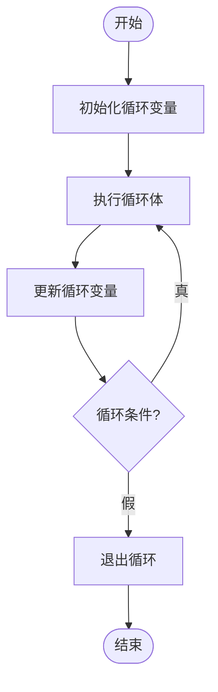

---
tags:
  - 408_计算机学科专业基础
创建时间: 2026-01-11T16:00:00
考试科目: "408"
课程: C语言
阶段: 零基础
老师: 泥鳅
开始日期: 2026-01-11
结束日期:
---
---
[[2026-01-16]]
# 1. 配置C语言开发环境
##  1.1 简单回顾第一份代码的执行过程

```C
#include<stdio.h>
int main(){
	printf("hello world\n");
	
	return 0;
}
```

	1.打开 VS Code
	2.创建项目 - 解决方案
	3.找到源文件文件夹往其中去添加一个文件
	4.C++ 是 C 的超集
	5.调试的过程 = 编译 + 运行
---
# 2. 程序员视角中的计算机
## 2.1 计算机是什么？
	计算机是模拟人类的思考和运算的过程的机器。
	算盘
	算盘计算 1 + 2 = ？（只需要用到算盘）
	算盘计算 1 + 2 + 3 - 4 = ？（不仅需要用到算盘，还要用到草稿纸）
	计算机将算盘替换为CPU（中央处理器），将草稿纸替换为存储器。
	即：计算机 = CPU + 存储器
---
## 2.3 理解一份C代码

```C
#include<stdio.h>

int main() {
	int i = 1;
	i = i + 2;
	i = i + 3;
	i = i - 4;
	printf("i = %d\n", i);
	
	return 0;
}
```

	#include<stdio.h>
	#开头的指令叫做预处理指令

	int main(){ ... } 函数的定义
		· 定义：将一个概念的所有信息都描述清楚。
		· int（返回值）：类似于数学中函数的因变量。
		· main（函数名）：函数名是用户自己设计的（标识符），名字为main的函数比较特殊，它是整个程序的入口。
		· ()（参数）：类似于数学中函数的自变量。
		· {}（函数体）：函数运行过程中，需要执行的指令。

		int 是一个关键字（C语言语法规定的），它描述的是一种整数的数据类型。
		main函数的返回值是一个整数。
		()说明main函数的参数是空的。

		int i = 1; 分号说明一个表达式的结束。
		定义了一个名字叫做i的变量，变量的类型是整数，变量一创建里面的数值就是1。
		变量就是在存储器里面找了一块位置,给它起了个名字。

		i = i + 2; 先计算 i + 2 ，再赋值给变量i。
		“ = ” 是赋值的意思。

		return 0; 返回一个整数0。
---
## 2.4 内存模型
	1.信息
		信息是对不确定性的消除。 —— 香农

		bit（比特）：一位bit就是0或者1。

			抛硬币
				正面 ——> 0
				反面 ——> 1
			红绿灯
				红灯 ——> 00
				黄灯 ——> 01
				绿灯 ——> 10
				保留 ——> 11
				
$$n位bit可以描述2^{n}种可能性$$

		机器数：一串二进制数。
		真值：人类所能理解的信息。
		编码：把真值映射成机器数的过程。
---

	2.进制
		· 二进制：逢2进1。
			0 1 10 11 100 101 110 ...
		· 十进制：逢10进1。
			0 1 2 3 4 5 6 7 8 9 10
---

	3.进制转换
		· 二进制怎样转换为十进制？
			加权求和法：二进制数的每一位乘以对应的 2 的幂次（权重），然后求和。

$$
\begin{gather}
\text公式：{十进制数} = \sum_{i=0}^{n} b_i \times 2^i\\
\text其中  b_i  是二进制数的第 i 位（从右向左，从 0 开始编号）
\end{gather}
$$
				步骤：
					1. 从二进制数最右边开始（最低位），给每位编号，从 0 开始。
					2. 每位数字乘以2^{位索引}。
					3. 将所有乘积相加。

$$\text例：1101_{2} = 1 * 2^{3} + 1 * 2^{2} + 0 * 2^{1} + 1 * 2^{0} = 13_{10}$$

		· 十进制如何转换成二进制？
			除2取余法：将一个十进制整数不断除以2，记录每次除法的余数（0或1），直到商为0为止，然后将所得余数倒序排列即为转换所得的二进制数。
			步骤：
				1. 将十进制整数除以2，记录商和余数。
				2. 用商继续除以2，再记录余数。
				3. 重复直到商为0。
				4. 将余数从下往上（逆序）排列。

$$
\begin{align*}
&\text{例：十进制29转二进制} \\
&\begin{aligned}
\text{计算过程：}
29 &\div 2 = 14 \cdots 1 \\
14 &\div 2 = 7  \cdots 0 \\
7  &\div 2 = 3  \cdots 1 \\
3  &\div 2 = 1  \cdots 1 \\
1  &\div 2 = 0  \cdots 1 \\
\end{aligned} \\
&\text{余数序列（从下往上读）：} 11101 \\
&\begin{aligned}
\text{验证}：
11101_2 &= 1 \times 2^4 + 1 \times 2^3 + 1 \times 2^2 + 0 \times 2^1 + 1 \times 2^0 \\
       &= 16 + 8 + 4 + 0 + 1 \\
       &= 29_{10}
\end{aligned}
\end{align*}
$$
- [0] 进制转换的具体方法参见：[[二进制与十进制相互转换方法]]
---

	4.八进制和十六进制
		· 八进制

$$
\begin{gather}
\text8 = 2^{3}\\
\text1234_{8} = 1 * 8^{3} + 2 * 8^{2} + 3 * 8^{1} + 4 * 8^{0} = (001|010|011|100)_{2} 
\end{gather}
$$
		· 十六进制

$$
\begin{gather}
\text16 = 2^{4}\\
\text1234_{16} = 1 * 16^{3} + 2 * 16^{2} + 3 * 16^{1} + 4 * 16^{0} = (0001|0010|0011|0100)_{2}\\
\end{gather}
$$
$$
\begin{gather}
\text十进制：0|1|2|3|4|5|6|7|8|9|10|11|12|13|14|15|16\\
\text十六进制：0|1|2|3|4|5|6|7|8|9|a|b|c|d|e|f|10\\
\end{gather}
$$
	5.内存
		内存的最小单位是byte（字节），1 byte = 8 bit = 8位二进制数 = 2位十六进制数。
		数据的单位是byte（字节），所有数据都是以byte（字节）为单位放进内存中的。
		每一个byte都有一个独立的十六进制数字编码用来描述不同数据所在的位置，我们将其称为地址。

```
000000C61AF0FCC4  00
000000C61AF0FCC4（地址：16位十六进制数 = 64位二进制数 = 64 bit）
00（数据：2位16进制数 = 8位二进制数 = 8 bit）
```
---
# 3. 基础语法
## 3.1 空白字符
### 3.1.1 空格 换行（Enter） 制表符（TAB）

	空白字符只起到分隔的作用，不充当语法成分。
---
## 3.2 注释

```c
//单行注释

/*
多行
注释
*/
```

	注释的使用场景：
		· 用来解释代码，说明变量的作用，或者是运算的作用。
		· 用来测试代码，面对可能出错的代码，我们不会直接删除，而是将其改成注释，方便后续恢复原状。
---
## 3.3 关键字和标识符
	关键字：由C语言语法规定的一些单词，它们有着固定的含义和用途。
	
	C语言是大小写敏感的：
		int 是关键字
		Int 不是关键字

```c
#include<stdio.h>
int /* int：用于声明函数返回整型值 */ main(){
	int i = 1;// int：用于声明整型变量
	
	return 0;//return：将函数执行结果返回给调用者
}
```

- [0] C语言常用的32个关键字参见：[[C语言常用的32个关键字]]
---

	标识符：用户自定义的单词，一般用来给变量或者是函数起名字。

	规范：
		· 标识符不能和关键字重复。
		· 大小写敏感。
		· 标识符由数字、字母和下划线组成。
		· 标识符开头不能是数字。

		int 不是标识符
		Int 是标识符
		3xy 不是标识符（原因：“3xy”以数字开头了。）
		xy3 是标识符
---
[[2026-01-17]]
# 4. 常量、变量和数据类型
## 4.1 字面值常量和符号常量
	1.数据对象
		· 常量 —— 不可修改
			- 字面值常量
				一写出来，就知道它的含义。
				例如：
					整数 1234
					浮点数 3.14
					字符 'a'（界定符是英文单引号）
					字符串 "hello world"（界定符是英文双引号）
				字面值常量特别容易混淆，因此我们引入一种新的常量来规避此种现象。

```c
#include<stdio.h>
int main(){
	//圆周率为3 半径也是3
	printf("R = %d,A = %d\n",3,3 * 3 * 3);
	
	return 0;
}
```

			- 符号常量
				使用宏定义来实现符号常量。
				宏的作用是在预处理阶段做文本替换。
				
				预处理只做了文本替换，不会执行编译检查。
				所以，为了规避宏定义带来的问题，我们需要加括号。
				
				代码生成的流程（简化版）：
					*.cpp（预处理） --> *.i （编译） --> *.exe（可执行文件）

- [0] 代码生成的完整流程详见：[[计算机组成原理]]

```c
#include<stdio.h>
// 使用宏定义来实现符号常量
// 宏的作用是在预处理阶段做文本替换
#define R 3
#define PIE 3
int main(){
	//圆周率为3 半径也是3
	printf("R = %d,A = %d\n",R,PIE * R * R);
	
	return 0;
}
```

			- 小结
				字面值常量：1234、3.14、'a'、"hello world"
				符号常量：#define R 3
					注意空格，还需要注意末尾没有分号。
---
## 4.2 变量的概念、定义和初始化
		· 变量 —— 可以修改
			变量是一片可以存放数据的有名字关联的内存区域。

			要素：
				- 名字 --> 满足标识符的规范
				- 内存区域的大小 --> 通过数据类型来描述
				- 人类理解的真值如何和机器数对应起来 --> 需要设计一个合理的映射/编码规则 --> 通过数据类型来描述

```c
#include<stdio.h>
int main(){
	// 数据类型 变量名字
	int i;
	printf("sizeof(i) = %d\n",sizeof(i));
	double d1,d2; // 定义了两个变量d1和d2
	printf("sizeof(d1) = %d,sizeof(d2) = %d,sizeof(double) = %d\n",sizeof(d1),sizeof(d2),sizeof(double));
	// 数据类型决定变量在内存空间中所占的字节数量，也就是说：数据类型决定内存大小。
	// 数据类型还决定机器数和真值之间的编码规则。
	
	return 0;
}
```

			变量的初始化和赋值
				初始化：在创建变量的时候就赋予了一个初始值。
				赋值：用新的值去取代原来内存里面的内容。

				初始化和赋值都使用了 '=' 运算符。
				当 '=' 在定义语句中，我们将其称为初始化。
				当 '=' 出现在其他位置，我们将其称为赋值。

				在C语言中，同一个符号在不同的位置有着不同的含义。

```c
#include<stdio.h>
int main(){
	//初始化的代码
	int i = 3; //定义一个变量i然后设置初值为3 | 当 '=' 在定义语句中，我们将其称为初始化
	i = 4; //用4来取代i原来的内容 | 当 '=' 出现在其他位置，我们将其称为赋值
	i = i + 1; //先计算i + 1，再用计算所得结果取代原来的内容
	
	return 0;
}
```
---
## 4.3 数据类型概览
	· 数据类型
		基本数据类型
			整数
				有符号整数
					char 同时也是字符类型 （C语言中，字符的本质是整数）
					short
					int
					long / long long
				无符号整数
					unsigned char
					unsigned short
					unsigned int
					unsigned long / unsigned long long
			浮点数
				单精度浮点数 float
				双精度浮点数 double
---
## 4.4 不同类型的整形字面值
	整数类型
		有符号整数
			包含：负数 0 正数

			char —— 1byte
			short —— 2byte
			int  —— 4byte
			long —— 4byte
			long long —— 8byte

			在不同的平台上面，int和long的大小会发生变化	

		无符号整数
			只有0和正数

		整形字面值的写法

```c
#include<stdio.h>
int main(){
	printf("1234 = %d\n",1234); //1234是十进制
	printf("01234 = %d\n",01234); //0开始的整形字面值是八进制的
	printf("0x1234 = %d\n",0x1234); //0x开始的整形字面值是十六进制的
}
```

		整数的数据范围：

$$
int \ ——> \ 4Byte \ ——> \ 32Bit \ ——> \ 2^{32} \ 种可能性 
\begin{cases}
0 & \text1种 \\
正数 & \text2^{31} - 1种 \\
负数 & \text2^{31}种 \\
\end{cases}
$$
		推广到其他的数据类型，结论类似：

$$
大小为n个Bit的有符号整数 \ ——> \ 2^{n} \ 种可能性 
\begin{cases}
0 & \text1种 \\
正数 & \text2^{n-1} - 1种 \\
负数 & \text2^{n-1}种 \\
\end{cases}
$$
---
## 4.5 整数溢出问题
	溢出问题：正数在做运算的时候，算出来的结果变成了负数。

```c
#include<stdio.h>
int main(){
	int i = 0x7fffffff 
	// 0111|1111|1111|1111|1111|1111|1111|1111 --> 最大正数
	i = i + 1;
	printf("i = %d\n",i);
	
	return 0
}
```

```c
结果：i = -2147483648
```
- [0] 整数溢出问题的具体原因详见：[[计算机组成原理]]
---
## 4.6 无符号整数
	无符号整数类型
		只能描述非负数

$$
\begin{gather}
\text unsigned \ char \ —— \ 1 \ byte \ 范围:0 \sim \ 2^{8}-1 \\
\text unsigned \ short \ —— \ 2 \ byte \ 范围:0 \sim \ 2^{16}-1 \\
\text unsigned \ int \ —— \ 4 \ byte \ 范围:0 \sim \ 2^{32}-1 \\
\text unsigned \ long \ —— \ 4 \ byte \ 范围:0 \sim \ 2^{32}-1 \\
\text unsigned \ long long \ —— \ 8 \ byte \ 范围:0 \sim \ 2^{64}-1 \\
\end{gather}
$$
```c
#include<stdio.h>
int main(){
	unsigned int u = 0xffffffff;
	u = u + 1;
	printf("u = %u\n",u);
	
	return 0;
}
```

```c
结果：u = 0
```

- [0] 输出结果表明：不管是有符号整数还是无符号整数能够表示的数据范围都是有限的，都会发生溢出问题。

- [1] 进一步推广可得到以下结论：无论什么数据类型，都是有范围的，都会发生溢出问题。
---
## 4.7 浮点数
	浮点数类型
		带小数的数据
			float -- 4byte
			double -- 8byte

```c
#include<stdio.h>
int main(){
	float f = 3.14159;
	printf("f = %f\n",f);
	
	return 0;
}
```

```c
结果：f = 3.141590
```

```c
#include<stdio.h>
int main(){
	float f = 3.14159;
	printf("f = %.10f\n",f);
	
	return 0;
}
```

```c
结果：f = 3.1415901184
```

		整数与浮点数的区别：
			整数是精确的。
			浮点数是近似值，有误差，因此浮点数是不能够去比较相等的，两个浮点数之间总会有一些偏差值。

```c
#include<stdio.h>
int main(){
	float f = 3.14159;
	printf("f = %.10f\n",f);
	double d = 3.14159;
	printf("d = %.10f\n",d);
	
	return 0;
}
```

```c
结果：
	f = 3.1415901184
	d = 3.1415900000
```

- [0] 输出结果表明：double的精度比float高。

- [1] double的有效数字是15位，float的有效数字是6位。
---

		浮点数的精度丢失问题：
			两个浮点数，如果绝对值相差很大，可能会出现精度丢失的问题。

```c
#include<stdio.h>
int main(){
	float a = 1.2345e10; // e10 = * 10^10
	float b = a + 20;
	printf("a = %f,b = %f\n",a,b);
	
	return 0;
}
```

```c
结果：a = 12344999936.000000,b = 12344999936.000000
```

- [0] 输出结果表明：当两个浮点数的绝对值相差过大，会出现精度丢失的问题。该现象产生的原因为：a与b二者相差20，20相对于1.2345e10来说显得过于小了，所以在做加减法运算时，20在移位的过程中由于小于精度而被忽略掉了，所以加法的信息也就没有了。

- [1] 总结：当两个浮点数的绝对值相差过大时，用float进行加减法运算是不行的。此问题的本质是由于float的精度不够高，因此我们可以换用double将精度提高。

```c
#include<stdio.h>
int main(){
	double a = 1.2345e10; // e10 = * 10^10
	double b = a + 20;
	printf("a = %f,b = %f\n",a,b);
	
	return 0;
}
```

```c
结果：a = 12345000000.000000,b = 12345000020.000000
```
---
## 4.8 字符和ASCII编码
	· 字符类型
		可以打印在屏幕上面的字符数据。
		字母、符号、数字之类。

		C语言种用char来表示字符类型。

```c
#include<stdio.h>
int main(){
	char ch;
	//显示字母
	ch = 'a';
	printf("ch = %c\n",ch);
	
	return 0;
}
```

```c
结果：ch = a
```

```c
#include<stdio.h>
int main(){
	char ch;
	//显示数字
	ch = '0'; //字符只能显示一位数字
	printf("ch = %c\n",ch);
	
	return 0;
}
```

```c
结果：ch = 0
```

```c
#include<stdio.h>
int main(){
	char ch;
	//显示逗号
	ch = ',';
	printf("ch = %c\n",ch);
	
	return 0;
}
```

```c
结果：ch = ,
```

```c
#include<stdio.h>
int main(){
	char ch;
	//换行\n
	ch = '\n';
	printf("ch = %c\n",ch);
	
	return 0;
}
```

```c
结果：ch = 

```

```c
#include<stdio.h>
int main(){
	char ch;
	//回车\r —— 将光标从右边移到左边
	ch = '\r';
	printf("abc%cxyz",ch);
	
	return 0;
}
```

```c
结果：xyz
```

```c
#include<stdio.h>
int main(){
	char ch;
	//退格\b —— 光标往左退一格
	ch = '\b';
	printf("abc%cxyz",ch);
	
	return 0;
}
```

```c
结果：abxyz
```

```c
#include<stdio.h>
int main(){
	char ch;
	//制表符\t
	ch = '\t';
	printf("abc%cxyz",ch);
	
	return 0;
}
```

```c
结果：abc xyz
```

```c
#include<stdio.h>
int main(){
	char ch;
	//反斜杠\\
	ch = '\\';
	printf("abc%cxyz",ch);
	
	return 0;
}
```

```c
结果：abc\xyz
```

	· char类型和整数的关系

```c
#include<stdio.h>
int main(){
	char ch;
	ch = 'a'; //'a' 和 数值97是等价的
	printf("ch = %d\n",ch);
	
	return 0;
}
```

```c
结果：ch = 97
```

```c
#include<stdio.h>
int main(){
	char ch1;
	ch1 = 97;
	printf("ch1 = %c\n",ch1);
	
	return 0;
}
```

```c
结果：ch1 = a
```

- [0] 输出结果表明：在内存中，任意两个数据当其数值为'a'和97时，这两个数据是等价的，输出结果的表现形式取决于打印时的解释方式（用占位符%d还是用占位符%c）。具体过程如下图所示。

$$
\text 97 \ ——> \
\begin{cases}
\%d & 97 \\
\%c & a \\
\end{cases}
$$

- [1] 因此可得到以下结论：字符的底层都是整数。
---

	· 编码规则：记录各种各样的数值与字符之间的对应关系 --> ASCII

	ASCII码
		128种对应规则 —— 0 ~ 127

		常用的ASCII码：
			0 —— NUL（null） —— 空
			10 —— LF（line feed —— new line） —— 换行
			48 ~ 57 —— 数字 0 ~ 9
			65 ~ 90 —— 大写字母 A ~ Z
			97 ~ 122 —— 小写字母 a ~ z

- [0] '0'等价于48而不是0

- [1] '3' - '1' 等价于 3 - 1

- [2] 相同含义的大写字母与小写字母之间相差32

- [0] 完整版ASCII码表格详见：[[ASCII码表(完整版)]]
---
## 4.9 字面值常量的默认类型
	一个整数字面值常量优先是int类型。
	int放不下，就是unsigned int，然后是long long。

	任何浮点数字面值常量都是double类型。

```c
#include<stdio.h>
int main(){
	float f = 1 / 2;
	printf("f = %f\n",f);
	
	return 0;
}
```

```c
结果： 0.000000
```

```c
#include<stdio.h>
int main(){
	float f = 1.0 / 2;
	printf("f = %f\n",f);
	
	return 0;
}
```

```c
结果： 0.500000
```

```c
#include<stdio.h>
int main(){
	long long ll;
	ll = 131072 * 131072;
	printf("ll = %lld\n",ll);
	
	return 0;
}
```

```c
结果：ll = 0
```

- [0] 输出结果和预想结果不同的原因：131072本身是一个int类型，131072也是一个int类型。int类型 * int类型 = int类型。二者相乘等于2^34超出了int类型能够表达的范围导致溢出了。所以在赋值给ll之前已经有一部分信息丢掉了。就算后面补救赋值给了一个long long类型信息已经不完整了导致输出结果和预想结果不同。解决办法如下：

```c
#include<stdio.h>
int main(){
	long long ll;
	ll = (long long)131072 * 131072; //(long long) + 表达式 —— 做类型转换
	printf("ll = %lld\n",ll);
	
	return 0;
}
```

```c
结果：ll = 1719869184
```
---
[[2026-01-18]]
# 5. 专题A 输入和输出
## 5.1 缓冲区
	目前需要了解的缓冲区：
		stdin —— 标准输入缓冲区
			用来处理标准输入缓冲区中的数据的函数有：
				scanf getchar fgets
		stdout —— 标准输出缓冲区
			用来处理标准输出缓冲区中的数据的函数有：
				printf puts
---
## 5.2 scanf( )的基本使用
	scanf()
		scanf()（格式化输入）：从标准输入缓冲区拷贝数据到自己的内存。

```c
#include<stdio.h>
int main(){
	int i; //用来存放从stdin过来的数据
	int ret = scanf("%d",&i); //%d是一个控制符，用来说将要接收的数据的类型是整数；&i是将数据存入i的地址当中,&符号的作用是取地址，不可省略。
	printf("ret = %d,i = %d\n",ret,i);
	
	return 0;
}
```

```c
在Visual Studio中点击编译，此时在输出窗口中会有一条报错信息："error C4996"提示我们scanf是不安全的。
```

- [0] 使用scanf( )时可能会报错，其原因是scanf是不安全的。我们希望将这个报错忽略掉，因此进行以下操作：

```c
#define _CRT_SECURE_NO_WARNINGS
#include<stdio.h>
int main(){
	int i; //用来存放从stdin过来的数据
	int ret = scanf("%d",&i); //%d是一个控制符，用来说将要接收的数据的类型是整数；&i是将数据存入i的地址当中,&符号的作用是取地址，不可省略。
	printf("ret = %d,i = %d\n",ret,i);
	
	return 0;
}
```

```c
输入：1234
结果：ret = 1,i = 1234
```

		使用scanf()的步骤如下：
			1. 准备变量 —— 数据的目的地
			2. scanf()的两类参数：
				- 第一类参数：字符串 —— 用来描述数据的格式
				- 第二类参数：& + 变量名 —— 用来说明存放数据的地址（记得使用&运算符）
			3. scanf()的返回值是读取成功的变量个数
				- 如果返回值和'%'个数相等 —— 读取成功
				- 如果返回值小于'%'个数 —— 有数据读取失败
				- 如果返回值为-1，我们认为是特殊情况，我们将这种特殊情况称为EOF

- [0] 若想深入了解EOF请参见：[[深入了解EOF]]
---

	stdin的性质
		先进先出 —— 本质上是一个字符队列

```c
#define _CRT_SECURE_NO_WARNINGS
#include<stdio.h>
int main(){
	int i;
	float f;
	scanf("%d%f",&i,&f);
	printf("i = %d,f = %f\n",i,f);
	
	return 0;
}
```

- [0] 使用scanf( )时，其参数中的%d、%f、%lf会忽略缓冲区里面的前置空白字符（换行、空格、制表符）

- [1] 因此我们使用scanf( )时，不需要考虑输入内容当中有多少个空格，控制字符可以连着写

```c
#define _CRT_SECURE_NO_WARNINGS
#include<stdio.h>
int main(){
	char ch;
	scanf("%c",&ch);
	printf("ch = %c\n",ch);
	
	return 0;
}
```

- [2] 使用scanf( )时，其参数中的%c不会忽略前面的空白字符

```c
#define _CRT_SECURE_NO_WARNINGS
#include<stdio.h>
int main(){
	int i;
	char ch;
	scanf("%d%c",&i,&ch);
	printf("i = %d,ch = %c\n",i,ch);
	
	return 0;
}
```

```c
输入：1234 a
结果：i = 1234,ch = 
```

- [3] 我们希望改变scanf( )中参数%c的性质，让它能够忽略前面的空白字符，因此可以进行如下操作：

```c
#define _CRT_SECURE_NO_WARNINGS
#include<stdio.h>
int main(){
	int i;
	char ch;
	scanf("%d %c",&i,&ch); //%c前面的空格，可以让%c忽略前面的空白
	printf("i = %d,ch = %c\n",i,ch);
	
	return 0;
}
```

- [4] 一般的使用场景：绝大多数情况下scanf( )的格式字符串里面，只有%控制符，偶尔会在%c前面加空格
---
## 5.3 getchar( )
	getchar()从stdin（标准输入缓冲区）获取并返回下一个字符，如果到达文件尾返回EOF。
	getchar()等价于scanf(%c)，也不会忽略空白字符

```c
#include<stdio.h>
int main(){
	char ch1,ch2;
	ch1 = getchar();
	ch2 = getchar();
	printf("ch1 = %c,ch2 = %c\n",ch1,ch2);
	
	return 0;
}
```

```c
输入：a b
结果：ch1 = a,ch2 =  
```
---
## 5.4 printf( )
	stdout是一种行缓冲，当数据中有换行符的时候，就会刷到屏幕上面 ——> 我们写的代码输出语句要以换行结尾

	printf() —— 格式化输出

	先修知识 —— 占位符
		%c 字符
		%d 十进制
		%o 八进制
		%x 十六进制
		%f 浮点数
		%u 无符号整数
		%lld long long
		%ld long
		%s 字符串

```c
#include<stdio.h>
int main(){
	char name[] = "CaiXukun"; //C语言中用字符数组来存储字符串
	int age = 30;
	char address[] = "USA";
	printf("I am %s,I am %d years old.I live in %s\n",name,age,address);
	
	return 0;
}
```

	设置数据的宽度

```c
#include<stdio.h>
int main(){
	char name1[] = "CaiXukun",name2[] = "WuYifan"; //C语言中用字符数组来存储字符串
	int age1 = 30,age2 = 33;
	char address1[] = "USA",address2[] = "Canada";
	printf("I am %8s,I am %d years old.I live in %s\n",name1,age1,address1); //%8s：保证数据宽度不小于8个字符并且右对齐
	printf("I am %8s,I am %d years old.I live in %s\n",name2,age2,address2);
	
	return 0;
}
```

```c
#include<stdio.h>
int main(){
	char name1[] = "CaiXukun",name2[] = "WuYifan"; //C语言中用字符数组来存储字符串
	int age1 = 30,age2 = 33;
	char address1[] = "USA",address2[] = "Canada";
	printf("I am %-8s,I am %d years old.I live in %s\n",name1,age1,address1); //-%8s：保证数据宽度不小于8个字符并且左对齐
	printf("I am %-8s,I am %d years old.I live in %s\n",name2,age2,address2);
	
	return 0;
}
```

```c
#include<stdio.h>
int main(){
	char name1[] = "CaiXukun",name2[] = "WuYifan"; //C语言中用字符数组来存储字符串
	int age1 = 30,age2 = 33;
	char address1[] = "USA",address2[] = "Canada";
	printf("I am %-8s,I am %03d years old.I live in %s\n",name1,age1,address1); //%03d保证数据宽度不小于3，并且当数据宽度小于3时在前面补0
	printf("I am %-8s,I am %03d years old.I live in %s\n",name2,age2,address2);
	
	return 0;
}
```

- [0] %和d/s/c/f之间可以添加整数，用来描述最小宽度

- [1] 整数前面加负号，可以实现左对齐

- [2] 整数前面加0，可以让不足最小宽度的数据填充0
---

	设置浮点数的宽度

```c
#include<stdio.h>
int main(){
	double d = 3.1415926535;
	printf("d = %.15lf\n",d);
	
	return 0;
}
```

	puts() —— 打印一行
		puts(str) 等价于 printf("%s\n",str)

```c
#include<stdio.h>
int main(){
	char str[] = "hello";
	puts(str);
	
	return 0;
}
```
---
[[2026-01-25]]
# 6. 运算符和表达式
	运算符
		算术运算符
		关系运算符
		逻辑运算符
		赋值运算符
		*位运算符
		其他：条件运算符 逗号运算符
---
## 6.1 算术运算符
	+ - * / %
	整数支持：+ - * / %
	浮点数支持：+ - * / （不支持%）

```c
#include<stdio.h>
int main(){
	int a = 10,b = 5;
	printf("a + b = %d\n",a + b);
	printf("a - b = %d\n",a - b);
	printf("a * b = %d\n",a * b);
	printf("a / b = %d\n",a / b);
	printf("a %% b = %d\n",a % b); //printf()想显示%要写%%
	
	return 0;
}
```

```c
结果：
a + b = 15
a - b = 5
a * b = 50
a / b = 2
a % b = 0
```

- [0] %（取余运算符）的操作数必须是整数

```c
#include<stdio.h>
int main(){
	int a = 1,b = 2,c = 3;
	//优先级：* / % 高于 + -
	//相同优先级按照从左往右的顺序
	printf("output = %d\n",a + b * c);
	
	return 0;
}
```

```c
结果：output = 7
```

- [1] 优先级：* / % 高于 + -
- [2] 相同优先级按照从左往右的顺序 —— 结合性
---
## 6.2 关系运算符
	C语言当中如何描述真和假

$$
\left.
\begin{array}{l@{\quad}l}
\text{数据的机器数是0} & \text{—— 假} \\
\text{数据的机器数不是0} & \text{—— 真}
\end{array}
\right\}
\text{ ——> if 结构}
$$

```c
#include<stdio.h>
int main(){
	int condition = 1;
	if(condition){
		printf("true!\n");
	}
	else{
		printf("false!\n");
	}
	
	return 0;
}
```

```c
结果：true!
```

	关系运算符
		判断相等关系
			判断相等 ==
			判断不相等 !=
		判断大小关系
			小于 <
			小于等于 <=
			大于 >
			大于等于 >=

```c
#include<stdio.h>
int main(){
	int a = 10,b = 5;
	printf("a == b is %d\n",a == b);
	printf("a != b is %d\n",a != b);
	
	return 0;
}
```

```c
结果：
a == b is 0
a != b is 1
```

- [0] 满足条件，关系运算符的返回值为1；不满足条件，关系运算符的返回值为0。

```c
#include<stdio.h>
int main(){
	int a = 1,b = 2,c = 3;
	printf("a < b < c is %d\n",a < b < c);
	//a < b < c不是看b是否在a与c中间，而是先执行a < b，再执行b < c
	
	return 0;
}
```

```c
结果：a < b < c is 1
```

- [1] a < b < c不是看b是否在a与c中间，而是先执行a < b，再执行b < c

```c
#include<stdio.h>
int main(){
	int a = 1,b = 2,c = 1;
	printf("a == b < c is %d\n",a == b < c);
	//'<'的优先级高于'=='，所以要先做<运算，再做==运算
	
	return 0;
}
```

```c
结果：a == b < c is 0
```

- [3] 判断大小的运算符的优先级高于判断相等的运算符，相同优先级按照从左往右的顺序 —— 结合性
---
[[2026-01-26]]
## 6.3 逻辑运算符
	对布尔表达式（返回真或假的表达式）做运算

	逻辑与（&&） 逻辑或（||） 逻辑非（！）

	逻辑与 双目 L && R

<table class="table-center">
<tr>
<th>L</th>
<th>R</th>
<th>N</th>
</tr>
<tr>
<td>1</td>
<td>1</td>
<td>1</td>
</tr>
<tr>
<td>1</td>
<td>0</td>
<td>0</td>
</tr>
<tr>
<td>0</td>
<td>1</td>
<td>0</td>
</tr>
<tr>
<td>0</td>
<td>0</td>
<td>0</td>
</tr>
</table>

	逻辑或 双目 L || R

<table class="table-center">
<tr>
<th>L</th>
<th>R</th>
<th>N</th>
</tr>
<tr>
<td>1</td>
<td>1</td>
<td>1</td>
</tr>
<tr>
<td>1</td>
<td>0</td>
<td>1</td>
</tr>
<tr>
<td>0</td>
<td>1</td>
<td>1</td>
</tr>
<tr>
<td>0</td>
<td>0</td>
<td>0</td>
</tr>
</table>

	逻辑非 单目

$$
\begin{cases}
\ ! \ 0 & —— \ \ \ 1 \\
\ ! \ 1 & —— \ \ \ 0 \\
\end{cases}
$$

	判断某一年是不是闰年
		闰年的规则：
			· 年份能被4整除并且不能被100整除 —— 闰年
			· 年份能被400整除 —— 闰年
		year % 4 == 0 && year % 100 != 0 || year % 400 == 0

- [0] !（逻辑非） > &&（逻辑与） > ||（逻辑或）

```c
#define _CRT_SECURE_NO_WARNINGS
#include<stdio.h>
int main(){
	int year;
	scanf("%d",&year);
	if(year % 4 == 0 && year % 100 != 0 || year % 400 == 0){
		printf("%d is a leap year!\n",year);
	}
	else{
		printf("%d is not a leap year!\n",year);
	}
	
	return 0;
}
```

```c
输入：2026
结果：2026 is not a leap year!
```
---
## 6.4 优先级和表达式树
	C语言运算符的优先级
		单目运算符 > 算数运算符(* / % 高于 + -) > 关系运算符(< <= > >= 高于 == !=) > 逻辑运算符(&& 高于 ||)

- [0] 完整版C语言运算符的优先级汇总表详见[[C语言运算符优先级]]
---

	表达式树
		将表达式看作一个倒着长的树结构
			树：优先级最低的作为根

```c
year % 4 == 0 && year % 100 != 0 || year % 400 == 0
```


---
## 6.5 短路操作
	短路操作
		当逻辑与(&&)的左操作数为假时，可以不用执行右操作数
		当逻辑或(||)的左操作数为真时，可以不用执行右操作数

```c
#include<stdio.h>
int main(){
	int i = 1;
	int j = 1;
	i == j || (j = 2);
	printf("j = %d\n",j);
	
	return 0;
}
```

```c
结果：j = 1
```

- [0] 总结：当表达式中存在&&或者||时，表达式应该先执行左边的操作数，看是否触发短路，再考虑是否执行右边的操作数。
---
## 6.6 赋值运算符
	赋值运算符 L = R
		赋值运算符优先级比较低
		可以将赋值运算符"="看作一个向左指向的箭头"⬅"，其实质为把R的值(可以是临时数据)放入L的内存空间里面。因此，我们需要对L提出一些要求：

$$
\text L(左值)
\begin{cases}
① & L必须代表一片内存空间 \\
② & 该空间可以被修改 \\
\end{cases}
$$

```c
#include<stdio.h>
int main(){
	int i = 1; //这个等于号不是赋值，它是初始化
	i = 3 + 4; //合理
	3 + 4 = i; //不合理
	i = i + 1; //合理 i出现在左边表示访问i的地址；i出现在右边表示获取i的值
	i += 1; //等价于 i = i + 1;
	++i; //等价于 i = i + 1;
	
	return 0;
}
```

	赋值运算符的结合性 —— 从右往左

```c
#include<stdio.h>
int main(){
	int x,y;
	x = y = 1;
	printf("x = %d,y = %d\n",x,y);
	
	return 0;
}
```

```c
结果：x = 1,y = 1
```
---
## 6.7 三目运算符
	条件运算符 3目 A ? B : C
		检查A的真假，若A为真则返回B，若A为假则返回C

```c
#include<stdio.h>
int main(){
	int a = 10,b = 5;
	int max = a > b ? a : b;
	printf("max = %d\n",max);
	
	return 0;
}
```

```c
结果：max = 10
```

```c
#include<stdio.h>
int main(){
	int a = 10,b = 5,c = 15;
	int max = (a > b ? a : b) > c ? (a > b ? a : b) : c;
	printf("max = %d\n",max);
	
	return 0;
}
```

```c
结果：max = 15
```
---
## 6.8 逗号运算符
	逗号运算符的优先级是最低的
	A,B ——> 先执行A再执行B最后返回B
	和A;B;很像

	场景：变量i，要求先改变i的值，再判断i是否合适

	if(i = i + 1,i == 3){
	}

- [2] 注意：函数参数里面的","不是逗号运算符，C语言没有规定参数的处理顺序。
---
## 6.9 自增自减运算符
	++ 单目 自增 ——> 操作数必须是左值
	-- 单目 自减 ——> 操作数必须是左值

	++i 前缀自增 内存内容：4 返回结果：4 ——> 先自增再返回
	i++ 后缀自增 内存内容：4 返回结果：3 ——> 先返回再自增

```c
#include<stdio.h>
int main(){
	int i = 3;
	int j;
	j = ++i; //前缀自增：先自增(++)再返回
	printf("i = %d,j = %d\n",i,j)
	
	return 0;
}
```

```c
结果：i = 4,j = 4
```

```c
#include<stdio.h>
int main(){
	int i = 3;
	int j;
	j = i++; //前缀自增：先自增(++)再返回
	printf("i = %d,j = %d\n",i,j)
	
	return 0;
}
```

```c
结果：i = 4,j = 3
```
---
[[2026-01-27]]
## 6.10 运算符总结

```c
5 > 3 && 8 < 4 - !0
```


```
先算 5 > 3 --> 1

!0 --> 1
4 - 1 --> 3
8 < 3 --> 0

最后 1 && 0 --> 0
```

- [0] 1.需要按照优先级整理表达式树
- [1] 2.几个特殊运算符 && || , 规定了执行顺序
---
# 7. 选择结构
## 7.1 选择结构描述

	先修知识 —— 顺序结构


	选择结构


- [0] C语言中选择结构靠if和switch两种方式实现
---
## 7.2 单分支if
	if(表达式){
		语句块
	}

	语句块可以是：
		一个语句
		{多个语句}


```c
#define _CRT_SECURE_NO_WARNINGS
#include<stdio.h>
int main(){
	int i;
	scanf("%d",&i);
	if(i == 1){
		printf("i is 1!\n");
	} //编程要求：我们自己写的代码，不能省略花括号。
	
	return 0;
}
```

```c
输入：1
结果：i is 1!
```
---
## 7.3 双分支if
	if(表达式){
		语句块1
	}
	else{
		语句块2
	}


```c
#include<stdio.h>
int main(){
	int a = 10,b = 5;
	if(a > b){
		printf("max = a,a is %d\n",a)
	}
	else{
		printf("max = b,b is %d\n",b);
	}
	
	return 0;
}
```

```c
结果：max = a,a is 10
```

```c
#include<stdio.h>
int main(){
	int a = 10,b = 15,c = 20;
	if(a > b){
		if(a > c){
			printf("max = a,a is %d\n",a);
		}
		else{
			printf("max = c,c is %d\n",c);
		}
	}
	else{
		if(b > c){
			printf("max = b,b is %d\n",b);
		}
		else{
			printf("max = c,c is %d\n",c);
		}
	}
	
	return 0;
}
```

```c
结果：max = c,c is 20
```
---
## 7.4 多分支if
	只需要在else的语句里面嵌套使用if，就可以实现更多分支的if了。


```c
#define _CRT_SECURE_NO_WARNINGS
#include<stdio.h>
int main(){
	int height;
	scanf("%d",&height);
	if(height < 160){
		printf("He is short!\n");
	}
	else if(height <= 178){
		printf("He is middle-sized!\n")
	}
	else{
		printf("He is tall!\n");
	}
	
	return 0;
}
```

```c
输入：180
结果：He is tall!
```
---
[[2026-01-29]]
## 7.5 else就近匹配
	不加花括号可能会出现的问题

```c
#include<stdio.h>
int main(){
	int i = 0;
	if(i > 1)
		if(i < 10)
			printf("i is between 1 amd 10\n");
	else{
		printf("i is less than 1\n");
	}
	
	return 0;
}
```

```c
结果：
```

- [0] if和else是就近匹配的

```c
#include<stdio.h>
int main(){
	int i = 0;
	if(i > 1){
		if(i < 10){
			printf("i is between 1 and 10\n");
		}
	}
	else{
		printf("i is less than 1\n");
	}
	
	return 0;
}
```

```c
结果：i is less than 1
```

- [1] C语言中，缩进不代表匹配规则
---
## 7.6 switch
	用于处理固定的多分支。

	switch(表达式){
		case 值1:
			...
		case 值2:
			...

		...

		default:
			...
	}

```c
#include<stdio.h>
int main(){
	int i = 4;
	switch(i){
		case 1:
			printf("1\n");
		case 2:
			printf("2\n");
		case 3:
			printf("3\n");
		default:
			printf("default!\n");
	}
	
	return 0;
}
```

```c
结果：default!
```

```c
#include<stdio.h>
int main(){
	int i = 3;
	switch(i){
		case 1:
			printf("1\n");
		case 2:
			printf("2\n");
		case 3:
			printf("3\n");
		default:
			printf("default!\n");
	}
	
	return 0;
}
```

```c
结果：
i = 3
default!
```

	switch当中的break
		switch语句块的代码遇到break会立刻跳出语句块

```c
#include<stdio.h>
int main(){
	int i = 3;
	switch(i){
		case 1:
			printf("1\n");
			break;
		case 2:
			printf("2\n");
			break;
		case 3:
			printf("3\n");
			break;
		default:
			printf("default!\n");
			break;
	}
	
	return 0;
}
```

```c
结果：3
```

	场景题：给出年份和月份，求这个月有多少天？

```c
#define _CRT_SECURE_NO_WARNINGS
#include<stdio.h>
int main(){
	int year,month;
	scanf("%d%d",&year,&month);
	int days_of_the_month;
	switch(month){
		case 1: case 3: case 5:
		case 7: case 8: case 10:
		case 12:
			days_of_the_month = 31;
			printf("Days of the month are %d\n",days_of_the_month);
			break;
		case 4: case 6: case 9:
		case 11:
			days_of_the_month = 30;
			printf("Days of the month are %d\n",days_of_the_month);
			break;
		case 2:
			days_of_the_month = 28 + (year % 400 == 0 || year % 4 == 0 && year % 100 != 0);
			printf("Days of the month are %d\n",days_of_the_month);
			break;
		default:
			printf("error!\n");
	}
	
	return 0;
}
```

```c
输入：2026 1
结果：Days of the month are 31
```
---
# 8. 循环结构
## 8.1 goto和循环
	实现函数内部的跳转 ——> 重复做一些事情 ——> 循环结构

```c
#include<stdio.h>
int main(){
	int i = 1;
	int total = 0;
label:
	total += i;
	++i;
	if(i <= 100){
		goto label;
	}
	printf("total is %d\n",total);
	
	return 0;
}
```

```c
结果：total is 5050
```

	如何用goto实现循环：
		先写标签，再写goto —— 实现循环
		goto语句应该放在if结构里面，否则会产生死循环（死循环需要用任务管理器排查）

	goto实现循环的问题：
		goto有害 —— Dijkstra
			代码的可读性下降
			性能问题（破坏了局部性）
		我们一般情况下使用goto，就算是用goto，也不会用它来实现循环。
		goto的使用场景是做快速跳转 —— 可以用goto离开多重循环。

		前向goto：标签在goto前面 —— 实现循环
		后向goto：标签在goto后面 —— 快速跳转
---
[[2026-02-01]]
## 8.2 while循环
	while循环
		while(表达式 —— 入口条件){
			语句块 —— 循环体
		}

		语句块可以是：
			一个语句
			{多个语句}


```c
#include<stdio.h>
int main(){
	int i = 1;
	int total = 0;
	while(i <= 100){ //先写循环体，再写入口条件
		total += i;
		++i;
	}
	printf("Total is %d\n",total);
	
	return 0;
}
```

```c
结果：Total is 5050
```
---
## 8.3 翻转整数
	输入一个整数，然后输出翻转之后的结果：
	1234 ——> 4321

- [0] 本题解题思路详见[[8.3 翻转整数解题思路]]

```c
#define _CRT_SECURE_NO_WARNINGS
#include<stdio.h>
int main(){
	int number;
	scanf("%d",&number);
	int input = number;
	int output = 0;
	while(input > 0){
		output *= 10;
		output += input % 10;
		input /= 10;
	}
	printf("output is %d\n",output);
	
	return 0;
}
```

```c
输入：1234
结果：output is 4321
```

	使用循环解决问题的思路：
		1.代码中肯定存在重复的行为

		2.先想循环体，把问题的中间状态列一个表格，观察各数据的变化，设计合理的变量

		3.入口条件，重点关注最后一次循环体（边界问题）
---
## 8.4 小写转大写
	输入一行字符串，将其中的小写字母转成大写字母：
	hello world! ——> HELLO WORLD!

- [0] 本题需要用到我们之前学过的知识[[ASCII码表(完整版)]]

- [1] 本题解题思路详见[[8.4 小写转大写解题思路]]

```c
#define _CRT_SECURE_NO_WARNINGS
#include<stdio.h>
int main(){
	char ch;
	while(scanf("%c",&ch) , ch != '\n'){
		if(ch >= 'a' && ch <= 'z'){
			ch -= 32; //将小写字母 转换成 大写字母
		}
		printf("%c",ch);
	}
	printf("\n");
	
	return 0;
}
```

```c
输入：hello world!
结果：HELLO WORLD!
```

	使用循环解决问题的思路：
		1.代码中肯定存在重复的行为

		2.先想循环体，把问题的中间状态列一个表格，观察各数据的变化，设计合理的变量

		3.入口条件，重点关注最后一次循环体（边界问题）
---
## 8.5 for循环
	背景：使用while执行一个100次的循环，代码如下：

```c
#include<stdio.h>
int main(){
	int i = 0;
	while(i < 100){
		循环体
		++1;
	}
}
```

	当我们使用while循环时，需要在主业务(循环体)之外进行一些额外操作(用于控制此循环)：
		1.初始化一个循环变量
		2.设置入口条件
		3.在循环体末尾对循环变量进行迭代
---

	这些额外操作(用于控制此循环)与主业务(循环体)的逻辑是毫无关联的，但在书写代码时却与主业务(循环体)的代码混在一起。为了解决这个问题，我们提出了for循环。
	for循环希望将这些额外操作(用于控制此循环)的代码和主业务(循环体)的代码分离，使代码结构更加清晰，方便程序员阅读。
---

	for(初始化;入口条件;循环变量迭代){
		语句块 —— 循环体
	}


```c
#include<stdio.h>
int main(){
	int total;
	for(i = 1;i <= 100;++1){
		total += i;
	}
	printf("Total is %d\n",total);
	
	return 0;
}
```

```c
结果：Total is 5050
```
---
## 8.6 do while循环
	do while循环
		do{
			语句块 —— 循环体
		}
		while(条件);
	先执行语句块，再检查条件



```c
#include<stdio.h>
int main(){
	int total = 0;
	int i = 1;
	do{
		total += i;
		++1;
	}while(i <= 100);
	printf("Total is %d\n",total);
	
	return 0;
}
```

```c
结果：Total is 5050
```
---
[[2026-02-06]]
## 8.7 continue
	continue关键字
		continue用在循环体里面
		程序运行的时候遇到continue，就会跳过本次循环体，直接开始下一次循环体
---

	场景题：对2，4，6，8，···，100进行求和

```c
#include<stdio.h>
int main(){
	int i = 1;
	int total = 0;
	while(i <= 100){
		if(i % 2 != 0){
			++i; //在continue之前记得对循环变量进行迭代！！！
			continue;
		}
		else{
			total += i;
			++i;
		}
	}
	printf("Total is %d\n",total);
	
	return 0;
}
```

```c
结果：Total is 2550
```

- [0] 在while循环中使用continue需注意要在continue之前对循环变量进行迭代！！！

```c
#include<stdio.h>
int main(){
	int total = 0;
	for(i = 1;i <= 100;++i){
		if(i % 2 != 0){
			continue;
		}
		else{
			total += i;
		}
	}
	printf("Total is %d\n",total);
	
	return 0;
}
```

```c
结果：Total is 2550
```
---
## 8.8 break
	break关键字
		break之前在选择结构switch里面出现过，现在讲的是一种新用法。
		break与continue一样只能出现在循环体里面。
		当程序运行到break的时候，程序会跳出单层循环。
		break的此种用法一般用于提前终止循环或循环次数未知的循环。
---

	场景题：1 + 2 + 3 + ··· + n > 200 (n∈N)，使此不等式成立的n的最小值是多少？（n为多少时，1 + 2 + 3 + ··· + n 第一次大于200？）

```c
#include<stdio.h>
int main(){
	while(1){
		//死循环 + 循环体里面break --> 循环次数未知的循环
		total += i;
		if(total > 200){
			break; //跳出循环结构
		}
		++i;
	}
	printf("Total is %d,i is %d\n",total,i);
	
	return 0;
}
```

```c
结果：Total is 210,i is 20
```
---
# 9. 专题B 枚举
	枚举思想
		面对一个问题的时候，直接将问题的所有可能性全部列出来，一个一个地检查是否符合题目的要求 --> 暴力解法 --> 存在重复操作 --> 循环
## 9.1 水仙花数
	“水仙花数”是指一个三位数，其各位数字的立方和等于该数本身。例如，153是一个水仙花数。请编写程序，找出所有的三位水仙花数。

```c
#include<stdio.h>
int main(){
	for(int i = 1;i <= 9;++i){
		for(int j = 0;j <= 9;++j){
			for(int k = 0;k <= 9;++k){
				if(100 * i + 10 * j + k == i * i * i + j * j * j + k * k * k){
					printf("%d\n",100 * i + 10 * j + k);
				}
			}
		}
	}
	
	return 0;
}
```

```c
结果：
153
370
371
407
```
---
## 9.2 找完数
	完数是指除本身以外的因子之和等于其本身的数。
	任给一个自然数n，求n以内的所有完数。如果找不到，则输出"No"

```c
#define _CRT_SECURE_NO_WARNINGS
#include<stdio.h>
int main(){
	int n;
	printf("Please enter a natural number:");
	scanf("%d",&n);
	int Is_Empty = 1; //记录完数个数是否为0
	for(int i = 1;i <= n;++i){
		// i用来遍历所有小于等于n的自然数
		int total = 0;
		for(int j = 1;j < i;++j){
			// j用来遍历所有比i小的数，把i的约数找出来
			if(i % j == 0){
				// 如果整除，则j是i的一个约数
				total += j;
			}
			else{
				continue;
			}
		}
		if(total == i){
			// 满足完数条件
			Is_Empty = 0; // 只要有一个完数，就不打印No
			printf("%d is a perfect number!\n",i);
		}
		else{
			continue;
		}
	}
	if(Is_Empty == 1){
		printf("There are no perfect numbers within the natural number n!\n");
	}
	
	return 0;
}
```

```c
Please enter a natural number:1024
结果：
6 is a perfect number!
28 is a perfect number!
496 is a perfect number!
```
---
## 9.3 检查一个数是否为质数
	输入一个正整数，检查该数是否为质数。如果该数是质数，则输出Yes；如果该数不是质数，则输出No。

```c
#define _CRT_SECURE_NO_WARNINGS
#include<stdio.h>
int main(){
	int n;
	printf("Please enter a positive integer:");
	scanf("%d",&n);
	int Is_Prime = 1;
	for(int i = 2;i < n;++i){
		if(n % i == 0){
			Is_Prime = 0;
			break;
		}
	}
	if(Is_Prime == 1){
		printf("Yes\n");
	}
	else{
		printf("No\n");
	}
	
	return 0;
}
```

```c
Please enter a positive integer:31
结果：Yes
```
---

	算法是否有优化空间？
	当前算法为：从2检查到n - 1 --> 有没有办法少检查几次？

- [0] 假如一个数n不是质数，那么它可以用a * b（a,b ≠ 1 且 a,b ≠ n）来表示，并且a,b不可能同时大于$\sqrt{n}$ ，也就是说，假如一个数n不是质数，那么它至少有一个约数小于等于$\sqrt{n}$
- [1] 因此，我们只需要从2检查到$\sqrt{n}$就可以了

```c
#define _CRT_SECURE_NO_WARNINGS
#include<stdio.h>
int main(){
	int n;
	printf("Please enter a positive integer:");
	scanf("%d",&n);
	int Is_Prime = 1;
	for(int i = 2;i * i <= n;++i){
		if(n % i == 0){
			Is_Prime = 0;
			break;
		}
	}
	if(Is_Prime == 1){
		printf("Yes\n");
	}
	else{
		printf("No\n");
	}
	
	return 0;
}
```

```c
Please enter a positive integer:31
结果：Yes
```
---
# 10. 函数的基本原理
## 10.1 函数简介
	正式学习函数之前，我们需要对函数建立两个直觉：
		- 函数大概有什么用？
			● 传入参数 --> 执行函数体里面的指令 --> 返回结果
			● 把函数看成是程序的组件：
				■ 可以把函数看成是小的子程序
				■ 可以把程序看成是不同的函数组合起来
		- 使用函数有什么好处？
			● 减少重复代码的冗余
---

	场景题：现有3组数据，每组数据里面有3个整数，请你判断每组数据中的3个整数能否作为三角形的三边边长。三组数据如下：

	第一组数据：1,2,3
	第二组数据：2,3,4
	第三组数据：4,5,6

	解题思路：根据三角形任意两边之和大于第三边的性质对每组数据进行判断。
---
>**Version 1** : 声明每组数据时直接进行初始化，再对每组数据进行判断。

```c
#include<stdio.h>
int main(){
	int a1 = 1,b1 = 2,c1 = 3;
	int a2 = 2,b2 = 3,c2 = 4;
	int a3 = 4,b3 = 5,c3 = 6;
	
	if(a1 + b1 > c1 && a1 + c1 > b1 && b1 + c1 > a1){
		printf("The three integers in the first set of data can serve as the lengths of the three sides of a triangle.\n");
	}
	else{
		printf("The three integers in the first set of data cannot serve as the lengths of the three sides of a triangle.\n");
	}
	
	if(a2 + b2 > c2 && a2 + c2 > b2 && b2 + c2 > a2){
		printf("The three integers in the second set of data can serve as the lengths of the three sides of a triangle.\n");
	}
	else{
		printf("The three integers in the second set of data cannot serve as the lengths of the three sides of a triangle.\n");
	}
	
	if(a3 + b3 > c3 && a3 + c3 > b3 && b3 + c3 > a3){
		printf("The three integers in the third set of data can serve as the lengths of the three sides of a triangle.\n");
	}
	else{
		printf("The three integers in the third set of data cannot serve as the lengths of the three sides of a triangle.\n");
	}
	
	return 0;
}
```

```c
结果：
The three integers in the first set of data cannot serve as the lengths of the three sides of a triangle.
The three integers in the second set of data can serve as the lengths of the three sides of a triangle.
The three integers in the third set of data can serve as the lengths of the three sides of a triangle.
```
---
>**Version 2** : 先声明每组数据，然后通过 **scanf( )** 对每组数据进行赋值，最后对每组数据进行判断。

```c
#define _CRT_SECURE_NO_WARNINGS
#include<stdio.h>
int main(){
	int a1,b1,c1;
	printf("Please enter the first set of data:");
	scanf("%d%d%d",&a1,&b1,&c1);
	
	int a2,b2,c2;
	printf("Please enter the second set of data:");
	scanf("%d%d%d",&a2,&b2,&c2);
	
	int a3,b3,c3;
	printf("Please enter the third set of data:");
	scanf("%d%d%d",&a3,&b3,&c3);
	
	if(a1 + b1 > c1 && a1 + c1 > b1 && b1 + c1 > a1){
		printf("The three integers in the first set of data can serve as the lengths of the three sides of a triangle.\n");
	}
	else{
		printf("The three integers in the first set of data cannot serve as the lengths of the three sides of a triangle.\n");
	}
	
	if(a2 + b2 > c2 && a2 + c2 > b2 && b2 + c2 > a2){
		printf("The three integers in the second set of data can serve as the lengths of the three sides of a triangle.\n");
	}
	else{
		printf("The three integers in the second set of data cannot serve as the lengths of the three sides of a triangle.\n");
	}
	
	if(a3 + b3 > c3 && a3 + c3 > b3 && b3 + c3 > a3){
		printf("The three integers in the third set of data can serve as the lengths of the three sides of a triangle.\n");
	}
	else{
		printf("The three integers in the third set of data cannot serve as the lengths of the three sides of a triangle.\n");
	}
	
	return 0;
}
```

```c
Please enter the first set of data:1 2 3
Please enter the second set of data:2 3 4
Please enter the third set of data:4 5 6
结果：
The three integers in the first set of data cannot serve as the lengths of the three sides of a triangle.
The three integers in the second set of data can serve as the lengths of the three sides of a triangle.
The three integers in the third set of data can serve as the lengths of the three sides of a triangle.
```
---

	Version 1与Version 2的代码中存在大量重复冗余的片段，导致代码非常容易出错。为了降低代码出错的概率，我们应该尽量减少重复的操作。为此我们提出了函数这一概念。
---

	函数
		返回值类型 函数名(函数参数列表 --> 形参 --> 当作局部变量){
			函数体
		}
---
>**Version 3** : 将 **Version 1** 与 **Version 2** 中对每组数据进行判断的代码重新编写后集成到新定义的函数 **Is_Triangle( )** 中，对每组数据进行判断时只需调用**Is_Triangle( )** ，减少了重复操作，降低了代码出错的概率。

```c
#define _CRT_SECURE_NO_WARNINGS
#include<stdio.h>

void Is_Triangle(char rank[], int a, int b, int c){
	if (a + b > c && a + c > b && b + c > a){
		printf("The three integers in the %s set of data can serve as the lengths of the three sides of a triangle.\n", rank);
	}
	else{
		printf("The three integers in the %s set of data cannot serve as the lengths of the three sides of a triangle.\n", rank);
	}
}

int main(){
	int a1, b1, c1;
	char r1[] = "first";
	printf("Please enter the %s set of data:", r1);
	scanf("%d%d%d", &a1, &b1, &c1);
	Is_Triangle(r1, a1, b1, c1);

	int a2, b2, c2;
	char r2[] = "second";
	printf("Please enter the %s set of data:", r2);
	scanf("%d%d%d", &a2, &b2, &c2);
	Is_Triangle(r2, a2, b2, c2);

	int a3, b3, c3;
	char r3[] = "third";
	printf("Please enter the %s set of data:", r3);
	scanf("%d%d%d", &a3, &b3, &c3);
	Is_Triangle(r3, a3, b3, c3);

	return 0;
}
```

```c
Please enter the first set of data:1 2 3
结果：
The three integers in the first set of data cannot serve as the lengths of the three sides of a triangle.
Please enter the second set of data:2 3 4
结果：
The three integers in the second set of data can serve as the lengths of the three sides of a triangle.
Please enter the third set of data:4 5 6
结果：
The three integers in the third set of data can serve as the lengths of the three sides of a triangle.
```
---
>**Version 4** : 进一步将告诉程序输入的是第几组数据这一功能也集成到**Is_Triangle( )** 中，并引入**整形变量n** 来获取要输入几组数据的信息，进而通过**for** 循环来调用**Is_Triangle( )** 对每组数据进行判断。

```c
#define _CRT_SECURE_NO_WARNINGS
#include<stdio.h>

void Is_Triangle(){
	char rank[100];
	printf("Please enter the ranking of this set of data(e.g., first, second, third, ...):");
	scanf("%s",rank);
	int a,b,c;
	printf("Please enter the %s set of data(three integers):",rank);
	scanf("%d%d%d",&a,&b,&c);
	
	if (a + b > c && a + c > b && b + c > a){
		printf("The three integers in the %s set of data can serve as the lengths of the three sides of a triangle.\n", rank);
	}
	else{
		printf("The three integers in the %s set of data cannot serve as the lengths of the three sides of a triangle.\n", rank);
	}
}

int main(){
	int n;
	printf("Please input the number of data groups:");
	scanf("%d",&n);
	for(int i = 1;i <= n;++i){
		Is_Triangle();
	}

	return 0;
}
```

```c
Please input the number of data groups:3
Please enter the ranking of this set of data(e.g., first, second, third, ...):first
Please enter the first set of data(three integers):1 2 3
结果：
The three integers in the first set of data cannot serve as the lengths of the three sides of a triangle.
Please enter the ranking of this set of data(e.g., first, second, third, ...):second
Please enter the second set of data(three integers):2 3 4
结果：
The three integers in the second set of data can serve as the lengths of the three sides of a triangle.
Please enter the ranking of this set of data(e.g., first, second, third, ...):third
Please enter the third set of data(three integers):4 5 6
结果：
The three integers in the third set of data can serve as the lengths of the three sides of a triangle.
```

- [0] 当我们使用函数时，可以将重复冗余的操作都放进函数体中。这样做可以使代码量减少，进而降低程序出错的可能性。
---
[[2026-02-10]]
## 10.2 函数的声明和定义
	函数的声明
		通知编译器函数的一些信息，包括：
			返回值类型
			函数名
			形式参数
			分号';'

		在使用函数之前，必须有函数的声明

```c
#define _CRT_SECURE_NO_WARNINGS
#include<stdio.h>

void Is_Triangle(); //函数的声明
void Is_Triangle(); //声明可以多次

int main(){
	int n;
	printf("Please input the number of data groups:");
	scanf("%d",&n);
	for(int i = 1;i <= n;++i){
		Is_Triangle();
	}

	return 0;
}

void Is_Triangle(){
	char rank[100];
	printf("Please enter the ranking of this set of data(e.g., first, second, third, ...):");
	scanf("%s",rank);
	int a,b,c;
	printf("Please enter the %s set of data(three integers):",rank);
	scanf("%d%d%d",&a,&b,&c);
	
	if (a + b > c && a + c > b && b + c > a){
		printf("The three integers in the %s set of data can serve as the lengths of the three sides of a triangle.\n", rank);
	}
	else{
		printf("The three integers in the %s set of data cannot serve as the lengths of the three sides of a triangle.\n", rank);
	}
}
```
---

	函数的定义
		函数的定义就是把一个函数的所有信息全部描述出来，包括：
			返回值类型
			函数名
			形式参数
			函数体{}

		函数的定义会自带一次声明。
		函数的定义在一个程序中只能有一次！
---
- [0] 一个函数的定义在程序中只能有一次；一个函数的声明在程序中可以有多次。
---
## 10.3 函数运行过程
	函数调用
		函数调用语句之前，必须要先有函数声明。

		调用函数时，先写函数的名字，再写一对圆括号，在圆括号里面写传入的参数（实际参数 —— 实参）

		主调方：调用函数的一方
		被调方：被调用的函数

		流程：主调方先准备实参，然后传入给被调方，调用被调函数，被调方执行函数体，返回之后讲返回值给主调方。
---

	调试函数调用过程


- [0] 1.调试函数的时候要使用F11而不是F10
- [1] 2.主调函数去调用被调函数的时候，指令位置会跳转到被调函数，等被调函数返回之后，再回到主调方

>总结：
>顺序结构：指令一行一行从上往下走
>选择结构：出现指令跳转的情况
>循环结构：出现指令走回头路的情况
>函数调用：出现指令临时跳转到被调函数，被调方返回之后，再回到主调方的情况
---
## 10.4 函数运行的内存原理

```c
#include<stdio.h>

void func1(){
	
}

void func2(){
	func1();
}

int main(){
	func1();
	func2();
	
	return 0;
}
```

- [1] 调试函数调用的过程会发现：存在这样一个现象 —— 后调用的函数先返回。此现象的详细说明详见 —— [[函数调用的详细过程]]

- [0] 在指令的运行过程中，内存发生了什么变化？详见 —— [[内存布局]] + [[函数调用的内存原理]]

>总结：
>根据先修知识[[内存布局]]我们了解到 —— 函数调用影响的是栈区
>栈区的特征 —— 后进先出 **(Last in,first out.)**
>
>根据先修知识[[函数调用的内存原理]]我们了解到 —— 在函数调用的过程中，内存的变化如下：
>每次调用函数，会开辟一个栈帧
>栈帧会压入栈区；
>每次函数返回，会弹出一个栈帧 —— 被弹出的这个栈帧就会被销毁掉
---
## 10.5 作用域
	作用域用来描述变量的有效范围

```c
#define _CRT_SECURE_NO_WARNINGS
#include<stdio.h>
int a = 1;
void func(){
	int b = 2;
}
int main(){
	int c = 3;
	{
		int d = 4;
		// 在第11行这个位置，a b c d谁是有效的谁是无效的？答：除了b其他都有效。
	}
	
	// 在第14行这个位置，a b c d谁是有效的谁是无效的？答：除了b和d其他都有效。
	return 0;
}
```

- [0] 通过在**不同位置分别对a b c d进行赋值操作**，然后对代码进行编译，我们会发现：存在这样一个**现象** —— **不同位置的变量的有效范围是有区别的。**

- [1] 变量的作用域是以 —— **花括号'{}'** 作为边界的。

- [2] 我们将**花括号'{}'** 内部的变量称为 —— **内部变量**；我们将**花括号'{}'** 外部的变量称为 —— **外部变量**。

- [3] 外部变量在内部**依然可以生效**；内部变量在外部**不生效**。

- [4] C语言**不支持函数嵌套定义**

- [5] 函数**外部**的叫做**全局变量**；函数**内部**的叫做**局部变量**。
---
[[2026-02-11]]

```c
#define _CRT_SECURE_NO_WARNINGS
#include<stdio.h>
int a = 1;
void func(){
	int b = 2;
}
int main(){
	int c = 3;
	{
		int d = 4;
		int a = 2;
		a = 3;
		
	}
	
	return 0;
}
```

- [0] 在**main函数**前面打上一个**断点**后对程序进行调试，会发现指令在**进入main函数之前** **变量a的值为1**。指令在**进入main函数之后** 走到**int a = 2;** 这一行时，**变量a的值为2**；走到**a = 3;** 这一行时，**变量a的值为3**。指令**离开main函数之后**，**变量a的值又变回1了**。

>总结：
>在内部作用域里面，可以初始化一个和外部变量重名的变量 —— 起到隐藏的效果
>隐藏的含义：当程序运行到内部作用域的时候，外部变量就被藏起来了。
>
>❗注意：在C语言中，如果存在一个已被初始化的全局变量 `a`，而在某个函数内部**没有**定义同名的局部变量 `a`，就直接对变量 `a` 做各种运算，那么这里的 `a` 指的就是全局变量 `a`，所有运算都会直接作用于该全局变量，从而改变它的值。
---
## 10.6 生存期
	变量的生存期关注的是进程启动的时候，变量申请内存和释放内存的时机。
	变量在申请内存之后才能够使用；变量在释放内存后就不能够使用了。
	生存期与作用域的区别
		作用域：在写代码的时候考虑的。
		生存期：在程序运行的时候考虑的。

```c
#define _CRT_SECURE_NO_WARNINGS
#include<stdio.h>
int a = 1;
void func(){
	int a = 2;
}
int main(){
	int a = 3;
	func();
	
	return 0;
}
```

>总结：
>**全局变量**的**生存期**：**程序一启动**就**有效**；**程序终止**时**失效**。**与函数的调用与返回无关**。
>因此**全局变量**储存在内存的 **"数据段"** 中 **("数据段"的概念详见[[内存布局]])**。
>**局部变量**的**生存期**：所有的**局部变量**都储存在**栈帧**中 **("栈帧"的概念详见[[函数调用的内存原理]])**。**函数调用**时**分配内存**；**函数返回**时**释放内存**。
>因此**栈帧的大小**由**局部变量的大小**决定的。
---
## 10.7 值传递

>引例：对变量a和变量b做值交换的操作，代码如下：

```c
#define _CRT_SECURE_NO_WARNINGS
#include<stdio.h>
void swap(int a,int b){
	int temp = a;
	a = b;
	b = temp;
	printf("swap,a = %d,b = %d\n",a,b);
}
int main(){
	int a = 10,b = 5;
	swap(a,b);
	printf("main,a = %d,b = %d\n",a,b);
	
	return 0;
}
```

```c
结果：
swap,a = 5,b = 10
main,a = 10,b = 5
```

- [0] 通过**输出结果**我们可以得知：在**swap函数**中**成功**实现了对变量a和变量b做值交换的操作，而在**main函数**中**失败**了。这牵扯到了C语言中函数的一个非常重要的**机制** —— **[[值传递]](型参与实参的关系)**

- [1] **函数调用的过程**就是把**主调方的实参**传递给**被调方的形参**，**传递的方式**为**值传递**。

- [2] 在C语言中，**函数的形参**  **等价于** **函数内部的局部变量** **——** **函数的形参是储存到对应函数的栈帧中的**。**值传递的过程**可以简单理解为用 **实参值** 来 **初始化** **形参** **(将实参的值复制粘贴给形参)**。

- [3] **在main函数中失败的原因：** 值交换这一操作的代码都集成到**swap函数**中了，而**swap函数**所实现的值交换仅仅是对**swap函数**的**形参(sawp函数内部的局部变量)** 进行值交换，**main函数内部的局部变量a、b**并没有发生任何改变。因此在**main函数**中失败了。
---
[[2026-02-14]]
# 11. 数组
## 11.1 数组的概念和定义
	数组

	场景：
		如果需要5个变量？ —— int a1,a2,a3,a4,a5;
		如果需要10个变量？ —— int a1,a2,···,a10;
		如果需要100个变量？ —— int a1,a2,···,a100;

	由于程序业务的要求，我们现在需要很多个变量，原来用来描述单一数据的数据类型已经无法满足我们的需求了。因此我们提出了 —— 聚合数据结构(把单一的数据组合在一起)

	数组就是一种典型的聚合数据结构。

```c
#define _CRT_SECURE_NO_WARNINGS
#include<stdio.h>
int main(){
	int arr[5];
	
	return 0;
}
```

- [0] 当我声明了一个整形数组arr[5] (int arr[5])时，内存中发生了什么呢？ —— 详见[[C语言数组声明详解：int arr[5] ]]
- [1] 数组的性质 —— 详见[[数组的性质]]
---

	数组的定义
		元素的数据类型 数组名[数组长度(必须是"正·常·整数")];

```c
#define _CRT_SECURE_NO_WARNINGS
#include<stdio.h>
#define LEN 5
int main(){
	// 数组的长度必须大于0 && 数组的长度是一个整数
	int arr[LEN]; // 数组的元素类型为int，数组名为arr，数组长度为5。
	// 下面是不推荐的写法（不推荐的原因：数组长度不应该是变量）
	// int len = 5;
	// int arr[len];
	
	return 0;
}
```
---
## 11.2 数组的初始化
	数组的初始化就是在定义数组时，就给数组的元素设置好值 —— 数组的初始化

```c
#define _CRT_SECURE_NO_WARNINGS
#include<stdio.h>
#define LEN 5
int main(){
	int arr[LEN] = {1,2,3,4,5};
	
	return 0;
}
```

```c
#define _CRT_SECURE_NO_WARNINGS
#include<stdio.h>
#define LEN 5
int main(){
	// 初始化列表元素个数小于数组长度时，剩余元素自动赋值为0。
	// 注意：初始化列表元素个数不允许大于数组长度！！！
	int arr[LEN] = {1,2,3};
	
	return 0;
}
```

```c
#define _CRT_SECURE_NO_WARNINGS
#include<stdio.h>
#define LEN 5
int main(){
	// 数组长度是可以自动推断的。
	// 注意：只有初始化列表存在的情况下才可以省略数组长度！！！
	int arr[] = {1,2,3};
	
	return 0;
}
```