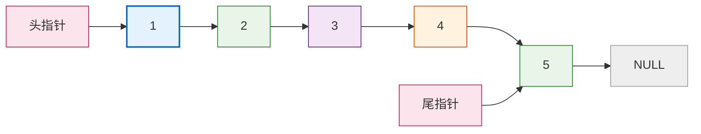
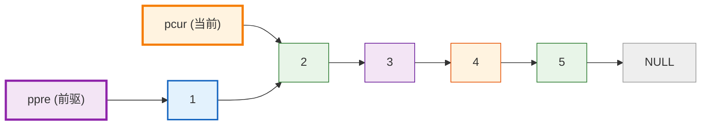
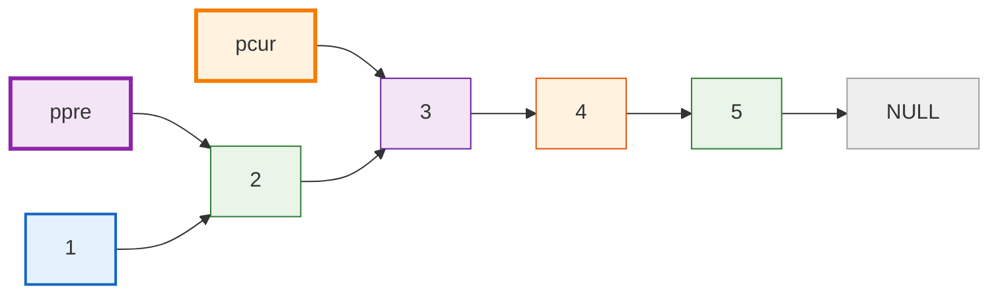
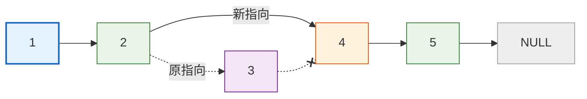
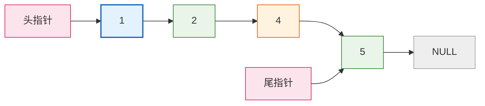

---
tags:
  - 408_计算机学科专业基础
创建时间: 2026-03-10T21:00:00
考试科目: "408"
课程: C语言
阶段: 零基础
老师: 泥鳅
开始日期: 2026-03-10
结束日期: 2026-03-10
---
# C语言单链表删除（双指针法）实现详解

## 1. 链表的基本概念

>[!principle] **链表的基本概念**
>链表是一种**动态数据结构**，由一系列节点（node）组成。每个节点包含：
>- **数据域**：存储数据（如整数、字符等）
>- **指针域**：存储下一个节点的地址（从而将节点串联起来）
>
>链表的头指针指向第一个节点，尾指针指向最后一个节点。最后一个节点的指针域为 `NULL`，表示链表结束。
>
>**删除操作**是链表的基本操作之一，需要根据数据值找到对应节点并将其从链表中移除，同时正确释放内存并维护头尾指针。本文利用**双指针法**实现在带头尾指针的单链表中删除指定节点。

---
## 2. 代码整体结构

```c
#define _CRT_SECURE_NO_WARNINGS
#include<stdio.h>
#include<stdlib.h>
#include<string.h>

typedef struct node_s{
	// 数据域
	int data;
	// 指针域
	struct node_s *next; // 指针变量本身所占的内存大小为4个字节，是一个固定值
	// struct node_s next // 这样写是不行的
}node_t;

typedef struct link_list_s{
	node_t *phead;
	node_t *ptail;
}link_list_t;

// 头插法
void head_insert(link_list_t *plist,int data){
	// 1.给新节点申请内存 & 初始化
	node_t *pnew_node = (node_t*)malloc(sizeof(node_t));
	pnew_node -> next = NULL; // 新节点的指针域一开始总是NULL
	pnew_node -> data = data;
	
	// 2.分类讨论
	if(plist -> phead == NULL){
		plist -> phead = pnew_node;
		plist -> ptail = pnew_node;
	}
	else{
		pnew_node -> next = plist -> phead;
		plist -> phead = pnew_node;
	}
}

// 尾插法
void tail_insert(link_list_t *plist,int data){
	// 1.给新节点申请内存 & 初始化
	node_t *pnew_node = (node_t*)malloc(sizeof(node_t));
	pnew_node -> next = NULL; // 新节点的指针域一开始总是NULL
	pnew_node -> data = data;
	
	// 2.分类讨论
	if(plist -> phead == NULL){
		plist -> phead = pnew_node;
		plist -> ptail = pnew_node;
	}
	else{
		plist -> ptail -> next = pnew_node;
		plist -> ptail = pnew_node;
	}
}

// 有序插入
void sort_insert(link_list_t *plist,int data){
	// 1.给新节点申请内存 & 初始化
	node_t *pnew_node = (node_t*)malloc(sizeof(node_t));
	pnew_node -> next = NULL; // 新节点的指针域一开始总是NULL
	pnew_node -> data = data;
	
	// 2.分类讨论
	if(plist -> phead == NULL){ // 没有节点的情况下不能使用双指针法
		plist -> phead = pnew_node;
		plist -> ptail = pnew_node;
	}
	else if(plist -> phead -> data > data){
		// 插入的节点比第一个节点还要小，退化成头插法
		pnew_node -> next = plist -> phead;
		plist -> phead = pnew_node;
	}
	else{ // 插在中间或插在末尾 —— 使用双指针法寻找待插入的位置
		node_t *ppre = plist -> phead; // 慢指针
		node_t *pcur = ppre -> next; 
		while(pcur != NULL){
			if(pcur -> data > data){
				ppre -> next = pnew_node;
				pnew_node -> next = pcur;
				break;
			}
			ppre = ppre -> next;
			pcur = pcur -> next;
		}
		if(pcur == NULL){ // 尾插法
			plist -> ptail -> next = pnew_node;
			plist -> ptail = pnew_node;
		}
	}
}

// 删除
void list_delete(link_list_t *plist,int data){
	node_t *pcur = plist -> phead; // pcur用来记录待删除节点的地址
	if(plist -> phead == NULL){
		printf("Error:List is empty!\n");
		return;
	}
	else if(pcur -> data == data){
		plist -> phead = pcur -> next;
		if(plist -> phead == NULL){ // 删除目标节点后，链表为空
			plist -> ptail = NULL;
		}
	}
	else{ // 某一个节点的指针域会发生改变 —— 使用双指针法
		node_t *ppre = plist -> phead;
		pcur = ppre -> next;
		while(pcur != NULL){
			if(pcur -> data == data){
				ppre -> next = pcur -> next;
				break;
			}
			ppre = ppre -> next;
			pcur = pcur -> next;
		}
		if(pcur == NULL){ // 目标节点不存在
			printf("Error:No such node!\n");
			return;
		}
		if(pcur == plist -> ptail){
			plist -> ptail = ppre;
		}
	}
	
	free(pcur);
	pcur = NULL;
}

// 打印链表
void print_list(link_list_t *plist){
	node_t *pcur = plist -> phead;
	while(pcur != NULL){
		printf("%d",pcur -> data);
		if(pcur -> next != NULL){
			printf(" -> ");
		}
		pcur = pcur -> next; // 每次都需要将游标后移
	}
	printf("\n");
}

int main(){
	link_list_t list;
	// 初始化
	list.phead = NULL;
	list.ptail = NULL;
	
	//head_insert(&list,1);
	//print_list(&list);
	//head_insert(&list,3);
	//print_list(&list);
	//head_insert(&list,5);
	//print_list(&list);
	
	//tail_insert(&list,1);
	//print_list(&list);
	//tail_insert(&list,3);
	//print_list(&list);
	//tail_insert(&list,5);
	//print_list(&list);
	
	sort_insert(&list,2);
	print_list(&list);
	sort_insert(&list,4);
	print_list(&list);
	sort_insert(&list,6);
	print_list(&list);
	sort_insert(&list,1);
	print_list(&list);
	sort_insert(&list,3);
	print_list(&list);
	sort_insert(&list,5);
	print_list(&list);
	
	list_delete(&list,7);
	print_list(&list);
	list_delete(&list,2);
	print_list(&list);
	list_delete(&list,4);
	print_list(&list);
	list_delete(&list,6);
	print_list(&list);
	list_delete(&list,1);
	print_list(&list);
	list_delete(&list,3);
	print_list(&list);
	list_delete(&list,5);
	print_list(&list);
	list_delete(&list,5);
	print_list(&list);
	
	return 0;
}
```

>[!method] **代码结构说明**
>- 定义了节点结构体 `node_t` 和链表管理结构体 `link_list_t`。
>- 实现了有序插入函数 `sort_insert` 用于构建测试链表。
>- 实现了删除函数 `list_delete` 和打印函数 `print_list`。
>- `main` 函数演示了删除各种位置节点的情况，并输出结果。

---
## 3. 结构体定义详解
### 3.1 节点结构体 `node_t`

```c
typedef struct node_s {
    int data;           // 数据域
    struct node_s *next; // 指针域，指向下一个节点
} node_t;
```

>[!principle] **节点结构体**
>- `data` 存放整型数据。
>- `next` 是一个指向相同类型节点（`struct node_s`）的指针，用来连接下一个节点。
>- `typedef` 给结构体起别名 `node_t`，后续可以直接用 `node_t` 定义变量，无需写 `struct node_s`。

### 3.2 链表管理结构体 `link_list_t`

```c
typedef struct link_list_s {
    node_t *phead;  // 指向链表第一个节点
    node_t *ptail;  // 指向链表最后一个节点
} link_list_t;
```

>[!principle] **链表管理结构体**
>- 这个结构体用来管理整个链表，只包含两个指针。
>- 同时持有头指针和尾指针，可以在删除操作中正确更新头尾指针，保持链表完整性。

---
## 4. 删除函数 `list_delete` 详解

```c
void list_delete(link_list_t *plist, int data) {
    node_t *pcur = plist->phead;  // pcur用于记录待删除节点的地址

    // 情况1：空链表
    if (plist->phead == NULL) {
        printf("Error:List is empty!\n");
        return;
    }
    // 情况2：删除头节点
    else if (pcur->data == data) {
        plist->phead = pcur->next;
        if (plist->phead == NULL) {  // 删除后链表为空
            plist->ptail = NULL;
        }
        // 注意：如果原链表只有一个节点，且被删除，头尾都置NULL
    }
    // 情况3：删除中间或尾部节点 —— 使用双指针法
    else {
        node_t *ppre = plist->phead;  // 慢指针（前驱）
        pcur = ppre->next;            // 快指针（当前）

        while (pcur != NULL) {
            if (pcur->data == data) {  // 找到目标节点
                ppre->next = pcur->next;  // 前驱的next指向目标的后继
                break;
            }
            // 同步移动指针
            ppre = ppre->next;
            pcur = pcur->next;
        }

        // 遍历结束未找到目标
        if (pcur == NULL) {
            printf("Error:No such node!\n");
            return;
        }

        // 如果删除的是尾节点，更新尾指针
        if (pcur == plist->ptail) {
            plist->ptail = ppre;
        }
    }

    // 释放目标节点内存
    free(pcur);
    pcur = NULL;
}
```

### 4.1 函数整体逻辑

>[!method] **删除操作步骤**
>1. **检查空链表**：若链表为空，直接报错返回。
>2. **处理头节点**：若头节点即为目标，则更新头指针指向下一个节点。若删除后链表变为空，还需将尾指针置 `NULL`。
>3. **处理中间或尾部节点**：使用双指针法遍历链表，找到目标节点的前驱 `ppre` 和当前节点 `pcur`。将前驱的 `next` 指向当前节点的 `next`，断开链接。
>4. **检查并更新尾指针**：如果删除的是尾节点（`pcur == plist->ptail`），则尾指针应更新为前驱节点 `ppre`。
>5. **释放内存**：调用 `free` 释放被删除节点的内存，并将指针置 `NULL` 避免野指针。

### 4.2 双指针法定位前驱

>[!method] **双指针法在删除中的应用**
>删除操作的核心是找到待删除节点的前驱节点，因为需要修改前驱的 `next` 指针。双指针法维护两个指针：
>- `ppre`（前驱）：始终指向当前节点的前一个节点。
>- `pcur`（当前）：指向当前遍历的节点，用于判断是否为目标。
>
>初始化时，`ppre` 指向头节点，`pcur` 指向第二个节点。遍历过程中，如果 `pcur->data` 不等于目标，则同步移动：`ppre = pcur; pcur = pcur->next;`。当找到目标时，`ppre` 恰好是其前驱，可以直接修改指针。

>[!caution]
>**使用双指针法的前提：** 链表至少有一个节点（已处理空链表），且目标不是头节点（已单独处理）。因为头节点没有前驱，无法用双指针法处理。

### 4.3 示例示意图

以下展示在链表 `1 -> 2 -> 3 -> 4 -> 5` 中删除节点 `3` 的过程（Mermaid 流程图）。

#### 删除前链表状态


#### 双指针定位过程（初始状态）


#### 第一次移动后（`2 != 3`）


#### 找到目标，修改指针


#### 删除后链表状态


---
## 5. main 函数执行流程

```c
int main() {
    link_list_t list;
    list.phead = NULL;
    list.ptail = NULL;

    // 构建有序链表
    sort_insert(&list, 2); sort_insert(&list, 4); sort_insert(&list, 6);
    sort_insert(&list, 1); sort_insert(&list, 3); sort_insert(&list, 5);
    print_list(&list);  // 输出：1 -> 2 -> 3 -> 4 -> 5 -> 6

    // 执行删除测试
    list_delete(&list, 7);  // 输出错误，链表不变
    print_list(&list);      // 1 -> 2 -> 3 -> 4 -> 5 -> 6

    list_delete(&list, 2);  // 删除中间节点2
    print_list(&list);      // 1 -> 3 -> 4 -> 5 -> 6

    list_delete(&list, 4);  // 删除中间节点4
    print_list(&list);      // 1 -> 3 -> 5 -> 6

    list_delete(&list, 6);  // 删除尾节点6，尾指针更新为5
    print_list(&list);      // 1 -> 3 -> 5

    list_delete(&list, 1);  // 删除头节点1，头指针更新为3
    print_list(&list);      // 3 -> 5

    list_delete(&list, 3);  // 删除头节点3（此时链表只剩5）
    print_list(&list);      // 5

    list_delete(&list, 5);  // 删除最后一个节点，头尾均置NULL
    print_list(&list);      // 空链表，无输出

    list_delete(&list, 5);  // 空链表删除，输出错误

    return 0;
}
```

>[!method] **main 函数执行说明**
>- 先通过有序插入构建升序链表 `1->2->3->4->5->6`。
>- 依次删除不同位置的节点，验证删除逻辑：
>  - 删除不存在的节点（`7`）：报错且链表不变。
>  - 删除中间节点（`2`、`4`）：正确断开链接。
>  - 删除尾节点（`6`）：尾指针更新为前驱 `5`。
>  - 删除头节点（`1`、`3`）：头指针更新为下一个节点。
>  - 删除最后一个节点（`5`）：头尾均置 `NULL`。
>  - 空链表再次删除：报错。
>- 每次删除后打印链表，观察结果是否符合预期。

---
## 6. 常见困惑点解答

>[!question] **Q1: 为什么删除头节点时不能使用双指针法？**
>双指针法需要前驱节点 `ppre`，但头节点没有前驱，因此必须单独处理。删除头节点只需更新头指针即可。

>[!question] **Q2: 删除后如何正确更新尾指针？**
>只有当删除的节点是尾节点时，才需要更新尾指针。判断条件为 `pcur == plist->ptail`，更新为前驱 `ppre`。如果删除后链表为空，还需将头尾都置 `NULL`。

>[!question] **Q3: 为什么在 `else` 分支中初始化 `pcur = ppre->next` 而不是直接 `pcur = plist->phead`？**
>因为头节点已经单独处理，进入 `else` 分支意味着目标不是头节点，所以可以从第二个节点开始遍历，同时 `ppre` 已经指向头节点，作为前驱。

>[!question] **Q4: 双指针法在删除时如何保证找到目标节点的前驱？**
>初始化时 `ppre` 指向头节点，`pcur` 指向第二个节点。每次比较 `pcur->data` 是否等于目标，若不等于则同步移动：`ppre = pcur; pcur = pcur->next;`。这样当 `pcur` 指向目标时，`ppre` 正好指向其前驱。

>[!question] **Q5: 如果链表只有一个节点且不是目标，程序会怎么处理？**
>当链表只有一个节点且不是目标时，头节点已单独处理（因为目标不是头节点），进入 `else` 分支后，`pcur = ppre->next` 为 `NULL`，循环不执行，直接判断 `pcur == NULL` 并输出错误信息。这符合逻辑，因为不存在该节点。

>[!question] **Q6: 释放节点内存后为什么还要将指针置 `NULL`？**
>将 `pcur` 置 `NULL` 是为了防止后续误用该指针（野指针）。虽然局部变量 `pcur` 在函数返回后即失效，但养成良好习惯有助于避免错误。

---
## 7. 关于 `node_t*` 类型

>[!principle] **`node_t*` 指针类型**
>`node_t*` 是一个**指针类型**，表示“指向 `node_t` 类型数据的指针”。
>
>- 它存储的是一个地址，该地址指向的内存中存放着一个 `node_t` 结构体。
>- 通过指针可以间接访问和修改节点：例如 `pcur->data` 就是通过指针找到节点，然后访问其 `data` 成员。
>- 指针本身的大小取决于系统（32位通常4字节，64位通常8字节），它只存储地址，不存储节点数据。

---
## 8. 关于 `(node_t*)malloc(...)` 强制转换

```c
node_t *pnew_node = (node_t*)malloc(sizeof(node_t));
```

>[!question] **Q1：为什么可以省略强制转换？**
>C语言中 `malloc` 返回 `void*`，而 `void*` 可以**隐式转换**为任何其他指针类型。因此以下写法完全合法：
>```c
>node_t *pnew_node = malloc(sizeof(node_t));
>```

>[!question] **Q2：为什么很多人还是加上强制转换？**
>1. **兼容C++**：C++不允许 `void*` 隐式转换，如果代码可能被用于C++项目，加上转换可避免编译错误。
>2. **可读性**：显式转换可以强调“我正在为 `node_t` 分配内存”，让意图更清晰。
>3. **历史原因**：在远古C编译器中 `malloc` 返回 `char*`，需要强制转换，这种习惯影响至今。
>
>**总结：** 在纯C环境下可省略，加上也无妨，属于编程风格选择。

---
## 9. 总结

>[!ideology] **本文总结**
>本文详细解析了如何在带头尾指针的单链表中使用**双指针法**实现删除操作，重点讲解了：
>- 链表节点的定义与内存结构
>- 删除操作的四种情况：空链表、删除头节点、删除中间节点、删除尾节点
>- 双指针法在删除中的原理与步骤
>- 如何正确更新头尾指针
>- 通过Mermaid示意图直观展示删除过程
>- `main` 函数测试用例及输出分析
>- 常见疑问解答
>
>双指针法是链表操作的重要技巧，在删除、插入等需要前驱节点的场景中非常实用。掌握它能够帮助你灵活处理各种链表问题，同时注意内存管理以避免泄漏。
>
>如果在阅读过程中仍有疑问，欢迎继续交流！