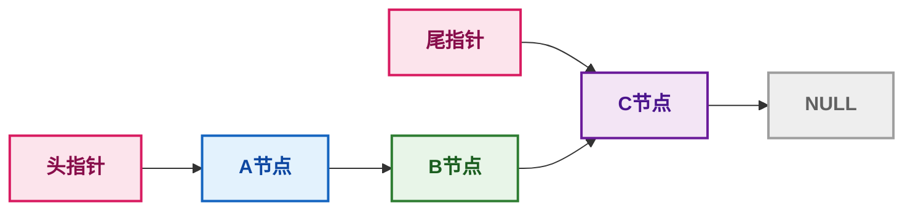
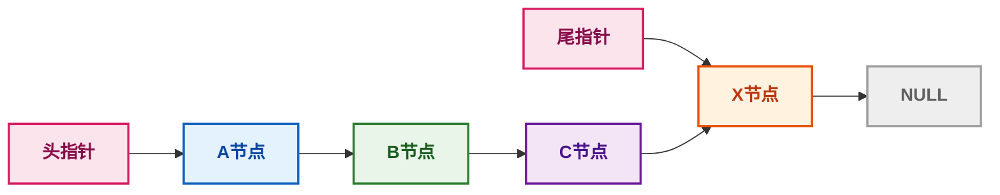

---
tags:
  - 408_计算机学科专业基础
创建时间: 2026-03-10T14:00:00
考试科目: "408"
课程: C语言
阶段: 零基础
老师: 泥鳅
开始日期: 2026-03-10
结束日期: 2026-03-10
---
# C语言单链表尾插法实现详解( 带头尾指针 )

## 1. 链表的基本概念

>[!principle] **链表的基本概念**
>链表是一种**动态数据结构**，由一系列节点（node）组成。每个节点包含：
>- **数据域**：存储数据（如整数、字符等）
>- **指针域**：存储下一个节点的地址（从而将节点串联起来）
>
>链表的头指针指向第一个节点，尾指针指向最后一个节点。最后一个节点的指针域为 `NULL`，表示链表结束。
>
>本文讲解的代码实现了一个**带头尾指针的单链表**，并实现了**尾插法**插入节点。

---

## 2. 代码整体结构

```c
#define _CRT_SECURE_NO_WARNINGS
#include<stdio.h>
#include<stdlib.h>
#include<string.h>

typedef struct node_s{
	// 数据域
	int data;
	// 指针域
	struct node_s *next; // 指针变量本身所占的内存大小为4个字节，是一个固定值
	// struct node_s next // 这样写是不行的
}node_t;

typedef struct link_list_s{
	node_t *phead;
	node_t *ptail;
}link_list_t;

// 头插法
void head_insert(link_list_t *plist,int data){
	// 1.给新节点申请内存 & 初始化
	node_t *pnew_node = (node_t*)malloc(sizeof(node_t));
	pnew_node -> next = NULL; // 新节点的指针域一开始总是NULL
	pnew_node -> data = data;
	
	// 2.分类讨论
	if(plist -> phead == NULL){
		plist -> phead = pnew_node;
		plist -> ptail = pnew_node;
	}
	else{
		pnew_node -> next = plist -> phead;
		plist -> phead = pnew_node;
	}
}

// 尾插法
void tail_insert(link_list_t *plist,int data){
	// 1.给新节点申请内存 & 初始化
	node_t *pnew_node = (node_t*)malloc(sizeof(node_t));
	pnew_node -> next = NULL; // 新节点的指针域一开始总是NULL
	pnew_node -> data = data;
	
	// 2.分类讨论
	if(plist -> phead == NULL){
		plist -> phead = pnew_node;
		plist -> ptail = pnew_node;
	}
	else{
		plist -> ptail -> next = pnew_node;
		plist -> ptail = pnew_node;
	}
}

// 打印链表
void print_list(link_list_t *plist){
	node_t *pcur = plist -> phead;
	while(pcur != NULL){
		printf("%d",pcur -> data);
		if(pcur -> next != NULL){
			printf(" -> ");
		}
		pcur = pcur -> next; // 每次都需要将游标后移
	}
	printf("\n");
}

int main(){
	link_list_t list;
	// 初始化
	list.phead = NULL;
	list.ptail = NULL;
	
	//head_insert(&list,1);
	//print_list(&list);
	//head_insert(&list,3);
	//print_list(&list);
	//head_insert(&list,5);
	//print_list(&list);
	
	tail_insert(&list,1);
	print_list(&list);
	tail_insert(&list,3);
	print_list(&list);
	tail_insert(&list,5);
	print_list(&list);
	
	return 0;
}
```

>[!method] **代码结构说明**
>- 定义了节点结构体 `node_t` 和链表管理结构体 `link_list_t`。
>- 实现了尾插法函数 `tail_insert` 和打印函数 `print_list`。
>- `main` 函数创建链表并依次尾插三个数据，每次插入后打印链表。

---

## 3. 结构体定义详解

### 3.1 节点结构体 `node_t`

```c
typedef struct node_s {
    int data;           // 数据域
    struct node_s *next; // 指针域，指向下一个节点
} node_t;
```

>[!principle] **节点结构体**
>- `data` 存放整型数据。
>- `next` 是一个指向相同类型节点（`struct node_s`）的指针，用来连接下一个节点。
>- `typedef` 给结构体起别名 `node_t`，后续可以直接用 `node_t` 定义变量，无需写 `struct node_s`。

### 3.2 链表管理结构体 `link_list_t`

```c
typedef struct link_list_s {
    node_t *phead;  // 指向链表第一个节点
    node_t *ptail;  // 指向链表最后一个节点
} link_list_t;
```

>[!principle] **链表管理结构体**
>- 这个结构体用来管理整个链表，只包含两个指针。
>- 同时持有头指针和尾指针，可以高效地在头部或尾部插入节点。本文利用尾指针实现了**O(1)时间**的尾插法。

---

## 4. 尾插法函数 `tail_insert` 详解

```c
void tail_insert(link_list_t *plist, int data) {
    // 1. 创建新节点
    node_t *pnew_node = (node_t*)malloc(sizeof(node_t));
    pnew_node->next = NULL;  // 新节点将成为新的尾节点，指针域必须为NULL
    pnew_node->data = data;  // 赋值数据

    // 2. 分类讨论链表是否为空
    if (plist->phead == NULL) {
        // 空链表：新节点既是头也是尾
        plist->phead = pnew_node;
        plist->ptail = pnew_node;
    } else {
        // 非空链表：新节点插入尾部
        plist->ptail->next = pnew_node;  // 当前尾节点的next指向新节点
        plist->ptail = pnew_node;        // 更新尾指针指向新节点
    }
}
```

### 4.1 创建新节点

>[!method] **创建新节点步骤**
>- `malloc(sizeof(node_t))` 在堆上分配一块大小为 `node_t` 的内存，返回 `void*` 类型的指针。
>- 将返回值强制转换为 `node_t*`（在C中可省略，但加上可提高可读性并兼容C++），赋值给指针变量 `pnew_node`。
>- 初始化新节点的 `data` 和 `next`。将 `next` 置 `NULL` 至关重要，因为新节点将成为新的尾节点，它的指针域必须为 `NULL`。

### 4.2 插入逻辑（尾插法）

>[!method] **尾插法逻辑**
>尾插法：每次新节点都成为新的尾节点，保持插入顺序与链表顺序一致。
>
>- **情况1：链表为空（`phead == NULL`）**  
>  新节点既是第一个节点，也是最后一个节点，所以让 `phead` 和 `ptail` 都指向它。
>
>- **情况2：链表非空**  
>  1. `plist->ptail->next = pnew_node;` —— 当前尾节点的 `next` 指针指向新节点，将新节点链接到链表末尾。
>  2. `plist->ptail = pnew_node;` —— 更新尾指针，使其指向新节点。
>  3. 头指针不变（头部没有变化）。

### 4.3 示例示意图

>[!derivation] **插入前链表状态**
>原链表：头指针 → A节点 → B节点 → C节点 → NULL  
>尾指针 → C节点



>[!derivation] **插入后链表状态**
>新链表：头指针 → A节点 → B节点 → C节点 → X节点 → NULL  
>尾指针 → X节点



---

## 5. main 函数执行流程

```c
int main() {
    link_list_t list;
    list.phead = NULL;   // 初始化为空链表
    list.ptail = NULL;

    tail_insert(&list, 1);
    print_list(&list);   // 输出：1
    tail_insert(&list, 3);
    print_list(&list);   // 输出：1 -> 3
    tail_insert(&list, 5);
    print_list(&list);   // 输出：1 -> 3 -> 5
    return 0;
}
```

>[!method] **main 函数执行步骤**
>1. 定义 `list` 变量，并初始化头尾指针为 `NULL`。
>2. 调用 `tail_insert(&list, 1)`：链表空，节点1成为头尾。打印：`1`
>3. 调用 `tail_insert(&list, 3)`：链表非空，节点3链接到节点1后，尾指针指向节点3。打印：`1 -> 3`
>4. 调用 `tail_insert(&list, 5)`：链表非空，节点5链接到节点3后，尾指针指向节点5。打印：`1 -> 3 -> 5`
>5. 最终链表顺序（从头到尾）：1 → 3 → 5 → NULL。
>
>注意：传参时传递的是 `&list`（链表管理结构体的地址），因为函数内部需要修改 `phead` 和 `ptail` 的值，必须传地址才能影响到外部的 `list`。

---

## 6. 常见困惑点解答

>[!question] **Q1: 为什么用 `->` 而不是点 `.`？**
>`->` 是**箭头运算符**，用于通过指针访问结构体成员。  
>`plist->phead` 等价于 `(*plist).phead`，因为 `plist` 是一个指针。

>[!question] **Q2: `malloc` 分配的内存什么时候释放？**
>代码中没有释放，会导致内存泄漏。实际程序中应在不再使用链表时遍历每个节点并调用 `free` 释放。教学示例中常省略，但必须知道需要释放。

>[!question] **Q3: 为什么新节点要先设 `next = NULL`？**
>确保新节点的指针域不会成为野指针。在尾插法中，新节点将作为尾节点，它的 `next` 必须为 `NULL`，以表示链表结束。即使不是尾节点的情况（如头插法），初始化为 `NULL` 也是良好习惯。

>[!question] **Q4: 头插法和尾插法的区别？**
>- **头插法**：新节点成为新头，插入顺序与最终链表顺序相反。  
>- **尾插法**：新节点成为新尾，插入顺序与最终链表顺序相同。若利用尾指针，可在 O(1) 时间完成尾插。

>[!question] **Q5: 为什么需要 `typedef`？**
>简化类型书写，提高代码可读性。例如用 `node_t` 代替 `struct node_s`。

>[!question] **Q6: `#define _CRT_SECURE_NO_WARNINGS` 的作用？**
>这是 Visual Studio 特有的宏，用于禁用某些不安全函数的安全警告（如 `scanf`）。本例中并未使用不安全函数，可能是从示例复制而来，可忽略。

>[!question] **Q7: 为什么尾插法需要维护尾指针？**
>如果没有尾指针，每次尾插都需要从头遍历链表找到最后一个节点，时间复杂度为 O(n)。维护尾指针可以直接在 O(1) 时间内完成插入，极大提高效率。

---

## 7. 关于 `node_t*` 类型

>[!principle] **`node_t*` 指针类型**
>`node_t*` 是一个**指针类型**，表示“指向 `node_t` 类型数据的指针”。
>
>- 它存储的是一个地址，该地址指向的内存中存放着一个 `node_t` 结构体。
>- 通过指针可以间接访问和修改节点：例如 `pnew_node->data = data;` 就是通过指针找到节点，然后给其 `data` 成员赋值。
>- 指针本身的大小取决于系统（32位通常4字节，64位通常8字节），它只存储地址，不存储节点数据。

---

## 8. 关于 `(node_t*)malloc(...)` 强制转换

```c
node_t *pnew_node = (node_t*)malloc(sizeof(node_t));
```

>[!question] **Q1：为什么可以省略强制转换？**
>C语言中 `malloc` 返回 `void*`，而 `void*` 可以**隐式转换**为任何其他指针类型。因此以下写法完全合法：
>```c
>node_t *pnew_node = malloc(sizeof(node_t));
>```

>[!question] **Q2：为什么很多人还是加上强制转换？**
>1. **兼容C++**：C++不允许 `void*` 隐式转换，如果代码可能被用于C++项目，加上转换可避免编译错误。
>2. **可读性**：显式转换可以强调“我正在为 `node_t` 分配内存”，让意图更清晰。
>3. **历史原因**：在远古C编译器中 `malloc` 返回 `char*`，需要强制转换，这种习惯影响至今。
>
>**总结：** 在纯C环境下可省略，加上也无妨，属于编程风格选择。

---

## 9. 总结

>[!ideology] **本文总结**
>本文详细解析了一个带头尾指针的单链表实现尾插法，重点讲解了：
>- 链表节点的定义与内存结构
>- 链表管理结构体的作用
>- 尾插法的具体实现步骤与指针操作
>- `main` 函数中的调用流程及打印输出
>- 常见疑惑（`->`、内存释放、`typedef`、强制转换、尾指针的作用等）
>
>通过尾插法，我们可以按照插入顺序构建链表，且利用尾指针实现了高效的尾部插入。结合之前的头插法，你可以根据需求选择合适的插入方式。
>
>如果在阅读过程中仍有疑问，欢迎继续交流！