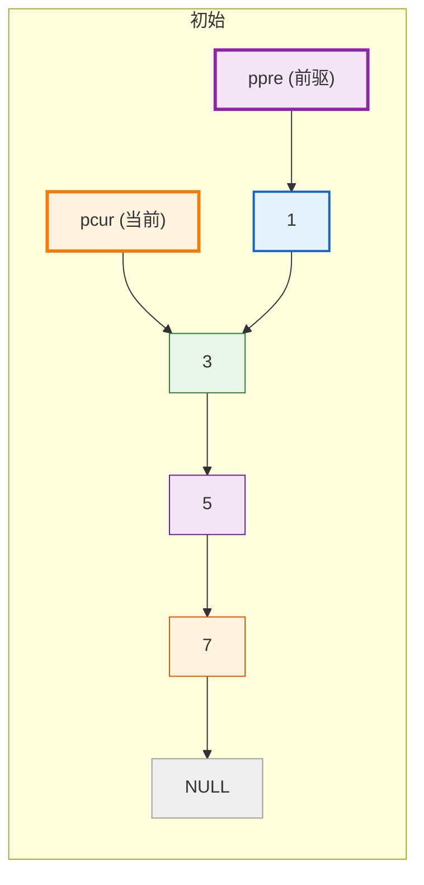
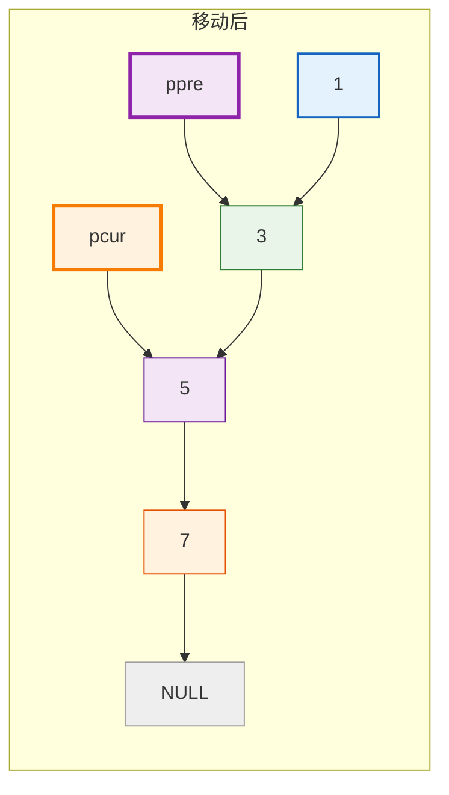
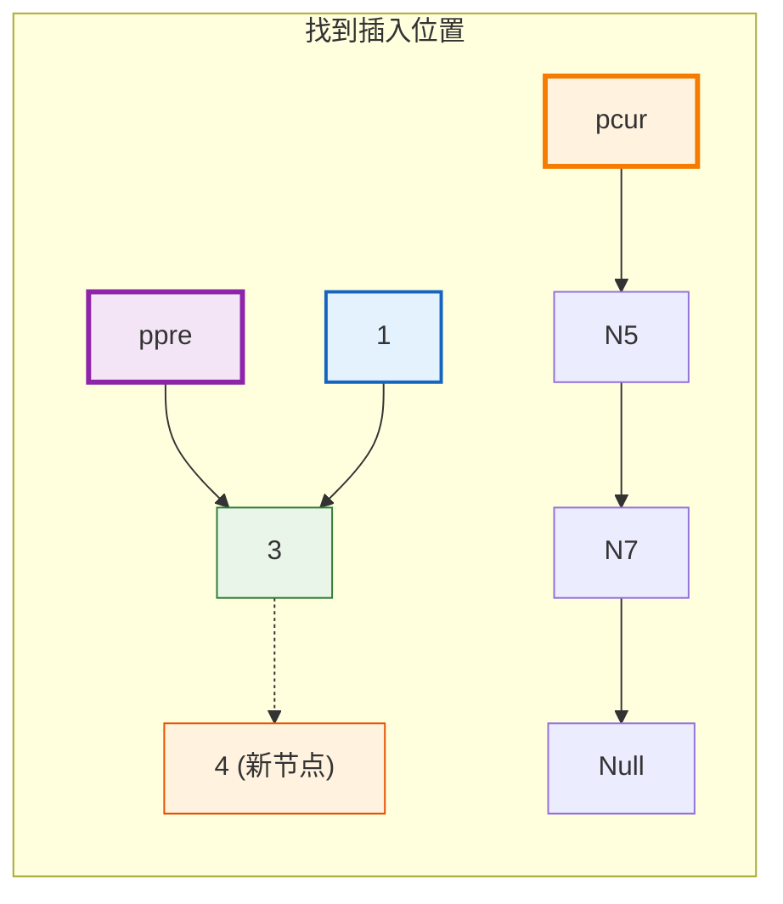

---
tags:
  - 408_计算机学科专业基础
创建时间: 2026-03-10T19:00:00
考试科目: "408"
课程: C语言
阶段: 零基础
老师: 泥鳅
开始日期: 2026-03-10
结束日期: 2026-03-10
---
# C语言单链表有序插入( 双指针法 )实现详解
## 1. 链表的基本概念

>[!principle] **链表的基本概念**
>链表是一种**动态数据结构**，由一系列节点（node）组成。每个节点包含：
>- **数据域**：存储数据（如整数、字符等）
>- **指针域**：存储下一个节点的地址（从而将节点串联起来）
>
>链表的头指针指向第一个节点，尾指针指向最后一个节点。最后一个节点的指针域为 `NULL`，表示链表结束。
>
>**有序插入**是指在一个**已排序（通常升序）**的链表中插入一个新节点，使得插入后链表依然保持有序。本文利用**双指针法**实现这一操作，并维护头尾指针。

---
## 2. 代码整体结构

```c
#define _CRT_SECURE_NO_WARNINGS
#include<stdio.h>
#include<stdlib.h>
#include<string.h>

typedef struct node_s{
	// 数据域
	int data;
	// 指针域
	struct node_s *next; // 指针变量本身所占的内存大小为4个字节，是一个固定值
	// struct node_s next // 这样写是不行的
}node_t;

typedef struct link_list_s{
	node_t *phead;
	node_t *ptail;
}link_list_t;

// 头插法
void head_insert(link_list_t *plist,int data){
	// 1.给新节点申请内存 & 初始化
	node_t *pnew_node = (node_t*)malloc(sizeof(node_t));
	pnew_node -> next = NULL; // 新节点的指针域一开始总是NULL
	pnew_node -> data = data;
	
	// 2.分类讨论
	if(plist -> phead == NULL){
		plist -> phead = pnew_node;
		plist -> ptail = pnew_node;
	}
	else{
		pnew_node -> next = plist -> phead;
		plist -> phead = pnew_node;
	}
}

// 尾插法
void tail_insert(link_list_t *plist,int data){
	// 1.给新节点申请内存 & 初始化
	node_t *pnew_node = (node_t*)malloc(sizeof(node_t));
	pnew_node -> next = NULL; // 新节点的指针域一开始总是NULL
	pnew_node -> data = data;
	
	// 2.分类讨论
	if(plist -> phead == NULL){
		plist -> phead = pnew_node;
		plist -> ptail = pnew_node;
	}
	else{
		plist -> ptail -> next = pnew_node;
		plist -> ptail = pnew_node;
	}
}

// 有序插入
void sort_insert(link_list_t *plist,int data){
	// 1.给新节点申请内存 & 初始化
	node_t *pnew_node = (node_t*)malloc(sizeof(node_t));
	pnew_node -> next = NULL; // 新节点的指针域一开始总是NULL
	pnew_node -> data = data;
	
	// 2.分类讨论
	if(plist -> phead == NULL){ // 没有节点的情况下不能使用双指针法
		plist -> phead = pnew_node;
		plist -> ptail = pnew_node;
	}
	else if(plist -> phead -> data > data){
		// 插入的节点比第一个节点还要小，退化成头插法
		pnew_node -> next = plist -> phead;
		plist -> phead = pnew_node;
	}
	else{ // 插在中间或插在末尾 —— 使用双指针法寻找待插入的位置
		node_t *ppre = plist -> phead; // 慢指针
		node_t *pcur = ppre -> next; 
		while(pcur != NULL){
			if(pcur -> data > data){
				ppre -> next = pnew_node;
				pnew_node -> next = pcur;
				break;
			}
			ppre = ppre -> next;
			pcur = pcur -> next;
		}
		if(pcur == NULL){ // 尾插法
			plist -> ptail -> next = pnew_node;
			plist -> ptail = pnew_node;
		}
	}
}

// 打印链表
void print_list(link_list_t *plist){
	node_t *pcur = plist -> phead;
	while(pcur != NULL){
		printf("%d",pcur -> data);
		if(pcur -> next != NULL){
			printf(" -> ");
		}
		pcur = pcur -> next; // 每次都需要将游标后移
	}
	printf("\n");
}

int main(){
	link_list_t list;
	// 初始化
	list.phead = NULL;
	list.ptail = NULL;
	
	//head_insert(&list,1);
	//print_list(&list);
	//head_insert(&list,3);
	//print_list(&list);
	//head_insert(&list,5);
	//print_list(&list);
	
	//tail_insert(&list,1);
	//print_list(&list);
	//tail_insert(&list,3);
	//print_list(&list);
	//tail_insert(&list,5);
	//print_list(&list);
	
	sort_insert(&list,2);
	print_list(&list);
	sort_insert(&list,4);
	print_list(&list);
	sort_insert(&list,6);
	print_list(&list);
	sort_insert(&list,1);
	print_list(&list);
	sort_insert(&list,3);
	print_list(&list);
	sort_insert(&list,5);
	print_list(&list);
	
	return 0;
}
```

>[!method] **代码结构说明**
>- 定义了节点结构体 `node_t` 和链表管理结构体 `link_list_t`。
>- 实现了有序插入函数 `sort_insert`（升序）和打印函数 `print_list`。
>- `main` 函数演示了乱序插入，最终链表保持升序。

---
## 3. 结构体定义详解

### 3.1 节点结构体 `node_t`

```c
typedef struct node_s {
    int data;           // 数据域
    struct node_s *next; // 指针域，指向下一个节点
} node_t;
```

>[!principle] **节点结构体**
>- `data` 存放整型数据。
>- `next` 是一个指向相同类型节点（`struct node_s`）的指针，用来连接下一个节点。
>- `typedef` 给结构体起别名 `node_t`，后续可以直接用 `node_t` 定义变量，无需写 `struct node_s`。

### 3.2 链表管理结构体 `link_list_t`

```c
typedef struct link_list_s {
    node_t *phead;  // 指向链表第一个节点
    node_t *ptail;  // 指向链表最后一个节点
} link_list_t;
```

>[!principle] **链表管理结构体**
>- 这个结构体用来管理整个链表，只包含两个指针。
>- 同时持有头指针和尾指针，可以高效地在头部或尾部插入节点，并在有序插入时正确更新尾指针。

---
## 4. 有序插入函数 `sort_insert` 详解

```c
void sort_insert(link_list_t *plist, int data) {
    // 1. 创建新节点
    node_t *pnew_node = (node_t*)malloc(sizeof(node_t));
    pnew_node->next = NULL;
    pnew_node->data = data;

    // 2. 分类讨论
    if (plist->phead == NULL) {  // 空链表
        plist->phead = pnew_node;
        plist->ptail = pnew_node;
    }
    else if (plist->phead->data > data) {  // 新节点最小，头插
        pnew_node->next = plist->phead;
        plist->phead = pnew_node;
    }
    else {  // 中间或尾部插入 —— 使用双指针法
        node_t *ppre = plist->phead;      // 慢指针（前驱）
        node_t *pcur = ppre->next;        // 快指针（当前）

        while (pcur != NULL) {
            if (pcur->data > data) {      // 找到插入位置
                ppre->next = pnew_node;
                pnew_node->next = pcur;
                break;
            }
            // 继续向后移动
            ppre = ppre->next;
            pcur = pcur->next;
        }

        if (pcur == NULL) {               // 插入到尾部
            plist->ptail->next = pnew_node;
            plist->ptail = pnew_node;
        }
    }
}
```

### 4.1 创建新节点

>[!method] **创建新节点步骤**
>- `malloc(sizeof(node_t))` 在堆上分配一块大小为 `node_t` 的内存，返回 `void*` 类型的指针。
>- 将返回值强制转换为 `node_t*`，赋值给指针变量 `pnew_node`。
>- 初始化新节点的 `data` 和 `next`。将 `next` 置 `NULL` 是一个好习惯，避免野指针，也为后续插入做好准备。

### 4.2 插入逻辑（有序插入）

>[!method] **有序插入逻辑**
>升序插入：保证每次插入后链表仍然升序排列。
>
>- **情况1：链表为空**  
>  新节点成为唯一的节点，头尾指针都指向它。
>
>- **情况2：新节点小于头节点**  
>  新节点应成为新的头节点，退化为**头插法**，同时尾指针不变（因为尾部未受影响）。
>
>- **情况3：新节点应插入中间或尾部**  
>  使用**双指针法**定位插入位置：
>  - 初始化 `ppre` 指向头节点，`pcur` 指向第二个节点。
>  - 遍历链表，只要 `pcur` 不为空且 `pcur->data <= data`，就同步移动两个指针（`ppre = pcur; pcur = pcur->next`）。
>  - 当 `pcur` 为空或 `pcur->data > data` 时停止：
>    * 若 `pcur` 不为空，说明找到插入位置（在 `ppre` 和 `pcur` 之间），将新节点插入中间。
>    * 若 `pcur` 为空，说明新节点应插入尾部，此时 `ppre` 指向原尾节点，需更新尾指针。

>[!caution]
>**使用双指针法的前提：** 链表中至少要有一个节点（即已处理空链表情况）。因为双指针法需要前驱节点 `ppre` 和当前节点 `pcur` 同时存在，以便遍历和定位。当链表只有一个节点时，`pcur` 为 `NULL`，但仍可通过 `ppre` 进行尾部插入处理。

### 4.3 双指针定位过程示意图

以下用 Mermaid 展示在有序链表 `1 -> 3 -> 5 -> 7` 中插入 `4` 的双指针定位过程（颜色标记仅为示意，不代表实际代码）。

#### 初始状态


#### 第一次比较后（`3 < 4`，移动指针）


#### 第二次比较后（`5 >= 4`，停止移动）


#### 插入后


---
## 5. main 函数执行流程

```c
int main() {
    link_list_t list;
    list.phead = NULL;
    list.ptail = NULL;

    sort_insert(&list, 2);   // 空链表 -> [2]
    sort_insert(&list, 4);   // 插入尾部 -> [2,4]
    sort_insert(&list, 6);   // 插入尾部（相等元素保持原序，稳定）-> [2,4,6]
    sort_insert(&list, 1);   // 插入头部 -> [1,2,4,6]
    sort_insert(&list, 3);   // 插入中间 -> [1,2,3,4,6]
    sort_insert(&list, 5);   // 插入中间 -> [1,2,3,4,5,6]
    print_list(&list);       // 输出：1 -> 2 -> 3 -> 4 -> 5 -> 6
    return 0;
}
```

>[!method] **main 函数执行步骤**
>1. 定义 `list` 并初始化为空链表。
>2. 依次调用 `sort_insert` 插入数据，每次插入后链表保持升序。
>3. 最终打印链表验证结果。
>
>注意：插入相同数据时，代码中判断为 `>` 才插入前面，因此相同元素会依次追加到尾部，保持插入顺序的稳定性。

---
## 6. 常见困惑点解答

>[!question] **Q1: 为什么需要双指针法？**
>在有序链表中插入新节点，需要找到插入位置的前驱节点。单指针无法同时保留前驱信息，因此需要两个指针一前一后同步移动，这样在找到插入点时，前驱指针正好指向需要修改 `next` 的节点。

>[!question] **Q2: 双指针法的核心思想是什么？**
>维护两个指针 `ppre`（前驱）和 `pcur`（当前），初始时 `ppre` 指向头节点，`pcur` 指向第二个节点。遍历过程中始终保持 `ppre->next == pcur`。当 `pcur` 为空或 `pcur->data > data` 时，`ppre` 即为待插入位置的前驱，`pcur` 为待插入位置的后继（可能为 NULL）。

>[!question] **Q3: 如果链表只有一个节点，双指针法还能用吗？**
>可以。当链表只有一个节点时，进入 `else` 分支后，`pcur` 初始为 `NULL`，循环不执行，直接进入 `if(pcur == NULL)` 尾部插入分支。此时 `ppre` 就是唯一的节点，且 `pcur == NULL` 表示新节点应插入尾部，直接通过尾指针操作即可，无需移动指针。

>[!question] **Q4: 为什么在处理头插时没有更新尾指针？**
>头插法只在链表头部添加节点，尾部节点没有变化，因此尾指针无需修改。只有当插入位置在尾部时，才需要更新尾指针指向新节点。

>[!question] **Q5: 这段代码能否处理重复元素？**
>可以。判断条件 `pcur->data > data` 表示严格大于时才插入前面；否则（即 `pcur->data <= data`）继续向后移动。因此重复元素会依次插入到已有相同元素之后，保持了插入顺序的稳定性。

---
## 7. 关于 `node_t*` 类型

>[!principle] **`node_t*` 指针类型**
>`node_t*` 是一个**指针类型**，表示“指向 `node_t` 类型数据的指针”。
>
>- 它存储的是一个地址，该地址指向的内存中存放着一个 `node_t` 结构体。
>- 通过指针可以间接访问和修改节点：例如 `pnew_node->data = data;` 就是通过指针找到节点，然后给其 `data` 成员赋值。
>- 指针本身的大小取决于系统（32位通常4字节，64位通常8字节），它只存储地址，不存储节点数据。

---
## 8. 关于 `(node_t*)malloc(...)` 强制转换

```c
node_t *pnew_node = (node_t*)malloc(sizeof(node_t));
```

>[!question] **Q1：为什么可以省略强制转换？**
>C语言中 `malloc` 返回 `void*`，而 `void*` 可以**隐式转换**为任何其他指针类型。因此以下写法完全合法：
>```c
>node_t *pnew_node = malloc(sizeof(node_t));
>```

>[!question] **Q2：为什么很多人还是加上强制转换？**
>1. **兼容C++**：C++不允许 `void*` 隐式转换，如果代码可能被用于C++项目，加上转换可避免编译错误。
>2. **可读性**：显式转换可以强调“我正在为 `node_t` 分配内存”，让意图更清晰。
>3. **历史原因**：在远古C编译器中 `malloc` 返回 `char*`，需要强制转换，这种习惯影响至今。
>
>**总结：** 在纯C环境下可省略，加上也无妨，属于编程风格选择。

---
## 9. 总结

>[!ideology] **本文总结**
>本文详细解析了如何在一个带头尾指针的有序单链表中使用 **双指针法** 实现升序插入，重点讲解了：
>- 链表节点的定义与内存结构
>- 有序插入的四种情况：空链表、头插、中间插、尾插
>- 双指针法的原理与步骤
>- 通过示意图直观展示指针移动过程
>- `main` 函数调用及输出验证
>- 常见疑问解答
>
>双指针法是链表操作中非常实用的技巧，掌握它能够帮助你轻松应对各种需要在节点前插入或删除的场景。结合头尾指针，可以高效地维护有序链表。
>
>如果在阅读过程中仍有疑问，欢迎继续交流！