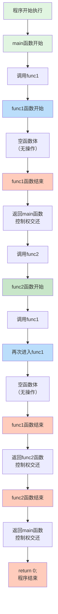
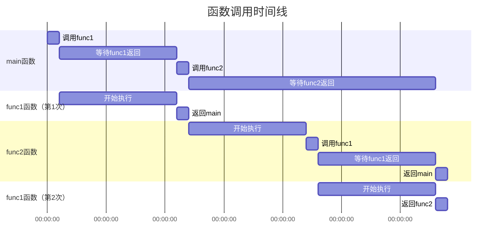

---
tags:
  - 408_计算机学科专业基础
考试科目: "408"
创建时间: 2026-02-10T15:07:00
课程: C语言
阶段: 零基础
老师: 泥鳅
开始日期: 2026-02-10
结束日期: 2026-02-10
---
```c
#include<stdio.h>

void func1(){
	
}

void func2(){
	func1();
}

int main(){
	func1();
	func2();
	
	return 0;
}
```

以下是函数调用过程的示意图，展示了程序执行的流程和调用关系：



## 函数调用栈变化示意图（调用深度）：

```
调用栈深度变化：
┌─────────────────┐
│     func1()     │ ← 第1次调用func1
├─────────────────┤
│     main()      │
├─────────────────┤
│  操作系统环境   │
└─────────────────┘

┌─────────────────┐
│     func1()     │ ← 第2次调用func1
├─────────────────┤
│     func2()     │
├─────────────────┤
│     main()      │
├─────────────────┤
│  操作系统环境   │
└─────────────────┘
```

## 调用过程详解：

1. **第1次调用func1()**
```
调用栈：main() → func1()
过程：main()调用func1() → func1()执行空函数体 → 返回main()
```

3. **第2次调用func1()（通过func2()间接调用）**
```
调用栈：main() → func2() → func1()
过程：main()调用func2() → func2()调用func1() → func1()执行空函数体 → 返回func2() → func2()执行完毕返回main()
```
## 执行时间线：



## 内存状态变化：

| 步骤 | 调用栈内容 | PC（程序计数器） | 说明 |
|------|-----------|----------------|------|
| 1 | `main()` | main函数入口 | 程序开始执行 |
| 2 | `main()` → `func1()` | func1函数入口 | 第一次调用func1 |
| 3 | `main()` | func1调用后的下一条指令 | func1返回 |
| 4 | `main()` → `func2()` | func2函数入口 | 调用func2 |
| 5 | `main()` → `func2()` → `func1()` | func1函数入口 | func2中调用func1 |
| 6 | `main()` → `func2()` | func1调用后的下一条指令 | func1返回func2 |
| 7 | `main()` | func2调用后的下一条指令 | func2返回main |
| 8 | 空 | 程序结束 | main返回，程序结束 |

## 函数调用特点总结：

1. **直接调用**：`main()`直接调用`func1()`
2. **间接调用**：`main()`调用`func2()`，`func2()`再调用`func1()`
3. **同一函数多次调用**：`func1()`被调用了两次
4. **调用栈管理**：每次函数调用都会在调用栈上创建一个新的栈帧，函数返回时释放

这个简单的示例展示了函数调用的基本机制，包括函数如何被调用、执行和返回，以及调用栈如何管理函数调用的嵌套关系。