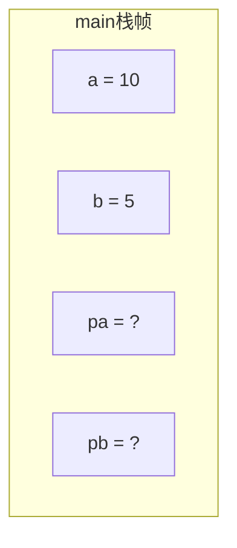
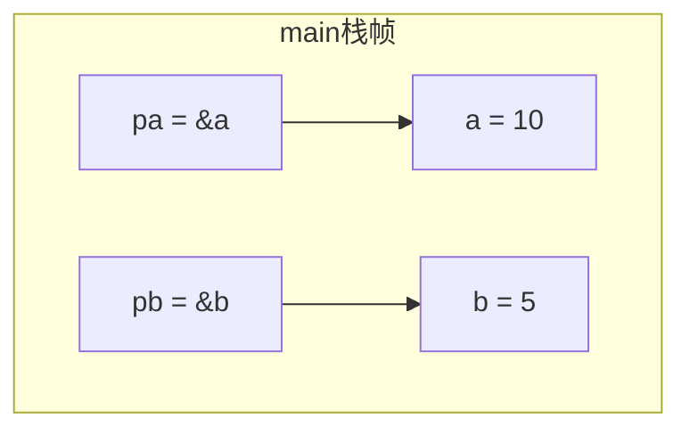
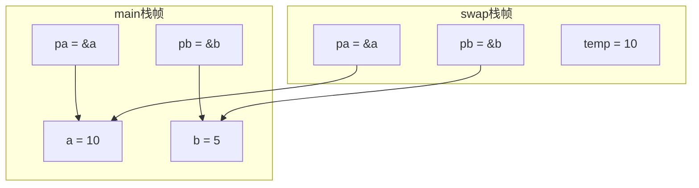
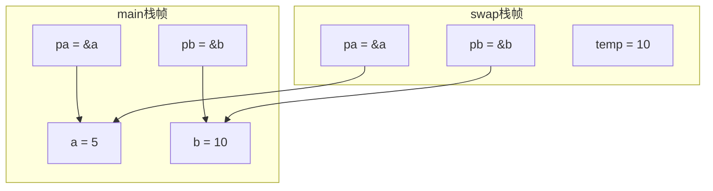
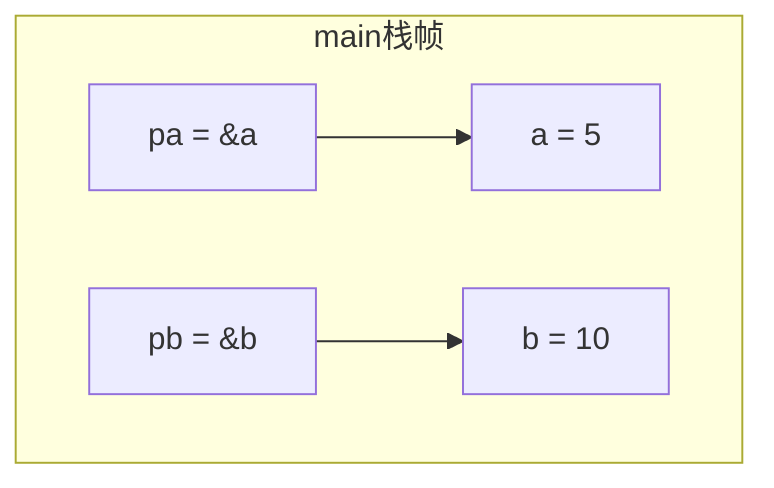

---
tags:
  - 408_计算机学科专业基础
考试科目: "408"
创建时间: 2026-02-27T23:24:00
课程: C语言
阶段: 零基础
老师: 泥鳅
开始日期: 2026-02-27
结束日期: 2026-02-27
---
---
# 指针交换程序内存变化分析

本文通过逐步追踪一个简单的指针交换程序，展示程序运行过程中栈内存的变化。使用 mermaid 图表可视化每个关键步骤后的栈帧状态。

## 源代码

```c
#define _CRT_SECURE_NO_WARNINGS
#include<stdio.h>
void swap(int *pa,int *pb){
    int temp = *pa;
    *pa = *pb;
    *pb = temp;
    printf("swap *pa = %d,*pb = %d\n",*pa,*pb);
}
int main(){
    int a = 10,b = 5;
    int *pa,*pb;
    pa = &a;
    pb = &b;
    swap(pa,pb);
    printf("main a = %d,b = %d\n",a,b);
    
    return 0;
}
```

## 运行结果

```
swap *pa = 5,*pb = 10
main a = 5,b = 10
```

## 内存变化步骤

> 假设 `main` 函数栈帧起始地址为 `0x1000`，`swap` 函数栈帧起始地址为 `0x2000`（仅用于示意），所有变量均为 `int` 或 `int*` 类型，占用 4 字节。

### 步骤1：定义变量后（刚进入 main）
变量 `a` 和 `b` 被初始化为 `10` 和 `5`，指针 `pa` 和 `pb` 未初始化（值未知）。



### 步骤2：执行 `pa = &a; pb = &b;` 后
`pa` 指向 `a`，`pb` 指向 `b`。



### 步骤3：调用 swap，进入 swap 函数（参数传递后）
`swap` 栈帧创建，形参 `pa` 和 `pb` 分别获得 `main` 中指针的值（仍指向 `a` 和 `b`），局部变量 `temp` 未初始化。


### 步骤4：执行 `int temp = *pa;` 后
`temp` 被赋值为 `a` 的值（10）。



### 步骤5：执行 `*pa = *pb;` 和 `*pb = temp;` 后
`a` 被改为 `b` 的原值 5，`b` 被改为 `temp` 的值 10，完成交换。



### 步骤6：swap 函数返回，销毁 swap 栈帧
回到 `main` 函数，`a` 和 `b` 的值已交换，`pa` 和 `pb` 仍指向它们。



## 总结
通过逐步追踪内存变化，可以清晰地看到：
- 指针作为函数参数时，传递的是地址，因此函数内可以通过指针间接修改主调函数中的变量。
- 栈帧在函数调用时创建，返回后销毁，但通过指针修改的堆或静态区数据（此处为栈上的变量）会持久化。