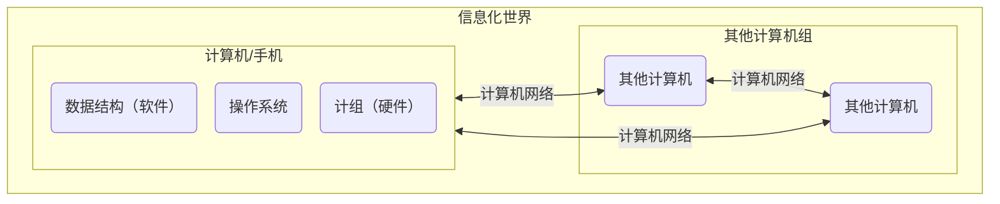
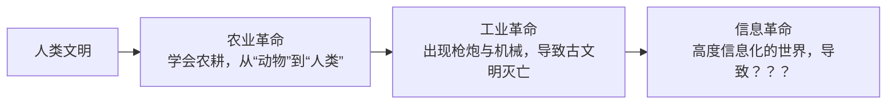
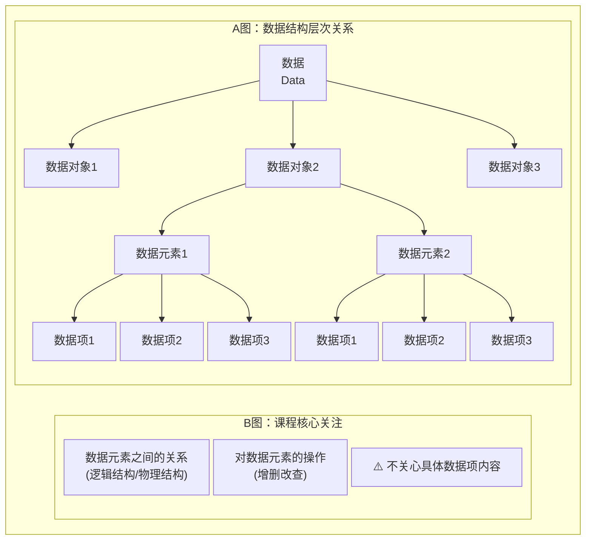

---
tags:
  - 408_计算机学科专业基础
创建时间: 2026-03-30T20:45:00
考试科目: "408"
课程: 数据结构
阶段: 基础
老师: 咸鱼
开始日期: 2026-03-30
结束日期:
---
[[2026-03-30]]
# 1. 绪论
## 1.0 开篇_数据结构在学什么

>[!Introduction]
>**数据结构在学什么？**
> - 如何用 **程序代码** 把现实世界的问题 **信息化**
> - 如何用计算机 **高效地** 处理这些信息从而创造价值

>[!example]
>人类是社会的发展，迄今经历了和经历着三个浪潮；第一次浪潮为农业阶段，从约1万年前开始；第二次浪潮为工业阶段，从17世纪末开始；第三次浪潮为正在到来的**信息化**阶段。—— 《第三次浪潮( 1980版 )，阿尔文·托夫勒》



>[!quote]
>”唯一可以确定的是，明天会使我们所有人大吃一惊。“ —— 阿尔文·托夫勒
>*The sole certainty is that tomorrow will surprise us all. —— Alvin Toffler*



---
[[2026-04-07]]
## 1.1 数据结构的基本概念

$$
\textbf{知识总览}
$$
$$
\textbf{数据结构}\left\{
\begin{array}{l}
\text{基本概念}\left\{
\begin{array}{l}
\text{数据} \\
\text{数据元素、数据项} \\
\text{数据对象、数据结构} \\
\text{数据类型、抽象数据类型（ADT）}
\end{array}\right. \\
\textbf{三要素}\left\{
\begin{array}{l}
\text{逻辑结构}\left\{
\begin{array}{l}
\text{线性结构：线性表、栈、队列} \\
\text{非线性结构：树、图、集合}
\end{array}\right. \\
\text{存储结构（物理结构）} \\
\text{数据的运算}
\end{array}\right.
\end{array}\right.
$$

>[!suggestion]
>**学习建议：**
> - 概念多，比较无聊。抓大放小，重要的是形成框架，不必纠结于细节概念

>[!question] 什么是数据？
>**数据：** 数据是**信息的载体**，是描述客观事物属性的数、字符及所有 **能输入到计算机中并被计算机程序识别( 二进制0和1 )** 和处理符号的集合。数据是计算机程序加工的原料。

>[!definition] 数据元素、数据项
>`数据元素` 是数据的基本单位，通常作为一个整体进行考虑和处理。
>一个数据元素可由若干 `数据项` 组成，数据项是构成数据元素的不可分割的最小单位。

>[!definition] 数据结构、数据对象
>**结构 —— 各个元素之间的关系**
>
>`数据结构` 是相互之间存在一种或多种特定 **关系** 的数据元素的集合。
>`数据对象` 是具有 **相同性质** 的数据元素的集合，是数据的一个子集。

>[!note] 数据结构的三要素
>**1.逻辑结构 —— 数据元素之间的逻辑关系是什么？**
> - 数据的逻辑结构
> 	- 集合
> 		- 各个元素同属一个集合，别无其他关系
> 	- 线性结构
> 		- 数据元素之间是一对一的关系
> 		- 除了第一个元素，所有元素都有唯一前驱
> 		- 除了最后一个元素，所有元素都有唯一后继
> 	- 树形结构
> 		- 数据元素之间是一对多的关系
> 	- 图状结构( 网状结构 )
> 		- 数据元素之间是多对多的关系
>
>**2.存储结构( 物理结构 ) —— 如何用计算机表示数据元素的逻辑关系？**
> - 数据的存储结构
> 	- 顺序存储
> 		- 把 **逻辑上相邻的元素存储在物理位置上也相邻的存储单元中**，元素之间的关系由存储单元的邻接关系来体现。
> 	- 链式存储
> 		- **逻辑上相邻的元素在物理位置上可以不相邻**，借助指示元素存储地址的指针来表示元素之间的逻辑关系。
> 		- **知识回顾：** [[C语言入门课程#12. 指针]]
> 	- 索引存储
> 		- 在存储元素信息的同时，还建立附加的索引表。索引表中的每项称为索引项，索引项的一般形式是( 关键字，地址 )
> 	- 散列存储
> 		- 根据元素的关键字直接计算出该元素的存储地址，又称**哈希( Hash )存储**
> 		- 若想深入理解散列存储 —— 详见[[数据结构##7.5 散列表]]
>
>$$
>\text{数据的存储结构}
>\begin{cases}
>\text{顺序存储} \\
>\text{非顺序存储}\left\{
>\begin{array}{l}
>\text{链式存储} \\
>\text{索引存储} \\
>\text{散列存储}
>\end{array}\right.
>\end{cases}
>$$
>
>**3.数据的运算 —— 施加在数据上的运算( 包括运算的定义和实现 )**
> - **运算的定义**是**针对逻辑结构**的，指出运算的功能
> - **运算的实现**是**针对存储结构**的，指出运算的具体操作步骤

>[!summary] 数据结构的三要素
>$$
>\begin{array}{c}
>\textbf{数据结构的三要素} \\
>\text{(讨论每一种数据结构时都要关注的三个方面)}
>\end{array}
>\left\{
>\begin{array}{l}
>\text{逻辑结构}\left\{
>\begin{array}{l}
>\text{线性结构：线性表、栈、队列} \\
>\text{非线性结构：树、图、集合}
>\end{array}\right. \\
>\text{存储结构（物理结构）} \\
>\text{数据的运算}
>\end{array}\right.
>$$
>
>**绪论部分只需要理解三点：**
> - 若采用**顺序存储**，则各个数据元素在物理上必须是**连续的**；若采用**非顺序存储**，则各个数据元素在物理上可以是**离散的**
> - 数据的**存储结构**会**影响存储空间分配的方便程度( e.g. 银行VIP客户想插队 )**
> - 数据的**存储结构**会**影响对数据运算的速度( e.g. 找到队列里的第三个人 )**

[[2026-04-13]]

>[!definition] 数据类型、抽象数据类型
> - `数据类型`是**一个值的集合**和**定义在此集合上**的**一组操作**的总称。
> 	- 1.原子类型 —— 其值不可再分的数据类型
> 		- bool类型
> 			- 值的范围：true、false
> 			- 可进行操作：与、或、非$···$
> 		- int类型
> 			- 值的范围:
> 				- 16位系统：$-32768 \sim 32767$
> 				- 32位 / 64位系统：$-2147483648 \sim 2147483647$
> 			- 可进行操作：加、减、乘、除、模运算$···$
> 	- 2.结构类型 —— 其值可以再分解为若干成分( 分量 )的数据类型。
> 		- 定义一个具体的结构体类型，表示排队顾客信息。
> 		- 根据具体业务需求来确定**值的范围**和**可进行的操作**。
> 		- e.g.
> 			- 值的范围：num( 1~9999 )、people( 1 ~ 12 )
> 			- 可进行操作：如”拼桌“运算 —— 把人数相加合并
>```c
>	struct Customer{
>		int num; // 号数
>		int people; // 人数
>		... // 其他必要的信息
>	};
>```
> - `抽象数据类型(Abstract Data Type,ADT)`是**抽象数据组织**及**与之相关的操作**。
> 	- ADT用**数学化的语言**定义了**某种数据的逻辑结构和对这种数据的运算**。ADT**并不关心和讨论**具体要采用哪种**存储结构( 物理结构 )**，即ADT与具体的实现无关。

[[2026-04-15]]

>[!Knowledge review and key examination points] 知识回顾与重要考点


$$
\textbf{知识回顾与重要考点}
$$

$$
\textbf{数据结构}\left\{
\begin{array}{l}
\text{基本概念}\left\{
\begin{array}{l}
\text{数据} \\
\text{数据元素、数据项} \\
\text{数据对象、数据结构} \\
\text{数据类型、抽象数据类型（ADT）}
\end{array}\right. \\
\textbf{三要素}\left\{
\begin{array}{l}
\text{逻辑结构}\left\{
\begin{array}{l}
\text{线性结构：线性表、栈、队列} \\
\text{非线性结构：树、图、集合}
\end{array}\right. \\
\text{存储结构（物理结构）}\left\{
\begin{array}{l}
\text{顺序存储} \\
\text{非顺序存储：链式存储、索引存储、散列存储}
\end{array}\right. \\
\text{数据的运算：根据逻辑结构来定义，根据存储结构来实现}
\end{array}\right.
\end{array}\right.
$$

>[!caution]
> - 定义一个ADT，就是定义了数据的逻辑结构、数据的运算。也就是**定义**了一个数据结构。
> - 确定一种存储结构，就意味着在计算机中表示出数据的逻辑结构。存储结构不同，也会导致运算的具体实现不同。确定了存储结构，才能**实现**数据结构。

---
[[2026-04-19]]
## 1.2 算法和算法评价
### 1.2.1 算法的基本概念

$$
\text{算法的基本概念}\left\{
\begin{array}{l}
\text{什么是算法} \\
\text{算法的五个特性} \\
\text{“好”算法的特质} \\
\end{array}\right.
$$

>[!question] 什么是算法？
>程序 = 数据结构 + 算法
>**数据结构：** 如何用数据正确地描述现实世界的问题( 包括数值型的问题，非数值型的问题，数据元素之间的关系$···$ )，并存入计算机。
>**算法：** 如何高效地处理这些数据，以解决实际问题。

>[!definition] 算法
>`算法(Algorithm)`是**对特定问题求解步骤的一种描述**，它是指令的有限序列，其中的每条指令表示一个或多个操作。

>[!example] 要解决的问题：做番茄炒蛋
> - 食材
> 	- 鸡蛋 4个
> 	- 西红柿 2个
> 	- 料酒 少许
> 	- 盐 1勺
> 	- 糖 少许
> - 步骤
> 	- 西红柿切块
> 	- 鸡蛋加料酒打匀
> 	- 将锅烧热，倒入鸡蛋翻炒
> 	- 导入西红柿翻炒
> 	- 加少许盐、糖
> 	- 装盘

[[2026-04-28]]

> [!Characteristics of Algorithms] 算法的特性 —— 算法必须具备的特性
>  - **有穷性：** 一个算法必须总在执行有穷步之后结束，且每一步都可在有穷时间内完成。
> 	 - 注：**算法**必须是**有穷**的，而**程序**可以是**无穷**的。
> 		 - 算法： 用有限步骤解决某个特定的问题。
>  - **确定性：** 算法中每条指令必须有确切的含义，对于**相同的输入**只能得出**相同的输出**。
>  - **可行性：** 算法中描述的操作都可以通过已经实现的**基本运算执行有限次**来实现。
>  - **输入和输出：**
> 	 - **输入：** 一个算法**有零个或多个输入**，有些输入取自于某个特定的**数据对象**的集合。
> 	 - **输出：** 一个算法**有一个或多个输出**，这些输出是与输入有着某种特定关系的量。

>[!The characteristics of a "good" algorithm] “好”算法的特质 —— 设计算法时尽量追求的目标
> - **正确性：** 算法应能正确地解决求解问题。
> - **可读性：** 算法应具有良好的可读性，以帮助人们理解。
> - >[!caution]
> >在写408中数据结构的代码题时一定要在必要处添加**注释**！
> - **健壮性( 鲁棒性 )：** 输入非法数据时，算法能适当地做出反应或进行处理，而不会产生莫名其妙的输出结果。
> - **高效率**与**低存储量需求：**
> 	- **高效率：** 花的时间少，**时间复杂度低**。
> 	- **低存储量需求：** 不费内存，**空间复杂度低**。

>[!quote] 程序设计
> - 设计一个好的**数据结构**
> - 设计一个好的**算法**

---
[[2026-04-29]]
### 1.2.2 算法效率的度量

$$
\text{算法效率的度量}\left\{
\begin{array}{l}
\text{算法的时间复杂度} \\
\text{算法的空间复杂度}
\end{array}\right.
$$

#### 1.2.2.1 算法的时间复杂度( 渐进时间复杂度 ) —— 评价算法的时间开销的指标

>[!question] 如何评估算法的时间开销？
> - 让算法先运行，**事后统计**运行时间
> 	- 存在什么问题？
> 		- 和机器性能有关，如：超级计算机 v.s. 单片机
> 		- 和编程语言有关，越高级的语言执行效率越低
> 		- 和编译程序产生的机器指令质量有关
> 		- 有些算法是不能事后再统计的，如：导弹控制算法
> 	- 能否排除与算法本身无关的外界因素？
> 	- 能否事先估计？
> - 算法**时间复杂度**
> 	- **事前预估**算法**时间开销**$T(n)$与**问题规模**$n$的关系( T表示“time” )

[[2026-04-30]]

>[!Algorithm 1] 算法1 —— 逐步递增型爱你
>```c
>void loveYou(int n){ // n为问题规模
>	① int i = 1; // 爱你的程度
>	② while(i <= n){
>		③ i++; // 每次+1
>		④ printf("I Love You %d\n",i);
>	}
>	⑤ printf("I Love You More Than %d",n);
>}
>
>int main(){
>	loveYou(3000);
>	
>	return 0;
>}
>```
> - 语句**频度**：
> 	- ① —— 1次
> 	- ② —— 3001次
> 	- ③④ —— 3000次
> 	- ⑤ —— 1次
> 	- $T(3000) = 1 + 3001 + 2 * 3000 + 1 = 9003$
> - 时间开销与问题规模$n$的关系：
> 	- $T(n) = 3n + 3$
> >[!question]
> > - 问题1：是否可以忽略表达式某些部分？
> > - 答：**只考虑阶数，用大$O$记法表示**
> > 	- 时间开销与问题规模$n$的关系：
> > 		- $T_1(n) = 3n + 3$
> > 		- $T_2(n) = n^2 + 3n + 1000$
> > 		- $T_3(n) = n^3 + n^2  + 99999999$
> > 			- 当问题规模n足够大时，我们可以忽略掉表达式中低阶的部分，只考虑表达式中**高阶**的部分。
> > 				- 若$n = 3000$，则：
> > 					- $3n = 9000 \ \ v.s. \ \ T_1(n) = 9003$
> > 					- $n^2 = 9000000 \ \ v.s. \ \ T_2(n) = 9010000$
> > 					- $n^3 = 27000000000 \ \ v.s. \ \ T_3(n) = 270189999999$
> > 			- 当我们在评价一个算法的优劣时，**甚至**可以**忽略常数项**。因此我们在描述时间复杂度时，只需要关注时间复杂度处于哪个**数量级**即可。
> > 				- $T_1(n) = O(n)$
> > 				- $T_2(n) = O(n^2)$
> > 				- $T_3(n) = O(n^3)$
> > 				- 大$O$表示“同阶”，同等数量级。即：当$n \to \infty$时，二者之比为常数。
> > 				- $T(n) = O(f(n)) \iff \lim\limits_{n \to \infty} \frac{T(n)}{f(n)} = k$
> > 			- 教材中是这样描述的：
> > 				- a) 加法规则
> > 					- $T(n) = T_1(n) + T_2(n) = O(f(n)) + O(g(n)) = O(max(f(n),g(n)))$ —— **多项相加，只保留最高阶的项，且系数变为1**
> > 				- b) 乘法规则
> > 					- $T(n) = T_1(n) \times T_2(n) = O(f(n)) \times O(g(n)) = O(f(n) \times g(n))$ —— **多项相乘，都保留**
> > 				> [!example] E.g.
> > 				> - $T_3(n) = n^3 + n^2\log_2{n} = O(n^3) + O(n^2\log_2{n})$
> > 				> > [!question] $O(n^3) 和 O(n^2\log_2{n}) 哪个更大？$
> > 				> > - **结论：** $O(1) < O(\log_2{n}) < O(n) < O(n\log_2{n}) < O(n^2) < O(n^3) < O(2^n) < O(n!) < O(n^n)$
> > 				> > - ![[Pasted image 20260430153518.png]]
> > 				> > - **口诀：** 常对幂指阶
> > 				> > - $O(n^3) = O(n^2 \times n)$
> > 				> > - $O(n^2\log_2{n}) = O(n^2 \times \log_2{n})$
> > 				> > - $\because O(n) > O(\log_2 n)$
> > 				> > - $\therefore O(n^3) > O(n^2 \log_2 n)$
> > 				> - $T_3(n) = O(n^3)$
> > 				> > [!question] 两个算法的时间复杂度分别如下，哪个的阶数更高( 时间复杂度更高 )？
> > 				> > - $T_1(n) = O(n)$
> > 				> > - $T_2(n) = O(\log_2{n})$
> > 				> > 	- $\lim\limits_{n \to \infty} \frac{\log_2{n}}{n} \xrightarrow{\text{洛必达}} \lim\limits_{n \to \infty} \frac{1}{n\ln{2}} = 0$ —— 当$n \to \infty$时，$n$比$\log_2{n}$变大的速度快很多
> > 				> > 	- $\therefore O(n) > O(\log_2{n})$
> > 				> > [!question] 两个算法的时间复杂度分别如下，哪个的阶数更高( 时间复杂度更高 )？
> > 				> > - $T_1(n) = O(n^2)$
> > 				> > - $T_2(n) = O(2^n)$
> > 				> > 	- $\lim\limits_{n \to \infty} \frac{n^2}{2^n} \xrightarrow{\text{洛必达}} \lim\limits_{n \to \infty} \frac{2n}{2^n\ln{2}} \xrightarrow{\text{洛必达}} \lim\limits_{n \to \infty} \frac{2}{2^n\ln^2{2}} = 0$ —— 当$n \to \infty$时，$2^n$比$n^2$变大的速度快很多
> > 				> > 	- $\therefore O(2^n) > O(n^2)$
> > - 问题2：如果有好几千行代码，按这种方法需要一行一行数？
> > - 答：**只需考虑最深层循环的循环次数与$n$的关系**
> > 	- **结论1：** 顺序执行的代码只会影响常数项，可以忽略。
> > 	- **结论2：** 只需挑循环中的`一个基本操作`分析它的执行次数与$n$的关系即可。

[[2026-05-01]]

>[!Algorithm 2] 算法2 —— 嵌套循环型爱你
>```c
>void loveYou(int n){ // n为问题规模
>	int i = 1; // 爱你的程度
>	while(i <= n){ // 外层循环执行n次
>		i++;
>		printf("I Love You %d\n",i);
>		for(int j = 1;j <= n;j++){ // 嵌套两层循环
>			printf("I am Iron Man\n"); // 内层循环共执行n^2次
>		}
>	}
>	printf("I Love You More Than %d\n",n);
>}
>int main(){
>	loveYou(3000);
>	
>	return 0;
>}
>```
> - 时间开销与问题规模n的关系：
> 	- $T(n) = O(n) + O(n^2) = O(n^2)$
> - **结论3：** 如果有多层嵌套循环，只需关注最深层循环循环了几次。

>[!example] 练习1 —— 算法3 —— 指数递增型爱你
>```c
>void loveYou(int n){ // n为问题规模
>	int i = 1; // 爱你的程度
>	while(i <= n){
>		i = i * 2; // 每次翻倍
>		printf("I Love You %d\n",i);
>	}
>	printf("I Love You More Than %d\n",n);
>}
>int main(){
>	loveYou(3000);
>	
>	return 0;
>}
>```
> - 计算上述算法的时间复杂度$T(n)$：
> 	- 设最深层循环的语句频度( 总共循环的次数 )为$x$，则由循环条件可知，循环结束时刚好满足$2^x > n$
> 	- $x = \log_2{n} + 1$
> 	- $T(n) = O(x) = O(\log_2{n} + 1) = O(\log_2{n}) + O(1) = O(\log_2{n})$

[[2026-05-02]]

>[!example] 练习2 —— 算法4 —— 搜索数字型爱你
>```c
>void loveYou(int flag[],int n){ // n为问题规模
>	printf("I Am Iron Man\n");
>	for(int i = 0;i < n;i++){ // 从第一个元素开始查找
>		if(flag[i] == n){ // 找到元素n
>			printf("L Love You %d\n",n);
>			break; // 找到后立即跳出循环
>		}
>	}
>}
>int main(){
>	int flag[n] = {1...n}; // flag数组中乱序存放了1 ~ n这些数
>	loveYou(flag,n);
>	
>	return 0;
>}
>```
> - 计算上述算法的时间复杂度$T(n)$：
> 	- **最好**情况：元素$n$在第一个位置 —— **最好时间复杂度**$T(n) = O(1)$
> 	- **最坏**情况：元素$n$在最后一个位置 —— **最坏时间复杂度**$T(n) = O(n)$
> 	- **平均**情况：假设元素$n$在任意一个位置的概率相同为$\frac{1}{n}$ —— **平均时间复杂度**$T(n) = O(n)$
> 		- 循环次数$x = (1 + 2 + 3 + ··· + n)\frac{1}{n} = (\frac{n(1 + n)}{2})\frac{1}{n} = \frac{1 + n}{2}$
> - 从练习2中我们可以看出 —— 很多算法执行时间与**输入的数据**有关
> - 因此针对这一类的算法我们需要考虑在**不同的情况**下算法的时间复杂度是多少

>[!summary] 算法的时间复杂度
> - **最坏时间复杂度：** 最坏情况下算法的时间复杂度
> - **平均时间复杂度：** **所有输入示例等概率出现**的情况下，算法的期望运行时间
> - 最好时间复杂度( 参考意义不大 )：最好情况下算法的时间复杂度

>[!summary] 知识回顾与重要考点
> - 时间复杂度
> 	- 如何计算
> 		- ①找到一个基本操作( 最深层循环 )
> 		- ②分析该基本操作的执行次数$x$与问题规模$n$的关系$x = f(n)$
> 		- ③$x$的数量级$O(x)$就是算法时间复杂度$T(n)$
> 	- 常用技巧
> 		- 加法规则：$O(f(n)) + O(g(n)) = O(max(f(n),g(n)))$
> 		- 乘法规则：$O(f(n)) \times O(g(n)) = O(f(n) \times g(n))$
> 		- “常对幂指阶”：$O(1) < O(\log_2{n}) < O(n) < O(n\log_2{n}) < O(n^2) < O(n^3) < O(2^n) < O(n!) < O(n^n)$
> 	- 三种复杂度
> 		- 最坏时间复杂度：考虑输入数据“最坏”的情况
> 		- 平均时间复杂度：考虑所有输入数据都等概率出现的情况
> 		- 最好时间复杂度：考虑输入数据“最好”的情况

---
#### 1.2.2.2 算法的空间复杂度

>[!summary] 知识回顾与重要考点
> - 空间复杂度
> 	- 如何计算
> 		- 普通程序
> 			- ①找到所占空间大小与问题规模相关的变量
> 			- ②分析所占空间$x$与问题规模$n$的关系$x = f(n)$
> 			- ③$x$的数量级$O(x)$就是算法空间复杂度$S(n)$
> 		- 递归程序
> 			- ①找到递归调用的深度$x$与问题规模$n$的关系$x = f(n)$
> 			- ②$x$的数量级$O(x)$就是算法空间复杂度$S(n)$
> 	- 常用技巧
> 		- 加法规则：$O(f(n)) + O(g(n)) = O(max(f(n),g(n)))$
> 		- 乘法规则：$O(f(n)) \times O(g(n)) = O(f(n) \times g(n))$
> 		- “常对幂指阶”：$O(1) < O(\log_2{n}) < O(n) < O(n\log_2{n}) < O(n^2) < O(n^3) < O(2^n) < O(n!) < O(n^n)$

---
[[2026-05-03]]
# 2. 线性表

>[!summary] 知识总览
> - 线性表
> 	- 逻辑结构
> 	- 基本运算 / 操作
> 	- 存储 / 物理结构
> 		- 顺序表( 顺序存储 )
> 			- 定义( 如何用代码实现 )
> 			- 基本操作的实现
> 		- 链表( 链式存储 )

## 2.1 线性表的定义和基本操作

>[!summary] 知识回顾与重要考点
> - 线性表
> 	- 定义( Linear List ) —— “逻辑结构”
> 		- 值得注意的特性：数据元素**同类型、有限、有序**
> 		- 重要术语
> 			- 表长、空表
> 			- 表头、表尾
> 			- 前驱、后继
> 			- 数据元素的**位序( 从1开始 )** —— **用数组实现线性表时需要注意审题！**
> 	- 基本操作 —— “运算”
> 		- **创建销毁、增删改查**( 所有数据结构适用的记忆思路 )⭐
> 		- 判空、判长、打印输出( 还可自己根据实际需求增加其他基本操作 )
> 		- 其他值得注意的点
> 			- 理解什么时候要传入参数的**引用"&"**⭐
> 			- **函数命名**要有**可读性**

---
[[2026-05-04]]
## 2.2 线性表的存储/物理结构
### 2.2.1 顺序表( 顺序存储 )
#### 2.2.1.1 顺序表的定义

>[!summary] 知识回顾与重要考点
> - 顺序表
> 	- **存储结构**
> 		- 逻辑上相邻的数据元素物理上也相邻
> 	- 实现方式
> 		- 静态分配
> 			- 使用“静态数组”实现
> 			- 大小一旦确定就无法改变
> 		- 动态分配
> 			- 使用“动态数组”实现
> 			- `L.data = (ElemType *) malloc(sizeof(ElemType) * size);`
> 			- 顺序表存满时，可再用`malloc`动态拓展顺序表的最大容量⭐
> 			- 需要将数据元素复制到新的存储区域，并用`free`函数释放原区域⭐
> 	- 特点
> 		- 随机访问⭐
> 			- 能在$O(1)$时间内找到第$i$个元素
> 		- 存储密度高
> 		- 拓展容量不方便
> 		- **插入、删除**数据元素不方便⭐

---
#### 2.2.1.2 顺序表的插入和删除