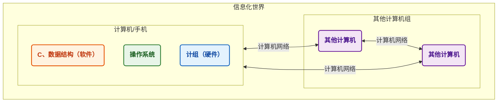

---
tags:
  - 408_计算机学科专业基础
创建时间: 2026-03-30T20:45:00
考试科目: "408"
课程: 数据结构
阶段: 基础
老师: 咸鱼
开始日期: 2026-03-30
结束日期:
---
[[2026-03-30]]
# 1. 绪论
## 1.0 开篇_数据结构在学什么

>[!note]
>**数据结构在学什么？**
> - 如何用 **程序代码** 把现实世界的问题 **信息化**
> - 如何用计算机 **高效地** 处理这些信息从而创造价值

>[!example]
>人类是社会的发展，迄今经历了和经历着三个浪潮；第一次浪潮为农业阶段，从约1万年前开始；第二次浪潮为工业阶段，从17世纪末开始；第三次浪潮为正在到来的**信息化**阶段。—— 《第三次浪潮( 1980版 )，阿尔文·托夫勒》

>[!quote]
>”唯一可以确定的是，明天会使我们所有人大吃一惊。“ —— 阿尔文·托夫勒
>*The sole certainty is that tomorrow will surprise us all. —— Alvin Toffler*

---
[[2026-04-07]]
## 1.1 数据结构的基本概念

$$
\textbf{知识总览}
$$
$$
\textbf{数据结构}\left\{
\begin{array}{l}
\text{基本概念}\left\{
\begin{array}{l}
\text{数据} \\
\text{数据元素、数据项} \\
\text{数据对象、数据结构} \\
\text{数据类型、抽象数据类型（ADT）}
\end{array}\right. \\
\textbf{三要素}\left\{
\begin{array}{l}
\text{逻辑结构}\left\{
\begin{array}{l}
\text{线性结构：线性表、栈、队列} \\
\text{非线性结构：树、图、集合}
\end{array}\right. \\
\text{存储结构（物理结构）} \\
\text{数据的运算}
\end{array}\right.
\end{array}\right.
$$

>[!suggestion]
>**学习建议：**
> - 概念多，比较无聊。抓大放小，重要的是形成框架，不必纠结于细节概念

>[!question] 什么是数据？
>**数据：** 数据是**信息的载体**，是描述客观事物属性的数、字符及所有 **能输入到计算机中并被计算机程序识别( 二进制0和1 )** 和处理符号的集合。数据是计算机程序加工的原料。

>[!definition] 数据元素、数据项
>`数据元素` 是数据的基本单位，通常作为一个整体进行考虑和处理。
>一个数据元素可由若干 `数据项` 组成，数据项是构成数据元素的不可分割的最小单位。

>[!definition] 数据结构、数据对象
>**结构 —— 各个元素之间的关系**
>
>`数据结构` 是相互之间存在一种或多种特定 **关系** 的数据元素的集合。
>`数据对象` 是具有 **相同性质** 的数据元素的集合，是数据的一个子集。

>[!note] 数据结构的三要素
>**1.逻辑结构 —— 数据元素之间的逻辑关系是什么？**
> - 数据的逻辑结构
> 	- 集合
> 		- 各个元素同属一个集合，别无其他关系
> 	- 线性结构
> 		- 数据元素之间是一对一的关系
> 		- 除了第一个元素，所有元素都有唯一前驱
> 		- 除了最后一个元素，所有元素都有唯一后继
> 	- 树形结构
> 		- 数据元素之间是一对多的关系
> 	- 图状结构( 网状结构 )
> 		- 数据元素之间是多对多的关系
>
>**2.存储结构( 物理结构 ) —— 如何用计算机表示数据元素的逻辑关系？**
> - 数据的存储结构
> 	- 顺序存储
> 		- 把 **逻辑上相邻的元素存储在物理位置上也相邻的存储单元中**，元素之间的关系由存储单元的邻接关系来体现。
> 	- 链式存储
> 		- **逻辑上相邻的元素在物理位置上可以不相邻**，借助指示元素存储地址的指针来表示元素之间的逻辑关系。
> 		- **知识回顾：** [[C语言入门课程#12. 指针]]
> 	- 索引存储
> 		- 在存储元素信息的同时，还建立附加的索引表。索引表中的每项称为索引项，索引项的一般形式是( 关键字，地址 )
> 	- 散列存储
> 		- 根据元素的关键字直接计算出该元素的存储地址，又称**哈希( Hash )存储**
> 		- 若想深入理解散列存储 —— 详见[[数据结构###7.5.1 散列表的基本概念]]
>
>$$
>\text{数据的存储结构}
>\begin{cases}
>\text{顺序存储} \\
>\text{非顺序存储}\left\{
>\begin{array}{l}
>\text{链式存储} \\
>\text{索引存储} \\
>\text{散列存储}
>\end{array}\right.
>\end{cases}
>$$
>
>**3.数据的运算 —— 施加在数据上的运算( 包括运算的定义和实现 )**
> - **运算的定义**是**针对逻辑结构**的，指出运算的功能
> - **运算的实现**是**针对存储结构**的，指出运算的具体操作步骤

>[!summary] 数据结构的三要素
>**绪论部分只需要理解三点：**
> - 若采用**顺序存储**，则各个数据元素在物理上必须是**连续的**；若采用**非顺序存储**，则各个数据元素在物理上可以是**离散的**
> - 数据的**存储结构**会**影响存储空间分配的方便程度( e.g. 银行VIP客户想插队 )**
> - 数据的**存储结构**会**影响对数据运算的速度( e.g. 找到队列里的第三个人 )**

