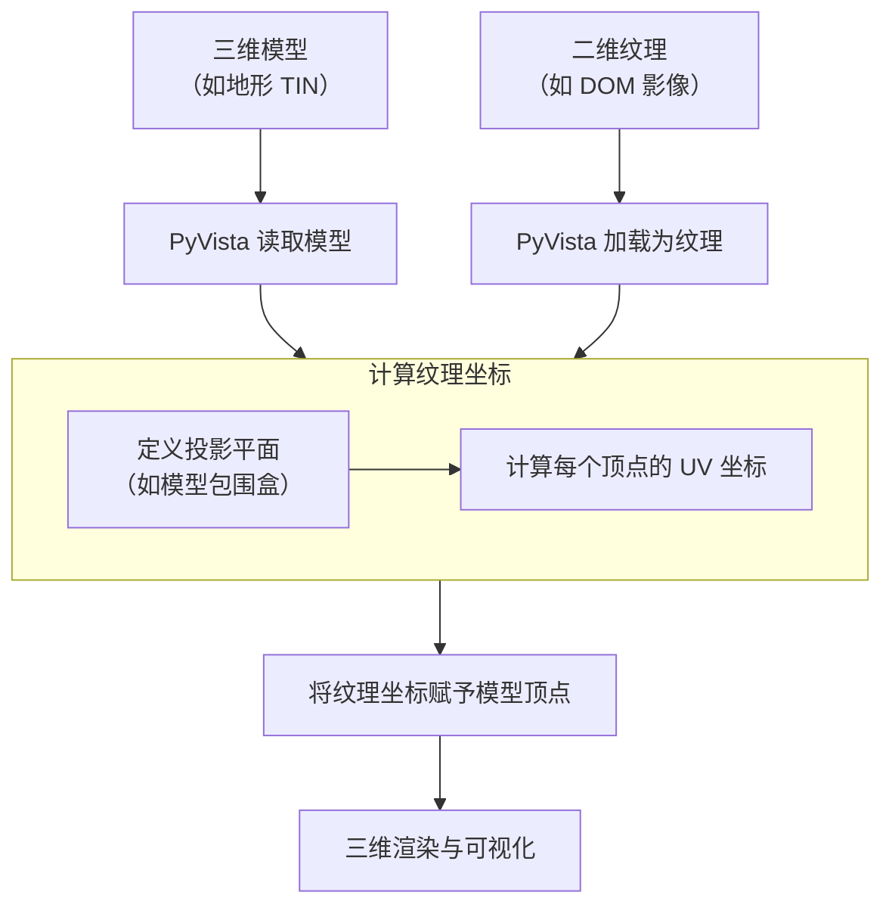

---
tags:
  - GIS
  - 三维GIS
创建时间: 2026-03-02T09:50:00
课程: 三维GIS开发
课程类型: 选择性必修
阶段: 大三下
老师: 段新桥
开始日期: 2026-03-02
结束日期:
---
[[2026-03-02]]
# 3D GIS Programing Essentials

	IBM深蓝 —— 国际象棋 —— AlphaGo围棋 —— AlphaFold分子药物

## 1. AI挑战下的三维GIS与编程

### 1.1 学科知识体系

#### 1.1.1 术语体系

#### 1.1.2 知识网络/图谱

$$
\text {开发/编程}
\begin{cases}
\text {前端}
\begin{cases}
\text{交互方式} \\
\text{UI} \\
\text{适配} \\
\text{配色} \\
\text{样式} \\
\end{cases} \\
\text {后端} \\
\end{cases}
$$
#### 1.1.3 知识对齐

$$
\text{Aligenment}
\begin{cases}
\text{AI} \\
\text{已有科学与技术} \\
\text{人的价值何在？} \\
\end{cases}
$$
---
### 1.2 三维挑战

#### 1.2.1

>[!note]
>三维相对二维平面，有意义的距离从来不是直线距离：非欧氏距离&非欧氏空间

#### 1.2.2 弯曲
$$
\begin{gather}
\text{线曲率} \ \kappa(s) = \lim_{\Delta s \to 0} \left\| \frac{\boldsymbol{T}(s+\Delta s) - \boldsymbol{T}(s)}{\Delta s} \right\| = \left\| \frac{d\boldsymbol{T}}{ds} \right\| \\
\text{面曲率} \ K(P) = \lim_{S \to P} \frac{\mathcal{A}(\boldsymbol{n}(S))}{\mathcal{A}(S)}
\end{gather}
$$

	平面三角形内角和 = PI
	球面三角形内角和 > PI
	双曲面三角形内角和 < PI

#### 1.2.3 距离

$$
\text{向量的内积 a · b} \\
$$
#### 1.2.4 角度
	长度之比，无量纲

$$
\begin{gather}
\alpha = \frac{l}{r} \\
\cos\theta = \frac{\mathbf{a} \cdot \mathbf{b}}{|\mathbf{a}|\,|\mathbf{b}|}
\end{gather}
$$
---
## 2. 三维GIS编程导论
### 2.1 三维GIS的研究对象
#### 2.1.1 自然资源管理

>[!timeline]
>2018年3月，组建自然资源部
>2019年3月，省市县自然资源管理机构改革
>看齐USGS，即：
>自然资源**调查、登记、确权、规划**  
>代替国务院形式所有人职权  
>以国土空间规划为主体，“一张蓝图干到底”
>2022年2月，**实景三维**中国建设与**数字经济**；
>2024年4月，智慧城市与地形级地理场景；

#### 2.1.2 地球环境
	地球是个椭球体（至少是三维的）
	地形是起伏不平的
	地球环境变化的主体：地球流体（大气与海洋）

>[!note]
>**一些基本事实：**
>地形对地球表层系统的水热动量的再分配起到支配性作用；
>大气层密度标高*8.5km*，*20km* 厚度包括了*99%* 的质量；
>大洋平均深度*4km*，各大洋最深处都约在*9km* ;

>[!note]
>**实际上的地球表层流体：**
>地球流体（大气与海洋）
>碰到硬边界就会变形：*绕道*，*抬升*，*停滞*

#### 2.1.3 城市环境
---
### 2.2 三维空间数据与面向对象的现代软件工程
#### 2.2.1 空间数据模型

>[!note]
>**矢量与栅格**
>**矢量：** 点、线、面、体、组合体
>由基本元素( *simplex* )按规则构成复杂形体( *combinatory  topology* )，**点定义几何**( *geomertry* )，**连接关系** ( *connectivity* ) 称为 **拓扑** ( *topology* )。
>**栅格：** 二维&三维
>二维栅格即影像，三维栅格是二维影像在竖直方向上的堆叠。
>海量空间数据必须借助计算机的自动处理。

---
[[2026-03-04]]
## 3. 程序系统的基本原理和算法库
	三维 —— 凸多边形 —— 非平坦、非欧氏空间
	距离度量 —— 图最短路径(Dijkstra)
### 3.1 程序系统的基本原理

$$
\begin{gather}
\text{A = L × L} \\
\text{V = L × L × L} \\
\text 角度ε  = \frac{Δε}{Δl}
\end{gather}
$$

#### 3.1.1 形式语言与自动机

![[74ffbd8b94935c53cdcdc682f2b1b8a0.jpg]]

#### 3.1.2 程序入口(entry point)

>[!note]
>1.程序编译后形成文件(PE/OFF)
>2.文件格式的程序是**进程**( *process* )在磁盘上的**映像**( *image* )
>3.程序一旦装载( *loader* )并运行，形成**操作系统**的进程，即将获得系统资源，理论上可以做任何事。
>
>“给我一个进程入口，我可以创造一个世界。”
>**Python，R，Julia，Go，Rust**

#### 3.1.3 运行时(runtime)

>[!note]
>1.一个基本的Windows程序通常包含代码和UI( *User Interface* )两大部分
>2.源代码编辑后，由RC( *resource compiler* )编译器将这两部分整合成一个EXE文件( **可执行程序** )。
>3.EXE文件装载后，放在内存中，CPU的指令寄存器( *IP* )指向程序入口
>4.UI资源指菜单、对话框、位图、图标等，需要在一个 **.rc**文件中描述它们，也就是说，**UI界面都是WIndows“画”出来的**。
>5.这和网页设计中拖一个按钮并编写事件没什么两样。

>[!note]
>1.Windows程序可以调用的函数可以分为C libs和Windows API两种，都可称为runtime libraries，简称运行时(库)。
>2.LIBC.LIB是C Runtimes的静态连接版，MSVCRT.LIB是C Runtimes的动态连接版。
>3.GDI32.DLL、USER32.DLL和KERNEL32.DLL提供基础WIndows功能API的三大函数库。
>4.应用程序也可以编写自己的静态DLL/动态DLL，对外提供功能接口
>
>可见，运行时是提供**软件功能复用**的一种形式。

#### 3.1.4 消息驱动(message driven architecture)

>[!note]
>1.Windows程序的运行靠外部事件驱动，逻辑如下：
>程序循环取消息；
>事件发生，Windows收集事件，产生消息，投递消息；
>程序从消息队列取到消息，做出相应的处理。
>2.那么每一个Windows程序都有一个取消息的无限循环。

>[!definition]
>**消息结构定义如下：**

```c
typedef struct tagMsg{
	HWND hWnd; // 窗口句柄
	UINT message; // 消息ID
	WPARAM wParam; // 短参数
	LPARAM lParam; // 参数
	DWORD time; // 时刻
	POINT pt; // 位置
}MSG;
```

>[!definition]
>窗口过程( **window function** )响应发给自己的消息，函数定义如下：

```c
LRESULT CALLBACK WndProc(HWND hWnd,UINT message,WPARAM wParam,LPARAM lParam)
{
	switch(message){
		case WM_LBUTTONDOWN: // 鼠标左键按下了
			...
		case WM_MOUSEMOVE: // 窗口在移动
			...
		case WM_DESTROY: // 窗口销毁了
		
		PostQuitMessage(0);
		
		default: // 没有特殊的或用户交互，交予默认过程处置
			return DefWindowProc(hWnd,message,wParam,lParam);
	}
	
	return (0); // 无论如何，一定要返回！！！
}
```

>[!note]
>**Windows应用程序的消息机制：**

![[936a0255bdccc52feb47f963c1be1250.jpg]]

>[!note]
>**Windows程序系统的原理要点：**
>1.Windows收集所有的消息，当一个程序( 进程，*process* )运行时，Windows为之建立相应的消息队列；
>2.应用程序从*Entry Point* 取得系统权限，建立窗口和窗口过程后，执行一个死循环( 消息循环 )：取消息并将消息分发至( 子 )窗口或线程；
>3.窗口或线程函数对消息作出反应；
>4.*GetMessage* 与*Entry Point* 是系统关键；**若消息队列为空，进程休眠，让出CPU时间**。

>[!note]
>**Windows程序本意是有图形界面的，但也存在许多变形：**
>1.控制台程序(console)：即所谓的命令行窗口程序
>2.窗口程序
>3.WinForms程序：.NET/WPF等高级语言界面程序
>**无论是哪种形式，程序原理是相似相同的。**
>4.*控制台程序下也可以使用窗口界面。*

#### 3.1.5 Linux，UNIX，鸿蒙与其它

>[!note]
>1.操作系统决定程序系统的结构
>2.操作系统的生态决定程序的生态
>3.手机与智能设备主要是类Linux系统

#### 3.1.6 软件复用、通信与接口

>[!note]
>**1.IPC/RPC：** 进程间通信/远程通信
>**2.COM/CORBA：** 
>二进制标准
>**接口**编程( *IInterface / IDispatch / IFeature / IFeatureClass ...* )
>接口好比插座，仅描述功能规范，不提供实现( *abstract class* )
>**3.Web Service/SOAP**
>**4.UDDI**  

- [1] 封装越来越高级
---
### 3.2 编程模式

>[!note]
>1.程序 = 算法 + 数据结构 —— N.Wirth
>2.但是用户(程序)也需要和计算机自身打交道
>3.用户友好界面(UI)编程：苹果，Windows，手机
>4.AI编程(Agent Programing)：prompt Engineering
>
>所以一直存在两种编程模式：
>关注输入输出的**系统程序**和关注数据处理的**算法程序**

---
### 3.3 Python与算法库

#### 3.3.1 现代软件工程

>[!note]
>1.C++是操作系统级的代码，是**编译型**底层代码。
>2.当面临快速的任务需求时，看中的**原型系统**的效率。
>项目任务的快速迭代
>脚本语言与**解释型**语言，边试错，边开发
>3.交互式语言
>变量可不声明就使用
>可以交互式，也可以程序式 >*python a.py*
>*Python.exe*在宿主机上构建了自己的“语言世界”

>[!note]
>1.面向对象
>2.强格式
>如缩进严格。好处是语法清晰。
>3.弱类型
>类型转换与声明灵活自由
>4.万金油式语言
>比如ArcGIS可以引入Python
>5.明显缺点：
>解释型，速度慢
>并行较弱(Gil)
>丰富的三方库，存在不小的功能重叠

#### 3.3.2 算法库

>[!note]
>**1.Python Package Index：** https://pypi.org
>**2.Pypi相当于实现了C++时代梦寐以求的** *UDDI* **注册中心**

>[!note]
>**GIS相关包：**
>1.CGAL —— 主要是C++，学院派计算几何算法库
>2。ITK/VTK —— Kitware维护的图像图形库
>3.Shapely —— 著名的GEOS库的Python版本
>4.Cartopy —— 制图
>5.Bassmap，Flona，GeoPandas —— 集成的地图可视化
>6.pycairo，pyproj，OGR，GDAL，pyshp —— 坐标，投影，GIS数据
>7.PIL，SPy —— 遥感影像与光谱
>8.libigl —— 轻量级网格处理库，支持变形、参数化等几何操作
>9.Open3D —— 3D数据处理库，专注于点云和网格的可视化、重建及深度学习
>10.laspy —— 读写LAS/LAZ点云格式的Python库，基于NumPy
>11.PDAL/XArray —— PDAL点云处理（类似GDAL），XArray多维数组分析，常结合用于点云栅格化
>12.whitebox —— WhiteboxTools的Python接口，提供水文分析、激光雷达处理等丰富地理空间工具

#### 3.3.3 包的安装

>[!note]
>1.pip xxxxx.whl
>2.pip国内源配置：
>pip.ini
>[global] index-url = https://pypi.tuna.tsinghua.edu.cn/simple
>uv使用
>Poetry使用
>conda配置

---
### 3.4 Python/PyTorch语言要素
#### 3.4.1 简单数据类型

>[!definition]
>**代数的概念：** 集合之上的**运算**，及数的集合一起，称为**代数**( *algebra* )。

##### 3.4.1.1 整数与小数

>[!note]
>1.单个的数构成一个**集合**的元素。
>2.集合之上可以定义**运算**，运算决定数和集合的性质；称为**代数**( *algebra* )。

```text
实验：
	a = 10
	type(a);id(a)
	a = 10 + 0.1
	type(a);id(a)
	a = 0o12;a
	a = 0xafd;a
	a = 0b01;a
```

>[!note]
>**强制转换：**
>1.int(x,base = 10)：x是小鼠或字符串，base是进制。
>2.float(x)：x是数与字符串。
>3.str(x)：x是数

##### 3.4.1.2 字符串

>[!note]
>1.a = 'abc'; b = "abc"; c = '''abc'''; d = """abc"""
>2.type(a)
>3.字符串前加：
>r —— 不转义
>u —— UNICODE编码
>f —— 接受参数的字符串格式化 
>4.字符串的**加/乘**运算：
>s = 'good' * 3

![[Pasted image 20260304104034.png]]

#### 3.4.2 结构数据类型
##### 3.4.2.1 list：列表

>[!definition]
>**列表：** 可动态增删改的混合元素集合。

>[!note]
>1. l = []
>2. l.append(a)
>3. l.extend(l1)
>4. 列表通常比数组灵活，却又可以当数组用
>
>人工智能经典语言<span style = "color:skyblue;">LISP</span>以列表为语言基础

##### 3.4.2.2 tuple：元组

>[!definition]
>**元组：** 基本固定的列表。

>[!note]
>1.l = (1,2)
>2.x = 2,3;x
>3.x,y = 2,3;x;y;
>4.x,y = y,x;x;y;

##### 3.4.2.3 dict：字典

>[!definition]
>**字典：** 字典是动态的**键 — 值对**集合，其位置索引仅是象征性。

>[!note]
>dict = {'a' : 1,'b' : 131,'c' : 666}\
>dict = [ 'c' ]

##### 3.4.2.4 set：集合

>[!definition]
>**集合：** **无重复**元素。

>[!note]
>1.dict = {'a','bbc','cx'}
>2.for s in dict:
>3.集合支持**交/差/对称查**运算

#### 3.4.4 序列内涵 ( *list comprehension* )

>[!note]
>1.[i ** 2 for i in range(1,100)]
>**字典也可以内涵：**
>2.{k:v for k,v in zip(keys,values)}
>**内涵还可以加条件：**
>3.[i ** 2 for i in range(1,1000) if i % 2 == 1]

#### 3.4.5 PyTorch语言要素

>[!note]
>1.PyTorch以张量(tensor)为基本要素，但此张量不是狭义的数学概念，更多地是数组/矩阵的兼容概念。
>2.以数组和矩阵的概念看张量，Numpy中的数据类型在PyTorch中都找得到对应。
>3.数组和矩阵最重要的是讲究维度对齐。
>
>这对后面的神经网络与深度学习的数学模型设计至关重要。
>向量默认都是列序。

>[!important]
>**矩阵相乘(点乘)的行列要求：**

$$
\begin{pmatrix}
a_{11} & a_{12} & a_{13} \\
a_{21} & a_{22} & a_{23}
\end{pmatrix}
\begin{pmatrix}
b_{11} & b_{12} \\
b_{21} & b_{22} \\
b_{31} & b_{32}
\end{pmatrix}
=
\begin{pmatrix}
a_{11}b_{11} + a_{12}b_{21} + a_{13}b_{31} & a_{11}b_{12} + a_{12}b_{22} + a_{13}b_{32} \\
a_{21}b_{11} + a_{22}b_{21} + a_{23}b_{31} & a_{21}b_{12} + a_{22}b_{22} + a_{23}b_{32}
\end{pmatrix}
$$

---
### 3.5 图形库
#### 3.5.1 OpenGL

![[3aa4907461dd1cc17bb6ee7e2dd50a99.jpg]]

#### 3.5.2 DirectX

![[4611b198d4025fb307066451ceba2330.jpg]]

#### 3.5.3 Osg/OsgEarth

![[ebd7e96bed7e9a6b36cc611adc8f6e2a.jpg]]

#### 3.5.4 OpenInventor

![[d27e91665c44ef36b9f9b80432aeead6.jpg]]

#### 3.5.5 VTK/Paraview/PyVista/panel/Trame

![[207dcd69ff71616d97c39a22515a0884.jpg]]

#### 3.5.6 总结

![[b6b7cba9ed369913696c1ff67e7b1000.jpg]]

#### 3.5.7 实例与练习
##### 3.5.7.1 *Pyvista* 读取空间数据并展示

![[Pasted image 20260304111537.png]]

```python
import pyvista as pv # 导入pyvista库  
  
mesh = pv.read(r'C:\Users\吕梓源\Desktop\课程\大三上学期\数据分析程序设计（Python）\klein.vtk') # 读取模型文件  
mesh.plot() # 显示网格
```

##### 3.5.7.2 *VTK* 读取空间数据并展示

![[Pasted image 20260304111445.png]]

```python
import vtk # 导入vtk库，用于构建点集、顶点集和多边形数据集  
  
r = vtk.vtkPolyDataReader() # 构建一个多边形数据集读取器  
r.SetFileName(r'C:\Users\吕梓源\Desktop\课程\大三上学期\数据分析程序设计（Python）\klein.vtk') # 设置读取文件名  
r.Update() # 更新读取器，读取模型文件  
  
pd = vtk.vtkPolyData() # 构建一个多边形数据集  
pd.ShallowCopy(r.GetOutput()) # 从读取器r获取输出并浅拷贝到多边形数据集pd  
  
actor = vtk.vtkActor() # 构建一个演员  
m = vtk.vtkPolyDataMapper() # 构建一个多边形数据集映射器  
m.SetInputData(pd) # 为映射器m添加多边形数据集pd  
actor.SetMapper(m) # 为演员actor设置映射器m  
  
ren = vtk.vtkRenderer() # 构建一个渲染器  
ren.AddActor(actor) # 为渲染器ren添加演员actor  
  
# 创建渲染窗口  
rw = vtk.vtkRenderWindow() # 构建一个渲染窗口  
rw.AddRenderer(ren)  # 为渲染窗口rw添加渲染器ren  
rw.SetWindowName("Klein Bottle - VTK Visualization") # 设置渲染窗口标题  
  
# 创建渲染窗口交互器，用于处理用户与3D模型的交互  
ri = vtk.vtkRenderWindowInteractor()  # 实例化交互器对象  
ri.SetRenderWindow(rw)  # 将交互器与渲染窗口关联  
ri.Render()  # 触发初始渲染  
  
ri.Start()  # 启动交互循环，开始接收用户输入事件
```

##### 3.5.7.3 *gdal* / *xarray* 读取 *netcdf* / *hdf*

---
[[2026-03-09]]
## 4. 三维文件格式和组合拓扑
### 4.1 三维文件格式
#### 4.1.1 组合拓扑( *combinatory topology* )

>[!note]
>**空间对象的抽象：**
>*0* 维对象点
>*1* 维对象线由*0* 维点界定
>*2* 维面/多边形对象由*1* 维线界定
>*3* 维体由*2* 维面界定
>*k* 维对象由( *k - 1* )维对象组成其**边界**即组合拓扑。

>[!caution]
>1.文件是数据组织格式的工业交换标准。
>2.文件是数学法则的具体化。

>[!important]
>**边界**是某种*奇点* ( singularity )，即连接性质发生突变的空间位置。
>*e.g.*
>*1.* 线的两边*端点* 就是线的**边界**，这两个*端点* 即为*奇点*。
>*2.* *三维* 的**球体**投影到*二维* 的**平面**上可能会遇到的问题 —— 详见[[]]
>
>通过*求边界、粘连* 等操作，可以得到操作几何形状的一个 “**代数**” ( algebra )

#### 4.1.2 表结构与组合拓扑

>[!note]
>**顶点表：** 顶点索引与坐标($x,y,z$)；*list of vertices of tuple* ($x,y,z$);
>**边表：** 边索引与顶点集；*list of edges of vertices* ;
>**面表：** 面索引与边集；*list of facets of edges* ;
>体表：体索引与面集；*list of volumes of facets* ;
>组( group )；
>多体( multi - volume )；

![[1b69328adcc54a85a31e7df4ebb24966.jpg]]

##### 4.1.2.1 顶点表

>[!note]
>**储存顶点的坐标，是图形的几何；**
>**顶点表由其索引来引用**，即顶点在表中的顺序号。
>
>**好处：**
>1.减少数据冗余，提高数据访问效率；
>2.保持拓扑关系，即从逻辑上保证不同的边 / 面结构中访问的是同一个点。

>[!caution]
>在很多图形系统中，如果两个点分别定义，即使它们坐标相同，它们也是拓扑不相同的点。

##### 4.1.2.2  边表

>[!note]
>**存储两个端点所使用顶点的索引：**
>1.不同的顺序代表不同的边定向( *orientation* )。
>2.有时为方便访问，会使用双端队列( *queue* )存储对边，成为*DCEL* ( *double - connected edge list* )或*Halfedge* 结构。

##### 4.1.2.3 面表

>[!note]
>**储存（三个）端点所使用顶点的索引：**
>1.不同的顶点顺序代表不同的面定向( *orientation* )
>2.为避免图形结构中出现不常见的”非流形“ ”假流形“ ”伪流形“，组合拓扑还需要在边表 / 面表结构中增加更多的约束，比如：
>*1) 一个顶点至少要由两条边邻接；*
>*2) 一条边至多能由两个面邻接。*

![[c9824a14d32b568901f350a6e58ba5d3.jpg]]

>[!note]
>1.边界是**空间奇异**( *singularity* )，是拓扑突变；
>2.边界具有不同的维度；
>3.边界是不同维度对象的连接关节；
>4.非流形是边界连接的不顺畅，具有特殊的空间意义。

##### 4.1.2.4 练习

###### 4.1.2.4.1 **VTK** 读取空间数据并展示

	DataFrame
		columns x,y,z,v
	变量名：df['x']

![[Pasted image 20260309120204.png]]

```python
import pandas as pan # 导入pandas库，用于读取CSV文件  
import vtk # 导入vtk库，用于构建点集、顶点集和多边形数据集  
import numpy as np # 导入numpy库，用于数组操作  
  
df = pan.read_csv(r'C:\Users\吕梓源\Desktop\课程\大三上学期\数据分析程序设计（Python）\monthly_summary_202001_fit.csv') # 读取CSV文件  
x = df['x'] # 从DataFrame中提取x列  
y = df['y'] # 从DataFrame中提取y列  
z = df['z'] # 从DataFrame中提取z列  
#print(x,len(x)) # 输出x列和其长度  
  
pts = vtk.vtkPoints() # 构建点集  
for i in range(len(x)): # 对len(x)进行遍历  
    pts.InsertNextPoint(x[i],y[i],z[i])  
    #pts.InsertNextPoint(i,np.array([x[i],y[i],z[i]]))  
print(pts.GetNumberOfPoints()) # 输出点集的点数  
  
vtx = vtk.vtkCellArray() # 构建顶点集  
#for i in range(len(x)): #存在风险：i可能会超出范围  
for i in range(pts.GetNumberOfPoints()): # 使用点集的点数更安全  
    v = vtk.vtkVertex() # 构建一个顶点  
    v.GetPointIds().SetId(0,i) # 为顶点v添加一个点索引i  
    vtx.InsertNextCell(v) # 为顶点集vtx添加一个顶点v  
  
pd = vtk.vtkPolyData() # 构建一个多边形数据集  
pd.SetPoints(pts) # 为多边形数据集pd添加点集pts  
pd.SetVerts(vtx) # 为多边形数据集pd添加顶点集vtx  
  
w = vtk.vtkPolyDataWriter() # 构建一个多边形数据集写入器  
w.SetFileName(r'C:\Users\吕梓源\Desktop\课程\大三上学期\数据分析程序设计（Python）\monthly_summary_202001_fit.vtk') # 设置写入文件名  
w.SetInputData(pd) # 为写入器w添加多边形数据集pd  
w.Write() # 写入文件
```

###### 4.1.2.4.2 **Pyvista** 读取空间数据并展示

![[Pasted image 20260309120447.png]]

```python
import pandas as pan # 导入pandas库，用于读取CSV文件  
import pyvista as pv # 导入pyvista库，用于可视化网格  
import numpy as np # 导入numpy库，用于数组操作  
  
df = pan.read_csv(r'C:\Users\吕梓源\Desktop\课程\大三上学期\数据分析程序设计（Python）\monthly_summary_202001_fit.csv') # 读取CSV文件  
x = df['x'] # 从DataFrame中提取x列  
y = df['y'] # 从DataFrame中提取y列  
z = df['z'] # 从DataFrame中提取z列  
cords = np.array([x,y,z]).T # 将x、y、z列转换为点坐标数组  
  
#使用pyvista与使用vtk时的区别：  
# 1. pyvista直接使用点坐标构建网格，而vtk需要先构建点集和顶点集  
# 2. pyvista的plot()方法可以直接显示网格，而vtk需要通过渲染器、渲染窗口和交互器来显示  
# 3. 数据类型上，pyvista使用numpy数组，而vtk使用vtkPoints对象  
  
points = pv.PolyData(cords) # 从点坐标数组构建PolyData对象  
points.plot() # 显示网格
```

---
[[2026-03-11]]
### 4.2 散点格式与可视化

>[!summary]
>**总结：**
>**1.** 散点是0维空间对象的抽象，不与其它的点或高维对象相关联，因而点( *表* )就是**几何**；
>**2.** 而由点构线 / 线构面 / 面构体的组合关系形成高维对象时，无一不涉及到组合与空间关系，因而几何单元( *cell* )就是**拓扑**；
>**3.** 通俗意义上的拓扑就是空间关系，但组合拓扑是一个维度的邻接关系( *incidence* )，是细粒度的“空间关系”，更宏观的空间关系如“包含”、“相切”、“方位”可以由几何体的组合拓扑计算。

---
### 4.3 折线与曲线

#### 4.3.1 定义与格式

>[!definition]
>**线段：** 由0维点组成边界形成的1维空间对象；
>**折线** ( 多义线，*polyline* )：多个点有序连成线段的集合；
>**简单曲线** ( *Jordan Curve* )：没有自相交的曲线；
>**♦操作4：** 使用Paraview打开*data/structure_from_asc_points.vtk* 研究其形状；
>**♦操作5：** 使用Editplus或Nodepad打开*data/structure_from_asc_points.vtk* 研究其多义线数据的存储结构。

![[05616a46a80b1318fb7e42829c8de3f4.jpg]]

##### 4.3.1.1 练习

###### 4.3.1.1.1 基于 **GeoPandas** 的 *Shapefile数据读取* 与 *VTK/PyVista可视化*

![[Pasted image 20260311105658.png]]

![[Pasted image 20260311105714.png]]

![[Pasted image 20260311111104.png]]

![[Pasted image 20260311111749.png]]

![[Pasted image 20260311112335.png]]

![[Pasted image 20260311112446.png]]

![[Pasted image 20260311112642.png]]

![[Pasted image 20260311112852.png]]


```python
import geopandas as gpd # 导入geopandas库，用于读取SHP文件  
import vtk # 导入vtk库，用于构建点集、顶点集和多边形数据集  
import numpy as numpy # 导入numpy库，用于数组操作  
import pyvista as pv # 导入pyvista库，用于可视化  
  
df = gpd.read_file(r'C:\Users\吕梓源\Desktop\课程\大三上学期\数据分析程序设计（Python）\REG.shp',encoding = 'gbk') # 读取REG.shp文件  
print(df.columns) # 打印列名  
print(df.geometry[2].exterior.coords) # 打印第3个几何对象的外部坐标  
l = len(df.geometry[2].exterior.coords) # 提取第3个几何对象的外部坐标的长度  
  
# x = [df.geometry[2].exterior.coords[i][0] for i in range(l)] # 提取x坐标  
# x = [] # 提取x坐标  
# y = [] # 提取y坐标  
# z = [] # 提取z坐标  
# for i in range(l): # 遍历所有点  
#     x.append(df.geometry[2].exterior.coords[i][0]) # 提取x坐标  
#     y.append(df.geometry[2].exterior.coords[i][1]) # 提取y坐标  
#     z.append(0) # 提取z坐标  
  
pts = vtk.vtkPoints() # 创建点对象  
pts.SetDataTypeToDouble() # 设置数据类型为双精度浮点数  
for i in range(l): # 遍历所有点  
    pts.InsertNextPoint(df.geometry[2].exterior.coords[i][0], df.geometry[2].exterior.coords[i][1], 0) # 插入点  
ca = vtk.vtkCellArray() # 创建单元数组对象  
  
# 提取所有点的索引  
# for i in range(pts.GetNumberOfPoints()): # 遍历所有点  
#     v = vtk.vtkVertex() # 创建顶点对象  
#     v.GetPointIds().SetId(0,i) # 设置顶点的点索引  
#     ca.InsertNextCell(v) # 插入单元  
# pd = vtk.vtkPolyData() # 创建多边形数据对象  
# pd.SetPoints(pts) # 设置点对象  
# pd.SetVerts(ca) # 设置单元数组对象  
#  
# pp = pv.PolyData(pd) # 创建PyVista多边形数据对象  
# pp.plot(color = 'green') # 绘制多边形数据对象  
  
# 提取所有线的索引  
# for i in range(pts.GetNumberOfPoints() - 1): # 遍历所有点  
#     ln = vtk.vtkLine() # 创建线对象  
#     ln.GetPointIds().SetId(0,i) # 设置线的点索引  
#     ln.GetPointIds().SetId(1,(i+1)) # 设置线的点索引  
#     ca.InsertNextCell(ln) # 插入单元  
# ln = vtk.vtkLine() # 创建线对象  
# ln.GetPointIds().SetId(0,(pts.GetNumberOfPoints() - 1)) # 设置线的点索引  
# ln.GetPointIds().SetId(1,0) # 设置线的点索引  
# ca.InsertNextCell(ln) # 插入单元  
#  
# pd = vtk.vtkPolyData() # 创建多边形数据对象  
# pd.SetPoints(pts) # 设置点对象  
# pd.SetLines(ca) # 设置单元数组对象  
#  
# pp = pv.PolyData(pd) # 创建PyVista多边形数据对象  
# pp.plot(color = 'green') # 绘制多边形数据对象  
  
# 提取所有线的索引  
pln = vtk.vtkPolyLineSource() # 创建折线源对象  
pln.SetPoints(pts) # 设置折线源对象的点对象  
pln.Update() # 更新折线源对象  
  
pp = pv.PolyData(pln.GetOutput()) # 创建PyVista折线数据对象  
pp.plot(color = 'red') # 绘制折线数据对象  
  
# 提取所有线的索引  
plg = vtk.vtkPolygon() # 创建多边形对象  
plg.GetPointIds().SetNumberOfIds(pts.GetNumberOfPoints()) # 设置折线点对象的点索引数量  
for i in range(pts.GetNumberOfPoints()): # 遍历所有点  
    plg.GetPointIds().SetId(i, i) # 设置折线点对象的点索引  
ca.InsertNextCell(plg) # 插入单元  
  
pd = vtk.vtkPolyData() # 创建多边形数据对象  
pd.SetPoints(pts) # 设置点对象  
pd.SetPolys(ca) # 设置单元数组对象 # 来自人的先验知识，而不是vtk的自动三角化  
  
# 进行Delaunay2D三角化  
# d2d = vtk.vtkDelaunay2D() # 创建Delaunay2D对象  
# d2d.SetInputData(pd) # 设置Delaunay2D对象的输入数据  
# d2d.Update() # 更新Delaunay2D对象  
  
# 提取所有三角形的索引  
# tri = vtk.vtkTriangleFilter() # 创建三角形过滤器对象  
# tri.SetInputData(pd) # 设置三角形过滤器对象的输入数据  
# tri.Update() # 更新三角形过滤器对象  
  
pp = pv.PolyData(pd) # 创建PyVista多边形数据对象  
pp = pp.triangulate() # 三角化多边形数据对象  
pp.plot(color = 'green') # 绘制三角化多边形数据对象  
  
# 单纯形simplex:  
# 一个单纯形是一个n维空间中的一个n-1维的子空间，它由n个点组成，这些点在n维空间中是线性独立的。  
# 例如，在二维空间中，一个三角形就是一个单纯形，它由三个点组成，这些点在二维空间中是线性独立的。  
# 在三维空间中，一个四面体就是一个单纯形，它由四个点组成，这些点在三维空间中是线性独立的。  
  
#pyvsita渲染折线源和多边形数据对象的区别:  
# 折线源对象是一个vtk对象，它可以直接渲染出来。  
# 多边形数据对象是一个vtk对象，它可以直接渲染出来。  
# 但是，折线源对象和多边形数据对象的渲染结果是不同的。  
# 折线源对象的渲染结果是一条折线，它由多个点组成，这些点之间是连续的。  
# 多边形数据对象的渲染结果是一个多边形，它由多个点组成，这些点之间是不连续的。  
  
#solid和wireframe:  
# solid: 渲染出一个实心的多边形，它由多个点组成，这些点之间是不连续的。  
# wireframe: 渲染出一个空心的多边形，它由多个点组成，这些点之间是不连续的。  
  
#共线与Delaunay三角化：  
# 共线：如果在一个n维空间中，n个点是共线的，那么这n个点就构成了一个n-1维的子空间，这个子空间就是一个单纯形。  
# Delaunay三角化：Delaunay三角化是一种三角化算法，它可以将一个平面上的点集三角化，使得每个三角形的外接圆都不包含其他点。  
  
#凸多边形和Delaunay三角化：  
# 凸多边形：如果一个多边形的所有内角都小于180度，那么这个多边形就是一个凸多边形。  
# Delaunay三角化：Delaunay三角化是一种三角化算法，它可以将一个平面上的点集三角化，使得每个三角形的外接圆都不包含其他点。  
  
#显卡能接受的多边形都是三角形，所以不能渲染出非三角形的多边形。只有通过三角化才能渲染出非三角形的多边形。
```

>[!quote] 代码功能概述
> 这段代码主要利用 `geopandas` 读取 Shapefile 文件，提取其中的几何对象（第三个要素），然后通过 `vtk` 和 `pyvista` 库对提取的二维多边形点集进行多种形式的几何构建与可视化。包括注释部分在内，实现了以下功能：
> 
> 1. **读取 Shapefile 数据**  
>    - 使用 `geopandas.read_file()` 读取指定路径的 `REG.shp` 文件，并指定编码为 `gbk`。  
>    - 打印数据框的列名，以及第三个几何对象（索引为2）的外环坐标点列表。
> 
> 2. **提取坐标点**  
>    - 从第三个几何对象的外环中获取所有点的二维坐标（`x`, `y`），并为每个点设置 `z=0`。  
>    - 注释部分展示了分别提取 `x`, `y`, `z` 列表的代码（z 全部为 0）。
> 
> 3. **构建 VTK 点集（vtkPoints）**  
>    - 创建 `vtk.vtkPoints` 对象，设置为双精度浮点类型。  
>    - 将提取的所有点插入到 `vtkPoints` 中。
> 
> 4. **绘制点云（注释部分）**  
>    - 遍历所有点，为每个点创建 `vtk.vtkVertex` 单元。  
>    - 将这些顶点单元存入 `vtkCellArray`。  
>    - 构建 `vtkPolyData` 数据对象，设置点集和顶点单元。  
>    - 通过 `pyvista.PolyData` 包装并绘制（绿色点云）。
> 
> 5. **绘制闭合折线（两种方式）**  
>    - **手动构建线段单元**（注释部分）  
>      - 遍历相邻点对，创建 `vtk.vtkLine` 单元，并添加最后一个点到第一个点的线段，形成闭合环。  
>      - 存入 `vtkCellArray`，构建 `vtkPolyData` 并设置为线（`SetLines`）。  
>      - 通过 `pyvista` 绘制（绿色线）。  
>    - **使用 `vtkPolyLineSource` 直接生成折线**（激活部分）  
>      - 创建 `vtk.vtkPolyLineSource` 对象，设置点集。  
>      - 调用 `Update()` 后获取输出，用 `pyvista` 绘制（红色线）。
> 
> 6. **创建多边形并三角化渲染**（激活部分）  
>    - 创建 `vtk.vtkPolygon` 单元，将所有点的索引依次加入（形成多边形）。  
>    - 将该多边形单元存入 `vtkCellArray`。  
>    - 构建 `vtkPolyData`，设置点集和多边形单元（`SetPolys`）。  
>    - 使用 `pyvista.PolyData` 包装该数据，并调用 `.triangulate()` 将其三角化（因为显卡只能渲染三角形）。  
>    - 绘制三角化后的多边形（绿色填充）。  
>    - 注释部分还提到可以通过 `vtkDelaunay2D` 或 `vtkTriangleFilter` 进行三角化。
> 
> 7. **附带的概念说明**（注释中的文字）  
>    - 解释了单纯形（simplex）、共线、凸多边形、Delaunay 三角化的基本概念。  
>    - 比较了折线源与多边形数据对象的渲染区别，以及 solid 与 wireframe 渲染模式。  
>    - 说明了为什么需要将非三角形多边形三角化后才能被显卡正常渲染。
> 
> 总之，代码完整演示了从 Shapefile 读取地理数据，到使用 VTK 进行几何建模，最后通过 PyVista 实现多种可视化形式的全过程，涵盖了点、线、面的构建与显示。

>[!quiz]
>### 1. 处理 polyline.csv 数据为线和多边形输出
>通常，CSV 文件包含点坐标序列，每个线要素或多边形要素由多个点构成。处理步骤如下：
>- **读取 CSV**：使用编程语言（如 Python 的 pandas、C++ 的文件流）解析数据，确定每一行代表的点及其所属要素的 ID。
>- **构建几何**：按要素 ID 分组，将点串连成线。若需多边形，需确保首尾点闭合（必要时手动闭合）。
>- **输出格式**：可将结果保存为常见矢量格式（如 Shapefile、GeoJSON），利用库（如 GDAL、GeoPandas）直接写入；或输出为自定义文本格式。
>- **注意事项**：确认坐标系统（WGS84 或其他），属性字段（如要素名称）可一并输出。
>
>### 2. 处理商业软件特殊格式数据的思路
>遇到未知格式时，一般解决思路为：
>- **研究文档**：首先查找软件官方文档、开发者社区或格式说明，了解数据结构。
>- **利用现有工具**：尝试用该软件自身导出为通用格式（如 CSV、Shapefile），或搜索第三方转换工具。
>- **逆向分析**：若无文档，可用十六进制编辑器查看文件头，推测字节对齐、字段类型；或通过对比不同参数下的文件差异，分析数据规律。
>- **编写解析器**：根据分析结果，使用编程语言（如 Python 的 struct 模块）编写自定义解析脚本，提取几何和属性信息。
>- **验证与测试**：用已知数据测试解析结果，确保几何和属性正确。
>
>### 3. AI 加工地理信息数据特别关心的两点
>- **几何精度与拓扑一致性**：AI 生成或处理的数据可能引入位置偏差、自相交等拓扑错误，需验证几何是否符合实际地理空间规则。
>- **属性语义准确性**：地理信息通常包含丰富的语义标签（如地物类别），AI 可能误判或混淆，需确保分类、命名等属性的正确性和一致性。

---
[[2026-03-16]]
#### 4.3.2


---
#### 4.3.3 曲线

>[!note]
>**人工&自然曲线要素：**
>**1.** 道路
>**2.** 河流
>**3.** 等高线/等深线

>[!note]
>自然对象很少有纯粹的形状，因而不太可能由**简单函数**来描述其形状。
>那我们可以使用初等函数的组合来表示：
>一次函数，二次函数，···，n次函数
>$f \ = \ a_{0} \ + \ a_{1}x \ + \ a_{2}x^2 \ + a_{3}x^3 \ + \ ··· \ + \ a_{n}x^n$
>这里系数$a_{i}$未知
>同时，**小波变换**与**快速傅里叶变换**理论表明，可以将任意信号分解为简单函数的线性组合，但代价颇高；
>更因为**龙格库塔**现象的存在，对某些形状的逼近计算不可行。

>[!note]
>工业设计上，出现**样条逼近**的解决办法：
>Pierre Bézier，1970s，Renault工厂
>
>样条逼近有时又称**分段线性逼近**，即相邻两点间线性逼近，整体上再组合。
>样条逼近具有严密的数学解释( *Bernstein / Chebyshev* 多项式 )

>[!note]
>**径向基函数逼近** ( *Radial Basis Function* )：用一组基本形状( 函数 )去逼近目标的任意形状。
>高斯函数( gaussian )：$\varphi(x) \ = \ exp(-\frac{x^2}{2σ^2})$
>多面函数( multiquadric )：$\varphi(x) \ = \ \sqrt{1 + \frac{x^2}{\sigma^2}}$
>薄板曲面( thin - plate )：$\varphi(x) \ = \ x^2\ln{(x+1)}$
>
>所谓径向基函数，是说函数的影像随着距离( 径向! )向四周而变化，函数中的 *x* 即是距离。

>[!note]
>现在假设有 *N* 个采样点，每一个采样点对其余
>影响的权重即是点之间距离 *x* 的RBF值，每
>参量，即：
>$$\color{#adc094}{F(r) = \sum_{i=1}^{n}\omega_{i}\varphi(||r - r_{i}||)}$$
>![[Pasted image 20260317203112.png]]
>对此 *N* 个点，注意它有真值{ $y_{i}$ }
>$$ \underbrace{ \begin{bmatrix} \varphi_{11} & \varphi_{12} & \cdots & \varphi_{1N} \\ \varphi_{21} & \varphi_{22} & \cdots & \varphi_{2N} \\ \vdots & \vdots & \ddots & \vdots \\ \varphi_{N1} & \varphi_{N2} & \cdots & \varphi_{NN} \end{bmatrix} }_{\Phi} \qquad \underbrace{ \begin{bmatrix} w_1 \\ w_2 \\ \vdots \\ w_N \end{bmatrix} }_{\mathbf{w}} \qquad = \qquad \underbrace{ \begin{bmatrix} y_1 \\ y_2 \\ \vdots \\ y_N \end{bmatrix} }_{\mathbf{y}}, \quad \text{其中} \ \varphi_{ji} = \varphi\!\left(\left\|\boldsymbol{r}_j - \boldsymbol{r}_i\right\|\right) $$
>
>这样可得到当前条件下各点的系数$\color{#c36e75}\Phi$和权重$\color{#c36e75}W$，这些参数对其它任意点也适用！

---
#### 4.3.4 样条与RBF光滑曲线

>[!note]
>在Python的scipy包中，已经具有RBF插值及实现RBF的接口。
>
>但RBF接收不了三维曲线；
>`c = RBF(x,y,z,function = 'multiquadric')`
>
>VTK提供的样条可以拟合三维曲线：
> - **vtkParametric + vtkParametricFunctionSource**  
>   - 用于定义并生成参数化的三维曲线或曲面。  
>   - `vtkParametric` 提供数学公式，`vtkParametricFunctionSource` 将其采样为几何数据。  
>   - 适合 **生成型**：通过公式生成曲线。
>
> - **vtkSplineFilter**  
>   - 用于对已有的 polyline 数据进行样条插值和平滑。  
>   - 输入是离散点或折线，输出是拟合后的光滑三维曲线。  
>   - 适合 **拟合型**：通过数据点拟合曲线。
>
> 👉 总结：  
> - **生成曲线**：`vtkParametric` + `vtkParametricFunctionSource`  
> - **拟合已有点集**：`vtkSplineFilter`  
> 三者都能得到三维曲线，但用途不同：前两个偏向数学建模，后者偏向数据拟合。
>
>$\color{#eeb074} Hermite \ / \ Bezier \ / \ Lagrange \ 曲线及用法，参见 \ vtkBezierCurve \ / \ vtkLagrangeCurve$

---
#### 4.3.5 练习

##### 4.3.5.1 练习1

![[Pasted image 20260316104234.png]]

![[Pasted image 20260316104618.png]]

##### 4.3.5.2 练习2

![[Pasted image 20260316112152.png]]

![[Pasted image 20260316111727.png]]

![[Pasted image 20260316112242.png]]

##### 4.3.5.3 练习3

![[Pasted image 20260316112509.png]]

![[Pasted image 20260316113351.png]]

![[Pasted image 20260316113623.png]]

![[Pasted image 20260316113639.png]]

---
### 4.4 三角形与曲面

---
[[2026-03-23]]
## 5. 矢量数据的顺序遍历
### 5.1 两种数据访问需求：顺序与随机

>[!note]
>**空间对象的四个基本要素：**
>**1.** 几何
>**2.** 拓扑关系
>**3.** 外观
>**4.** 语义

>[!note]
>**1.空间数据的访问模式**
> - 一种常见的访问需求是基于数据的**内部组织方式**，此时需要利用组合拓扑的表结构，顺序遍历：
> 	- 点表：list of points
> 	- 边表：list of point_id_pairs
> 	- 面表：list of point_idd_triples
> - 每次查询一个*数据单元*
> - 另一种常见的访问需求来源于数据的**空间关系**，即空间数据的检索条件由**外部给定**。比如：
> 	- 按位置( 点 ) 查询临近关系
> 	- 按区域范围查询空间覆盖
> - 两种不同的数据访问需求，对应两种不同的业务需求；
> - 内部条件访问通常需要遍历整个数据集，面向整个数据集的处理需求
> 	- 当然也可以按一定的内部条件进行检索
> - 随机的外部条件访问通常要建立空间索引，利用各种树结构
> 	- 不建立快速索引则需要遍历整个数据集，效率低且不必要
> 	- *BSP、Kd-Tree、Kt-Tree*

---
### 5.2 顺序遍历：几何与拓扑

>[!note]
>**1.遍历点**
> - 点是空间对象的几何
> - 由点也可以按拓扑扩散，这在地统计学中常用：
> 	- 顶点的法向，曲率( 弯曲程度 )，照度，*Laplace-Beltrami* 算子，···
> 	- 反过来想一想，如果按面片求曲率、照度该怎么定义？

>[!note]
>**2.遍历面**
> - 面是基本的形状单元，三角面基本上是工业标准
> - 基本流程：
> 	- 由单元id查点ids( *vtkIdList* 对象 )
> 	- 再由ids表得到各点id
> 	- 由各点id，就可以得到坐标，进行几何计算
> - **核心方法：**
> 	- *pd.GetCellPoints(cid,pids)*
> 	- *pd.GetPoint(pid,coords[3])*

---
### 5.3 图结构

>[!note]
>**1.定义**
> - 表达顶点与顶点之间关联关系
> 	- 顶点有顶点数据( 属性，id )
> 	- 边数据( 属性，id，边长 )
> - 图结构是神经网络中表达**不规则空间数据**的一种主要手段
> - TIN结构可以方便地转换为图结构
> - 有向图：*vtkDirectedGraph*
> - 无向图：*vtkUndirectedGraph*
> - 可变异图：*vtkMutableDirectedGraph*
> - **核心方法：**
> 	- **mg.AddVertax(id**
> 	- **mg.AddEdge(v0,v1)**

### 5.4 练习

#### 5.3.1 练习1

![[Pasted image 20260325083808.png]]

---
[[2026-03-18]]
## 6. 矢量数据的属性可视化
### 6.1 属性的量表系统

#### 6.1.1 四种量表

>[!note]
>**四种量表：**
> - 定名量表，*nominal / cardinal*，众数
> - 顺序量表，*ordinal*，中位数
> - 间隔量表，*interval*，标准差，$···$，$x - 2\sigma$，$x - \sigma$，$x + \sigma$，$x + 2\sigma$，$···$
> - 比率量表，*ratio*，$L,kLr,kLr^2,kLr^3,···,H$

---
#### 6.1.2 量表系统的特征

>[!note]
>**量表系统的特征：**
> - 无论是定性的还是定量的属性，都可以量化为数字；
> - 每一个属性的所有属性值可以组织为一个数值表；
> - 地图是符号按一定的规则组成的完备**系统**；
> - 地图承载的信息量，稀疏，大小，对比：格式塔心理学；
> - 因此需要有一个系统性的**安排** ( *arrangement* )：数量，变化，排列；
> - *量表完成符号表示的定量化，是符号系统化基础。*

---
#### 6.1.3 量表系统到符号的映射：可视化

>[!note]
>**量表系统到符号的映射：可视化**
> - 空间数据自身具备**位置**与**形状**，代表了一定地理范围内的分布。
> - 可视化很大程度上是用“**地图语言**“讲述*地理空间的现象与分布* —— 事实陈述
> - 可视化任务
> 	- 使用地图语言表现空间对象丰富的**属性数据**
> 	- 数据**挖掘结果**的可视化表现手段
> - 工作流程
> 	- 属性数据量化( *定类，比率，差距，等比* )。
> 	- 属性量表数据组织，依附于**顶点**或**单元**。
> 		- 为每一个顶点( *vtkVertex* )或每一个单元( *vtkCell* )建立一个数组元。
> 	- 属性数组映射至某个指定**视觉变量**或**符号组合**

---
#### 6.1.4 视错觉与视觉操纵

>[!note]
> - 与文字知识、数字原理等确定性知觉相比，视觉属于不可靠的感知。
> - 属性量表可能被有意地”**修改**“以强调特定的意图。
> - 眼见并不为实，视觉容易被操纵( manipulation )。
> - 康德：**有意地操纵人的思想意识是一种纯粹的邪恶。**

---
#### 6.1.5 可视化与数据挖掘

>[!note]
>**KNN聚类：**

---
#### 6.1.6 练习

##### 6.1.6.1 练习1

![[Pasted image 20260318090108.png]]

![[Pasted image 20260318090618.png]]

用vtk实现相同的效果

![[Pasted image 20260318091806.png]]

![[Pasted image 20260318093953.png]]

---
## 第三次作业
### 1. 智慧城市建设中三维地理要素的建设内容

在智慧城市与实景三维中国的建设背景下，三维地理要素的建设不仅仅是“建个三维模型”，而是构建一个结构化、语义化、可计算的城市数字空间。综合多个城市的实践经验，其建设内容通常可以归纳为以下四个核心方面：

| **建设维度** | **核心内容** | **具体描述与技术手段** |
| :--- | :--- | :--- |
| **多维地理场景构建** | 基础地形与地表覆盖 | 利用数字高程模型、数字表面模型和正射影像，真实还原地形起伏、地表覆盖等宏观自然地理场景，形成统一的空间基底。 |
| **模型分级与实体化** | 从“可视”到“可算” | 对建筑、道路等进行结构化、语义化处理，构建LOD1.3、LOD2等标准的城市三维模型。为每个实体赋予唯一编码，使其成为可识别、可分析、可查询的“城市细胞”。 |
| **全空间数据融合** | 地上地下、室内外一体化 | 融合地下空间（地铁、管网）、地表建筑及低空经济（无人机航线）等多源数据，打破“数据孤岛”，实现陆海一体、空地协同的全域二三维时空数据体系。 |
| **业务应用与智慧赋能** | 面向场景的专题应用 | 基于三维底座开发如城市规划“一键监督”、土地招商“一图统揽”、城市安全监测（如内涝模拟、火灾应急）、智慧交通（车路协同）和历史文化保护等应用场景。 |

### 2. 地图可视化中的属性量表及其与几何数据的关联

在地图学中，为了将调查数据（属性数据）准确地可视化，需要先理解数据的测量尺度，即属性量表。根据史蒂文斯（S.S. Stevens）的分类体系，主要分为四大类：

| **量表类型** | **描述** | **数学特性** | **可视化示例** | **关联的几何数据结构** |
| :--- | :--- | :--- | :--- | :--- |
| **定名量表** | 定性描述，仅用于区分不同类别，无顺序、无大小关系。 | `=` 或 `≠` | 土地利用类型图（森林、水域、居民地），用不同颜色或图案填充面状区域。 | **面状要素**：用于表示不同类别的封闭区域。 |
| **顺序量表** | 定性描述，有明确的顺序或等级，但无法量化等级间的具体差距。 | `>` 或 `<` | 教育程度图（小学、中学、大学）、道路等级图（高速、国道、乡道）。 | **线状要素**：用于表示具有等级差异的线性特征。 |
| **间隔量表** | 定量描述，有固定的度量单位，但没有绝对的、有意义的零值点。 | `+` 或 `-` | 温度分布图、年份图。不能说20℃是10℃的两倍“热”。 | **点状要素**：通常通过点的大小或颜色的连续变化来表示数值。 |
| **比率量表** | 定量描述，既有固定的度量单位，也有绝对零值，可以进行比率运算。 | `×` 或 `÷` | 人口密度图、降雨量图、收入分布图。可以说100万人口是50万人口的两倍。 | **点/线/面要素**：是最常用的数值型数据。 |

**与几何数据结构的关联：**
在几何数据（空间数据）中，属性量表通常与不同的**几何图元（Primitives）** 关联。
- **点（Points）：** 通常关联**定名量表**（如特定地点的名称）或**比率/间隔量表**（如气象站点的温度、PM2.5值）。
- **线（Lines）：** 通常关联**顺序量表**（如河流的级别、道路的等级）。
- **面（Polygons）：** 通常关联**定名量表**（如地块的用途类别）或**比率量表**（如各行政区的GDP密度）。

### 3. 读取 sh.vtk 进行 Voronoi 聚类分析

**核心逻辑：**
1. **读取文件**：使用`pyvista.read()`读取地形三角网VTK文件，获取顶点坐标数组和三角面片索引数组。
2. **随机选择产生子**：从所有顶点中随机选取10个顶点作为Voronoi图的产生子（种子点），固定随机种子以保证结果可重现。
3. **计算距离与聚类**：
   - **欧氏距离聚类**：利用NumPy广播计算机械所有顶点到每个种子点的三维直线距离，取距离最近的种子点索引作为该点的簇标签。
   - **测地距离聚类**：使用`pygeodesic`库创建测地距离计算对象，对每个种子点计算其到所有顶点的沿地表最短路径距离，取最近种子点索引作为簇标签。
4. **可视化比较**：将两种聚类结果分别作为标量字段添加到原始网格的副本中，使用PyVista的`Plotter`创建一行两列的子图，并排显示欧氏距离和测地距离的Voronoi划分结果，同时用红点标记种子点位置，直观对比两种距离度量下的聚类差异。

```python
import pyvista as pv  
import numpy as np  
import pygeodesic  
  
# -------------------- 1. 读取数据 --------------------tin = pv.read(r'C:\Users\吕梓源\Desktop\课程\大三上学期\数据分析程序设计（Python）\sh10.vtk') # 读取vtk文件，返回一个pyvista对象  
pts = tin.points                     # 所有顶点坐标 (n,3)faces = tin.faces.reshape(-1, 4)[:, 1:]  # 三角形面片索引 (m,3)  
# -------------------- 2. 随机选取 10 个种子点 --------------------np.random.seed(24)  # 固定随机种子，便于结果重现  
n_seeds = 10  
seed_indices = np.random.choice(len(pts), size=n_seeds, replace=False)  
print(f"随机选取的种子点索引: {seed_indices}")  
  
# -------------------- 3. 欧氏距离聚类 --------------------print("正在计算欧氏距离聚类...")  
seed_coords = pts[seed_indices]                     # (10,3)  
# 计算每个点到所有种子点的欧氏距离，取最近种子的索引  
# 利用广播计算 (n,10) 的距离矩阵  
dist_euc = np.linalg.norm(pts[:, np.newaxis, :] - seed_coords[np.newaxis, :, :], axis=2)  
euc_labels = np.argmin(dist_euc, axis=1)            # 每个点的簇标签 (0~9)  
# -------------------- 4. 测地距离聚类 --------------------print("正在计算测地距离聚类（可能需要一些时间）...")  
# 创建测地距离计算对象  
geo_algo = pygeodesic.geodesic.PyGeodesicAlgorithmExact(pts, faces)  
  
# 存储每个种子点到所有点的测地距离  
geo_distances = []  
for i, seed_idx in enumerate(seed_indices):  
    print(f"  计算种子 {i+1}/{n_seeds} ...")  
    dist, _ = geo_algo.geodesicDistances([seed_idx])  
    geo_distances.append(dist)          # dist 是长度为 n 的数组  
  
# 转换为 (n_seeds, n) 的数组  
geo_dist_matrix = np.array(geo_distances)   # shape (10, n)  
geo_labels = np.argmin(geo_dist_matrix, axis=0)   # 每个点的最近种子索引  
  
# -------------------- 5. 将结果添加到 PyVista 对象并可视化比较 --------------------# 复制一份，分别保存两种聚类结果（避免相互覆盖）  
tin_euc = tin.copy()  
tin_geo = tin.copy()  
  
tin_euc['Voronoi (Euclidean)'] = euc_labels  
tin_geo['Voronoi (Geodesic)'] = geo_labels  
  
# 设置活动标量，以便着色显示  
tin_euc.set_active_scalars('Voronoi (Euclidean)')  
tin_geo.set_active_scalars('Voronoi (Geodesic)')  
  
# 创建多窗口可视化  
plotter = pv.Plotter(shape=(1, 2))  # 一行两列  
  
# 左图：欧氏距离 Voronoiplotter.subplot(0, 0)  
plotter.add_mesh(tin_euc, cmap='tab10', show_edges=True)  
plotter.add_text("Euclidean Distance", position='upper_edge')  
# 标记种子点位置  
seed_points_euc = pv.PolyData(pts[seed_indices])  
plotter.add_mesh(seed_points_euc, color='red', point_size=10, render_points_as_spheres=True)  
  
# 右图：测地距离 Voronoiplotter.subplot(0, 1)  
plotter.add_mesh(tin_geo, cmap='tab10', show_edges=True)  
plotter.add_text("Geodesic Distance", position='upper_edge')  
seed_points_geo = pv.PolyData(pts[seed_indices])  
plotter.add_mesh(seed_points_geo, color='red', point_size=10, render_points_as_spheres=True)  
  
# 显示窗口  
plotter.show()  
  
# 可选：保存结果到文件（例如 VTK 格式）  
tin_euc.save('voronoi_euclidean.vtk')  
tin_geo.save('voronoi_geodesic.vtk')  
print("结果已保存为 voronoi_euclidean.vtk 和 voronoi_geodesic.vtk")
```

![[Snipaste_2026-03-18_21-07-20.jpg]]

![[Snipaste_2026-03-18_21-11-32.jpg]]

**关于可视化结果的差异说明：**
- **欧氏距离（直线距离）**：这种聚类方式无视地形起伏。如果你的地形是一个有山谷和山脊的山脉，聚类边界在三维空间中是直的。这会导致在现实地形中，一个点虽然在平面投影上离某个种子点很近，但实际上可能隔着一座山，但根据欧氏距离，它仍被归为同一类。结果看起来像是用平直的平面切割地形。
- **测地距离（表面距离）**：这种聚类方式沿着地形表面计算“走过去有多远”。聚类边界会严格遵循地形的“分水岭”或山脊线。例如，一个山谷两侧的点，虽然空间直线距离很近，但由于被山脊阻隔，测地距离很远，因此会被划分到不同的Voronoi单元中。可视化结果会显示出沿着地形起伏的自然划分边界，更具地理意义。

---
[[2026-03-25]]
### 7.1 数据访问和非空间索引

#### 7.1.1 顺序查找和随机查找

>[!note]
>**顺序查找( 遍历 )：** 非空间查找：遍历整个属性量表。依赖某个键( KEY )，找到满足键的属性，则返回记录( data point )
> - 满足内业处理要求，遍历所有记录
> - 一次返回一条记录，查找结束
> - 查找结束是给定的某属性条件
> - 非空间思维
> - **不足**在哪里？

>[!note]
>**随即查找：** 给定一个外部条件，往往是个随机的空间位置( 点 )，返回数据表中与查找条件最近的邻域结构( 多条记录 )
> - 对公众服务业务要求
> - 一次返回多条记录
> - **邻域结构和空间思维**
> 	- 卷积神经网络，*视觉和目标空间结构有关*
> 	- **邻域特征：** *平移不变性，局部性*

---
#### 7.1.2 从顺序查找到二分查找：效率

>[!note]
>**顺序查找( 遍历 )：** 平均 $n / 2$ 次查找，复杂度$O(n)$
>**二分查找：** $n / 2 \ , \ n / 4 \ , \ n / 8 \ ,···$，加起来，复杂度$O(\log{n})$
> - 调和级数求和：$$\sum_{k=1}^{n} \ \frac{1}{k} \ = \ \log{n} \ + \ \gamma + \frac{1}{2n} \ - \ \int_{n}^{\infty} \frac{\overline{B}_1(x)}{x^2} \,dx$$
> - 牛顿迭代法求根

>[!note]
>所以，若要在某属性组中快速定位某一个特定值，关键在于将该属性组排序，形成一个**偏序**( *partial order* )集合，然后就可以在这个**偏序集**上使用二分查找等**快速定位**。这种排序结构俗称**索引**( *indexing* )。
> - 索引是一个**键值对**( *key-value tuple* )
> - 传统索引建立在“**键**”属性表上，利用各种树结构
> - 非空间索引

>[!note]
>空间数据在**数据实体**之上往往还有一个代理层( *surrogate / proxy* )
> - 索引通常建在代理层
> 
> **为什么索引通常建在代理层？**
> - **解耦索引与物理存储**：代理层隔离了索引与真实数据实体，数据实体的存储位置、格式变化或物理迁移均不影响索引结构，避免了频繁重建索引的开销。
> - **降低索引维护成本**：空间索引（如R树、四叉树）维护代价高。若索引直接绑定数据实体，数据的增删改或几何更新会引发大量索引写操作；代理层将变化隔离，仅代理对象保持稳定，有效减少索引的写放大。
> - **支持多源异构数据**：空间数据可能来自文件、关系库、NoSQL或对象存储。代理层为上层索引提供统一的句柄，使索引可无差别覆盖不同底层存储，实现统一的查询入口。
> - **优化懒加载与缓存**：空间查询通常分两步——索引粗筛得到候选代理，再按需加载真实几何体进行精确计算。代理层让索引仅承载轻量级对象，避免将海量复杂几何数据提前读入内存，提升缓存效率与响应速度。
> - **便于多版本与长事务管理**：在编辑场景下，代理层可支持多版本视图。索引指向特定版本的代理，不同事务持有独立的代理集，数据实体本身保持原子性，版本切换时无需重构索引。

---
### 7.2 空间索引

>[!note]
>**为什么需要空间索引？**
> - 外部查询条件是随机的空间位置，遍历是非随机的数据访问
> - 随着数据量增加，遍历代价不可承受
> - 拓扑( 空间关系 )查询可以部分满足随机访问需求
> 	- *GetPointCells / GetCellNeighbors / GetCellEdgeNeighbors*
> 	- 但外部条件可能不存在拓扑关系：条件点在外部，散点

![[784bf7e37fac3e9a740d30b9ff4df3f6.jpg]]

![[dd5ed183d7774b78d0e868037c26c592.jpg]]

---
### 7.3 点定位：*vtkPointLocator*

#### 7.3.1 需求分析

>[!note]
>**场景1：求某顶点的邻域**  
> - 该操作是**估算曲率的前提**。在离散网格或点云中，曲率无法直接求导，需借助邻域点进行局部曲面拟合或主成分分析，从而计算法向量与曲率变化。邻域范围直接影响估算精度。
>
>**场景2：给定某个位置，查询最邻近的 n 个点**  
> - 用于最近邻查找，如插值、特征匹配等。
>
>**场景3：给定某个点，查询在距离半径 r 内的所有点**  
> - 用于范围查询，如半径邻域分析、空洞检测等。

#### 7.3.2 练习

##### 7.3.2.1 练习1

![[Pasted image 20260325092419.png]]

##### 7.3.2.2 练习2

![[Pasted image 20260325093813.png]]

---
[[2026-03-29]]
## 第四次作业

### 纹理映射原理与 PyVista 实践

> 智慧城市中，将 DOM（数字正射影像）贴到三维地形（TIN）或建筑物白模上，是构建逼真三维场景的核心技术。

#### 纹理映射的数学原理📐 

纹理映射的本质是建立**三维模型顶点** `(X, Y, Z)` 与**二维纹理像素** `(u, v)` 之间的坐标映射关系。整个过程可以看作三维世界到二维照片的投影变换。

##### 三大坐标系变换

1. **世界坐标系 → 相机坐标系**  
   通过相机外参（旋转矩阵 `R` 和平移向量 `t`）将点变换到相机视角下：

   $$
   \begin{bmatrix} X_c \\ Y_c \\ Z_c \end{bmatrix} = R \begin{bmatrix} X \\ Y \\ Z \end{bmatrix} + t
   $$

2. **相机坐标系 → 图像坐标系**  
   利用相机内参（焦距 `f_x, f_y`、光心 `c_x, c_y`）进行透视投影：

   $$
   u = f_x \frac{X_c}{Z_c} + c_x, \quad v = f_y \frac{Y_c}{Z_c} + c_y
   $$

3. **整体变换矩阵**  
   将上述两步合并为齐次坐标下的单一公式：

   $$
   s \begin{bmatrix} u \\ v \\ 1 \end{bmatrix} = K \begin{bmatrix} R & t \end{bmatrix} \begin{bmatrix} X \\ Y \\ Z \\ 1 \end{bmatrix}
   $$

   其中：
   - `K`：相机内参矩阵
   - `[R t]`：相机外参矩阵
   - `s`：缩放因子

#### 💻 PyVista 实践：在地形模型上贴 DOM

以下代码演示了如何读取你的本地地形模型 `sh10.vtk`，并为其贴上正射影像图（DOM）。

##### 环境准备

```bash
pip install pyvista
```

##### 完整代码（已配置你的文件路径）

```python
import pyvista as pv

# ================= 1. 加载你的地形模型 =================
terrain = pv.read(r'D:\ex\ex3\sh10.vtk')   # 你的 sh10.vtk 文件

# ================= 2. 加载你的 DOM 影像 =================
# 已自动填充你提供的正射影像路径
dom_path = r'D:\ex\ex3\b3119313b07eca80557425439f2397dda1448324.jpg'
dom_texture = pv.read_texture(dom_path)

# ================= 3. 计算纹理坐标 =================
# 如果你的模型已有纹理坐标，可跳过这步
terrain.texture_map_to_plane(use_bounds=True, inplace=True)

# ================= 4. 可视化 =================
plotter = pv.Plotter()
plotter.add_mesh(terrain, texture=dom_texture, smooth_shading=True)
plotter.camera_position = 'xy'   # 先俯视检查映射效果
plotter.show()
```

##### 关键函数说明

| 函数 | 作用 |
|------|------|
| `pv.read()` | 读取 VTK 格式的三维模型文件（如 `.vtk`） |
| `pv.read_texture()` | 将图片文件加载为纹理对象 |
| `texture_map_to_plane()` | 自动计算模型每个顶点的 `(u, v)` 纹理坐标，默认基于模型包围盒投影到平面 |
| `add_mesh(..., texture=...)` | 将纹理应用到模型表面进行渲染 |

> **提示**：若 DOM 影像范围与地形不完全匹配，可使用 `terrain.clip_box()` 裁剪地形，使其与影像范围对齐。

#### 🔁 核心流程总结



#### 标签🏷️

#智慧城市 #纹理映射 #PyVista #三维可视化 #DOM

---
[[2026-03-30]]
## 8.
### 8.1 空间索引
#### 8.1.1 顺序查找和随机查找

>[!note]
>**顺序查找( 遍历 )：** 遍历整个属性量表，找到某个键，则返回记录
> - 一次返回一条记录
> - 非空间思维( 临近查询 )
>**不足：** *难以返回邻域和局部结构，时间复杂度$O(n)$*
> - 将属性组织成**偏序**集( *partial order* )以使用**快速定位**，即**索引**( *indexing* )
> - 索引是一个**键值对**( *key-value tuple* )，建立在各种树结构之上，$O(\log{n})$
> - 非空间索引
>
>**随即查找：** 给定一个外部条件，某个随机的空间位置( 点 )，返回数据表中与查找条件最近的*临近结构* ( 多条记录 )
> - **邻域结构和空间思维**
>
>卷积神经网络，视觉和目标空间结构
>*Hilbert / Peano* 曲线，将二维空间**位置**映射为一维有序的线结构：*贪吃蛇*
>
>八叉树/*OBBTree* 将三维空间反复细分、然后以某种顺序串连细分**象限**为偏序集
>
>空间位置可索引，即空间索引

### 8.2 单元空间索引的需求分析

#### 8.2.1 点索引典型应用场景 *vtkPointLocator*

>[!note]
>**场景1：**
> - 给定某个位置，查询最邻近的 *n* 个点
> - `FindClosestNPoints(N,x,vtkIdList)`
>
>**场景2：**
> - 给定某个点，查询在距离半径 *r* 内的所有点( *r* 是**欧式直线距离** )
> - `FindPointsWithinRadius(R,x,vtkIdList)`

>[!note]
>**为什么需要单元空间索引？**
> - 外部随机的空间位置查询，但遍历是顺序的数据访问
> - 随着数据量增加，遍历代价不可承受
> - 拓扑( 空间链接关系 )查询可以部分满足随机访问需求
> 	- *GetPointCells / GetCellNeighbors / GetCellEdgeNeighbors*
> 	- 但拓扑查询的功能非常基础，查找 *n-ring* 邻域不方便
> 	- 同时，拓扑关系有时不可用：条件点在目标数据集之外，目标数据集是散点，目标数据集是 *polygonal soup*

#### 8.2.2 单元索引的应用需求 *vtkCellLocator*

>[!note]
>**场景1：**
> - 求某顶点的邻域，脱离基础拓扑查询，快速返回 *n-ring* 邻域
>**场景2：**
> - 给定某个查询位置，返回距离目标数据集最邻近的*1* 个点
>**场景3：**
> - 给定某个点，查询在距离半径 *r* 内的所有点( *r* 是**欧式直线距离** )

![[Pasted image 20260330192145.png]]

### 8.3 单元定位：*vtkCellLocator*
#### 8.3.1 核心功能

>[!note]
>在矢量数据结构上建立空间索引( *BSP / OBB / Kd-Tree ···* )，给定查询空间位置( 点 )：
> - 查询最近的*1* 个点：返回最近单元，返回最近单元上的最近点
> - 查询在距离半径*r* 内的最近*1* 点
> - 查询最近的单元( *cell* )
> - 查询*box* 里的所有单元

![[Pasted image 20260330194249.png]]

#### 8.3.2 核心函数

>[!note]
> - `void SetDataSet(vtkDataSet *)` —— 
> - `void BuildLocator()` —— 
> - `vtkIdType FindClosestPoint(x[],closestPoint[],&cellId,&subid,&dist2`)
> - `void FindClosestPointWithinRadius(x[],radius,cloestPoint[3],&cellId,&subId,&dist2)`
> - `int intersectWithLine(p1[],p2[],tol,&t,x[],pcoords[],&subid,&cellid)`
> - `vtkIdType FindCell(double x[])`
> - `void FindCellsWithinBounds(double *bbox,vtkIdList *cells)`
> - `void FindCellsAlongLine(p1[],p2[],tolerance,vtkIdList)`

### 8.4 单元定位应用

#### 8.4.1

#### 8.4.2 应用

>[!note]
>**操作1：**
> - 在TIN格网上，随即找一个点：查询与这个点最近的面片与距离*data/c30_mid_pd.vtk*
>**操作2：**
> - 在TIN上交互式选中一点，高亮此点附近大小400 * 400 * 400的box里的所有单元
>**操作3：**
> - 单元定位`IntersectWithLine`可用来快速找线与面( `mesh` )的交点；
> - 一个实际应用是`ray-tracing`：
> 	- https://pyscience.wordpress.com/2014/10/05/from-ray-casting-to-ray-tracing-with-python-and-vtk/

### 8.5 练习
#### 8.5.1 练习1

![[Pasted image 20260330111553.png]]

![[Pasted image 20260330111603.png]]

#### 8.5.2 练习2

![[Pasted image 20260330175934.png]]

## 第五次作业

### VTK 网格数据读取与几何查询示例

#### 概述

> [!info] 功能说明
> 本示例利用 VTK（Visualization Toolkit）读取一个 `.vtk` 格式的多边形网格文件，提取指定三角形单元的中心点，构造一条穿过该中心的垂直线，然后使用 `vtkCellLocator` 进行两种几何查询：
> 1. **线与网格的交点检测**：求垂直线与网格的第一个交点。
> 2. **最近点查询**：求网格上距离线段上端点最近的点。
>
> 代码展示了 VTK 中基本的数据读取、单元遍历、定位器构建和几何计算流程。

#### 依赖库

> [!note] 导入模块
> ```python
> import vtk          # VTK 核心库，用于数据读取与几何计算
> import numpy as np  # 数值数组操作
> import math         # 数学函数（距离计算）
> ```

#### 代码分块讲解

##### 1. 读取 VTK 文件

> [!example] 代码与说明
> ```python
> r = vtk.vtkPolyDataReader()
> r.SetFileName(r'C:\Users\吕梓源\Desktop\课程\大三上学期\数据分析程序设计（Python）\c15_mid_pd.vtk')
> r.Update()
> pd = vtk.vtkPolyData()
> pd.ShallowCopy(r.GetOutput())
> ```
> - **`vtkPolyDataReader`**：专门读取 `.vtk` 格式多边形数据的读取器。
> - **`SetFileName`**：设置文件路径（注意路径中可能包含中文字符，确保系统编码支持）。
> - **`Update`**：执行读取操作。
> - **`ShallowCopy`**：将读取结果浅拷贝到 `vtkPolyData` 对象中，便于后续使用。

##### 2. 提取指定三角形单元的点坐标

> [!example] 代码与说明
> ```python
> cid = 770828                      # 用户指定的单元索引
> pis = vtk.vtkIdList()
> pd.GetCellPoints(cid, pis)        # 获取该单元的点索引列表
> v0, v1, v2 = pis.GetId(0), pis.GetId(1), pis.GetId(2)
> 
> p0 = np.zeros(3, dtype=np.float64)
> pd.GetPoint(v0, p0)
> p1 = np.zeros(3, dtype=np.float64)
> pd.GetPoint(v1, p1)
> p2 = np.zeros(3, dtype=np.float64)
> pd.GetPoint(v2, p2)
> 
> cent = (p0 + p1 + p2) / 3         # 计算三角形中心
> ```
> - 假设该单元为三角形（3 个点），直接获取三个点的坐标并计算中心。
> - **注意**：`cid` 是硬编码的，使用时需确保该索引在网格范围内。

##### 3. 构造垂直线段

> [!example] 代码与说明
> ```python
> z0 = cent.copy()
> z1 = cent.copy()
> z0[2] += 10   # 向上偏移 10 个单位
> z1[2] -= 10   # 向下偏移 10 个单位
> ```
> - 以三角形中心为起点，沿 Z 轴方向分别向上、向下延伸 10 个单位，构成一条垂直线段。

##### 4. 构建 CellLocator 并执行相交检测

> [!example] 代码与说明
> ```python
> cloc = vtk.vtkCellLocator()
> cloc.SetDataSet(pd)
> cloc.BuildLocator()               # 构建空间索引加速查询
> 
> tx = np.zeros(3, dtype=np.float64)
> cellid = vtk.reference(0)
> subid = vtk.reference(0)
> dist2 = vtk.reference(0.0)
> 
> t = vtk.reference(0.0)
> pcoords = np.zeros(3, dtype=np.float64)
> cloc.IntersectWithLine(z0, z1, 0.001, t, tx, pcoords, subid, cellid)
> ```
> - **`vtkCellLocator`**：用于加速点定位、线与单元相交等空间查询的类。
> - **`BuildLocator`**：构建内部数据结构（如八叉树或 kd-tree），必须在使用查询前调用。
> - **`IntersectWithLine`**：
>   - 参数：线段起点 `z0`、终点 `z1`、容差 `0.001`（用于处理浮点误差）。
>   - 输出：`t`（交点在线段上的参数，0~1）、`tx`（交点坐标）、`pcoords`（单元内参数化坐标）、`subid`（子单元 ID，对于非结构化网格无用）、`cellid`（交点所在单元 ID）。
>   - 返回值为 1 表示找到交点，0 表示无交点。

##### 5. 查找最近点

> [!example] 代码与说明
> ```python
> cloc.FindClosestPoint(z0, tx, cellid, subid, dist2)
> ```
> - **`FindClosestPoint`**：在网格上寻找离给定点 `z0` 最近的点。
> - 参数：输入点 `z0`，输出 `tx`（最近点坐标）、`cellid`（最近点所在单元 ID）、`subid`（子单元 ID）、`dist2`（距离的平方）。
> - 注意：此处 `tx` 被覆盖，之前保存的交点坐标已丢失。

##### 6. 输出结果

> [!example] 代码与说明
> ```python
> print("交点坐标:", tx[0], tx[1], tx[2])
> print("交点参数 t:", float(t))
> print("交点所在单元ID:", int(cellid))
> 
> print(cent[0], cent[1], cent[2])
> print(tx[0], tx[1], tx[2])
> print(math.dist(z0, tx), np.sqrt(float(dist2)))
> ```
> - 打印交点信息（来自相交检测）。
> - 打印三角形中心、最近点坐标（来自最近点查询）、以及两点间的欧氏距离。
> - 注意：`math.dist` 和 `np.sqrt(dist2)` 理论上应相等（前者是实际距离，后者是最近点距离的平方根），但 `tx` 已被更新为最近点，所以 `math.dist(z0, tx)` 计算的是 z0 到最近点的距离，而非到交点的距离。

![[Pasted image 20260330175951.png]]
#### 关键概念解释

##### vtkPolyData

> [!info] 数据结构
> - 表示由点、单元（三角形、四边形等）组成的不规则网格。
> - 提供 `GetPoint`、`GetCellPoints` 等方法访问几何拓扑。

##### vtkCellLocator

> [!info] 空间索引类
> - 用于快速定位点、线与单元的几何关系。
> - 必须在查询前调用 `BuildLocator()`。
> - 常用方法：
>   - `IntersectWithLine`：求线段与网格的第一个交点。
>   - `FindClosestPoint`：求网格上离给定点最近的点。

##### 交点参数 t

> [!info] 参数化表示
> - 在线段参数化表示中：`P = P0 + t * (P1 - P0)`，t ∈ [0,1]。
> - 可用来判断交点位置（如 t=0.5 表示中点）。

##### 坐标系统

> [!info] 右手系
> - VTK 使用右手笛卡尔坐标系，本示例沿 Z 轴方向构建垂线，适用于平面网格位于 XY 平面的情况。

#### 注意事项

> [!warning] 关键点提醒
> - **文件路径**：包含中文时确保 Python 环境编码正确，或使用原始字符串 `r'...'`。
> - **单元索引**：`cid = 770828` 需要保证存在于网格中，否则程序会崩溃。
> - **数据类型**：VTK 使用 `vtk.reference` 包装输出参数，必须传入引用对象以接收结果。
> - **结果理解**：`tx` 在相交检测和最近点查询中被重复使用，第二次调用后覆盖了第一次的结果，因此打印的“交点坐标”实际是最近点坐标，打印时需注意逻辑顺序。

#### 总结

> [!summary] 归纳
> 这段代码是一个典型的 VTK 网格几何查询示例，展示了：
> - 如何读取 `.vtk` 文件并访问其几何数据。
> - 如何计算三角形单元的中心。
> - 如何构建 `vtkCellLocator` 并执行线与网格的相交检测。
> - 如何查找网格上离某点最近的点。
>
> 在实际应用中，可根据需求修改单元索引、线段方向、容差等参数，以适应不同的几何分析场景。

---

#### 标签🏷️

#VTK #几何计算 #网格分析 #Python

---
[[2026-04-01]]
## 9.空间计算：度量计算和形体集合运算
### 9.1 基于度量的空间计算

#### 9.1.1 应用背景

>[!note]
>空间计算依赖空间度量( *metric* )
>测绘的目标是建立地球表面**几何框架**
> - 球面距离：南昌至曼彻斯特的空间距离
> - 表面距离：广兰校区至梅岭古镇
> - 图距离与街区距离：公交&地铁距离
> - 平面弯曲：河流传输距离？
> - 三维弯曲：商场导航路径？

#### 9.1.2 地形曲面上的测地距离

>[!note]
>**地形曲面是自然地理学的基础**
> - $大气层：标高8km \ vs \ 最高隆起8km$
> - $海洋：平均深度4km \ vs \ 最深12km$
>不规则地形曲面，没有直接的地图投影方法
> - **Dijkstra**最短路径 / **Networks** / **C.Berge**
> - 计算几何测地距离 / **MMP**
> - 微分几何测地距离 / **HM**

#### 9.1.3


### 9.2 几何切割

#### 9.2.1 应用场景

>[!note]
> - **空间叠置分析**
> - **造型( Modelling )：切除与雕刻**

### 9.3 点集拓扑与布尔运算

#### 9.3.1 点集布尔运算的概念

>[!note]
>正如三维空间中进行“空间关系”的运算需要严密的**点集拓扑**数学支撑一样，空间形体的“运算”也要从点集出发，即**点集的布尔运算**。
> - 点集的运算包括**交**( *intersect* )、**并**( *union* )、**差**( *difference* )
> - 空间形体的运算也包括**交**、**并**、**差**
> - 形体的布尔运算是更高等级的空间运算，叠置，雕刻，可视剖切···

### 9.4 练习

#### 9.4.1 练习1

![[Pasted image 20260401161350.png]]

#### 9.4.2 练习2

![[Pasted image 20260401161446.png]]

![[Pasted image 20260401161705.png]]

![[Pasted image 20260401161744.png]]

---
[[2026-04-08]]
## 10. 点云与表面重建

### 10.1 摄影测量中的病态问题
#### 10.1.1 投射与不投射的“遥感”

>[!caution] 投射与不投射的“遥感”
>概念构想 —— 计算机断层扫描( CT ) —— 计算机三维重建
> - “遥感”中的电磁波并非$x / \gamma$穿透性射线
> - 内扫描也不能解决问题

#### 10.1.2 非适定的表面重建

>[!caution] 非适定的表面重建
> - “遥感”中的电磁波并非$x / \gamma$穿透性射线
> 	- **遮挡问题**
> 	- **粘连问题**
> 	- **歧义与重复问题**

### 10.2 点云格式与读写
#### 10.2.2 las点云
##### 10.2.2.1 点格式
###### 10.2.2.1.1 Point Format 0
|    `Dimensions`     |  `Type`  | `Size(bit)` |
| :-----------------: | :------: | :---------: |
|          X          |  signed  |     32      |
|          Y          |  signed  |     32      |
|          Z          |  signed  |     32      |
|      intensity      | unsigned |     16      |
|    return_number    | unsigned |      3      |
| number_of_retrurns  | unsigned |      3      |
| scan_direction_flag |   bool   |      1      |
| edge_of_flight_line |   bool   |      1      |
|   classification    | unsigned |      5      |
|      synthetic      |   bool   |      1      |
|      key_point      |   bool   |      1      |
|      withheld       |   bool   |      1      |
|   scan_angle_rank   |  signed  |      8      |
|      user_data      | unsigned |      8      |
|   point_source_id   | unsigned |      8      |
###### 10.2.2.1.2 Point Format 1
| `Added dimensions` |  `Type`  | `Size(bit)` |
| :----------------: | :------: | :---------: |
|      gps_time      | Floating |     64      |
###### 10.2.2.1.3 Point Format 2
| `Added dimensions` |  `Type`  | `Size(bit)` |
| :----------------: | :------: | :---------: |
|        red         | unsigned |     16      |
|       green        | unsigned |     16      |
|        blue        | unsigned |     16      |
###### 10.2.2.1.4 Point Format 3
| `Added dimensions` |  `Type`  | `Size(bit)` |
| :----------------: | :------: | :---------: |
|      gps_time      | Floating |     64      |
|        red         | unsigned |     16      |
|       green        | unsigned |     16      |
|        blue        | unsigned |     16      |
###### 10.2.2.1.5 Point Format 4
|     `Added dimensions`     |  `Type`  | `Size(bit)` |
| :------------------------: | :------: | :---------: |
|          gps_time          | Floating |     64      |
|      wavepacket_index      | unsigned |      8      |
|     wavepacket_offset      | unsigned |     64      |
|      wavepacket_size       | unsigned |     32      |
| return_point_wave_location | unsigned |     32      |
|            x_t             | floating |     32      |
|            y_t             | floating |     32      |
|            z_t             | floating |     32      |
##### 10.2.2.2 分类
| `Classification`        |
| ----------------------- |
| `1 - Unclassified`      |
| `2 - Groud`             |
| `4 - Medium vegetation` |
| `6 - Building`          |
| `7 - Low point(noise)`  |
| `10 - Rail`             |
| `11 - Road surface`     |
### 10.3 两种主要的表面重建
#### 10.3.1 隐函数的Marching Cubes方法

>[!method] 隐函数的Marching Cubes方法
> - **流程：**
> 	- 点云数据
> 	- 潜在曲面的隐函数
> 	- 八叉树顶点分类( 曲面内外 )
> 	- MC方法提取三角网表面
> - **局部方法：**
> 	- 有符号距离法( SDF )
> 	- 截断符号距离法( TSDF )
> 	- 最小二乘法
> - **全局方法：**
> 	- 泊松表面重建

#### 10.3.2 3D Delaunay Triangulation方法

>[!method] 3D Delaunay Triangulation方法
> - **流程：**
> 	- 以点云建四面体
> 	- 四面体集合转为图结构：一个四面体一个节点，相邻节点用边连接
> 	- 图割算法( visibility information )对节点进行二分
> 	- 二分后的空间边界即重建表面

>[!operation] 对点云`cactus.3337.pts`使用`vtkSurfaceReconstruction`重建
> - **流程：**
> 	- 建*vtkPoints / vtkPolyData*
> 	- 建立*vtkSurfaceReconstructionFilter*
> 	- 建立*vtkContourFilter*，提取*0* 等值面
> 	- 写入到文件
> - **注意：**
> 	- 表面重建非常消耗内存与CPU，对大体量点云慎用

### 10.4 点云过滤与分割

### 10.5 地形表面重建

### 10.6 练习
#### 10.6.1 练习1

![[Pasted image 20260408091234.png]]

#### 10.6.2 练习2

![[Pasted image 20260408091334.png]]

#### 10.6.3 练习3

![[Pasted image 20260408091714.png]]

![[Pasted image 20260408091731.png]]

#### 10.6.4 练习4

![[Pasted image 20260408092959.png]]

![[Pasted image 20260408093015.png]]

![[Pasted image 20260408093904.png]]

---
