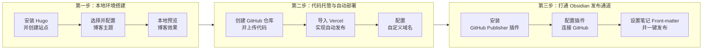

---
tags:
  - 随笔
  - 个人独立博客
创建时间: 2026-03-05T15:20:00
开始日期: 2026-03-05
结束日期: 2026-03-05
---
# 从零开始搭建个人独立博客：Obsidian + Hugo + GitHub + Vercel 一键发布工作流

> 本篇笔记详细记录了如何使用 **Hugo** 生成静态博客，通过 **GitHub** 托管代码，利用 **Vercel** 自动部署，并借助 **Obsidian** 的 **GitHub Publisher** 插件实现一键发布的全过程。按照本文步骤操作，你将拥有一个完全属于自己的、支持自动发布的个人独立博客。

---

## 📌 整体流程概览



---

## 🛠️ 第一步：搭建本地博客环境 (Hugo)

### 1. 安装包管理器 Scoop (推荐)
在 Windows 上，使用 Scoop 可以轻松安装和管理命令行工具。打开 **PowerShell**，执行以下命令：
```powershell
Set-ExecutionPolicy RemoteSigned -scope CurrentUser
irm get.scoop.sh | iex
```

### 2. 安装 Git 和 Hugo
继续在 PowerShell 中执行：
```powershell
scoop install git
scoop install hugo
```
验证安装：分别输入 `hugo version` 和 `git version`，应显示版本信息。

### 3. 创建博客站点
选择一个你喜欢的英文名（例如 `myblog`），在 PowerShell 中执行：
```powershell
hugo new site myblog
```
这会在当前目录下创建一个名为 `myblog` 的文件夹，里面包含博客的初始文件结构。

### 4. 下载并配置博客主题
以广受欢迎的 [PaperMod](https://github.com/adityatelange/hugo-PaperMod) 主题为例：
```powershell
cd myblog
git init
git submodule add https://github.com/adityatelange/hugo-PaperMod.git themes/PaperMod
```
然后编辑 `hugo.toml` 文件（可用 VS Code 打开），清空原有内容，粘贴以下基础配置：
```toml
baseURL = "https://example.com/"  # 稍后修改为你的实际域名
languageCode = "zh-cn"
title = "我的个人博客"
theme = "PaperMod"
```

### 5. 本地预览你的博客
在 `myblog` 目录下运行：
```powershell
hugo server
```
打开浏览器访问 `http://localhost:1313`，即可看到博客的本地版本。按 `Ctrl + C` 停止服务。

---

## ☁️ 第二步：托管代码并自动部署 (GitHub + Vercel)

### 1. 在 GitHub 上创建仓库
- 登录 [GitHub](https://github.com)，点击右上角 “+” → **New repository**。
- 仓库名建议使用 `<你的用户名>.github.io`（例如 `zhangsan.github.io`），选择 **Public**，**不要勾选**任何初始化选项（如 README、.gitignore）。
- 点击 **Create repository**。

### 2. 将本地代码推送到 GitHub
在 PowerShell 中（确保当前目录为 `myblog`），依次执行：
```powershell
git remote add origin https://github.com/<你的用户名>/<你的仓库名>.git
git branch -M main
git add .
git commit -m "first commit"
git push -u origin main
```

### 3. 在 Vercel 上导入并部署项目
- 登录 [Vercel](https://vercel.com)（建议使用 GitHub 账号登录）。
- 点击 **Add New...** → **Project**。
- 在列表中找到你刚创建的仓库，点击 **Import**。
- 在配置页面，**Framework Preset** 会自动检测为 **Hugo**，其他设置保持默认。
- 点击 **Deploy**，等待约一分钟，部署完成。Vercel 会为你分配一个 `*.vercel.app` 的免费域名。

### 4. 绑定你自己的域名（可选但推荐）
- 在 Vercel 的项目页面，进入 **Settings** → **Domains**。
- 输入你的自定义域名（例如 `blog.yourname.com`），点击 **Add**。
- 根据提示在你的域名服务商（如阿里云、腾讯云、Cloudflare）处添加 CNAME 记录，将域名指向 `cname.vercel.com`。
- 配置生效后，即可通过自己的域名访问博客。

---

## 🔗 第三步：打通 Obsidian，实现一键发布

### 1. 在 Obsidian 中安装 GitHub Publisher 插件
- 打开 Obsidian 设置，进入 **第三方插件** → **社区插件**，点击 **浏览**。
- 搜索 **“GitHub Publisher”**（图标是纸飞机），点击安装并启用。

### 2. 配置插件，连接 GitHub
进入插件设置页面，填写以下关键信息：
- **GitHub 用户名**：你的 GitHub 用户名。
- **仓库名称**：你之前创建的仓库名，例如 `zhangsan.github.io`。
- **分支**：填写 `main`。
- **GitHub Token**：需要生成一个具有 `repo` 权限的 token。
  - 在 GitHub 右上角头像 → **Settings** → **Developer settings** → **Personal access tokens** → **Tokens (classic)** → **Generate new token (classic)**。
  - 勾选 `repo` 权限，生成后复制 token（注意：关闭页面后将无法再次查看，请妥善保存）。
  - 将 token 粘贴到插件的对应输入框中。

其他选项可根据需要调整，例如是否自动转换图片等。

### 3. 设置笔记的 Front-matter
GitHub Publisher 通过笔记开头的 YAML 区域（Front-matter）决定是否发布。在你准备发布的第一篇 Obsidian 笔记最上方，添加如下内容：
```yaml
---
title: "我的第一篇博客"
date: 2024-01-20
description: "这里是文章的描述"
tags: ["测试", "博客"]
share: true
---
```
- `share: true` 是关键，表示该笔记需要被发布。
- 其他字段如 `title`、`date` 等会被 Hugo 主题使用。

### 4. 一键发布！
- 打开刚刚添加了 Front-matter 的笔记。
- 按下 `Ctrl + P` 调出命令面板，搜索并执行 **“Upload single current active note”** 命令。
- 如果配置正确，插件会将笔记推送到 GitHub，Vercel 检测到更新后会自动重新部署。几分钟后，新文章就会出现在你的博客上。

---

## 🚀 第四步：优化你的发布体验

### 1. 创建博客文章模板（使用 Templater 插件）
- 安装 Obsidian 社区插件 **Templater**。
- 创建一个模板文件（例如 `templates/博客文章.md`），内容如下：
  ```yaml
  ---
  title: "{{title}}"
  date: {{date:YYYY-MM-DD}}
  description: ""
  tags: []
  share: true
  ---

  ```
- 在 Templater 设置中，将该文件设为模板。
- 以后写新博客时，通过 Templater 插入模板，即可自动生成 Front-matter。

### 2. 处理图片（可选）
- 安装 **Image Converter** 插件，可自动将笔记中的图片转换为更适合网页的格式（如 WebP），并在发布时复制到正确位置。
- 在 GitHub Publisher 的配置中，可以设置图片上传的路径，确保图片也能被推送到仓库。

### 3. 关于博客主题的进一步定制
- Hugo 的 PaperMod 主题提供了丰富的配置选项（如导航菜单、社交链接、评论系统等），可查阅其[官方文档](https://github.com/adityatelange/hugo-PaperMod/wiki)进行个性化修改。

---

## 📌 注意事项
- 每次在 Obsidian 中执行发布命令后，Vercel 的自动部署大约需要 1-2 分钟，请耐心等待。
- 如果发布失败，首先检查 GitHub Token 是否有效，以及仓库名称和分支是否正确。
- 建议将博客源文件（`myblog` 文件夹）也用 Git 管理，方便版本控制和回滚。

---

> 至此，你已经拥有了一套现代化的个人博客写作与发布工作流。在 Obsidian 中安心写作，一键发布，你的思想将轻松抵达互联网的每个角落。